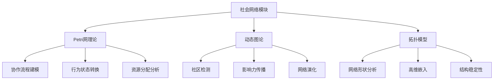
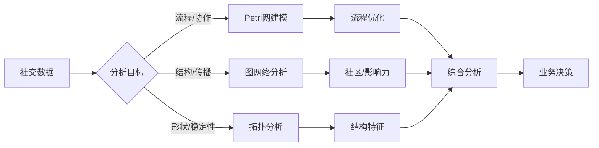

# 社会网络模块理论关系梳理 / Social Network Module Theory Relationship Analysis

## 📚 **概述 / Overview**

**文档目的**: 梳理社会网络模块与三大理论（Petri网、动态图论、拓扑模型）的关系，揭示社会网络分析和建模中的理论基础。

**核心内容**:

- 社会网络与Petri网的关系（行为建模、协作流程）
- 社会网络与动态图论的关系（社区检测、影响力传播）
- 社会网络与拓扑模型的关系（网络结构、高维分析）
- 跨理论应用模式

**适用对象**: 社会网络研究者、数据科学家、社交平台工程师

---

## 📋 **目录 / Table of Contents**

- [社会网络模块理论关系梳理 / Social Network Module Theory Relationship Analysis](#社会网络模块理论关系梳理--social-network-module-theory-relationship-analysis)
  - [📚 **概述 / Overview**](#-概述--overview)
  - [📋 **目录 / Table of Contents**](#-目录--table-of-contents)
  - [🎯 **一、模块概述 / Part 1: Module Overview**](#-一模块概述--part-1-module-overview)
    - [1.1 社会网络模块核心内容](#11-社会网络模块核心内容)
    - [1.2 理论关联概览](#12-理论关联概览)
  - [🔗 **二、与Petri网理论的关系 / Part 2: Relationship with Petri Net Theory**](#-二与petri网理论的关系--part-2-relationship-with-petri-net-theory)
    - [2.1 社会行为概念映射](#21-社会行为概念映射)
    - [2.2 协作流程Petri网建模](#22-协作流程petri网建模)
    - [2.3 信息传播状态模型](#23-信息传播状态模型)
  - [📊 **三、与动态图论的关系 / Part 3: Relationship with Dynamic Graph Theory**](#-三与动态图论的关系--part-3-relationship-with-dynamic-graph-theory)
    - [3.1 社会网络图映射](#31-社会网络图映射)
    - [3.2 社区检测分析](#32-社区检测分析)
    - [3.3 影响力传播分析](#33-影响力传播分析)
    - [3.4 网络演化追踪](#34-网络演化追踪)
  - [🔬 **四、与拓扑模型的关系 / Part 4: Relationship with Topological Models**](#-四与拓扑模型的关系--part-4-relationship-with-topological-models)
    - [4.1 网络结构拓扑](#41-网络结构拓扑)
    - [4.2 持久同调在社会网络中的应用](#42-持久同调在社会网络中的应用)
    - [4.3 高维结构检测](#43-高维结构检测)
  - [🔧 **五、跨理论应用模式 / Part 5: Cross-Theory Application Patterns**](#-五跨理论应用模式--part-5-cross-theory-application-patterns)
    - [5.1 社会网络分析流水线](#51-社会网络分析流水线)
    - [5.2 典型场景理论选择](#52-典型场景理论选择)
    - [5.3 典型案例：社交平台分析](#53-典型案例社交平台分析)
    - [5.4 工具链对应](#54-工具链对应)
  - [📚 **六、参考文档 / Part 6: Reference Documents**](#-六参考文档--part-6-reference-documents)
    - [6.1 模块内文档](#61-模块内文档)
    - [6.2 相关理论文档](#62-相关理论文档)

---

## 🎯 **一、模块概述 / Part 1: Module Overview**

### 1.1 社会网络模块核心内容

| 子模块 | 核心概念 | 主要问题 |
|--------|----------|----------|
| **社会网络基础** | 节点、边、度分布 | 网络结构特征 |
| **社区检测** | 模块度、社区结构 | 群体识别、划分 |
| **影响力传播** | 信息扩散、级联 | 病毒式传播、舆情 |
| **链接预测** | 相似性、共同邻居 | 关系预测、推荐 |

### 1.2 理论关联概览



---

## 🔗 **二、与Petri网理论的关系 / Part 2: Relationship with Petri Net Theory**

### 2.1 社会行为概念映射

| 社会概念 | Petri网对应 | 映射说明 |
|----------|-------------|----------|
| **用户状态** | 库所(Place) | 用户的行为/信息状态 |
| **社交行为** | 变迁(Transition) | 关注、分享、评论等 |
| **信息/资源** | 令牌(Token) | 信息片段、影响力单位 |
| **行为触发** | 变迁点火 | 行为的触发条件 |

### 2.2 协作流程Petri网建模

**在线协作工作流建模**:

```
库所（状态）:
- P_Idle: 空闲状态
- P_Drafting: 起草中
- P_Reviewing: 审核中
- P_Approved: 已批准
- P_Published: 已发布

变迁（动作）:
- T_Create: 创建内容
- T_Submit: 提交审核
- T_Approve: 批准
- T_Reject: 拒绝（返回修改）
- T_Publish: 发布

分析:
- 流程正确性: 可达性分析
- 瓶颈检测: 死锁/活锁分析
- 资源利用: 令牌流分析
```

### 2.3 信息传播状态模型

| 传播概念 | Petri网对应 | 分析方法 |
|----------|-------------|----------|
| **未知状态** | 库所（Unaware） | 初始标识 |
| **已知状态** | 库所（Aware） | 可达性 |
| **传播动作** | 变迁 | 传播速率 |
| **传播路径** | 变迁序列 | 路径分析 |

---

## 📊 **三、与动态图论的关系 / Part 3: Relationship with Dynamic Graph Theory**

### 3.1 社会网络图映射

| 社会概念 | 动态图对应 | 映射说明 |
|----------|------------|----------|
| **用户/个体** | 顶点(Vertex) | 社会实体 |
| **社会关系** | 边(Edge) | 好友、关注、互动 |
| **关系强度** | 边权重 | 互动频率、亲密度 |
| **网络演化** | 图演化 | 关系建立/断裂 |

### 3.2 社区检测分析

**社区检测方法**:

```
社交网络数据 → 动态图构建
              ↓
    节点: 用户（带属性）
    边: 社交关系（带权重）
    属性: 活跃度、兴趣标签
              ↓
    分析: Louvain社区检测
          标签传播算法
          谱聚类
              ↓
    输出: 社区结构、社区演化
```

### 3.3 影响力传播分析

| 分析类型 | 图方法 | 应用场景 |
|----------|--------|----------|
| **影响力最大化** | 贪心算法+模拟 | 营销推广 |
| **舆情传播** | 级联模型 | 舆情监控 |
| **关键用户** | 中心性分析 | KOL识别 |
| **传播路径** | 路径分析 | 信息溯源 |

### 3.4 网络演化追踪

| 演化事件 | 图操作 | 分析目标 |
|----------|--------|----------|
| **新用户加入** | 添加顶点 | 增长模式 |
| **建立关系** | 添加边 | 链接预测 |
| **关系断裂** | 删除边 | 流失预警 |
| **社区变化** | 结构重组 | 社区演化 |

---

## 🔬 **四、与拓扑模型的关系 / Part 4: Relationship with Topological Models**

### 4.1 网络结构拓扑

| 社会概念 | 拓扑对应 | 映射说明 |
|----------|----------|----------|
| **网络形状** | 拓扑空间 | 整体结构特征 |
| **社区边界** | 拓扑边界 | 社区分界 |
| **结构洞** | 贝蒂数β₁ | 连接缺失 |
| **高阶关系** | 单纯复形 | 多人互动 |

### 4.2 持久同调在社会网络中的应用

**社会网络形状分析**:

```
社会网络 → 距离矩阵构建
          ↓
    过滤: 基于社交距离的Rips复形
    持久同调: 计算拓扑特征
          ↓
    分析: β₀演化 → 社区数量变化
          β₁演化 → 结构洞识别
          持久性 → 稳定结构识别
```

### 4.3 高维结构检测

| 分析类型 | 拓扑方法 | 应用 |
|----------|----------|------|
| **三元组闭合** | 2-单纯形 | 信任传递 |
| **群组结构** | 高阶单纯形 | 群组检测 |
| **网络比较** | 持久图距离 | 平台对比 |
| **异常检测** | 拓扑变化 | 异常行为 |

---

## 🔧 **五、跨理论应用模式 / Part 5: Cross-Theory Application Patterns**

### 5.1 社会网络分析流水线



### 5.2 典型场景理论选择

| 场景 | 首选理论 | 分析方法 |
|------|----------|----------|
| **工作流优化** | Petri网 | 状态机建模+瓶颈分析 |
| **社区检测** | 动态图论 | Louvain+演化追踪 |
| **影响力分析** | 动态图论 | 中心性+传播模拟 |
| **结构稳定性** | 拓扑模型 | 持久同调+形状分析 |

### 5.3 典型案例：社交平台分析

**多理论综合分析**:

```
1. Petri网分析（用户行为流程）:
   - 建模用户行为状态转换
   - 分析转化漏斗
   - 优化用户体验流程

2. 动态图分析（网络结构）:
   - 构建用户关系网络
   - 检测兴趣社区
   - 识别关键影响者
   - 追踪信息传播路径

3. 拓扑分析（结构特性）:
   - 分析网络整体形状
   - 检测结构洞和弱连接
   - 评估网络稳定性
```

### 5.4 工具链对应

| 分析阶段 | 推荐工具 | 理论基础 |
|----------|----------|----------|
| **数据采集** | Twitter API, Facebook Graph | 数据源 |
| **图分析** | NetworkX, igraph, Gephi | 动态图论 |
| **社区检测** | python-louvain, cdlib | 图算法 |
| **拓扑分析** | GUDHI, giotto-tda | TDA |
| **可视化** | Gephi, D3.js | 可视化 |

---

## 📚 **六、参考文档 / Part 6: Reference Documents**

### 6.1 模块内文档

- [社会网络模块README](../../07-社会网络/README.md)
- [社会网络基础](../../07-社会网络/)

### 6.2 相关理论文档

- [Petri网理论逻辑脉络](01-Petri网理论逻辑脉络.md)
- [动态图论逻辑脉络](02-动态图论逻辑脉络.md)
- [拓扑模型逻辑脉络](03-拓扑模型逻辑脉络.md)

---

**文档版本**: v1.0
**创建时间**: 2025年1月
**最后更新**: 2025年1月
**状态**: ✅ 完成
**维护者**: GraphNetWorkCommunicate项目组
