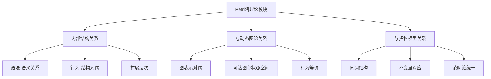
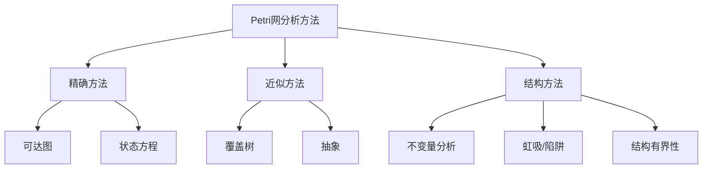
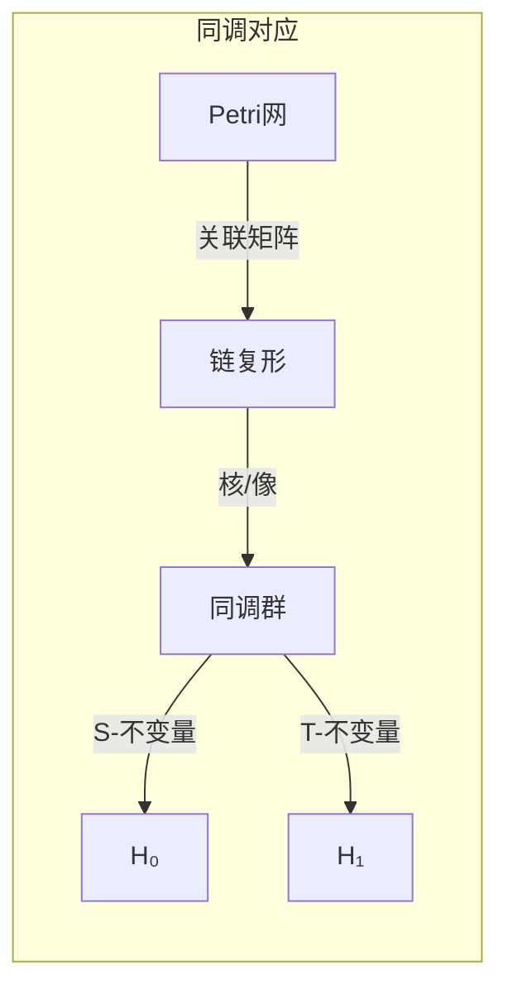
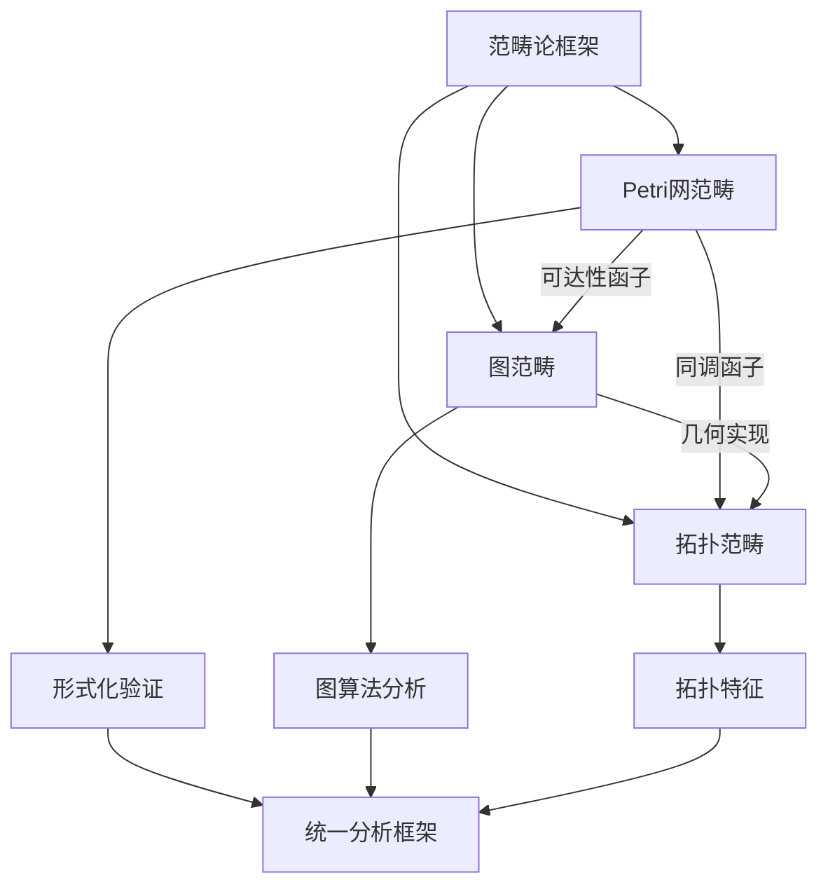

# Petri网理论模块理论关系梳理 / Petri Net Theory Module Relationship Analysis

## 📚 **概述 / Overview**

**文档目的**: 梳理Petri网理论模块与动态图论、拓扑模型的深层关系，揭示Petri网作为统一理论框架的核心地位和跨理论映射。

**核心内容**:

- Petri网理论的内部结构关系
- Petri网与动态图论的对偶关系
- Petri网与拓扑模型的同调关系
- 统一理论框架中的Petri网定位

**适用对象**: 形式化方法研究者、并发系统设计师、理论计算机科学家

---

## 📋 **目录 / Table of Contents**

- [Petri网理论模块理论关系梳理 / Petri Net Theory Module Relationship Analysis](#petri网理论模块理论关系梳理--petri-net-theory-module-relationship-analysis)
  - [📚 **概述 / Overview**](#-概述--overview)
  - [📋 **目录 / Table of Contents**](#-目录--table-of-contents)
  - [🎯 **一、模块概述 / Part 1: Module Overview**](#-一模块概述--part-1-module-overview)
    - [1.1 Petri网理论模块核心内容](#11-petri网理论模块核心内容)
    - [1.2 理论关联概览](#12-理论关联概览)
  - [🔗 **二、Petri网理论内部结构 / Part 2: Petri Net Theory Internal Structure**](#-二petri网理论内部结构--part-2-petri-net-theory-internal-structure)
    - [2.1 理论层次结构](#21-理论层次结构)
    - [2.2 核心概念关系](#22-核心概念关系)
    - [2.3 分析方法关系图](#23-分析方法关系图)
  - [📊 **三、与动态图论的对偶关系 / Part 3: Duality with Dynamic Graph Theory**](#-三与动态图论的对偶关系--part-3-duality-with-dynamic-graph-theory)
    - [3.1 表示对偶](#31-表示对偶)
    - [3.2 关键对偶映射](#32-关键对偶映射)
    - [3.3 分析方法对应](#33-分析方法对应)
  - [🔬 **四、与拓扑模型的同调关系 / Part 4: Homological Relationship with Topological Models**](#-四与拓扑模型的同调关系--part-4-homological-relationship-with-topological-models)
    - [4.1 同调结构对应](#41-同调结构对应)
    - [4.2 不变量的拓扑解释](#42-不变量的拓扑解释)
    - [4.3 高阶结构](#43-高阶结构)
    - [4.4 Mermaid示意图](#44-mermaid示意图)
  - [🔧 **五、统一理论框架 / Part 5: Unified Theory Framework**](#-五统一理论框架--part-5-unified-theory-framework)
    - [5.1 范畴论统一](#51-范畴论统一)
    - [5.2 函子映射](#52-函子映射)
    - [5.3 统一框架示意](#53-统一框架示意)
    - [5.4 跨理论应用](#54-跨理论应用)
  - [📚 **六、参考文档 / Part 6: Reference Documents**](#-六参考文档--part-6-reference-documents)
    - [6.1 模块内文档](#61-模块内文档)
    - [6.2 相关理论文档](#62-相关理论文档)
    - [6.3 应用模式文档](#63-应用模式文档)

---

## 🎯 **一、模块概述 / Part 1: Module Overview**

### 1.1 Petri网理论模块核心内容

| 子模块 | 核心概念 | 主要问题 |
|--------|----------|----------|
| **基础理论** | 库所、变迁、令牌、标识 | 语法与语义 |
| **行为分析** | 可达性、活性、有界性 | 行为性质验证 |
| **不变量分析** | S-不变量、T-不变量 | 结构性质 |
| **扩展理论** | 着色网、时间网、随机网 | 建模能力扩展 |

### 1.2 理论关联概览



---

## 🔗 **二、Petri网理论内部结构 / Part 2: Petri Net Theory Internal Structure**

### 2.1 理论层次结构

```
Petri网理论层次
│
├─── 语法层 (Syntax)
│    ├─── 网结构: (P, T, F, W)
│    ├─── 标识: M: P → ℕ
│    └─── 点火规则
│
├─── 语义层 (Semantics)
│    ├─── 可达集: [M₀⟩
│    ├─── 可达图
│    └─── 行为等价
│
├─── 性质层 (Properties)
│    ├─── 行为性质: 活性、有界性、可达性
│    ├─── 结构性质: 不变量、覆盖
│    └─── 公平性
│
└─── 扩展层 (Extensions)
     ├─── 着色Petri网 (CPN)
     ├─── 时间Petri网 (TPN)
     └─── 随机Petri网 (SPN)
```

### 2.2 核心概念关系

| 概念对 | 关系类型 | 说明 |
|--------|----------|------|
| **库所-变迁** | 对偶 | 状态-动作的对偶表示 |
| **S-不变量-T-不变量** | 对偶 | 资源守恒-循环行为的对偶 |
| **可达性-覆盖** | 近似 | 精确分析与近似分析 |
| **活性-死锁** | 对立 | 行为性质的两面 |

### 2.3 分析方法关系图



---

## 📊 **三、与动态图论的对偶关系 / Part 3: Duality with Dynamic Graph Theory**

### 3.1 表示对偶

| Petri网概念 | 动态图对应 | 对偶关系 |
|-------------|------------|----------|
| **Petri网结构** | 二部图 | 结构同构 |
| **可达图** | 有向图 | 行为等价 |
| **标识演化** | 图快照序列 | 状态对应 |
| **变迁点火** | 图重写 | 操作对应 |

### 3.2 关键对偶映射

**结构对偶**:

```
Petri网 (P, T, F) ←→ 二部图 G = (V₁∪V₂, E)
    P ←→ V₁ (库所节点)
    T ←→ V₂ (变迁节点)
    F ←→ E (有向边)
```

**行为对偶**:

```
可达图 RG(N, M₀) ←→ 状态转换图 G = (S, →)
    标识 M ←→ 状态 s ∈ S
    变迁点火 ←→ 状态转移 s → s'
```

### 3.3 分析方法对应

| Petri网方法 | 图论方法 | 对应关系 |
|-------------|----------|----------|
| **可达性分析** | 图可达性/BFS | 状态空间遍历 |
| **活性检测** | 强连通分量 | 循环结构 |
| **结构分析** | 图算法 | 拓扑性质 |
| **覆盖树** | 树遍历 | 状态抽象 |

---

## 🔬 **四、与拓扑模型的同调关系 / Part 4: Homological Relationship with Topological Models**

### 4.1 同调结构对应

| Petri网概念 | 拓扑对应 | 同调关系 |
|-------------|----------|----------|
| **S-不变量** | 0-循环 | ker(∂₀) |
| **T-不变量** | 1-循环 | ker(∂₁) |
| **关联矩阵** | 边界算子 | ∂: C₁ → C₀ |
| **网结构** | 链复形 | C₁ → C₀ |

### 4.2 不变量的拓扑解释

**S-不变量的同调解释**:

```
关联矩阵 C: ℤᵀ → ℤᴾ
S-不变量: y ∈ ℤᴾ 满足 C^T · y = 0
拓扑对应: y 是0-循环（闭链）
物理意义: 令牌守恒定律
```

**T-不变量的同调解释**:

```
T-不变量: x ∈ ℤᵀ 满足 C · x = 0
拓扑对应: x 是1-循环
物理意义: 基本循环行为（可重复执行序列）
```

### 4.3 高阶结构

| 拓扑概念 | Petri网解释 | 应用 |
|----------|-------------|------|
| **贝蒂数β₀** | 连通分量数 | 独立子系统 |
| **贝蒂数β₁** | 独立循环数 | 基本行为模式 |
| **Euler特征** | P - T | 结构不变量 |

### 4.4 Mermaid示意图



---

## 🔧 **五、统一理论框架 / Part 5: Unified Theory Framework**

### 5.1 范畴论统一

**Petri网范畴**:

```
对象: Petri网 (P, T, F, M₀)
态射: 网态射 (fP, fT): N₁ → N₂
    - fP: P₁ → P₂ (库所映射)
    - fT: T₁ → T₂ (变迁映射)
    - 保持流关系和标识
```

### 5.2 函子映射

| 函子 | 域 | 陪域 | 作用 |
|------|------|------|------|
| **可达性函子** | Petri网 | 图 | 构建可达图 |
| **展开函子** | Petri网 | 无环网 | 展开为无环结构 |
| **折叠函子** | 无环网 | Petri网 | 压缩表示 |
| **同调函子** | Petri网 | 阿贝尔群 | 计算不变量 |

### 5.3 统一框架示意



### 5.4 跨理论应用

| 应用场景 | 理论选择 | 统一视角 |
|----------|----------|----------|
| **协议验证** | Petri网 | 状态空间探索 |
| **大规模分析** | 动态图论 | 图算法 |
| **形状分析** | 拓扑模型 | 持久同调 |
| **综合分析** | 范畴论统一 | 函子转换 |

---

## 📚 **六、参考文档 / Part 6: Reference Documents**

### 6.1 模块内文档

- [Petri网理论模块README](../../10-Petri网理论/README.md)
- [Petri网基础理论](../../10-Petri网理论/)

### 6.2 相关理论文档

- [Petri网理论逻辑脉络](01-Petri网理论逻辑脉络.md)
- [动态图论逻辑脉络](02-动态图论逻辑脉络.md)
- [拓扑模型逻辑脉络](03-拓扑模型逻辑脉络.md)

### 6.3 应用模式文档

- [操作系统应用模式](../../13-应用模式归纳/01-操作系统应用模式/)
- [分布式系统应用模式](../../13-应用模式归纳/02-分布式系统应用模式/)

---

**文档版本**: v1.0
**创建时间**: 2025年1月
**最后更新**: 2025年1月
**状态**: ✅ 完成
**维护者**: GraphNetWorkCommunicate项目组
