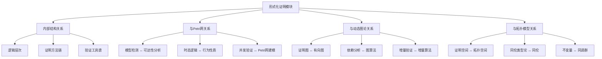
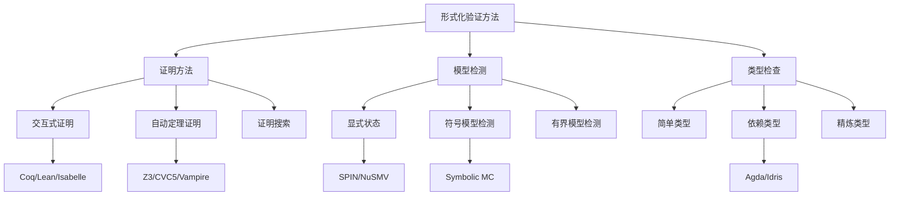
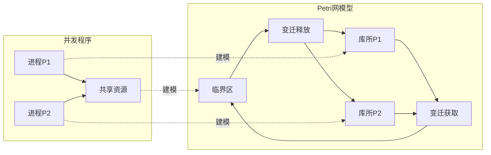
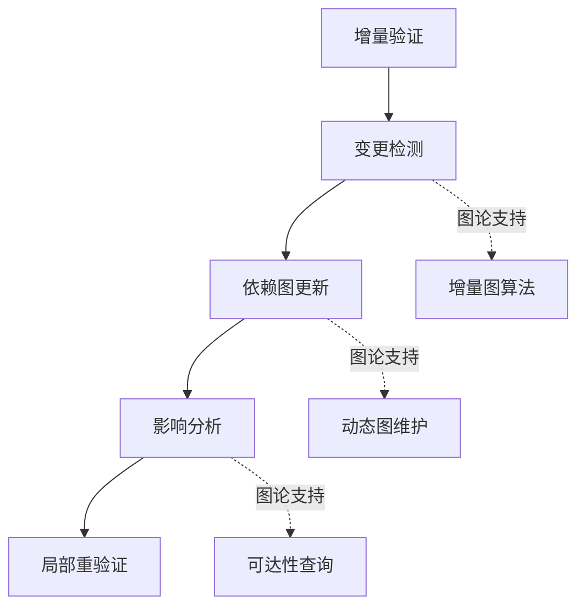
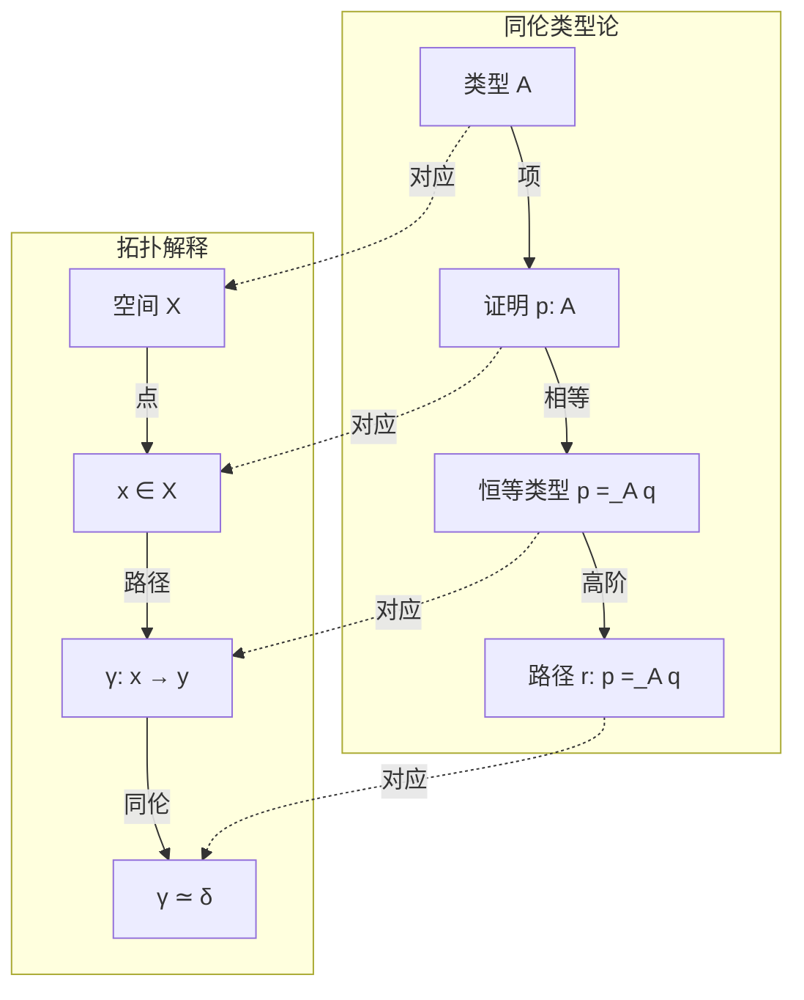
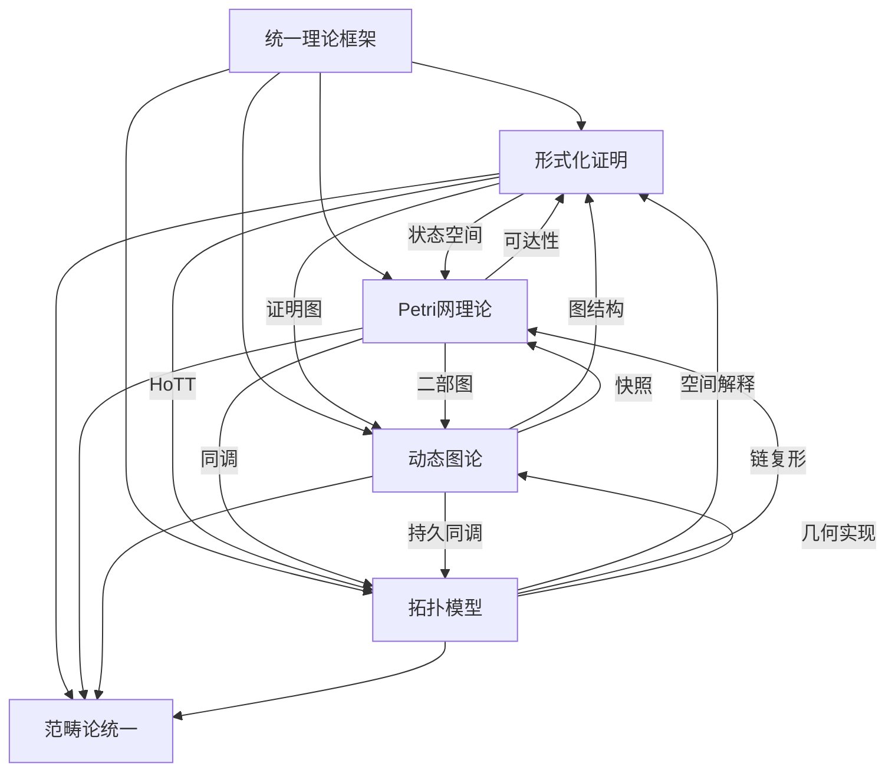

# 形式化证明模块理论关系梳理 / Formal Verification Module Relationship Analysis

## 📚 **概述 / Overview**

**文档目的**: 梳理形式化证明模块与Petri网理论、动态图论、拓扑模型的深层关系，揭示形式化方法作为验证核心的理论定位和跨理论映射。

**核心内容**:

- 形式化证明的内部结构关系
- 形式化证明与Petri网的双向映射
- 形式化证明与动态图论的联系
- 形式化证明与拓扑模型的同调关系
- 统一理论框架中的形式化证明定位

**适用对象**: 形式化方法研究者、程序验证工程师、定理证明器开发者、软件安全专家

---

## 📋 **目录 / Table of Contents**

- [形式化证明模块理论关系梳理 / Formal Verification Module Relationship Analysis](#形式化证明模块理论关系梳理--formal-verification-module-relationship-analysis)
  - [📚 **概述 / Overview**](#-概述--overview)
  - [📋 **目录 / Table of Contents**](#-目录--table-of-contents)
  - [🎯 **一、模块概述 / Part 1: Module Overview**](#-一模块概述--part-1-module-overview)
    - [1.1 形式化证明模块核心内容](#11-形式化证明模块核心内容)
    - [1.2 理论关联概览](#12-理论关联概览)
  - [🔗 **二、形式化证明内部结构 / Part 2: Internal Structure**](#-二形式化证明内部结构--part-2-internal-structure)
    - [2.1 理论层次结构](#21-理论层次结构)
    - [2.2 核心概念关系](#22-核心概念关系)
    - [2.3 验证方法关系图](#23-验证方法关系图)
  - [📊 **三、与Petri网的双向映射 / Part 3: Bidirectional Mapping with Petri Nets**](#-三与petri网的双向映射--part-3-bidirectional-mapping-with-petri-nets)
    - [3.1 核心映射关系](#31-核心映射关系)
    - [3.2 模型检测与Petri网](#32-模型检测与petri网)
    - [3.3 并发验证的Petri网建模](#33-并发验证的petri网建模)
    - [3.4 工具链对应](#34-工具链对应)
  - [🌐 **四、与动态图论的联系 / Part 4: Connection with Dynamic Graph Theory**](#-四与动态图论的联系--part-4-connection-with-dynamic-graph-theory)
    - [4.1 证明结构的图表示](#41-证明结构的图表示)
    - [4.2 关键映射](#42-关键映射)
    - [4.3 增量验证与动态图](#43-增量验证与动态图)
    - [4.4 具体应用案例](#44-具体应用案例)
  - [🔬 **五、与拓扑模型的同调关系 / Part 5: Homological Relationship with Topological Models**](#-五与拓扑模型的同调关系--part-5-homological-relationship-with-topological-models)
    - [5.1 同伦类型论(HoTT)的拓扑基础](#51-同伦类型论hott的拓扑基础)
    - [5.2 证明空间的拓扑结构](#52-证明空间的拓扑结构)
    - [5.3 同调群与证明不变量](#53-同调群与证明不变量)
    - [5.4 Mermaid示意图](#54-mermaid示意图)
    - [5.5 Univalence公理的拓扑意义](#55-univalence公理的拓扑意义)
  - [🔧 **六、统一理论框架 / Part 6: Unified Theory Framework**](#-六统一理论框架--part-6-unified-theory-framework)
    - [6.1 范畴论统一视角](#61-范畴论统一视角)
    - [6.2 函子映射](#62-函子映射)
    - [6.3 三理论统一框架](#63-三理论统一框架)
    - [6.4 跨理论应用场景](#64-跨理论应用场景)
    - [6.5 工具生态系统](#65-工具生态系统)
  - [📚 **七、参考文档 / Part 7: Reference Documents**](#-七参考文档--part-7-reference-documents)
    - [7.1 模块内文档](#71-模块内文档)
    - [7.2 相关理论文档](#72-相关理论文档)
    - [7.3 应用模式文档](#73-应用模式文档)

---

## 🎯 **一、模块概述 / Part 1: Module Overview**

### 1.1 形式化证明模块核心内容

| 子模块 | 核心概念 | 主要问题 |
|--------|----------|----------|
| **证明基础** | 公理系统、推理规则、证明树 | 逻辑正确性 |
| **自动定理证明** | 归结原理、表方法、SAT求解 | 自动验证 |
| **模型检测** | LTL、CTL、状态空间 | 时态性质验证 |
| **形式化语义** | 操作语义、指称语义、公理语义 | 程序含义 |
| **程序验证** | Hoare逻辑、分离逻辑、依赖类型 | 程序正确性 |

### 1.2 理论关联概览



---

## 🔗 **二、形式化证明内部结构 / Part 2: Internal Structure**

### 2.1 理论层次结构

```
形式化证明理论层次
│
├─── 基础逻辑层 (Foundation)
│    ├─── 命题逻辑
│    ├─── 一阶谓词逻辑
│    └─── 高阶逻辑
│
├─── 证明方法层 (Methods)
│    ├─── 直接证明
│    ├─── 归纳证明
│    ├─── 反证法
│    └─── 构造证明
│
├─── 自动化层 (Automation)
│    ├─── 归结原理
│    ├─── SAT/SMT求解
│    ├─── 表方法
│    └─── 模型检测
│
├─── 程序验证层 (Program Verification)
│    ├─── Hoare逻辑
│    ├─── 分离逻辑
│    ├─── 依赖类型
│    └─── 精炼类型
│
└─── 高级扩展层 (Extensions)
     ├─── 同伦类型论 (HoTT)
     ├─── 线性逻辑
     ├─── 模态逻辑
     └─── 概率/量子验证
```

### 2.2 核心概念关系

| 概念对 | 关系类型 | 说明 |
|--------|----------|------|
| **语法-语义** | 对偶 | 证明规则与模型满足的对偶 |
| **完备性-可靠性** | 互补 | 证明系统的基本性质 |
| **演绎-归纳** | 对偶 | 证明方向的对偶 |
| **模型检测-定理证明** | 互补 | 有限状态vs无限状态 |

### 2.3 验证方法关系图



---

## 📊 **三、与Petri网的双向映射 / Part 3: Bidirectional Mapping with Petri Nets**

### 3.1 核心映射关系

| 形式化证明概念 | Petri网对应 | 映射关系 |
|---------------|-------------|----------|
| **状态空间** | 可达集 | 同构 |
| **时态性质(LTL/CTL)** | 行为性质 | 验证对象 |
| **模型检测** | 可达性分析 | 方法对应 |
| **并发验证** | Petri网建模 | 建模对象 |
| **死锁检测** | 活性分析 | 性质对应 |

### 3.2 模型检测与Petri网

**LTL性质验证的Petri网实现**:

```
LTL公式 φ → Büchi自动机 Aφ → Petri网乘积 → 可达性分析
    ↓                ↓               ↓              ↓
时态性质       接受状态机      状态空间交积    空性检测
```

**CTL性质的Petri网验证**:

| CTL算子 | Petri网分析 | 说明 |
|---------|-------------|------|
| **EF φ** | 前向可达 | 存在路径最终满足 |
| **AF φ** | 公平路径 | 所有路径最终满足 |
| **EG φ** | 强连通分量 | 存在路径总是满足 |
| **AG φ** | 不变式检查 | 所有状态满足 |

### 3.3 并发验证的Petri网建模



### 3.4 工具链对应

| 形式化工具 | Petri网工具 | 功能 |
|-----------|-------------|------|
| **SPIN** | CPN Tools | 并发验证 |
| **NuSMV** | INA/LoLA | 模型检测 |
| **TLA+** | - | 规约语言 |
| **ProVerif** | - | 安全协议 |

---

## 🌐 **四、与动态图论的联系 / Part 4: Connection with Dynamic Graph Theory**

### 4.1 证明结构的图表示

| 形式化概念 | 图论对应 | 映射关系 |
|-----------|----------|----------|
| **证明树** | 有向树 | 结构同构 |
| **依赖图** | DAG | 前提-结论依赖 |
| **调用图** | 有向图 | 函数调用关系 |
| **控制流图** | 有向图 | 程序结构 |

### 4.2 关键映射

**证明图结构**:

```
证明 π: A ⊢ B
    ↓ 映射
有向图 G = (V, E)
    V = {公理, 引理, 中间结论, 目标}
    E = {推理步骤}
```

**依赖分析的图算法**:

| 分析任务 | 图算法 | 应用 |
|----------|--------|------|
| **引用分析** | DFS/BFS | 查找依赖 |
| **循环检测** | 强连通分量 | 检测循环定义 |
| **拓扑排序** | 拓扑排序 | 证明顺序 |
| **切片分析** | 图切片 | 简化验证 |

### 4.3 增量验证与动态图



### 4.4 具体应用案例

**程序切片分析**:

```
输入: 程序P, 关注变量v, 程序点p
1. 构建程序依赖图 PDG(P)
2. 从(v, p)执行后向切片
3. 使用图可达性算法找到所有影响节点
4. 提取切片程序P'
输出: 与(v, p)相关的最小程序片段
```

---

## 🔬 **五、与拓扑模型的同调关系 / Part 5: Homological Relationship with Topological Models**

### 5.1 同伦类型论(HoTT)的拓扑基础

| HoTT概念 | 拓扑对应 | 同调关系 |
|----------|----------|----------|
| **类型** | 空间 | 拓扑空间 |
| **项** | 点 | 空间中的元素 |
| **相等类型** | 路径空间 | 同伦 |
| **高阶相等** | 高阶同伦 | πn(X) |

### 5.2 证明空间的拓扑结构

**证明的同伦解释**:

```
类型 A: B
    ↓ 拓扑解释
空间 X (类型A对应的拓扑空间)
    ↓
点 x ∈ X (证明对应空间中的点)
    ↓
路径 x ≃ y (证明等价对应路径)
```

### 5.3 同调群与证明不变量

| 拓扑概念 | 证明论解释 | 应用 |
|----------|------------|------|
| **π₀(X)** | 类型的连通分量 | 类型的基本分类 |
| **π₁(X)** | 路径的等价类 | 证明路径的循环结构 |
| **H₀(X)** | 连通分量计数 | 独立证明数 |
| **H₁(X)** | 循环结构 | 证明中的循环依赖 |

### 5.4 Mermaid示意图



### 5.5 Univalence公理的拓扑意义

```
Univalence: (A ≃ B) ≃ (A = B)
    ↓ 拓扑解释
类型等价 = 同伦等价
等价的类型在证明论意义上完全相同
```

---

## 🔧 **六、统一理论框架 / Part 6: Unified Theory Framework**

### 6.1 范畴论统一视角

**证明范畴**:

```
对象: 命题/类型
态射: 证明/程序
恒等态射: 恒等证明/id函数
复合: 证明组合/函数复合
```

### 6.2 函子映射

| 函子 | 域 | 陪域 | 作用 |
|------|------|------|------|
| **类型函子** | 证明范畴 | 拓扑范畴 | HoTT解释 |
| **语义函子** | 语法范畴 | 模型范畴 | 指称语义 |
| **验证函子** | 程序范畴 | 性质范畴 | 程序验证 |
| **状态函子** | 程序范畴 | Petri网范畴 | 并发建模 |

### 6.3 三理论统一框架



### 6.4 跨理论应用场景

| 应用场景 | 形式化证明角色 | 结合理论 | 统一视角 |
|----------|---------------|----------|----------|
| **协议验证** | 时态逻辑验证 | Petri网建模 | 状态空间探索 |
| **程序分析** | Hoare逻辑 | 动态图(CFG/DFG) | 依赖分析 |
| **类型理论** | 依赖类型 | 拓扑(HoTT) | 同伦语义 |
| **安全验证** | 安全性质证明 | 全部三理论 | 多层次验证 |

### 6.5 工具生态系统

| 工具类别 | 代表工具 | 理论基础 |
|----------|----------|----------|
| **交互式证明器** | Coq, Lean, Isabelle | 类型论 |
| **自动证明器** | Z3, CVC5, Vampire | 一阶逻辑 |
| **模型检测器** | SPIN, NuSMV | 时态逻辑+Petri网 |
| **程序验证器** | Dafny, F*, Viper | Hoare逻辑 |
| **HoTT系统** | Agda, cubicaltt | 同伦类型论 |

---

## 📚 **七、参考文档 / Part 7: Reference Documents**

### 7.1 模块内文档

- [形式化证明模块README](../../08-形式化证明/README.md)
- [证明基础](../../08-形式化证明/01-证明基础.md)
- [模型检测](../../08-形式化证明/03-模型检测.md)

### 7.2 相关理论文档

- [Petri网理论逻辑脉络](01-Petri网理论逻辑脉络.md)
- [动态图论逻辑脉络](02-动态图论逻辑脉络.md)
- [拓扑模型逻辑脉络](03-拓扑模型逻辑脉络.md)
- [Petri网理论模块理论关系梳理](11-Petri网理论模块理论关系梳理.md)

### 7.3 应用模式文档

- [操作系统应用模式](../../13-应用模式归纳/01-操作系统应用模式/)
- [分布式系统应用模式](../../13-应用模式归纳/02-分布式系统应用模式/)
- [网络安全应用模式](../../13-应用模式归纳/04-网络安全应用模式/)

---

**文档版本**: v1.0
**创建时间**: 2025年1月
**最后更新**: 2025年1月
**状态**: ✅ 完成
**维护者**: GraphNetWorkCommunicate项目组
