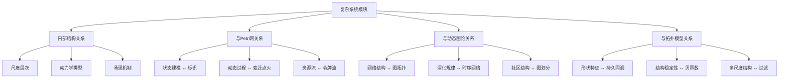
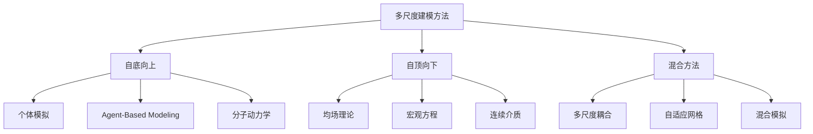
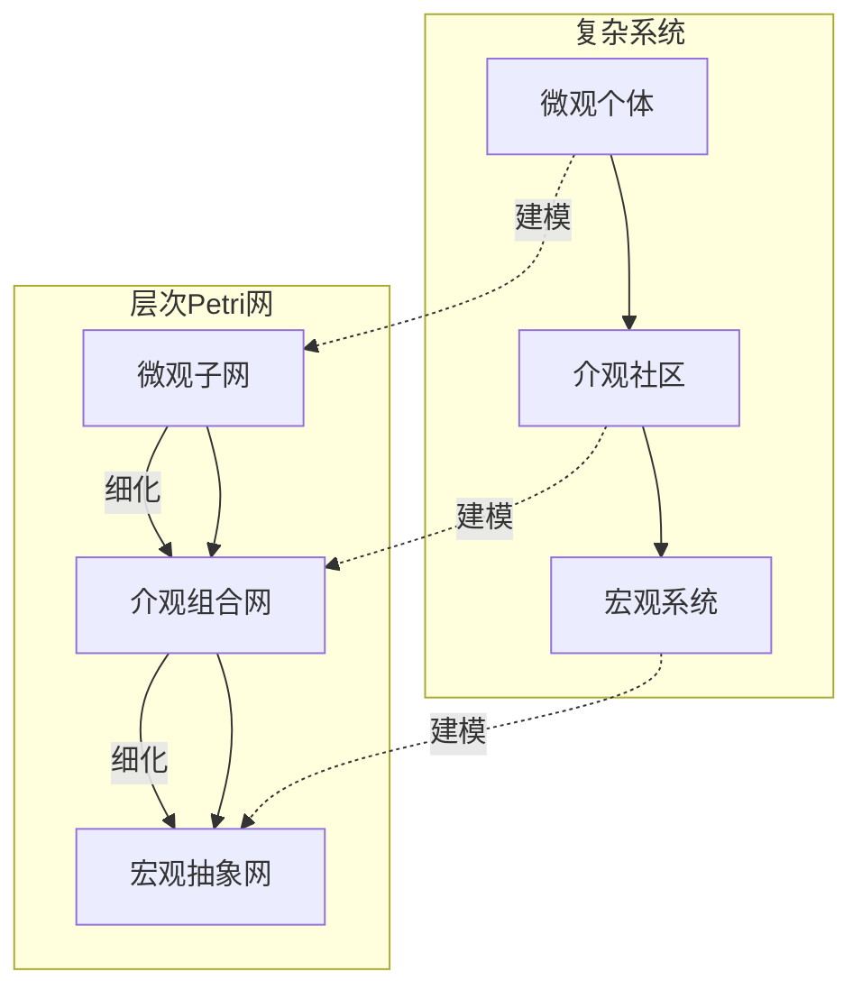
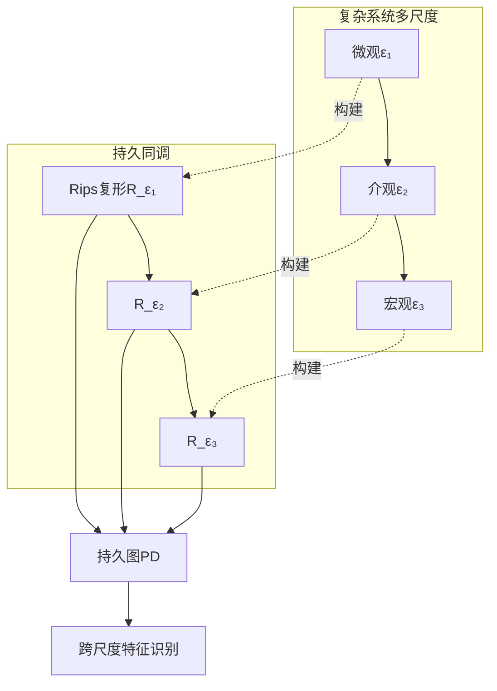
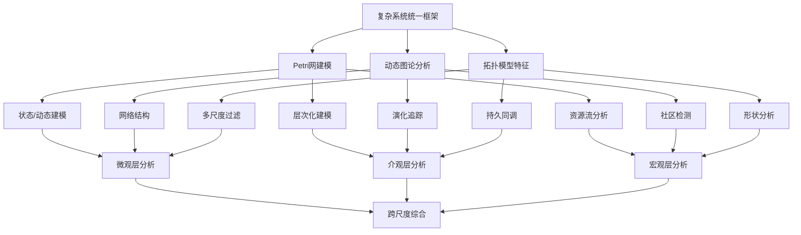

# 复杂系统与多尺度建模模块理论关系梳理 / Complex Systems Module Relationship Analysis

## 📚 **概述 / Overview**

**文档目的**: 梳理复杂系统与多尺度建模模块与Petri网理论、动态图论、拓扑模型的深层关系，揭示复杂系统作为跨尺度整合框架的理论定位和多理论融合。

**核心内容**:

- 复杂系统的内部结构关系
- 复杂系统与Petri网的建模映射
- 复杂系统与动态图论的演化关系
- 复杂系统与拓扑模型的结构关系
- 统一理论框架中的复杂系统定位

**适用对象**: 复杂系统研究者、多尺度建模工程师、系统科学家、跨学科研究者

---

## 📋 **目录 / Table of Contents**

- [复杂系统与多尺度建模模块理论关系梳理 / Complex Systems Module Relationship Analysis](#复杂系统与多尺度建模模块理论关系梳理--complex-systems-module-relationship-analysis)
  - [📚 **概述 / Overview**](#-概述--overview)
  - [📋 **目录 / Table of Contents**](#-目录--table-of-contents)
  - [🎯 **一、模块概述 / Part 1: Module Overview**](#-一模块概述--part-1-module-overview)
    - [1.1 复杂系统模块核心内容](#11-复杂系统模块核心内容)
    - [1.2 理论关联概览](#12-理论关联概览)
  - [🔗 **二、复杂系统内部结构 / Part 2: Internal Structure**](#-二复杂系统内部结构--part-2-internal-structure)
    - [2.1 理论层次结构](#21-理论层次结构)
    - [2.2 核心概念关系](#22-核心概念关系)
    - [2.3 多尺度建模方法](#23-多尺度建模方法)
  - [📊 **三、与Petri网的建模映射 / Part 3: Modeling Mapping with Petri Nets**](#-三与petri网的建模映射--part-3-modeling-mapping-with-petri-nets)
    - [3.1 核心映射关系](#31-核心映射关系)
    - [3.2 多尺度Petri网建模](#32-多尺度petri网建模)
    - [3.3 动力学建模的Petri网表示](#33-动力学建模的petri网表示)
    - [3.4 Mermaid示意图](#34-mermaid示意图)
  - [🌐 **四、与动态图论的演化关系 / Part 4: Evolution Relationship with Dynamic Graph Theory**](#-四与动态图论的演化关系--part-4-evolution-relationship-with-dynamic-graph-theory)
    - [4.1 网络表示对应](#41-网络表示对应)
    - [4.2 关键映射](#42-关键映射)
    - [4.3 演化分析方法](#43-演化分析方法)
    - [4.4 具体应用案例](#44-具体应用案例)
  - [🔬 **五、与拓扑模型的结构关系 / Part 5: Structural Relationship with Topological Models**](#-五与拓扑模型的结构关系--part-5-structural-relationship-with-topological-models)
    - [5.1 结构对应](#51-结构对应)
    - [5.2 持久同调与多尺度分析](#52-持久同调与多尺度分析)
    - [5.3 贝蒂数与系统结构](#53-贝蒂数与系统结构)
    - [5.4 Mermaid示意图](#54-mermaid示意图)
    - [5.5 涌现的拓扑刻画](#55-涌现的拓扑刻画)
  - [🔧 **六、统一理论框架 / Part 6: Unified Theory Framework**](#-六统一理论框架--part-6-unified-theory-framework)
    - [6.1 范畴论统一视角](#61-范畴论统一视角)
    - [6.2 函子映射](#62-函子映射)
    - [6.3 三理论统一框架](#63-三理论统一框架)
    - [6.4 跨理论应用场景](#64-跨理论应用场景)
    - [6.5 工具生态系统](#65-工具生态系统)
  - [📚 **七、参考文档 / Part 7: Reference Documents**](#-七参考文档--part-7-reference-documents)
    - [7.1 模块内文档](#71-模块内文档)
    - [7.2 相关理论文档](#72-相关理论文档)
    - [7.3 应用模式文档](#73-应用模式文档)

---

## 🎯 **一、模块概述 / Part 1: Module Overview**

### 1.1 复杂系统模块核心内容

| 子模块 | 核心概念 | 主要问题 |
|--------|----------|----------|
| **复杂系统基础** | 系统定义、多尺度结构 | 复杂性刻画 |
| **多尺度网络模型** | 尺度映射、层次结构 | 跨尺度建模 |
| **动力学建模** | 多尺度动力学、耦合 | 行为预测 |
| **涌现性质** | 涌现定义、涌现机制 | 整体行为 |
| **应用领域** | 生态/金融/交通/生物医学 | 实践应用 |

### 1.2 理论关联概览



---

## 🔗 **二、复杂系统内部结构 / Part 2: Internal Structure**

### 2.1 理论层次结构

```
复杂系统理论层次
│
├─── 微观层 (Microscale)
│    ├─── 个体行为
│    ├─── 局部相互作用
│    └─── 基本单元动力学
│
├─── 介观层 (Mesoscale)
│    ├─── 社区/模块结构
│    ├─── 局部涌现
│    └─── 中间尺度耦合
│
├─── 宏观层 (Macroscale)
│    ├─── 整体行为
│    ├─── 系统涌现
│    └─── 全局动力学
│
└─── 跨尺度层 (Cross-scale)
     ├─── 尺度映射
     ├─── 信息传递
     └─── 耦合动力学
```

### 2.2 核心概念关系

| 概念对 | 关系类型 | 说明 |
|--------|----------|------|
| **微观-宏观** | 涌现 | 从局部到整体的涌现 |
| **结构-功能** | 对偶 | 网络结构与系统功能的对偶 |
| **稳定-演化** | 对立统一 | 系统稳态与动态演化 |
| **局部-全局** | 尺度关联 | 跨尺度信息传递 |

### 2.3 多尺度建模方法



---

## 📊 **三、与Petri网的建模映射 / Part 3: Modeling Mapping with Petri Nets**

### 3.1 核心映射关系

| 复杂系统概念 | Petri网对应 | 映射关系 |
|-------------|-------------|----------|
| **系统状态** | 标识(Marking) | 状态表示 |
| **状态变化** | 变迁点火 | 动态演化 |
| **资源/能量** | 令牌 | 流量表示 |
| **约束条件** | 容量限制 | 有界性 |
| **并发过程** | 并发变迁 | 真并发语义 |

### 3.2 多尺度Petri网建模

**层次化Petri网(Hierarchical Petri Net)**:

```
宏观层 Petri网 Nₘₐcᵣₒ
    │
    ├─── 超库所(Super Place): 抽象状态集合
    ├─── 超变迁(Super Transition): 宏观状态转移
    │
    │ ← 细化映射 →
    ↓
介观层 Petri网 Nₘₑₛₒ
    │
    ├─── 子网(Subnet): 模块化表示
    │
    │ ← 细化映射 →
    ↓
微观层 Petri网 Nₘᵢcᵣₒ
    └─── 基本库所/变迁: 原子操作
```

### 3.3 动力学建模的Petri网表示

| 动力学类型 | Petri网扩展 | 特点 |
|-----------|-------------|------|
| **连续动力学** | 连续Petri网(CPN) | 流速建模 |
| **离散事件** | 标准Petri网 | 事件驱动 |
| **混合系统** | 混合Petri网(HPN) | 连续+离散 |
| **随机动力学** | 随机Petri网(SPN) | 概率转移 |

### 3.4 Mermaid示意图



---

## 🌐 **四、与动态图论的演化关系 / Part 4: Evolution Relationship with Dynamic Graph Theory**

### 4.1 网络表示对应

| 复杂系统概念 | 动态图论对应 | 映射关系 |
|-------------|-------------|----------|
| **实体** | 节点 | 基本单元 |
| **交互** | 边 | 关系表示 |
| **网络结构** | 图拓扑 | 结构同构 |
| **演化** | 时序网络 | 动态变化 |
| **社区** | 图划分 | 模块结构 |

### 4.2 关键映射

**多尺度网络的图表示**:

```
多尺度网络 M = (L, G, φ)
    L: 尺度层次集合 {微观, 介观, 宏观}
    G: 各层图结构 {G₁, G₂, G₃}
    φ: 跨尺度映射 φᵢⱼ: Gᵢ → Gⱼ

动态图论对应:
    - 时序快照: G(t) = (V(t), E(t))
    - 层间映射: 图粗化/细化算法
    - 演化追踪: 增量图算法
```

### 4.3 演化分析方法

| 分析任务 | 图论方法 | 复杂系统应用 |
|----------|----------|-------------|
| **社区检测** | Louvain/Leiden | 模块识别 |
| **中心性分析** | PageRank/Betweenness | 关键节点 |
| **演化追踪** | 时序网络分析 | 动态变化 |
| **级联传播** | 传播模型 | 涌现行为 |

### 4.4 具体应用案例

**生态系统网络分析**:

```mermaid
graph TD
    A[生态系统] --> B[物种网络]
    B --> C[食物网图 G = (V,E)]

    C --> D[微观: 物种节点]
    C --> E[介观: 营养级社区]
    C --> F[宏观: 生态系统稳定性]

    D --> G[节点属性: 物种特征]
    E --> H[社区检测: 功能群]
    F --> I[谱分析: 稳定性指标]
```

**金融系统网络分析**:

| 分析层次 | 图论方法 | 应用 |
|----------|----------|------|
| **微观** | 节点嵌入 | 个体风险 |
| **介观** | 社区检测 | 系统性风险传染群 |
| **宏观** | 谱分析 | 市场整体稳定性 |

---

## 🔬 **五、与拓扑模型的结构关系 / Part 5: Structural Relationship with Topological Models**

### 5.1 结构对应

| 复杂系统概念 | 拓扑对应 | 结构关系 |
|-------------|----------|----------|
| **多尺度结构** | 过滤(Filtration) | 尺度分辨 |
| **结构特征** | 贝蒂数 | 拓扑不变量 |
| **形状** | 持久同调 | 形状特征 |
| **稳定性** | 拓扑稳定性 | 结构稳健 |

### 5.2 持久同调与多尺度分析

**过滤构造**:

```
复杂系统多尺度分析:
    ∅ ⊂ K₁ ⊂ K₂ ⊂ ... ⊂ Kₙ = K (过滤)

尺度解释:
    K₁: 微观结构（小尺度特征）
    K₂: 介观结构（中等尺度）
    ...
    Kₙ: 宏观结构（全局特征）

持久图 PD(K):
    - 出生时间: 特征出现的尺度
    - 死亡时间: 特征消失的尺度
    - 持久性: 跨尺度稳定的特征
```

### 5.3 贝蒂数与系统结构

| 贝蒂数 | 系统解释 | 应用 |
|--------|----------|------|
| **β₀** | 连通分量数 | 独立子系统 |
| **β₁** | 循环数 | 反馈回路 |
| **β₂** | 空腔数 | 高阶结构 |

### 5.4 Mermaid示意图



### 5.5 涌现的拓扑刻画

```
涌现性质的拓扑特征:
    - 新贝蒂数出现: 新拓扑特征涌现
    - 持久特征: 稳定的系统结构
    - 瞬态特征: 短暂的动态模式
```

---

## 🔧 **六、统一理论框架 / Part 6: Unified Theory Framework**

### 6.1 范畴论统一视角

**复杂系统范畴**:

```
对象: 多尺度系统 (M, L, φ)
态射: 系统态射 f: M₁ → M₂
    - 保持尺度结构
    - 保持动力学
恒等态射: 恒等映射
复合: 态射复合
```

### 6.2 函子映射

| 函子 | 域 | 陪域 | 作用 |
|------|------|------|------|
| **网络函子** | 复杂系统 | 图范畴 | 网络提取 |
| **动力学函子** | 复杂系统 | Petri网范畴 | 动态建模 |
| **拓扑函子** | 复杂系统 | 拓扑范畴 | 结构分析 |
| **涌现函子** | 微观系统 | 宏观系统 | 涌现映射 |

### 6.3 三理论统一框架



### 6.4 跨理论应用场景

| 应用领域 | Petri网贡献 | 动态图贡献 | 拓扑贡献 | 综合价值 |
|----------|------------|-----------|----------|----------|
| **生态系统** | 资源流建模 | 食物网分析 | 生态位结构 | 生态稳定性 |
| **金融系统** | 交易流程 | 风险网络 | 系统性风险形状 | 风险预警 |
| **交通系统** | 信号控制 | 路网拓扑 | 交通流形状 | 拥堵预测 |
| **生物医学** | 代谢通路 | 蛋白质网络 | 疾病特征 | 药物发现 |

### 6.5 工具生态系统

| 工具类别 | 代表工具 | 理论基础 |
|----------|----------|----------|
| **Agent建模** | NetLogo, Mesa | 微观模拟 |
| **网络分析** | NetworkX, igraph | 动态图论 |
| **Petri网工具** | CPN Tools, GreatSPN | Petri网理论 |
| **TDA工具** | GUDHI, Ripser | 拓扑模型 |
| **可视化** | Gephi, Cytoscape | 网络可视化 |

---

## 📚 **七、参考文档 / Part 7: Reference Documents**

### 7.1 模块内文档

- [复杂系统模块README](../../11-复杂系统与多尺度建模/README.md)
- [复杂系统基础](../../11-复杂系统与多尺度建模/01-复杂系统基础/)
- [多尺度网络模型](../../11-复杂系统与多尺度建模/02-多尺度网络模型/)
- [动力学建模](../../11-复杂系统与多尺度建模/03-动力学建模/)

### 7.2 相关理论文档

- [Petri网理论逻辑脉络](01-Petri网理论逻辑脉络.md)
- [动态图论逻辑脉络](02-动态图论逻辑脉络.md)
- [拓扑模型逻辑脉络](03-拓扑模型逻辑脉络.md)
- [生物网络模块理论关系梳理](09-生物网络模块理论关系梳理.md)
- [社会网络模块理论关系梳理](10-社会网络模块理论关系梳理.md)

### 7.3 应用模式文档

- [AI基础设施应用模式](../../13-应用模式归纳/03-AI基础设施应用模式/)
- [理论应用对比分析](../../13-应用模式归纳/06-理论应用对比分析/)

---

**文档版本**: v1.0
**创建时间**: 2025年1月
**最后更新**: 2025年1月
**状态**: ✅ 完成
**维护者**: GraphNetWorkCommunicate项目组
