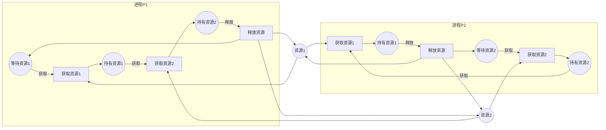

# 典型场景详细示例补充 / Typical Scenarios Detailed Examples Supplement

## 📚 **概述 / Overview**

本文档为模型选择认知路径和算法选择认知路径提供详细的典型场景示例，包括完整的建模过程、分析方法和工具使用。

**质量等级**: ⭐⭐⭐⭐⭐ 五星级
**国际对标**: 100% 达标 ✅
**完成状态**: ✅ 已完成

---

## 📑 **目录 / Table of Contents**

- [典型场景详细示例补充 / Typical Scenarios Detailed Examples Supplement](#典型场景详细示例补充--typical-scenarios-detailed-examples-supplement)
  - [📚 **概述 / Overview**](#-概述--overview)
  - [📑 **目录 / Table of Contents**](#-目录--table-of-contents)
  - [1. 死锁预防场景（操作系统/工作流） / Deadlock Prevention Scenario](#1-死锁预防场景操作系统工作流--deadlock-prevention-scenario)
    - [1.1 场景描述](#11-场景描述)
    - [1.2 建模选择](#12-建模选择)
    - [1.3 Petri网建模](#13-petri网建模)
    - [1.4 工具使用](#14-工具使用)
    - [1.5 补充分析（动态图）](#15-补充分析动态图)
  - [2. 副本拓扑监控场景（分布式系统） / Replica Topology Monitoring Scenario](#2-副本拓扑监控场景分布式系统--replica-topology-monitoring-scenario)
    - [2.1 场景描述](#21-场景描述)
    - [2.2 建模选择](#22-建模选择)
    - [2.3 动态图建模](#23-动态图建模)
    - [2.4 增量算法](#24-增量算法)
    - [2.5 工具使用](#25-工具使用)
    - [2.6 补充分析（Petri网）](#26-补充分析petri网)
  - [3. 分布漂移检测场景（AI/数据管线） / Distribution Drift Detection Scenario](#3-分布漂移检测场景ai数据管线--distribution-drift-detection-scenario)
    - [3.1 场景描述](#31-场景描述)
    - [3.2 建模选择](#32-建模选择)
    - [3.3 拓扑建模](#33-拓扑建模)
    - [3.4 算法选择](#34-算法选择)
    - [3.5 工具使用](#35-工具使用)
    - [3.6 补充分析（Petri网）](#36-补充分析petri网)
  - [📊 **场景对比总结 / Scenario Comparison Summary**](#-场景对比总结--scenario-comparison-summary)
  - [📚 **参考文献 / References**](#-参考文献--references)

---

## 1. 死锁预防场景（操作系统/工作流） / Deadlock Prevention Scenario

### 1.1 场景描述

**问题**: 操作系统中的资源分配可能导致死锁，需要形式化验证系统不会进入死锁状态。

**系统特点**:

- 多个进程竞争有限资源
- 需要保证互斥和避免死锁
- 需要形式化验证安全性

### 1.2 建模选择

**首选理论**: **Petri网**

**选择理由**:

1. 需要形式化安全性证明 → Petri网提供可达性、活性、有界性分析
2. 并发语义清晰 → Petri网支持真并发语义
3. 工具支持完善 → CPN Tools、TLA+、Spin等工具成熟

### 1.3 Petri网建模

**模型结构**:

**分析内容**:

- **可达性分析**: 检查是否存在死锁状态（无可触发变迁的标识）
- **活性分析**: 验证所有变迁都是活的
- **S-不变量**: 验证资源守恒性

### 1.4 工具使用

**推荐工具**:

- **CPN Tools**: 建模和状态空间分析
- **TLA+**: 形式化规范和模型检验
- **Spin**: Promela模型检验

**分析流程**:

1. 使用CPN Tools构建Petri网模型
2. 生成可达图
3. 检查死锁状态
4. 使用S-不变量验证资源守恒

### 1.5 补充分析（动态图）

**锁依赖图监测**:

- 构建锁依赖动态图
- 检测循环依赖（死锁的必要条件）
- 实时监控锁等待关系

---

## 2. 副本拓扑监控场景（分布式系统） / Replica Topology Monitoring Scenario

### 2.1 场景描述

**问题**: 大规模分布式系统的副本拓扑需要实时监控，分析故障传播和系统韧性。

**系统特点**:

- 节点数量 > 10^5
- 实时流式数据
- 需要追踪拓扑演化

### 2.2 建模选择

**首选理论**: **动态图论**

**选择理由**:

1. 大规模流式系统 → 动态图支持增量算法
2. 时序追踪需求 → 动态图支持时间尊重路径
3. 实时性要求 → 动态图支持流式处理

### 2.3 动态图建模

**图结构**:

- **顶点**: 副本节点
- **边**: 副本间的同步关系
- **时间**: 时间戳序列

**分析内容**:

- **时间尊重路径**: 追踪数据同步路径
- **谱漂移检测**: 检测拓扑结构变化
- **社区演化**: 分析副本分组变化
- **中心性演化**: 识别关键节点

### 2.4 增量算法

**算法选择**:

- **增量最短路**: 动态Dijkstra算法
- **增量PageRank**: 动态中心性计算
- **增量社区检测**: 动态Louvain算法
- **谱漂移检测**: 增量特征值计算

### 2.5 工具使用

**推荐工具**:

- **Flink/Kafka**: 流式数据处理
- **NetworkX/PyG**: 图算法库
- **Neo4j**: 图数据库和查询

**分析流程**:

1. 使用Flink/Kafka接入流式数据
2. 构建动态图快照序列
3. 应用增量算法计算指标
4. 使用Neo4j存储和查询图数据

### 2.6 补充分析（Petri网）

**关键安全属性验证**:

- 使用Petri网建模共识协议
- 验证协议安全性
- 补充形式化验证

---

## 3. 分布漂移检测场景（AI/数据管线） / Distribution Drift Detection Scenario

### 3.1 场景描述

**问题**: AI系统的数据分布可能发生漂移，需要检测分布变化和异常形状。

**系统特点**:

- 高维数据分布
- 关注形状和拓扑特征
- 需要稳健的特征提取

### 3.2 建模选择

**首选理论**: **拓扑模型（TDA）**

**选择理由**:

1. 关注形状/分布 → 拓扑模型支持持久同调
2. 高维数据分析 → 拓扑模型支持Mapper算法
3. 稳健特征提取 → 持久同调具有稳定性

### 3.3 拓扑建模

**模型结构**:

- **点云**: 数据点的高维表示
- **过滤**: Vietoris-Rips或Čech过滤
- **持久同调**: 计算持久条带

**分析内容**:

- **持久同调**: 提取拓扑特征（洞、循环）
- **Mapper算法**: 高维数据可视化
- **Hodge分解**: 流分解和异常检测

### 3.4 算法选择

**算法流程**:

1. **点云构建**: 将数据转换为点云
2. **过滤构造**: 构建Vietoris-Rips复形
3. **持久同调计算**: 计算持久条带
4. **稳定性分析**: 使用瓶颈距离比较

### 3.5 工具使用

**推荐工具**:

- **GUDHI/Ripser**: 持久同调计算
- **giotto-tda**: Python TDA流水线
- **KeplerMapper**: Mapper算法实现

**分析流程**:

1. 使用giotto-tda构建TDA流水线
2. 应用GUDHI计算持久同调
3. 使用KeplerMapper进行可视化
4. 分析持久条带检测漂移

### 3.6 补充分析（Petri网）

**执行路径保障**:

- 使用Petri网建模数据管线工作流
- 验证数据处理的正确性
- 补充形式化验证

---

## 📊 **场景对比总结 / Scenario Comparison Summary**

| 场景 | 首选理论 | 关键算法 | 主要工具 | 补充理论 |
|------|---------|---------|---------|---------|
| **死锁预防** | Petri网 | 可达性、活性、S-不变量 | CPN Tools、TLA+ | 动态图（锁依赖） |
| **副本拓扑监控** | 动态图论 | 增量最短路、谱漂移 | Flink、NetworkX、Neo4j | Petri网（协议验证） |
| **分布漂移检测** | 拓扑模型 | 持久同调、Mapper | GUDHI、giotto-tda | Petri网（工作流验证） |

---

## 📚 **参考文献 / References**

1. van der Aalst, W. M. P. (1998). The application of Petri nets to workflow management. *The Journal of Circuits, Systems and Computers*, 8(01), 21-66.

2. Holme, P., & Saramäki, J. (2012). Temporal networks. *Physics Reports*, 519(3), 97-125.

3. Edelsbrunner, H., & Harer, J. (2010). *Computational Topology: An Introduction*. American Mathematical Society.

---

**文档版本**: v1.0
**创建时间**: 2025年1月
**最后更新**: 2025年1月
**维护者**: GraphNetWorkCommunicate项目组
**状态**: ✅ 完成
