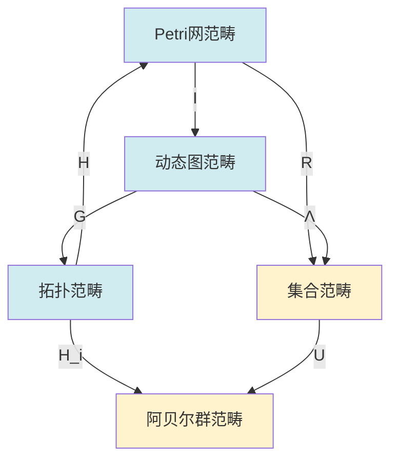

# 关系映射梳理概述 / Relationship Mapping Analysis Overview

## 📚 **概述 / Overview**

**文档目的**: 系统梳理三大理论（Petri网、动态图论、拓扑模型）之间的映射关系，建立完整的映射体系。

**核心主题**:

- 结构层面的映射关系
- 状态空间的映射关系
- 动态演化的映射关系
- 守恒律的映射关系

**主要内容**:

- Petri网 → 动态图映射
- 动态图 → 拓扑模型映射
- 拓扑模型 → Petri网映射
- 统一映射框架

**适用对象**: 理论研究者、系统工程师

---

## 📋 **目录 / Table of Contents**

- [关系映射梳理概述 / Relationship Mapping Analysis Overview](#关系映射梳理概述--relationship-mapping-analysis-overview)
  - [📚 **概述 / Overview**](#-概述--overview)
  - [📋 **目录 / Table of Contents**](#-目录--table-of-contents)
  - [🔄 **一、Petri网 → 动态图映射 / Part 1: Petri Net → Dynamic Graph Mapping**](#-一petri网--动态图映射--part-1-petri-net--dynamic-graph-mapping)
    - [1.1 结构映射](#11-结构映射)
    - [1.2 状态映射](#12-状态映射)
    - [1.3 动态映射](#13-动态映射)
  - [🔄 **二、动态图 → 拓扑模型映射 / Part 2: Dynamic Graph → Topology Model Mapping**](#-二动态图--拓扑模型映射--part-2-dynamic-graph--topology-model-mapping)
    - [2.1 结构映射](#21-结构映射)
    - [2.2 状态映射](#22-状态映射)
    - [2.3 动态映射](#23-动态映射)
  - [🔄 **三、拓扑模型 → Petri网映射 / Part 3: Topology Model → Petri Net Mapping**](#-三拓扑模型--petri网映射--part-3-topology-model--petri-net-mapping)
    - [3.1 结构映射](#31-结构映射)
    - [3.2 状态映射](#32-状态映射)
    - [3.3 动态映射](#33-动态映射)
  - [🔗 **四、统一映射框架 / Part 4: Unified Mapping Framework**](#-四统一映射框架--part-4-unified-mapping-framework)
    - [4.1 映射复合](#41-映射复合)
    - [4.2 函子交换图](#42-函子交换图)
    - [4.3 映射的完备性](#43-映射的完备性)
  - [📚 **五、参考文档 / Part 5: Reference Documents**](#-五参考文档--part-5-reference-documents)
    - [5.1 理论映射](#51-理论映射)
    - [5.2 View文件夹参考](#52-view文件夹参考)

---

## 🔄 **一、Petri网 → 动态图映射 / Part 1: Petri Net → Dynamic Graph Mapping**

### 1.1 结构映射

**实现函子 I: PNC → DGC**:

- **对象映射**: Petri网N → 动态图序列{G_M}
- **态射映射**: 变迁点火 → 图重写规则
- **函子性质**: 保持复合和恒等

**具体映射**:

- **库所 → 顶点**: 每个库所p对应顶点v_p
- **变迁 → 边**: 每个变迁t对应边e_t
- **标识 → 快照**: 每个标识M对应图快照G_M

### 1.2 状态映射

**标识空间 → 图快照序列**:

- **映射函数**: f: Reach(N, M₀) → {G₁, G₂, ..., G_T}
- **映射规则**: G_M = (V_M, E_M)，其中V_M = {p | M(p) > 0}
- **时间维度**: 可达序列对应时间序列

### 1.3 动态映射

**变迁点火 → 图重写**:

- **点火规则**: M [t⟩ M' → G_M → G_M'
- **图重写**: 添加/删除顶点和边
- **保持性质**: 可达性、活性等性质

---

## 🔄 **二、动态图 → 拓扑模型映射 / Part 2: Dynamic Graph → Topology Model Mapping**

### 2.1 结构映射

**几何实现函子 G: DGC → TOP**:

- **对象映射**: 动态图序列 → 胞腔复形序列
- **态射映射**: 图重写 → 同伦变形
- **函子性质**: 保持拓扑结构

**具体映射**:

- **顶点 → 0-胞腔**: 每个顶点v对应0-胞腔c₀
- **边 → 1-胞腔**: 每条边e对应1-胞腔c₁
- **图 → 复形**: 每个图G对应复形K_G

### 2.2 状态映射

**快照序列 → 链复形序列**:

- **映射函数**: g: {G₁, ..., G_T} → {C₁, ..., C_T}
- **映射规则**: C_t = C(G_t)，图的链复形
- **时间维度**: 快照序列对应复形序列

### 2.3 动态映射

**图重写 → 同伦变形**:

- **重写规则**: G → G' → K_G → K_G'
- **同伦变形**: 连续变形保持拓扑性质
- **保持性质**: 连通性、同调群等性质

---

## 🔄 **三、拓扑模型 → Petri网映射 / Part 3: Topology Model → Petri Net Mapping**

### 3.1 结构映射

**离散化函子 D: TOP → PNC**:

- **对象映射**: 胞腔复形K → Petri网N_K
- **态射映射**: 同伦变形 → 变迁序列
- **函子性质**: 保持离散结构

**具体映射**:

- **0-胞腔 → 库所**: 每个0-胞腔c₀对应库所p
- **1-胞腔 → 变迁**: 每个1-胞腔c₁对应变迁t
- **复形 → 网**: 每个复形K对应网N_K

### 3.2 状态映射

**链群 → 标识空间**:

- **映射函数**: h: C₀(K) → M
- **映射规则**: M(p) = c₀的系数
- **离散化**: 连续链群离散化为标识

### 3.3 动态映射

**同伦变形 → 变迁点火**:

- **变形规则**: K → K' → N_K → N_K'
- **点火序列**: 对应同伦路径
- **保持性质**: 拓扑不变量对应Petri网不变量

---

## 🔗 **四、统一映射框架 / Part 4: Unified Mapping Framework**

### 4.1 映射复合

**复合映射**:

```text
Petri网 → 动态图 → 拓扑模型
   ↓         ↓         ↓
  I(N)    G(I(N))   H(G(I(N)))
```

**交换性**:

- H ∘ G ∘ I = 统一映射
- 保持理论间的对应关系

### 4.2 函子交换图



### 4.3 映射的完备性

**完全忠实函子**:

- **完全性**: 所有对象和态射都有映射
- **忠实性**: 不同对象映射到不同对象
- **统一性**: 所有映射在统一框架下一致

---

## 📚 **五、参考文档 / Part 5: Reference Documents**

### 5.1 理论映射

- [理论映射关系图谱](../00-理论映射关系图谱.md)
- [理论逻辑脉络梳理概述](../01-理论逻辑脉络/00-理论逻辑脉络梳理概述.md)

### 5.2 View文件夹参考

- [View文件夹概念关系网络](../../../view/View文件夹概念关系网络-2025.md)
- [视图文件全面梳理与推进计划](../../../view/视图文件全面梳理与推进计划-2025.md)

---

**文档版本**: v1.0
**创建时间**: 2025年1月
**最后更新**: 2025年1月
**维护者**: GraphNetWorkCommunicate项目组
**状态**: ✅ 完成
