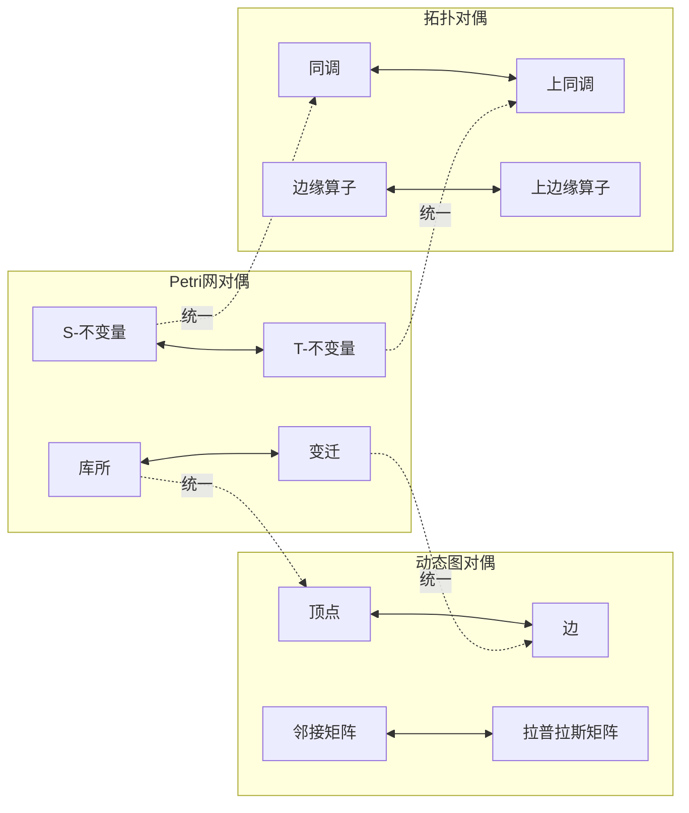

# 对偶关系总结概述 / Duality Relationship Summary Overview

## 📚 **概述 / Overview**

**文档目的**: 总结三大理论（Petri网、动态图论、拓扑模型）中的对偶关系，揭示理论间的对偶结构和语义。

**核心主题**:

- 结构对偶关系
- 语义对偶关系
- 方法对偶关系
- 对偶性的统一理解

**主要内容**:

- Petri网的对偶结构
- 动态图论的对偶结构
- 拓扑模型的对偶结构
- 跨理论的对偶映射

**适用对象**: 理论研究者、学习者

---

## 📋 **目录 / Table of Contents**

- [对偶关系总结概述 / Duality Relationship Summary Overview](#对偶关系总结概述--duality-relationship-summary-overview)
  - [📚 **概述 / Overview**](#-概述--overview)
  - [📋 **目录 / Table of Contents**](#-目录--table-of-contents)
  - [🔄 **一、结构对偶关系 / Part 1: Structural Duality Relationships**](#-一结构对偶关系--part-1-structural-duality-relationships)
    - [1.1 Petri网的结构对偶](#11-petri网的结构对偶)
    - [1.2 动态图论的结构对偶](#12-动态图论的结构对偶)
    - [1.3 拓扑模型的结构对偶](#13-拓扑模型的结构对偶)
  - [💭 **二、语义对偶关系 / Part 2: Semantic Duality Relationships**](#-二语义对偶关系--part-2-semantic-duality-relationships)
    - [2.1 离散 ↔ 连续对偶](#21-离散--连续对偶)
    - [2.2 局部 ↔ 全局对偶](#22-局部--全局对偶)
    - [2.3 时间 ↔ 空间对偶](#23-时间--空间对偶)
  - [🛠️ **三、方法对偶关系 / Part 3: Methodological Duality Relationships**](#️-三方法对偶关系--part-3-methodological-duality-relationships)
    - [3.1 构造 ↔ 分析对偶](#31-构造--分析对偶)
    - [3.2 精确 ↔ 近似对偶](#32-精确--近似对偶)
    - [3.3 静态 ↔ 动态对偶](#33-静态--动态对偶)
  - [🔗 **四、对偶性的统一理解 / Part 4: Unified Understanding of Duality**](#-四对偶性的统一理解--part-4-unified-understanding-of-duality)
    - [4.1 范畴论视角](#41-范畴论视角)
    - [4.2 统一对偶映射](#42-统一对偶映射)
    - [4.3 对偶性的认知意义](#43-对偶性的认知意义)
  - [📚 **五、参考文档 / Part 5: Reference Documents**](#-五参考文档--part-5-reference-documents)
    - [5.1 理论逻辑脉络](#51-理论逻辑脉络)
    - [5.2 理论映射](#52-理论映射)

---

## 🔄 **一、结构对偶关系 / Part 1: Structural Duality Relationships**

### 1.1 Petri网的结构对偶

**库所 ↔ 变迁对偶**:

- **库所（Place）**: 资源类型，存储令牌
- **变迁（Transition）**: 过程/事件，消耗和产生令牌
- **对偶性**: 资源 ↔ 过程，静态 ↔ 动态

**前集 ↔ 后集对偶**:

- **前集（•t）**: 变迁的输入库所
- **后集（t•）**: 变迁的输出库所
- **对偶性**: 输入 ↔ 输出，消耗 ↔ 产生

**S-不变量 ↔ T-不变量对偶**:

- **S-不变量**: 库所权重的守恒向量
- **T-不变量**: 变迁权重的循环向量
- **对偶性**: 资源守恒 ↔ 过程循环，空间 ↔ 时间

### 1.2 动态图论的结构对偶

**顶点 ↔ 边对偶**:

- **顶点（Vertex）**: 实体，图的节点
- **边（Edge）**: 关系，图的连接
- **对偶性**: 实体 ↔ 关系，节点 ↔ 连接

**入度 ↔ 出度对偶**:

- **入度（In-degree）**: 指向顶点的边数
- **出度（Out-degree）**: 从顶点出发的边数
- **对偶性**: 输入 ↔ 输出，接收 ↔ 发送

**邻接矩阵 ↔ 拉普拉斯矩阵对偶**:

- **邻接矩阵**: 描述连接关系
- **拉普拉斯矩阵**: 描述扩散过程
- **对偶性**: 结构 ↔ 过程，连接 ↔ 扩散

### 1.3 拓扑模型的结构对偶

**同调 ↔ 上同调对偶**:

- **同调群（Homology）**: 链的等价类
- **上同调群（Cohomology）**: 上链的等价类
- **对偶性**: 链 ↔ 函数，几何 ↔ 代数

**边缘算子 ↔ 上边缘算子对偶**:

- **边缘算子（∂）**: 链的边界
- **上边缘算子（δ）**: 上链的边界
- **对偶性**: 链边界 ↔ 函数边界，几何 ↔ 分析

**胞腔 ↔ 对偶胞腔对偶**:

- **胞腔（Cell）**: 复形的基本单元
- **对偶胞腔**: 对偶复形的基本单元
- **对偶性**: 原复形 ↔ 对偶复形，几何 ↔ 几何

---

## 💭 **二、语义对偶关系 / Part 2: Semantic Duality Relationships**

### 2.1 离散 ↔ 连续对偶

**Petri网 ↔ 拓扑模型**:

- **Petri网**: 离散的令牌分布和变迁点火
- **拓扑模型**: 连续的几何形状和同伦变形
- **对偶性**: 离散 ↔ 连续，组合 ↔ 几何

**统一理解**:

- Petri网的离散状态可以看作拓扑模型的离散采样
- 拓扑模型的连续形状可以看作Petri网的连续化

### 2.2 局部 ↔ 全局对偶

**Petri网 ↔ 动态图论**:

- **Petri网**: 局部的变迁点火规则
- **动态图论**: 全局的图重写系统
- **对偶性**: 局部 ↔ 全局，规则 ↔ 系统

**统一理解**:

- Petri网的局部规则组合产生全局行为
- 动态图论的全局系统可以分解为局部规则

### 2.3 时间 ↔ 空间对偶

**动态图论 ↔ 拓扑模型**:

- **动态图论**: 时间维度的图演化
- **拓扑模型**: 空间维度的几何形状
- **对偶性**: 时间 ↔ 空间，演化 ↔ 形状

**统一理解**:

- 动态图的时间演化可以看作拓扑模型的空间形状
- 拓扑模型的空间形状可以看作动态图的时间快照

---

## 🛠️ **三、方法对偶关系 / Part 3: Methodological Duality Relationships**

### 3.1 构造 ↔ 分析对偶

**Petri网方法对偶**:

- **构造方法**: 可达图构造、展开构造
- **分析方法**: 不变量分析、结构分析
- **对偶性**: 构造 ↔ 分析，生成 ↔ 验证

**动态图方法对偶**:

- **构造方法**: 图生成、图演化
- **分析方法**: 谱分析、社区分析
- **对偶性**: 构造 ↔ 分析，生成 ↔ 理解

**拓扑方法对偶**:

- **构造方法**: 复形构造、过滤构造
- **分析方法**: 同调分析、持续同调分析
- **对偶性**: 构造 ↔ 分析，生成 ↔ 特征提取

### 3.2 精确 ↔ 近似对偶

**精确方法 ↔ 近似方法**:

- **精确方法**: 完整状态空间、精确计算
- **近似方法**: 采样、压缩、近似算法
- **对偶性**: 精确 ↔ 近似，完整 ↔ 高效

**应用场景**:

- 小规模系统：精确方法
- 大规模系统：近似方法
- 混合策略：精确+近似

### 3.3 静态 ↔ 动态对偶

**静态分析 ↔ 动态分析**:

- **静态分析**: 结构性质、不变量
- **动态分析**: 演化过程、行为轨迹
- **对偶性**: 静态 ↔ 动态，结构 ↔ 行为

**统一理解**:

- 静态分析揭示结构性质
- 动态分析揭示行为规律
- 两者结合提供完整理解

---

## 🔗 **四、对偶性的统一理解 / Part 4: Unified Understanding of Duality**

### 4.1 范畴论视角

**对偶函子**:

- **对偶函子**: 将范畴映射到对偶范畴
- **对偶性**: 对象 ↔ 对象，态射 ↔ 态射
- **统一框架**: 所有对偶关系在范畴论中统一

### 4.2 统一对偶映射

### 4.3 对偶性的认知意义

**对偶性揭示**:

- 理论间的深层联系
- 概念间的对称性
- 方法间的互补性

**对偶性的应用**:

- 问题转换：利用对偶性转换问题
- 方法选择：根据对偶性选择方法
- 理论统一：通过对偶性统一理论

---

## 📚 **五、参考文档 / Part 5: Reference Documents**

### 5.1 理论逻辑脉络

- [理论逻辑脉络梳理概述](../01-理论逻辑脉络/00-理论逻辑脉络梳理概述.md)
- [Petri网理论逻辑脉络](../01-理论逻辑脉络/01-Petri网理论逻辑脉络.md)
- [动态图论逻辑脉络](../01-理论逻辑脉络/02-动态图论逻辑脉络.md)
- [拓扑模型逻辑脉络](../01-理论逻辑脉络/03-拓扑模型逻辑脉络.md)

### 5.2 理论映射

- [理论映射关系图谱](../00-理论映射关系图谱.md)
- [View文件夹概念关系网络](../../../view/View文件夹概念关系网络-2025.md)

---

**文档版本**: v1.0
**创建时间**: 2025年1月
**最后更新**: 2025年1月
**维护者**: GraphNetWorkCommunicate项目组
**状态**: ✅ 完成
