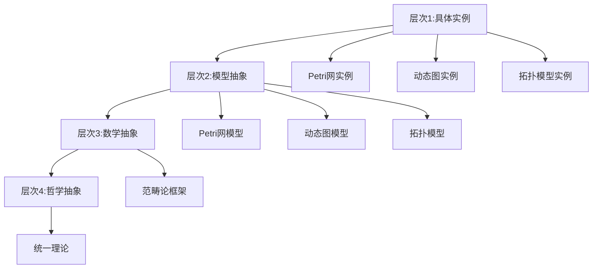
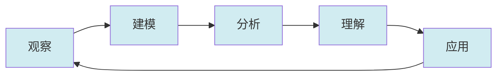

# 统一认知模式概述 / Unified Cognitive Pattern Overview

## 📚 **概述 / Overview**

**文档目的**: 总结三大理论（Petri网、动态图论、拓扑模型）在认知层面的统一模式，揭示理论认知的共同规律。

**核心主题**:

- 理论认知的统一模式
- 概念认知的统一规律
- 方法认知的统一路径
- 应用认知的统一机制

**主要内容**:

- 认知层次的统一
- 认知过程的统一
- 认知结果的统一
- 认知工具的统一

**适用对象**: 理论研究者、学习者、教育者

---

## 📋 **目录 / Table of Contents**

- [统一认知模式概述 / Unified Cognitive Pattern Overview](#统一认知模式概述--unified-cognitive-pattern-overview)
  - [📚 **概述 / Overview**](#-概述--overview)
  - [📋 **目录 / Table of Contents**](#-目录--table-of-contents)
  - [🧠 **一、认知层次的统一 / Part 1: Unified Cognitive Levels**](#-一认知层次的统一--part-1-unified-cognitive-levels)
    - [1.1 四层认知架构](#11-四层认知架构)
    - [1.2 认知层次的映射](#12-认知层次的映射)
  - [🔄 **二、认知过程的统一 / Part 2: Unified Cognitive Processes**](#-二认知过程的统一--part-2-unified-cognitive-processes)
    - [2.1 认知过程阶段](#21-认知过程阶段)
    - [2.2 认知过程的循环](#22-认知过程的循环)
  - [📊 **三、认知结果的统一 / Part 3: Unified Cognitive Results**](#-三认知结果的统一--part-3-unified-cognitive-results)
    - [3.1 结构认知的统一](#31-结构认知的统一)
    - [3.2 动态认知的统一](#32-动态认知的统一)
    - [3.3 应用认知的统一](#33-应用认知的统一)
  - [🛠️ **四、认知工具的统一 / Part 4: Unified Cognitive Tools**](#️-四认知工具的统一--part-4-unified-cognitive-tools)
    - [4.1 思维表征工具](#41-思维表征工具)
    - [4.2 分析方法工具](#42-分析方法工具)
    - [4.3 决策工具](#43-决策工具)
  - [📚 **五、参考文档 / Part 5: Reference Documents**](#-五参考文档--part-5-reference-documents)
    - [5.1 理论逻辑脉络](#51-理论逻辑脉络)
    - [5.2 认知规律归纳](#52-认知规律归纳)
    - [5.3 认知表征工具](#53-认知表征工具)

---

## 🧠 **一、认知层次的统一 / Part 1: Unified Cognitive Levels**

### 1.1 四层认知架构

**层次1：具体实例层**

- **Petri网**: 具体的工作流系统、并发系统
- **动态图**: 具体的社交网络、服务依赖网络
- **拓扑模型**: 具体的数据点云、网络结构
- **统一理解**: 都是具体系统的抽象

**层次2：模型抽象层**

- **Petri网**: 有向二分图模型
- **动态图**: 时序图模型
- **拓扑模型**: 胞腔复形模型
- **统一理解**: 都是离散结构的数学模型

**层次3：数学抽象层**

- **Petri网**: 范畴论中的对象
- **动态图**: 范畴论中的对象
- **拓扑模型**: 范畴论中的对象
- **统一理解**: 都在范畴论框架下统一

**层次4：哲学抽象层**

- **统一理论**: 资源-过程几何学
- **统一视角**: 离散事件动态系统
- **统一理解**: 都是系统演化的不同表示

### 1.2 认知层次的映射

---

## 🔄 **二、认知过程的统一 / Part 2: Unified Cognitive Processes**

### 2.1 认知过程阶段

**阶段1：观察与描述**

- **Petri网**: 观察系统行为，描述为Petri网
- **动态图**: 观察网络演化，描述为动态图
- **拓扑模型**: 观察数据形状，描述为拓扑模型
- **统一过程**: 都是观察→描述的过程

**阶段2：建模与分析**

- **Petri网**: 建立Petri网模型，进行可达性分析
- **动态图**: 建立动态图模型，进行演化分析
- **拓扑模型**: 建立拓扑模型，进行同调分析
- **统一过程**: 都是建模→分析的过程

**阶段3：理解与解释**

- **Petri网**: 理解系统行为，解释性质
- **动态图**: 理解网络演化，解释模式
- **拓扑模型**: 理解数据形状，解释特征
- **统一过程**: 都是理解→解释的过程

**阶段4：应用与推广**

- **Petri网**: 应用到新领域，推广理论
- **动态图**: 应用到新领域，推广理论
- **拓扑模型**: 应用到新领域，推广理论
- **统一过程**: 都是应用→推广的过程

### 2.2 认知过程的循环

---

## 📊 **三、认知结果的统一 / Part 3: Unified Cognitive Results**

### 3.1 结构认知的统一

**结构理解**:

- **Petri网**: 理解有向二分图结构
- **动态图**: 理解时序图结构
- **拓扑模型**: 理解胞腔复形结构
- **统一结果**: 都理解离散结构

**结构性质**:

- **Petri网**: 连通性、有界性、活性
- **动态图**: 连通性、社区结构、谱性质
- **拓扑模型**: 连通性、同调群、拓扑不变量
- **统一结果**: 都理解结构性质

### 3.2 动态认知的统一

**动态理解**:

- **Petri网**: 理解变迁点火过程
- **动态图**: 理解图演化过程
- **拓扑模型**: 理解同伦变形过程
- **统一结果**: 都理解动态过程

**动态性质**:

- **Petri网**: 可达性、活性、公平性
- **动态图**: 路径存在性、社区演化、谱演化
- **拓扑模型**: 持续同调、同伦等价、拓扑演化
- **统一结果**: 都理解动态性质

### 3.3 应用认知的统一

**应用理解**:

- **Petri网**: 理解工作流建模、死锁检测
- **动态图**: 理解社交网络分析、服务依赖追踪
- **拓扑模型**: 理解数据形状分析、异常检测
- **统一结果**: 都理解应用场景

**应用模式**:

- **Petri网**: 形式化验证、性能分析
- **动态图**: 实时监控、演化预测
- **拓扑模型**: 特征提取、可视化
- **统一结果**: 都理解应用模式

---

## 🛠️ **四、认知工具的统一 / Part 4: Unified Cognitive Tools**

### 4.1 思维表征工具

**思维导图**:

- **Petri网**: Petri网理论思维导图
- **动态图**: 动态图论思维导图
- **拓扑模型**: 拓扑模型思维导图
- **统一工具**: 统一理论框架思维导图

**关系图**:

- **Petri网**: 概念关系网络图
- **动态图**: 概念关系网络图
- **拓扑模型**: 概念关系网络图
- **统一工具**: 跨理论概念关系网络图

**因果链**:

- **Petri网**: 理论选择因果链
- **动态图**: 理论选择因果链
- **拓扑模型**: 理论选择因果链
- **统一工具**: 统一理论选择因果链

### 4.2 分析方法工具

**线性代数方法**:

- **Petri网**: 关联矩阵、状态方程
- **动态图**: 拉普拉斯矩阵、谱分析
- **拓扑模型**: 链复形、同调计算
- **统一工具**: 统一的线性代数框架

**不变量分析**:

- **Petri网**: S/T-不变量
- **动态图**: 谱不变量
- **拓扑模型**: 同调不变量
- **统一工具**: 统一的不变量框架

**展开分析**:

- **Petri网**: Unfolding
- **动态图**: 图展开
- **拓扑模型**: 万有覆叠空间
- **统一工具**: 统一的展开框架

### 4.3 决策工具

**决策树**:

- **模型选择决策树**: 选择理论模型
- **算法选择决策树**: 选择分析方法
- **工具选择决策树**: 选择工具链
- **统一工具**: 统一的决策框架

---

## 📚 **五、参考文档 / Part 5: Reference Documents**

### 5.1 理论逻辑脉络

- [理论逻辑脉络梳理概述](../01-理论逻辑脉络/00-理论逻辑脉络梳理概述.md)
- [Petri网理论逻辑脉络](../01-理论逻辑脉络/01-Petri网理论逻辑脉络.md)
- [动态图论逻辑脉络](../01-理论逻辑脉络/02-动态图论逻辑脉络.md)
- [拓扑模型逻辑脉络](../01-理论逻辑脉络/03-拓扑模型逻辑脉络.md)

### 5.2 认知规律归纳

- [认知规律归纳概述](../02-认知规律归纳/00-认知规律归纳概述.md)

### 5.3 认知表征工具

- [认知表征图谱概述](../认知表征图谱/00-认知表征图谱概述.md)
- [统一理论框架思维导图](../认知表征图谱/01-思维导图文档/04-统一理论框架思维导图.md)

---

**文档版本**: v1.0
**创建时间**: 2025年1月
**最后更新**: 2025年1月
**维护者**: GraphNetWorkCommunicate项目组
**状态**: ✅ 完成
