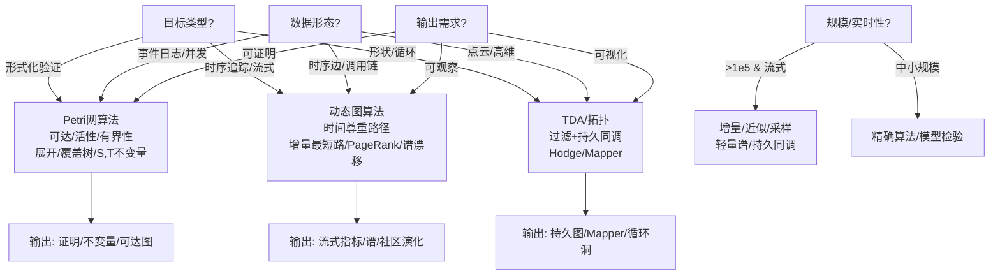

# 算法选择认知路径 / Algorithm Selection Cognitive Path

## 📚 概述 / Overview

面向三大理论场景（Petri网分析、动态图分析、拓扑/TDA），给出可操作的算法选择流程、文字决策树与输出物。

---

## 🎯 判断流程（简版）

1) **目标类型**
   - 形式化验证/可达性/活性 → Petri网分析族
   - 时序追踪/大规模流式 → 动态图增量/近似
   - 形状/循环/稳健特征 → 拓扑/TDA（持久同调、Hodge、Mapper）
2) **规模与实时性**
   - 节点/事件 > 1e5 且流式 → 增量/采样/近似优先
   - 中小规模、需精确 → 精确算法/模型检验
3) **数据形态**
   - 事件日志/并发语义 → Petri网（可达、S/T不变量、展开）
   - 时序边/调用链 → 动态图（时间尊重路径、谱演化、社区/中心性增量）
   - 点云/高维分布 → TDA（过滤+持久条带），或谱/Hodge
4) **约束与成本**
   - 延迟严格 → 增量最短路/中心性、流式检测、轻量谱近似
   - 资源受限 → 抽样+Sketch；子图切片；压缩状态空间
5) **结果需求**
   - 可证明 → 模型检验/不变量/证明树
   - 可观察 → 流式指标/谱漂移/社区演化
   - 可视化 → 持久图/Mapper/依赖图

---

## 🔀 决策树（文字版）

```text
目标？
├─ 形式化验证 → Petri网：可达/活性/有界性；展开/覆盖树；S/T不变量
├─ 时序追踪/流式 → 动态图：时间尊重路径、增量PageRank/最短路、谱漂移
└─ 形状/循环 → TDA：过滤构造 + 持久同调；Hodge流分解；Mapper摘要

规模/实时性？
├─ >1e5 & 流式 → 增量/近似/采样（图）；轻量持久同调或谱近似
└─ 中小规模 → 精确算法 / 模型检验

数据形态？
├─ 事件日志/并发 → Petri网
├─ 时序边/调用链 → 动态图
└─ 点云/高维分布 → TDA

输出需求？
├─ 可证明 → 模型检验/不变量/证明树
├─ 可观察 → 流式指标/谱/社区
└─ 可视化 → 持久图/Mapper/依赖图
```

---

## 🧭 决策树（Mermaid）



---

## 📦 输出物

- 选择说明与权衡表：算法类别、复杂度、精度/近似、数据需求
- 推荐算法清单：Petri网（可达图/覆盖树/展开/S/T不变量/CTL/LTL）；动态图（增量最短路、增量PageRank、社区追踪、谱漂移检测）；TDA（持久同调、Hodge、Mapper）
- 工具链映射：验证（CPN/TLA+/Spin）、流式（Flink/Kafka+NetworkX/PyG）、TDA（GUDHI/Ripser/giotto-tda、KeplerMapper）
- 后续动作：数据准备、参数设定、评估指标（精度/延迟/内存）

---

## ✅ 已完成

- ✅ Mermaid决策树（已完成，见上方）
- ✅ 典型场景对照（已完成，见下方）

---

## 🧪 典型场景示例

### 场景1：死锁检测/预防

**问题**: 检测和预防系统中的死锁状态。

**算法选择**: **Petri网算法**

**具体算法**:

- **可达性分析**: 构建可达图，检查死锁状态
- **活性分析**: 验证所有变迁都是活的
- **S/T不变量**: 计算不变量验证系统性质
- **展开算法**: 用于真并发模型检验
- **部分序规约**: 减少状态空间爆炸

**复杂度**:

- 可达性：EXPSPACE-完全
- S/T不变量：多项式时间
- 展开：最坏情况指数级

**工具**: CPN Tools、TLA+、Spin、GreatSPN

**详细示例**: 参见 [`典型场景详细示例补充.md`](../01-理论逻辑脉络/典型场景详细示例补充.md#1-死锁预防场景操作系统工作流--deadlock-prevention-scenario)

### 场景2：副本拓扑监测（分布式系统）

**问题**: 实时监控大规模分布式系统的副本拓扑，分析故障传播。

**算法选择**: **动态图增量算法**

**具体算法**:

- **增量最短路**: 动态Dijkstra算法，复杂度 $O(|E| \log |V|)$
- **增量PageRank**: 动态中心性计算，复杂度 $O(|E|)$
- **谱漂移检测**: 增量特征值计算，复杂度 $O(|V|^2)$
- **增量社区检测**: 动态Louvain算法，复杂度 $O(|E|)$

**流式处理**:

- 使用Flink/Kafka接入流式数据
- 增量更新图结构
- 实时计算指标

**工具**: Flink、Kafka、NetworkX、PyG、Neo4j

**详细示例**: 参见 [`典型场景详细示例补充.md`](../01-理论逻辑脉络/典型场景详细示例补充.md#2-副本拓扑监控场景分布式系统--replica-topology-monitoring-scenario)

### 场景3：分布漂移检测（AI/数据管线）

**问题**: 检测AI系统的数据分布漂移和异常形状。

**算法选择**: **TDA/拓扑算法**

**具体算法**:

- **持久同调**: 计算持久条带，复杂度 $O(n^3)$（$n$ 是点数）
- **Mapper算法**: 高维数据可视化，复杂度 $O(n \log n)$
- **Hodge分解**: 流分解，复杂度 $O(|E|^3)$
- **降采样+近似**: 实时性要求高时使用

**优化策略**:

- 降采样减少点数
- 轻量条带近似
- 增量持久同调计算

**工具**: GUDHI、Ripser、giotto-tda、KeplerMapper

**详细示例**: 参见 [`典型场景详细示例补充.md`](../01-理论逻辑脉络/典型场景详细示例补充.md#3-分布漂移检测场景ai数据管线--distribution-drift-detection-scenario)
