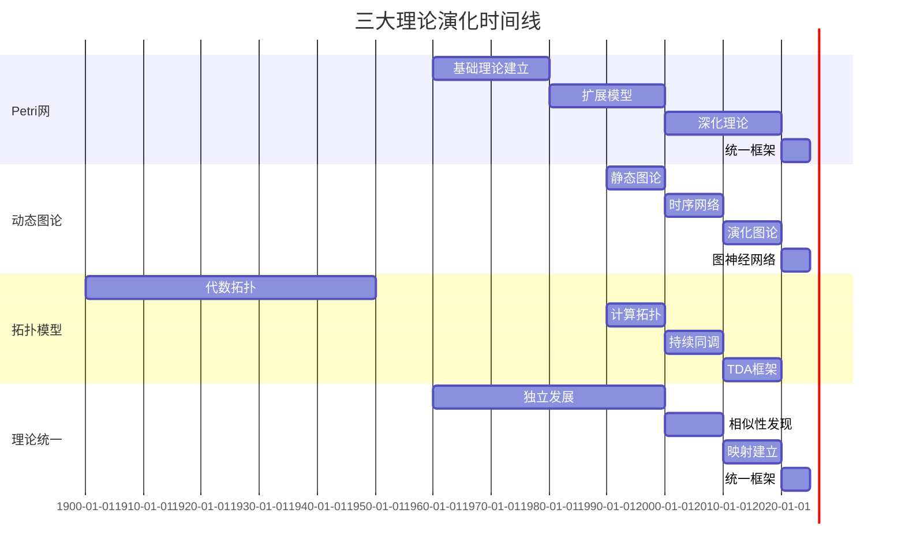

# 理论演化历史概述 / Theory Evolution History Overview

## 📚 **概述 / Overview**

**文档目的**: 梳理三大理论（Petri网、动态图论、拓扑模型）的历史发展脉络，揭示理论演化的认知规律。

**核心主题**:

- Petri网理论演化历史
- 动态图论演化历史
- 拓扑模型演化历史
- 理论统一的历史进程

**主要内容**:

- 理论发展时间线
- 关键理论突破点
- 理论演化的认知路径
- 理论融合的历史节点

**适用对象**: 理论研究者、学习者、教育者

---

## 📋 **目录 / Table of Contents**

- [理论演化历史概述 / Theory Evolution History Overview](#理论演化历史概述--theory-evolution-history-overview)
  - [📚 **概述 / Overview**](#-概述--overview)
  - [📋 **目录 / Table of Contents**](#-目录--table-of-contents)
  - [📅 **一、Petri网理论演化历史 / Part 1: Petri Net Theory Evolution History**](#-一petri网理论演化历史--part-1-petri-net-theory-evolution-history)
    - [1.1 起源阶段（1960-1970年代）](#11-起源阶段1960-1970年代)
    - [1.2 扩展阶段（1980-1990年代）](#12-扩展阶段1980-1990年代)
    - [1.3 深化阶段（2000-2010年代）](#13-深化阶段2000-2010年代)
    - [1.4 统一阶段（2020年代至今）](#14-统一阶段2020年代至今)
  - [📅 **二、动态图论演化历史 / Part 2: Dynamic Graph Theory Evolution History**](#-二动态图论演化历史--part-2-dynamic-graph-theory-evolution-history)
    - [2.1 起源阶段（1990-2000年代）](#21-起源阶段1990-2000年代)
    - [2.2 扩展阶段（2010年代）](#22-扩展阶段2010年代)
    - [2.3 深化阶段（2020年代）](#23-深化阶段2020年代)
  - [📅 **三、拓扑模型演化历史 / Part 3: Topology Model Evolution History**](#-三拓扑模型演化历史--part-3-topology-model-evolution-history)
    - [3.1 起源阶段（1900-1950年代）](#31-起源阶段1900-1950年代)
    - [3.2 计算阶段（1990-2000年代）](#32-计算阶段1990-2000年代)
    - [3.3 应用阶段（2010-2020年代）](#33-应用阶段2010-2020年代)
  - [🔗 **四、理论统一的历史进程 / Part 4: Historical Process of Theory Unification**](#-四理论统一的历史进程--part-4-historical-process-of-theory-unification)
    - [4.1 独立发展阶段（1960-2000年代）](#41-独立发展阶段1960-2000年代)
    - [4.2 相似性发现阶段（2000-2010年代）](#42-相似性发现阶段2000-2010年代)
    - [4.3 映射建立阶段（2010-2020年代）](#43-映射建立阶段2010-2020年代)
    - [4.4 统一框架阶段（2020年代至今）](#44-统一框架阶段2020年代至今)
  - [📊 **五、理论演化时间线 / Part 5: Theory Evolution Timeline**](#-五理论演化时间线--part-5-theory-evolution-timeline)
  - [📚 **六、参考文档 / Part 6: Reference Documents**](#-六参考文档--part-6-reference-documents)
    - [6.1 理论逻辑脉络](#61-理论逻辑脉络)
    - [6.2 认知规律归纳](#62-认知规律归纳)
    - [6.3 View文件夹参考](#63-view文件夹参考)

---

## 📅 **一、Petri网理论演化历史 / Part 1: Petri Net Theory Evolution History**

### 1.1 起源阶段（1960-1970年代）

**1962年：Petri的博士论文**

- **作者**: Carl Adam Petri（德国波恩大学）
- **论文标题**: "Kommunikation mit Automaten" (Communication with Automata)
- **贡献**: 提出Petri网的基本概念和理论基础
  - 引入库所(Place)和变迁(Transition)的概念
  - 建立有向二分图的数学框架
  - 定义变迁点火的规则
- **核心思想**: 用有向二分图建模并发系统
  - 并发性的形式化表示
  - 异步通信的精确建模
  - 系统状态的动态演化
- **影响**: 奠定了Petri网理论的基础
  - 开创了并发系统建模的新领域
  - 为形式化验证提供了理论基础
  - 影响了后续的进程代数理论

**1960-1970年代：基础理论建立**

- **结构理论**: 有向二分图的数学性质
  - 二分图的结构性质
  - 流关系的数学定义
  - 网的结构分类（自由选择网、状态机等）
  - 关键成果：建立Petri网的数学基础

- **动态理论**: 变迁点火规则和可达性
  - 变迁使能条件的形式化定义
  - 变迁点火规则的数学描述
  - 可达性概念的引入
  - 可达图构造方法
  - 关键成果：建立Petri网的动态语义

- **应用**: 通信系统、并发控制
  - 通信协议的建模和验证
  - 并发控制算法的分析
  - 系统死锁检测
  - 关键成果：证明Petri网的实用价值

### 1.2 扩展阶段（1980-1990年代）

**1980年代：着色Petri网**

- **贡献**: 引入类型系统和颜色函数
- **应用**: 复杂系统的建模
- **工具**: CPN Tools开发

**1990年代：时间Petri网**

- **贡献**: 引入时间约束
- **应用**: 实时系统建模
- **理论**: 时间区间约束

### 1.3 深化阶段（2000-2010年代）

**2000年代：随机Petri网**

- **贡献**: 引入随机性和概率
- **应用**: 性能分析、可靠性分析
- **理论**: 随机过程理论

**2010年代：混成Petri网**

- **贡献**: 结合离散和连续系统
- **应用**: 混成系统建模
- **理论**: 混成自动机理论

### 1.4 统一阶段（2020年代至今）

**2020年代：范畴论统一**

- **贡献**: 在范畴论框架下统一Petri网
- **应用**: 与其他理论的统一
- **理论**: 范畴论、函子理论

---

## 📅 **二、动态图论演化历史 / Part 2: Dynamic Graph Theory Evolution History**

### 2.1 起源阶段（1990-2000年代）

**1990年代：静态图论成熟**

- **基础**: 图论的基本理论
- **应用**: 社交网络、计算机网络
- **工具**: Graph algorithms

**2000年代：时序网络概念**

- **贡献**: 引入时间维度
- **应用**: 社交网络演化分析
- **理论**: 时序图模型

### 2.2 扩展阶段（2010年代）

**2010年代：演化图理论**

- **贡献**: 图重写系统
- **应用**: 网络演化建模
- **理论**: 图变换理论

**2010年代：因果图理论**

- **贡献**: Do演算和因果推断
- **应用**: 因果分析
- **理论**: 结构方程模型

### 2.3 深化阶段（2020年代）

**2020年代：图神经网络**

- **贡献**: 深度学习与图结合
- **应用**: 图学习、图预测
- **理论**: 图卷积网络、图注意力网络

**2020年代：动态图算法**

- **贡献**: 增量算法、近似算法
- **应用**: 大规模动态网络分析
- **理论**: 流式算法理论

---

## 📅 **三、拓扑模型演化历史 / Part 3: Topology Model Evolution History**

### 3.1 起源阶段（1900-1950年代）

**1900年代：代数拓扑**

- **贡献**: 同调群理论
- **应用**: 几何形状分析
- **理论**: 同调代数

**1950年代：CW复形理论**

- **贡献**: 胞腔复形概念
- **应用**: 拓扑空间分类
- **理论**: 同伦理论

### 3.2 计算阶段（1990-2000年代）

**1990年代：计算拓扑**

- **贡献**: 拓扑计算的算法
- **应用**: 数据形状分析
- **理论**: 计算几何

**2000年代：持续同调**

- **贡献**: 持续同调理论
- **应用**: 数据特征提取
- **理论**: 过滤理论

### 3.3 应用阶段（2010-2020年代）

**2010年代：拓扑数据分析（TDA）**

- **贡献**: TDA框架建立
- **应用**: 高维数据分析
- **理论**: Mapper算法

**2020年代：Hodge理论应用**

- **贡献**: 离散微分几何
- **应用**: 向量场分析、数据去噪
- **理论**: 离散Hodge分解

---

## 🔗 **四、理论统一的历史进程 / Part 4: Historical Process of Theory Unification**

### 4.1 独立发展阶段（1960-2000年代）

**阶段特征**:

- 三大理论各自独立发展
- 各自建立理论体系
- 各自发展应用领域

**时间线**:

- 1960-1980：Petri网理论建立
- 1990-2000：动态图论兴起
- 1990-2000：拓扑模型计算化

### 4.2 相似性发现阶段（2000-2010年代）

**阶段特征**:

- 发现理论间的相似性
- 建立初步的对应关系
- 探索统一的可能性

**关键发现**:

- Petri网与图的对应关系
- 动态图与拓扑的对应关系
- 拓扑与Petri网的对应关系

### 4.3 映射建立阶段（2010-2020年代）

**阶段特征**:

- 建立理论间的映射关系
- 构造函子映射
- 探索统一框架

**关键进展**:

- 函子映射的构造
- 范畴论框架的建立
- 统一性质的发现

### 4.4 统一框架阶段（2020年代至今）

**阶段特征**:

- 建立统一理论框架
- 范畴论统一框架
- 资源-过程几何学

**关键成果**:

- 统一性定理
- 统一映射框架
- 统一认知模式

---

## 📊 **五、理论演化时间线 / Part 5: Theory Evolution Timeline**

---

## 📚 **六、参考文档 / Part 6: Reference Documents**

### 6.1 理论逻辑脉络

- [理论逻辑脉络梳理概述](../01-理论逻辑脉络/00-理论逻辑脉络梳理概述.md)
- [Petri网理论逻辑脉络](../01-理论逻辑脉络/01-Petri网理论逻辑脉络.md)
- [动态图论逻辑脉络](../01-理论逻辑脉络/02-动态图论逻辑脉络.md)
- [拓扑模型逻辑脉络](../01-理论逻辑脉络/03-拓扑模型逻辑脉络.md)

### 6.2 认知规律归纳

- [认知规律归纳概述](../02-认知规律归纳/00-认知规律归纳概述.md)

### 6.3 View文件夹参考

- [View文件夹概念定义清单](../../../view/View文件夹概念定义清单-2025.md)
- [视图文件全面梳理与推进计划](../../../view/视图文件全面梳理与推进计划-2025.md)

---

**文档版本**: v1.0
**创建时间**: 2025年1月
**最后更新**: 2025年1月
**维护者**: GraphNetWorkCommunicate项目组
**状态**: ✅ 完成
