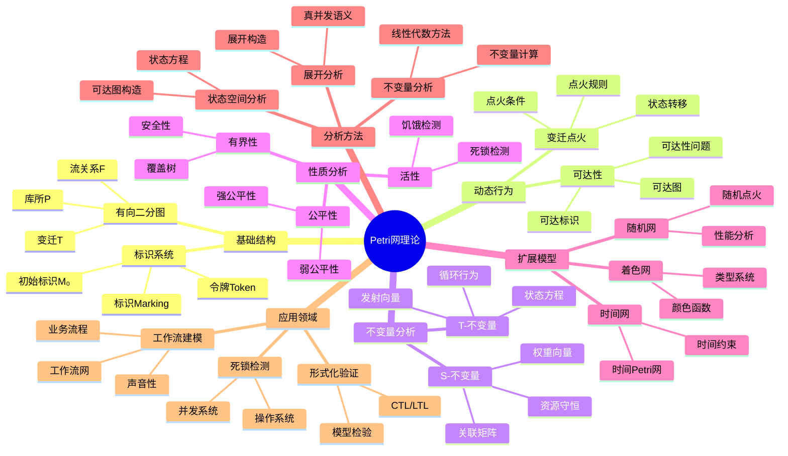

# Petri网理论思维导图 / Petri Net Theory Mind Map

## 📚 **概述 / Overview**

本文档提供Petri网理论的思维导图，用于快速理解Petri网理论的知识结构和概念关系。

---

## 🗺️ **思维导图结构 / Mind Map Structure**

---

## 📋 **核心概念层次 / Core Concept Hierarchy**

### 第一层：基础结构

- **有向二分图**: Petri网的基本结构
  - 库所（Place）：资源类型节点
  - 变迁（Transition）：过程/事件节点
  - 流关系（Flow Relation）：连接关系

- **标识系统**: 系统状态表示
  - 令牌（Token）：资源实例
  - 标识（Marking）：令牌分布
  - 初始标识（Initial Marking）：系统初始状态

### 第二层：动态行为

- **变迁点火**: 系统状态演化机制
  - 点火条件：前集库所有足够令牌
  - 点火规则：令牌转移规则
  - 状态转移：M [t⟩ M'

- **可达性**: 系统可达状态集合
  - 可达标识：从初始标识可达的标识
  - 可达图：以标识为顶点的有向图
  - 可达性问题：判断标识是否可达（EXPSPACE-完全）

### 第三层：不变量分析

- **S-不变量**: 资源守恒分量
  - 定义：w^T·C = 0
  - 语义：加权令牌数守恒
  - 计算：线性代数方法

- **T-不变量**: 循环行为分量
  - 定义：C·σ = 0
  - 语义：可重复的变迁序列
  - 应用：性能分析、循环检测

### 第四层：性质分析

- **活性**: 每个变迁最终都能被触发
  - 死锁检测：无死锁状态
  - 饥饿检测：无饥饿变迁

- **有界性**: 所有库所的令牌数有上界
  - 安全性：k=1的有界性
  - 覆盖树：分析无界网的方法

### 第五层：扩展模型

- **着色网**: 带类型系统的Petri网
  - 类型系统：令牌类型定义
  - 颜色函数：类型转换函数

- **时间网**: 带时间约束的Petri网
  - 时间约束：点火时间限制
  - 时间Petri网：时间区间约束

- **随机网**: 带随机性的Petri网
  - 随机点火：概率分布
  - 性能分析：吞吐量、延迟

### 第六层：分析方法

- **状态空间分析**: 通过可达图分析系统
  - 可达图构造：枚举所有可达状态
  - 状态方程：M' = M + C·σ

- **不变量分析**: 通过不变量分析性质
  - 线性代数方法：求解线性方程组
  - 不变量计算：S/T不变量计算

- **展开分析**: 通过展开分析真并发
  - 展开构造：消除循环的展开
  - 真并发语义：独立变迁的并发执行

---

## 🔗 **概念关系 / Concept Relationships**

### 结构关系

- **库所 ↔ 变迁**: 二分性，资源 ↔ 过程
- **标识 ↔ 令牌**: 整体 ↔ 局部，状态 ↔ 资源实例
- **流关系 ↔ 前集/后集**: 连接 ↔ 输入/输出

### 动态关系

- **变迁点火 ↔ 状态转移**: 机制 ↔ 结果
- **可达性 ↔ 可达图**: 集合 ↔ 图表示
- **状态方程 ↔ 关联矩阵**: 动态 ↔ 结构

### 分析关系

- **S-不变量 ↔ 资源守恒**: 数学 ↔ 语义
- **T-不变量 ↔ 循环行为**: 数学 ↔ 语义
- **活性 ↔ 死锁**: 性质 ↔ 问题

---

## 📚 **参考文档 / Reference Documents**

- [Petri网理论逻辑脉络](../01-理论逻辑脉络/01-Petri网理论逻辑脉络.md)
- [View文件夹概念定义清单](../../../../view/View文件夹概念定义清单-2025.md)
- [模型选择认知路径](../../决策逻辑图谱/01-模型选择认知路径.md)

---

**文档版本**: v1.0
**创建时间**: 2025年1月
**最后更新**: 2025年1月
**维护者**: GraphNetWorkCommunicate项目组
**状态**: ✅ 完成
