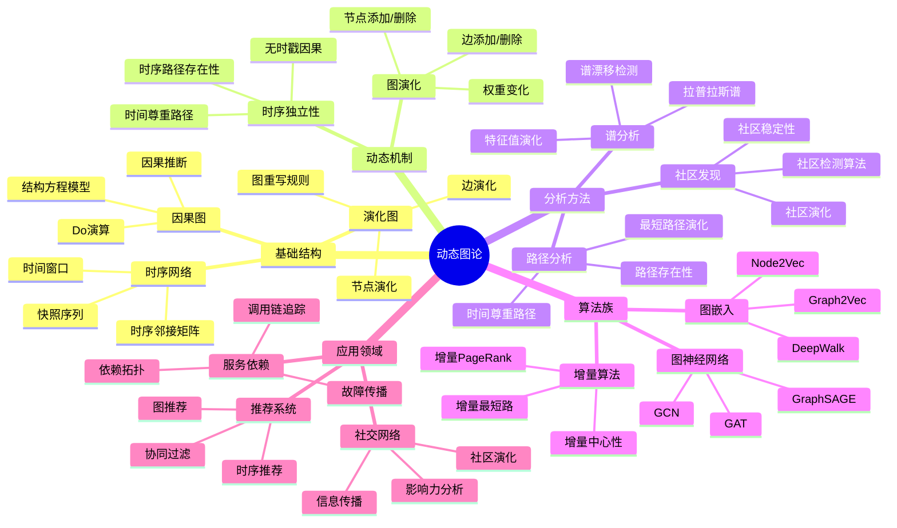

# 动态图论思维导图 / Dynamic Graph Theory Mind Map

## 📚 **概述 / Overview**

本文档提供动态图论的思维导图，用于快速理解动态图论的知识结构和概念关系。

---

## 🗺️ **思维导图结构 / Mind Map Structure**

---

## 📋 **核心概念层次 / Core Concept Hierarchy**

### 第一层：基础结构

- **时序网络**: 图结构随时间演化
  - 快照序列：离散时间点的图结构
  - 时序邻接矩阵：时间维度的邻接矩阵
  - 时间窗口：时间聚合窗口

- **演化图**: 通过重写规则演化
  - 图重写规则：图变换规则
  - 边演化：边的添加/删除
  - 节点演化：节点的添加/删除

- **因果图**: 表示因果关系
  - Do演算：因果推断的数学框架
  - 结构方程模型：描述变量间因果关系
  - 因果推断：从数据推断因果关系

### 第二层：动态机制

- **图演化**: 图结构的变化
  - 边添加/删除：边的动态变化
  - 节点添加/删除：节点的动态变化
  - 权重变化：边权重的动态变化

- **时序独立性**: 不同时刻的独立性
  - 无时戳因果：不依赖时间戳的因果关系
  - 时间尊重路径：考虑时间顺序的路径
  - 时序路径存在性：判断时序路径是否存在

### 第三层：分析方法

- **路径分析**: 分析路径的演化
  - 时间尊重路径：考虑时间顺序的路径
  - 最短路径演化：最短路径的时间演化
  - 路径存在性：判断路径是否存在

- **谱分析**: 分析图的谱性质
  - 拉普拉斯谱：拉普拉斯矩阵的特征值
  - 特征值演化：特征值的时间演化
  - 谱漂移检测：检测谱的异常变化

- **社区发现**: 发现社区结构
  - 社区演化：社区结构的时间演化
  - 社区稳定性：社区结构的稳定性
  - 社区检测算法：检测社区结构的算法

### 第四层：算法族

- **增量算法**: 动态更新算法结果
  - 增量PageRank：动态更新PageRank值
  - 增量最短路：动态更新最短路径
  - 增量中心性：动态更新中心性指标

- **图嵌入**: 将图映射到向量空间
  - DeepWalk：基于随机游走的嵌入
  - Node2Vec：改进的随机游走嵌入
  - Graph2Vec：图级别的嵌入

- **图神经网络**: 在图上进行深度学习
  - GCN：图卷积网络
  - GraphSAGE：可扩展的图神经网络
  - GAT：图注意力网络

### 第五层：应用领域

- **社交网络**: 分析社交网络演化
  - 信息传播：信息在网络中的传播
  - 影响力分析：节点影响力的分析
  - 社区演化：社区结构的时间演化

- **服务依赖**: 追踪服务依赖关系
  - 调用链追踪：追踪服务调用链
  - 依赖拓扑：服务依赖的拓扑结构
  - 故障传播：故障在依赖网络中的传播

- **推荐系统**: 基于图的推荐
  - 协同过滤：基于用户-物品图的推荐
  - 图推荐：基于图结构的推荐
  - 时序推荐：考虑时间因素的推荐

---

## 🔗 **概念关系 / Concept Relationships**

### 结构关系

- **时序网络 ↔ 快照序列**: 整体 ↔ 局部
- **演化图 ↔ 图重写规则**: 机制 ↔ 规则
- **因果图 ↔ Do演算**: 结构 ↔ 方法

### 动态关系

- **图演化 ↔ 边/节点变化**: 整体 ↔ 局部
- **时序独立性 ↔ 时间尊重路径**: 性质 ↔ 应用
- **谱演化 ↔ 特征值演化**: 整体 ↔ 局部

### 分析关系

- **路径分析 ↔ 时间尊重路径**: 方法 ↔ 应用
- **谱分析 ↔ 谱漂移检测**: 方法 ↔ 应用
- **社区发现 ↔ 社区演化**: 方法 ↔ 应用

---

## 📚 **参考文档 / Reference Documents**

- [动态图论逻辑脉络](../../01-理论逻辑脉络/02-动态图论逻辑脉络.md)
- [View文件夹概念定义清单](../../../../view/View文件夹概念定义清单-2025.md)
- [模型选择认知路径](../../决策逻辑图谱/01-模型选择认知路径.md)

---

**文档版本**: v1.0
**创建时间**: 2025年1月
**最后更新**: 2025年1月
**维护者**: GraphNetWorkCommunicate项目组
**状态**: ✅ 完成
