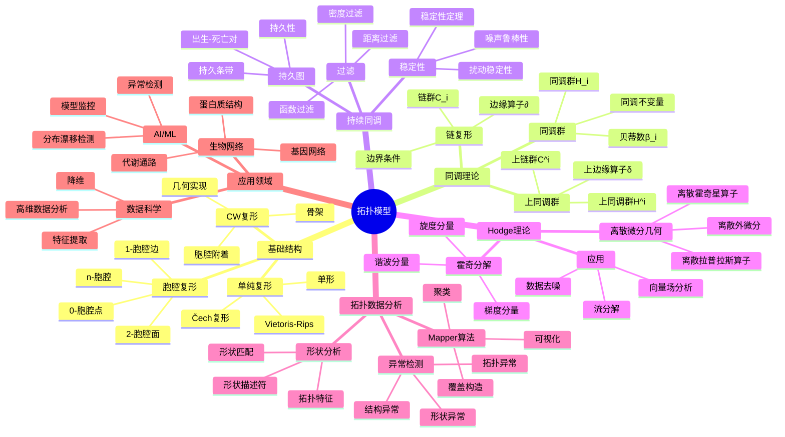

# 拓扑模型思维导图 / Topology Model Mind Map

## 📚 **概述 / Overview**

本文档提供拓扑模型的思维导图，用于快速理解拓扑模型的知识结构和概念关系。

---

## 🗺️ **思维导图结构 / Mind Map Structure**

---

## 📋 **核心概念层次 / Core Concept Hierarchy**

### 第一层：基础结构

- **胞腔复形**: 由胞腔构成的拓扑空间
  - 0-胞腔：点
  - 1-胞腔：边
  - 2-胞腔：面
  - n-胞腔：n维胞腔

- **CW复形**: 特殊的胞腔复形
  - 胞腔附着：胞腔的附着方式
  - 骨架：复形的骨架结构
  - 几何实现：复形的几何实现

- **单纯复形**: 由单形构成的复形
  - 单形：点、线段、三角形等
  - Vietoris-Rips复形：基于距离的复形
  - Čech复形：基于覆盖的复形

### 第二层：同调理论

- **链复形**: 链群和边缘算子的序列
  - 链群C_i：i维链的群
  - 边缘算子∂：链之间的映射
  - 边界条件：∂² = 0

- **同调群**: 同调不变量
  - 同调群H_i：i维同调群
  - 贝蒂数β_i：同调群的秩
  - 同调不变量：拓扑不变量

- **上同调群**: 对偶的同调理论
  - 上同调群H^i：i维上同调群
  - 上链群C^i：i维上链的群
  - 上边缘算子δ：上链之间的映射

### 第三层：持续同调

- **过滤**: 构造过滤复形
  - 距离过滤：基于距离的过滤
  - 密度过滤：基于密度的过滤
  - 函数过滤：基于函数的过滤

- **持久图**: 持续同调的可视化
  - 出生-死亡对：特征的出生和死亡
  - 持久条带：特征的持久性
  - 持久性：特征的稳定性

- **稳定性**: 持续同调的稳定性
  - 稳定性定理：持续同调的稳定性定理
  - 扰动稳定性：对扰动的稳定性
  - 噪声鲁棒性：对噪声的鲁棒性

### 第四层：Hodge理论

- **离散微分几何**: 离散设置下的微分几何
  - 离散外微分：离散的外微分算子
  - 离散霍奇星算子：离散的霍奇星算子
  - 离散拉普拉斯算子：离散的拉普拉斯算子

- **霍奇分解**: 向量场的分解
  - 梯度分量：梯度场分量
  - 旋度分量：旋度场分量
  - 谐波分量：调和场分量

- **应用**: Hodge理论的应用
  - 流分解：流的分解
  - 向量场分析：向量场的分析
  - 数据去噪：数据的去噪

### 第五层：拓扑数据分析

- **Mapper算法**: 基于持续同调的可视化
  - 覆盖构造：构造覆盖
  - 聚类：在每个覆盖元素内聚类
  - 可视化：可视化结果

- **形状分析**: 分析数据的形状
  - 拓扑特征：提取拓扑特征
  - 形状描述符：形状的描述符
  - 形状匹配：形状的匹配

- **异常检测**: 基于拓扑的异常检测
  - 拓扑异常：拓扑结构的异常
  - 形状异常：形状的异常
  - 结构异常：结构的异常

### 第六层：应用领域

- **数据科学**: 高维数据分析
  - 高维数据分析：分析高维数据
  - 特征提取：提取拓扑特征
  - 降维：基于拓扑的降维

- **AI/ML**: 机器学习应用
  - 模型监控：监控模型性能
  - 分布漂移检测：检测分布漂移
  - 异常检测：检测异常

- **生物网络**: 生物网络分析
  - 蛋白质结构：分析蛋白质结构
  - 基因网络：分析基因网络
  - 代谢通路：分析代谢通路

---

## 🔗 **概念关系 / Concept Relationships**

### 结构关系

- **胞腔复形 ↔ CW复形**: 一般 ↔ 特殊
- **链复形 ↔ 同调群**: 构造 ↔ 结果
- **过滤 ↔ 持久图**: 过程 ↔ 结果

### 动态关系

- **过滤 ↔ 持续同调**: 构造 ↔ 分析
- **Hodge分解 ↔ 向量场**: 方法 ↔ 对象
- **Mapper ↔ 可视化**: 算法 ↔ 应用

### 分析关系

- **同调群 ↔ 贝蒂数**: 群 ↔ 不变量
- **持续同调 ↔ 稳定性**: 方法 ↔ 性质
- **拓扑特征 ↔ 形状分析**: 特征 ↔ 应用

---

## 📚 **参考文档 / Reference Documents**

- [拓扑模型逻辑脉络](../../01-理论逻辑脉络/03-拓扑模型逻辑脉络.md)
- [View文件夹概念定义清单](../../../../view/View文件夹概念定义清单-2025.md)
- [模型选择认知路径](../../决策逻辑图谱/01-模型选择认知路径.md)

---

**文档版本**: v1.0
**创建时间**: 2025年1月
**最后更新**: 2025年1月
**维护者**: GraphNetWorkCommunicate项目组
**状态**: ✅ 完成
