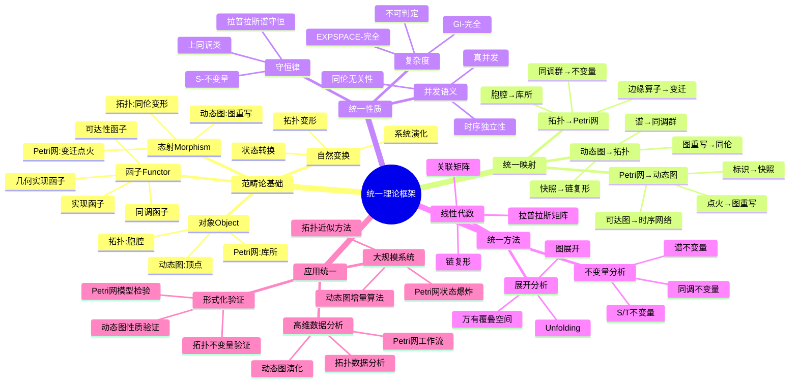

# 统一理论框架思维导图 / Unified Theory Framework Mind Map

## 📚 **概述 / Overview**

本文档提供三大理论（Petri网、动态图论、拓扑模型）在范畴论框架下的统一思维导图。

---

## 🗺️ **思维导图结构 / Mind Map Structure**

---

## 📋 **核心概念层次 / Core Concept Hierarchy**

### 第一层：范畴论基础

- **对象（Object）**: 三大理论的基础结构
  - Petri网：库所（资源类型）
  - 动态图：顶点（实体）
  - 拓扑：胞腔（几何单元）

- **态射（Morphism）**: 三大理论的动态机制
  - Petri网：变迁点火（状态转换）
  - 动态图：图重写（结构演化）
  - 拓扑：同伦变形（连续变形）

- **函子（Functor）**: 理论间的映射
  - 可达性函子：Petri网 → 集合
  - 实现函子：Petri网 → 动态图
  - 几何实现函子：Petri网 → 拓扑空间
  - 同调函子：拓扑空间 → 阿贝尔群

- **自然变换**: 系统演化
  - 系统演化：状态序列
  - 状态转换：标识变化
  - 拓扑变形：同伦变换

### 第二层：统一映射

- **Petri网 → 动态图**: 过程模型到结构模型
  - 标识 → 快照：状态映射
  - 点火 → 图重写：动态映射
  - 可达图 → 时序网络：结构映射

- **动态图 → 拓扑**: 结构模型到几何模型
  - 快照 → 链复形：结构映射
  - 图重写 → 同伦：动态映射
  - 谱 → 同调群：不变量映射

- **拓扑 → Petri网**: 几何模型到过程模型
  - 胞腔 → 库所：结构映射
  - 边缘算子 → 变迁：动态映射
  - 同调群 → 不变量：不变量映射

### 第三层：统一性质

- **守恒律**: 三大理论的守恒性质
  - S-不变量：Petri网的资源守恒
  - 拉普拉斯谱守恒：动态图的谱守恒
  - 上同调类：拓扑的拓扑不变量

- **并发语义**: 三大理论的并发性质
  - 真并发：Petri网的独立变迁并发
  - 时序独立性：动态图的时间独立性
  - 同伦无关性：拓扑的同伦无关性

- **复杂度**: 三大理论的计算复杂度
  - EXPSPACE-完全：Petri网可达性
  - GI-完全：动态图同构
  - 不可判定：拓扑高维同调

### 第四层：统一方法

- **线性代数**: 三大理论的线性方法
  - 关联矩阵：Petri网的状态方程
  - 拉普拉斯矩阵：动态图的谱分析
  - 链复形：拓扑的同调计算

- **不变量分析**: 三大理论的不变量
  - S/T不变量：Petri网的资源/循环不变量
  - 谱不变量：动态图的谱不变量
  - 同调不变量：拓扑的同调不变量

- **展开分析**: 三大理论的展开方法
  - Unfolding：Petri网的展开
  - 图展开：动态图的展开
  - 万有覆叠空间：拓扑的覆叠空间

### 第五层：应用统一

- **形式化验证**: 三大理论的形式化方法
  - Petri网模型检验：CTL/LTL模型检验
  - 动态图性质验证：图性质验证
  - 拓扑不变量验证：拓扑不变量验证

- **大规模系统**: 三大理论的大规模方法
  - Petri网状态爆炸：状态空间爆炸问题
  - 动态图增量算法：增量算法
  - 拓扑近似方法：近似拓扑方法

- **高维数据分析**: 三大理论的数据分析
  - Petri网工作流：工作流建模
  - 动态图演化：图演化分析
  - 拓扑数据分析：TDA方法

---

## 🔗 **概念关系 / Concept Relationships**

### 统一关系

- **对象 ↔ 态射**: 结构 ↔ 动态
- **函子 ↔ 自然变换**: 映射 ↔ 演化
- **守恒律 ↔ 不变量**: 性质 ↔ 方法

### 映射关系

- **Petri网 ↔ 动态图**: 过程 ↔ 结构
- **动态图 ↔ 拓扑**: 结构 ↔ 几何
- **拓扑 ↔ Petri网**: 几何 ↔ 过程

### 应用关系

- **形式化验证 ↔ 模型检验**: 方法 ↔ 工具
- **大规模系统 ↔ 增量算法**: 问题 ↔ 方法
- **高维数据 ↔ TDA**: 数据 ↔ 方法

---

## 📚 **参考文档 / Reference Documents**

- [理论映射关系图谱](../../00-理论映射关系图谱.md)
- [理论逻辑脉络梳理概述](../../01-理论逻辑脉络/00-理论逻辑脉络梳理概述.md)
- [View文件夹概念关系网络](../../../../view/View文件夹概念关系网络-2025.md)

---

**文档版本**: v1.0
**创建时间**: 2025年1月
**最后更新**: 2025年1月
**维护者**: GraphNetWorkCommunicate项目组
**状态**: ✅ 完成
