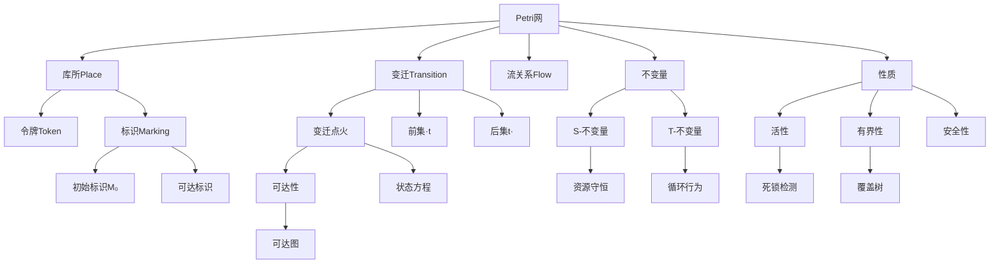
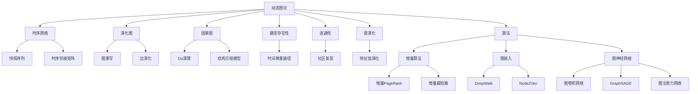
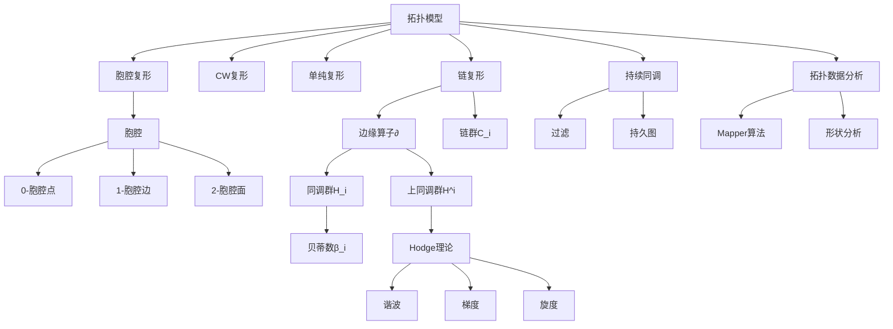
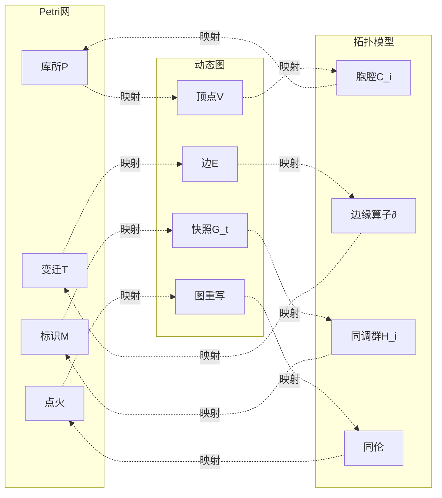

# 概念关系网络图 / Concept Relationship Network Graph

## 📚 **概述 / Overview**

本文档提供三大理论核心概念的关系网络图，展示概念间的结构关系、动态关系和分析关系。

---

## 🔗 **Petri网概念关系网络 / Petri Net Concept Relationship Network**

---

## 🔗 **动态图概念关系网络 / Dynamic Graph Concept Relationship Network**

---

## 🔗 **拓扑模型概念关系网络 / Topology Model Concept Relationship Network**

---

## 🔗 **跨理论概念映射关系 / Cross-Theory Concept Mapping**

---

## 📋 **关系类型说明 / Relationship Type Description**

### 结构关系

- **包含关系**: 理论 → 概念（如Petri网 → 库所）
- **组成关系**: 概念 → 子概念（如标识 → 令牌）
- **连接关系**: 概念 ↔ 概念（如库所 ↔ 变迁）

### 动态关系

- **因果关系**: 概念 → 结果（如变迁点火 → 可达性）
- **演化关系**: 概念 → 演化（如快照 → 时序网络）
- **转换关系**: 概念 ↔ 概念（如标识 ↔ 快照）

### 分析关系

- **计算关系**: 概念 → 方法（如可达性 → 可达图）
- **性质关系**: 概念 → 性质（如Petri网 → 活性）
- **映射关系**: 概念 ↔ 概念（如库所 ↔ 顶点）

---

## 📚 **参考文档 / Reference Documents**

- [View文件夹概念关系网络](../../../../view/View文件夹概念关系网络-2025.md)
- [理论映射关系图谱](../../00-理论映射关系图谱.md)
- [Petri网理论逻辑脉络](../../01-理论逻辑脉络/01-Petri网理论逻辑脉络.md)

---

**文档版本**: v1.0
**创建时间**: 2025年1月
**最后更新**: 2025年1月
**维护者**: GraphNetWorkCommunicate项目组
**状态**: ✅ 完成
