# 理论映射关系图 / Theory Mapping Relationship Graph

## 📚 **概述 / Overview**

**文档目的**: 提供三大理论（Petri网、动态图论、拓扑模型）之间映射关系的可视化图表，直观展示理论间的对应关系和转换规律。

**核心内容**:

- Petri网 ↔ 动态图映射关系图
- 动态图 ↔ 拓扑模型映射关系图
- 拓扑模型 ↔ Petri网映射关系图
- 统一映射框架图

**适用对象**: 理论研究者、学习者、系统工程师

**参考文档**: 详见 `../../00-理论映射关系图谱.md` 和 `../../03-关系映射梳理/00-关系映射梳理概述.md`

---

## 📋 **目录 / Table of Contents**

- [理论映射关系图 / Theory Mapping Relationship Graph](#理论映射关系图--theory-mapping-relationship-graph)
  - [📚 **概述 / Overview**](#-概述--overview)
  - [📋 **目录 / Table of Contents**](#-目录--table-of-contents)
  - [🔄 **一、Petri网 ↔ 动态图映射关系图 / Part 1: Petri Net ↔ Dynamic Graph Mapping**](#-一petri网--动态图映射关系图--part-1-petri-net--dynamic-graph-mapping)
    - [1.1 结构映射关系图](#11-结构映射关系图)
    - [1.2 状态映射关系图](#12-状态映射关系图)
    - [1.3 动态映射关系图](#13-动态映射关系图)
  - [🔄 **二、动态图 ↔ 拓扑模型映射关系图 / Part 2: Dynamic Graph ↔ Topology Model Mapping**](#-二动态图--拓扑模型映射关系图--part-2-dynamic-graph--topology-model-mapping)
    - [2.1 结构映射关系图](#21-结构映射关系图)
    - [2.2 状态映射关系图](#22-状态映射关系图)
    - [2.3 动态映射关系图](#23-动态映射关系图)
  - [🔄 **三、拓扑模型 ↔ Petri网映射关系图 / Part 3: Topology Model ↔ Petri Net Mapping**](#-三拓扑模型--petri网映射关系图--part-3-topology-model--petri-net-mapping)
    - [3.1 结构映射关系图](#31-结构映射关系图)
    - [3.2 状态映射关系图](#32-状态映射关系图)
    - [3.3 动态映射关系图](#33-动态映射关系图)
  - [🔗 **四、统一映射框架图 / Part 4: Unified Mapping Framework**](#-四统一映射框架图--part-4-unified-mapping-framework)
    - [4.1 函子映射关系图](#41-函子映射关系图)
    - [4.2 映射复合关系图](#42-映射复合关系图)
    - [4.3 交换性关系图](#43-交换性关系图)
  - [📚 **五、参考文档 / Part 5: Reference Documents**](#-五参考文档--part-5-reference-documents)
    - [5.1 核心参考文档](#51-核心参考文档)
    - [5.2 理论逻辑脉络文档](#52-理论逻辑脉络文档)
    - [5.3 认知表征工具](#53-认知表征工具)

---

## 🔄 **一、Petri网 ↔ 动态图映射关系图 / Part 1: Petri Net ↔ Dynamic Graph Mapping**

### 1.1 结构映射关系图

**核心映射**: 实现函子 I: PNC → DGC

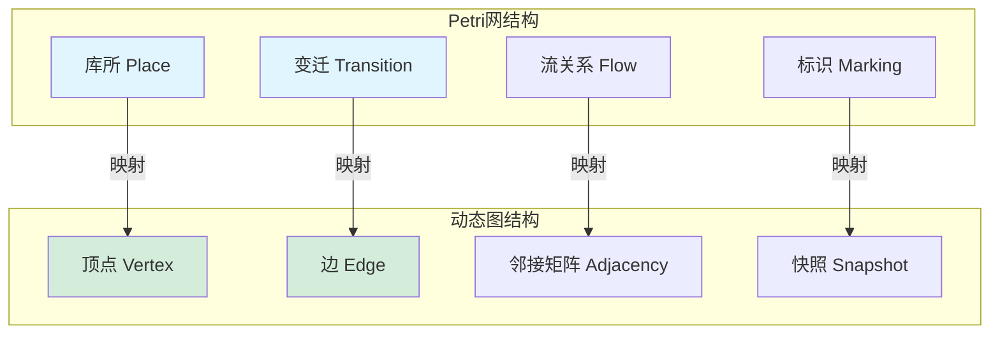

**映射规则**:

- **库所 → 顶点**: 每个库所p映射为顶点v_p
- **变迁 → 边**: 每个变迁t映射为边e_t = (v_{•t}, v_{t•})
- **流关系 → 邻接矩阵**: 流关系F映射为邻接矩阵A
- **标识 → 快照**: 标识M映射为图快照G_M = (V_M, E_M)

### 1.2 状态映射关系图

**映射函数**: f: Reach(N, M₀) → {G₁, G₂, ..., G_T}

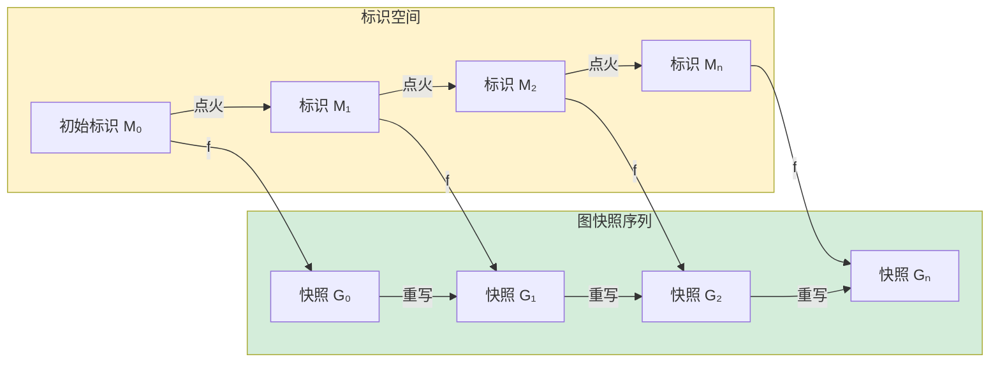

**映射规则**:

- **快照构造**: G_M = (V_M, E_M)，其中V_M = {v_p | p ∈ P, M(p) > 0}
- **时间序列**: 可达序列对应时间序列
- **保持性质**: 可达性关系在映射中保持

### 1.3 动态映射关系图

**映射**: 变迁点火 → 图重写

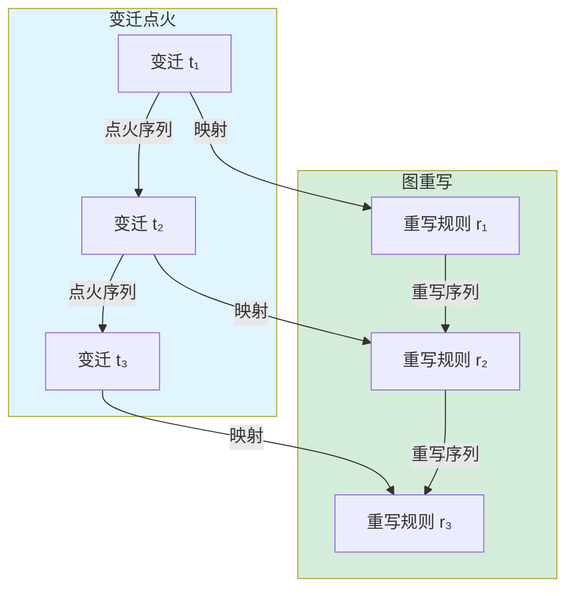

**映射规则**:

- **重写规则**: r = (L, R, K)，其中L = •t ∪ t•，R = •t' ∪ t'•，K = P \ (•t ∪ t•)
- **保持性质**: 可达性、活性等性质在映射中保持

---

## 🔄 **二、动态图 ↔ 拓扑模型映射关系图 / Part 2: Dynamic Graph ↔ Topology Model Mapping**

### 2.1 结构映射关系图

**核心映射**: 几何实现函子 G: DGC → TOP

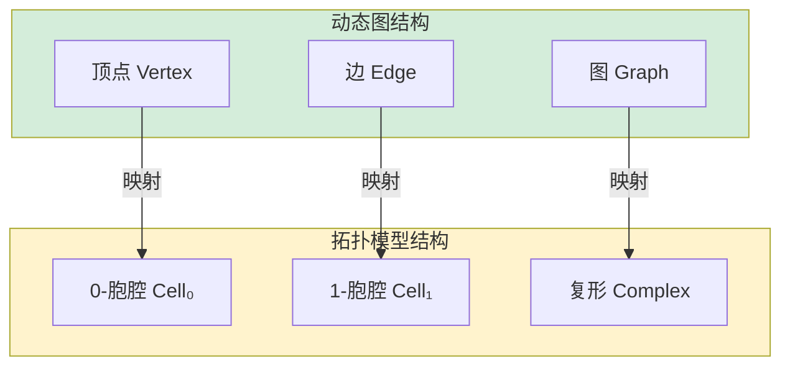

**映射规则**:

- **顶点 → 0-胞腔**: 每个顶点v映射为0-胞腔c₀
- **边 → 1-胞腔**: 每条边e映射为1-胞腔c₁
- **图 → 复形**: 每个图G映射为复形K_G

### 2.2 状态映射关系图

**映射函数**: g: {G₁, ..., G_T} → {C₁, ..., C_T}

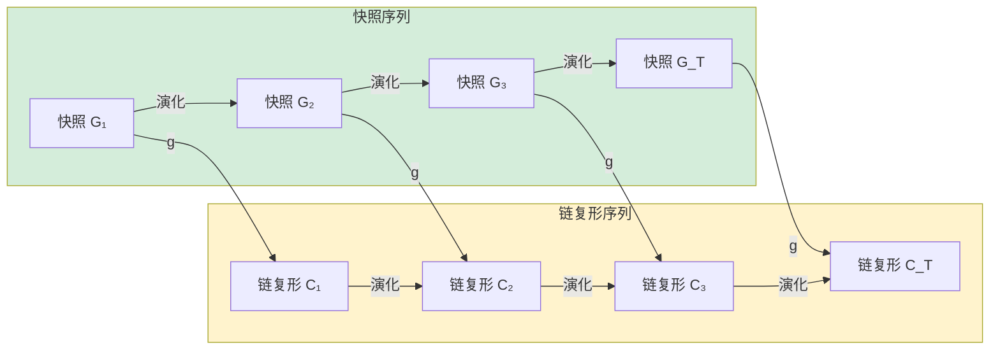

**映射规则**:

- **链复形构造**: C_t = C(G_t)，图的链复形
- **时间维度**: 快照序列对应复形序列
- **保持性质**: 连通性、同调群等性质在映射中保持

### 2.3 动态映射关系图

**映射**: 图重写 → 同伦变形

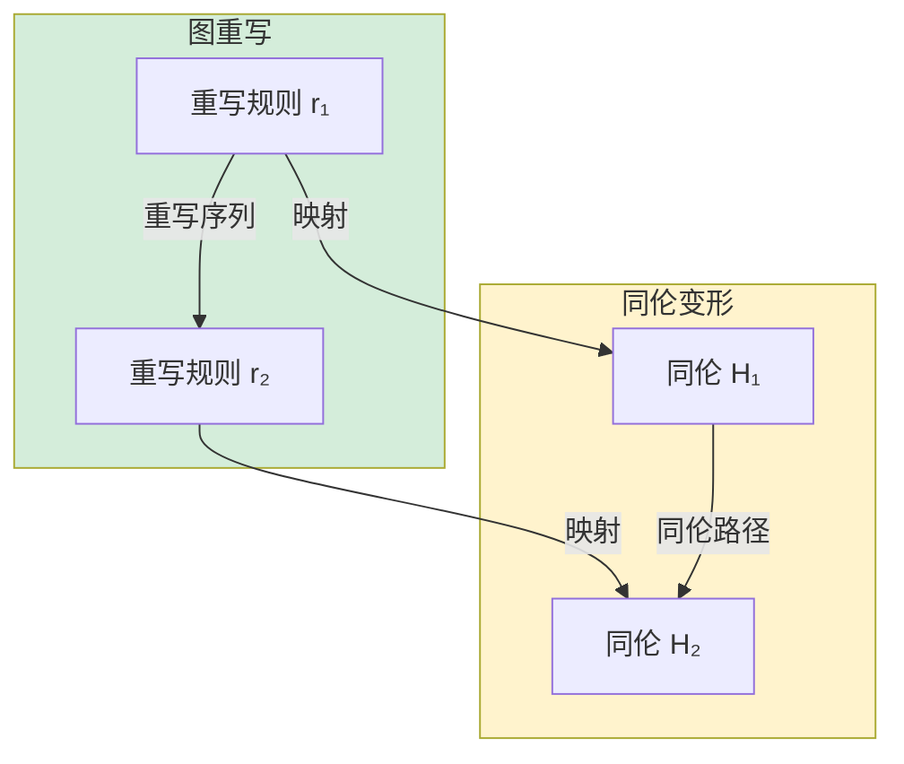

**映射规则**:

- **同伦构造**: H: |G| × [0,1] → |G'|，其中H(x, 0) = x，H(x, 1) = r(x)
- **保持性质**: 连通性、同调群等拓扑性质在映射中保持

---

## 🔄 **三、拓扑模型 ↔ Petri网映射关系图 / Part 3: Topology Model ↔ Petri Net Mapping**

### 3.1 结构映射关系图

**核心映射**: 离散化函子 D: TOP → PNC

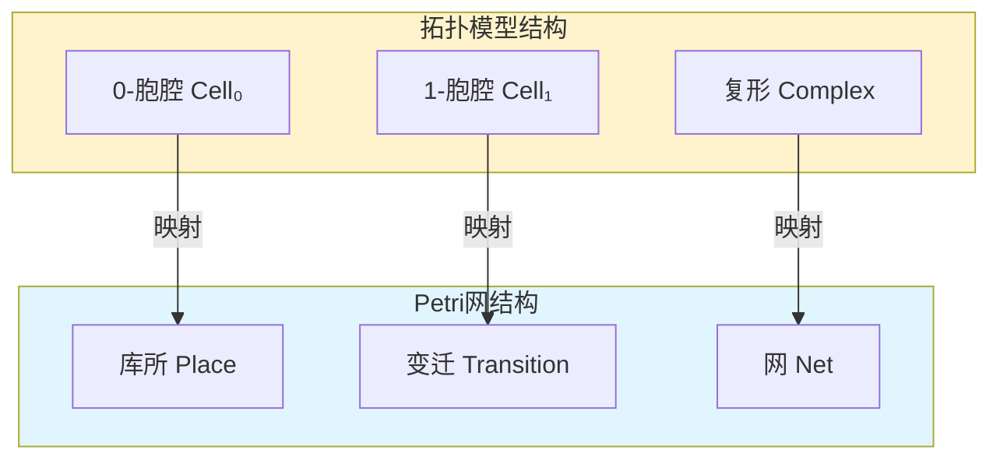

**映射规则**:

- **0-胞腔 → 库所**: 每个0-胞腔c₀映射为库所p
- **1-胞腔 → 变迁**: 每个1-胞腔c₁映射为变迁t
- **复形 → 网**: 每个复形K映射为网N_K

### 3.2 状态映射关系图

**映射函数**: h: C₀(K) → M

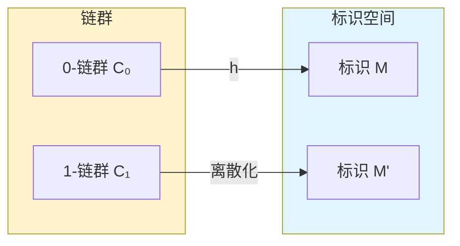

**映射规则**:

- **标识定义**: M(p) = c₀的系数
- **离散化**: 连续链群离散化为标识

### 3.3 动态映射关系图

**映射**: 同伦变形 → 变迁点火

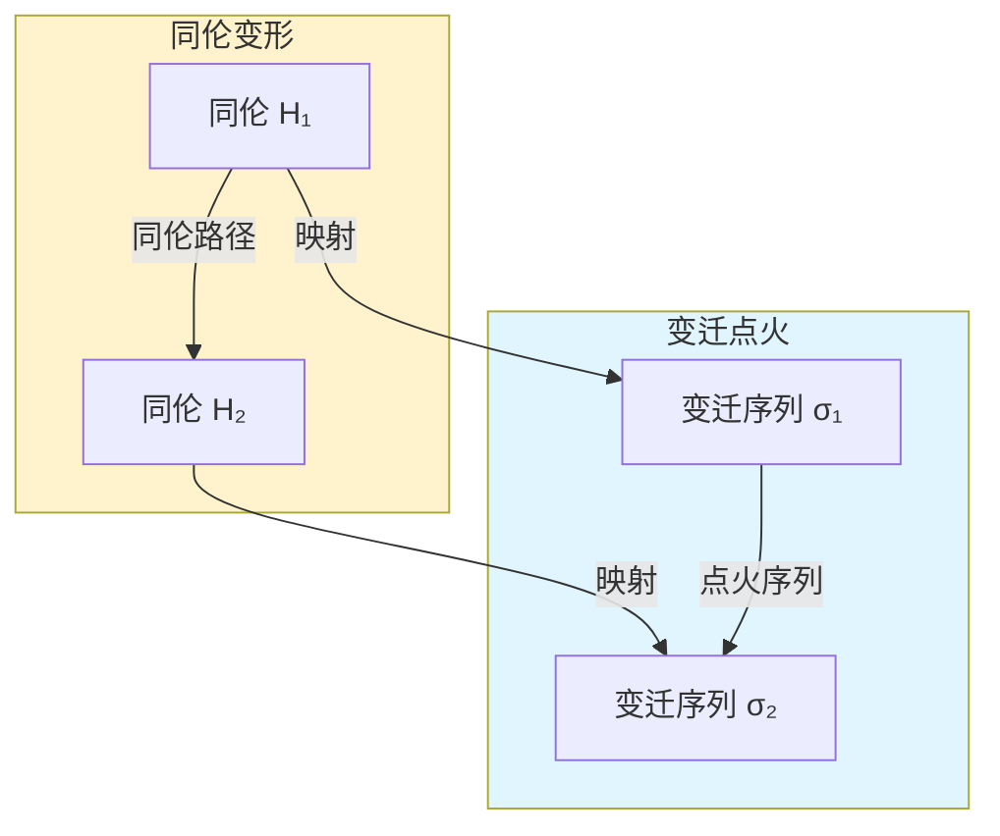

**映射规则**:

- **变迁提取**: t = {σ ∈ K | H(σ, 0) ≠ H(σ, 1)}
- **保持性质**: 拓扑不变量对应Petri网不变量

---

## 🔗 **四、统一映射框架图 / Part 4: Unified Mapping Framework**

### 4.1 函子映射关系图

**三大理论在范畴论框架下的统一映射**

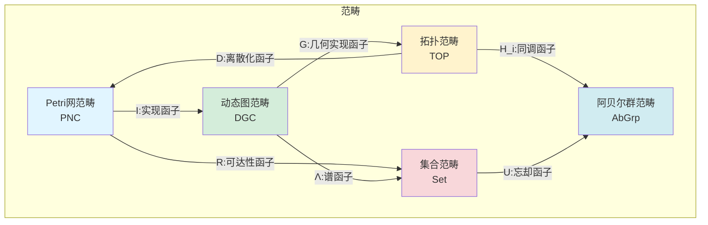

**函子定义**:

- **I: PNC → DGC**: Petri网到动态图的实现函子
- **G: DGC → TOP**: 动态图到拓扑模型的几何实现函子
- **D: TOP → PNC**: 拓扑模型到Petri网的离散化函子
- **R: PNC → Set**: Petri网的可达性函子
- **Λ: DGC → Set**: 动态图的谱函子
- **H_i: TOP → AbGrp**: 拓扑模型的同调函子

### 4.2 映射复合关系图

**复合映射的循环结构**

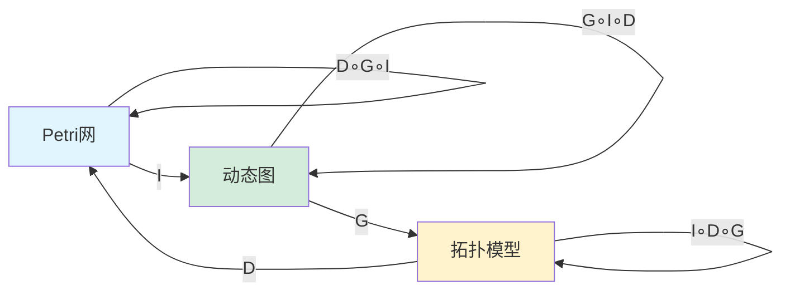

**复合映射性质**:

- **循环性**: D ∘ G ∘ I = id (在某种等价意义下)
- **交换性**: 所有映射的复合满足交换律
- **统一性**: 所有映射在统一框架下一致

### 4.3 交换性关系图

**函子映射的交换性**

```mermaid
graph TD
    A[对象A] -->|f:态射| B[对象B]

    A -->|F:函子| FA[F(A)]
    B -->|F:函子| FB[F(B)]

    FA -->|F(f)| FB

    A -->|G:函子| GA[G(A)]
    B -->|G:函子| GB[G(B)]

    GA -->|G(f)| GB

    FA -->|η:自然变换| GA
    FB -->|η:自然变换| GB

    style A fill:#e1f5ff
    style B fill:#e1f5ff
    style FA fill:#d4edda
    style FB fill:#d4edda
    style GA fill:#fff3cd
    style GB fill:#fff3cd
```

**交换条件**:

- **自然变换**: η: F → G 是自然变换，满足交换性
- **函子交换**: 所有函子映射满足交换律
- **统一框架**: 在范畴论框架下，所有映射是协调一致的

---

## 📚 **五、参考文档 / Part 5: Reference Documents**

### 5.1 核心参考文档

- **[理论映射关系图谱](../../00-理论映射关系图谱.md)** - 详细的理论映射关系说明
- **[关系映射梳理概述](../../03-关系映射梳理/00-关系映射梳理概述.md)** - 映射关系的详细梳理

### 5.2 理论逻辑脉络文档

- **[Petri网理论逻辑脉络](../../01-理论逻辑脉络/01-Petri网理论逻辑脉络.md)**
- **[动态图论逻辑脉络](../../01-理论逻辑脉络/02-动态图论逻辑脉络.md)**
- **[拓扑模型逻辑脉络](../../01-理论逻辑脉络/03-拓扑模型逻辑脉络.md)**

### 5.3 认知表征工具

- **[概念关系网络图](01-概念关系网络图.md)** - 概念间的关系网络
- **[统一理论框架思维导图](../01-思维导图文档/04-统一理论框架思维导图.md)** - 统一框架的知识结构

---

**文档版本**: v1.0
**创建时间**: 2025年1月
**最后更新**: 2025年1月
**维护者**: GraphNetWorkCommunicate项目组
**状态**: ✅ 完成
