# 应用领域关系图 / Application Domain Relationship Graph

## 📚 **概述 / Overview**

**文档目的**: 提供三大理论（Petri网、动态图论、拓扑模型）在不同应用领域中的关系图谱，展示理论在各个领域的应用模式和关系。

**核心内容**:

- 操作系统应用关系图
- 分布式系统应用关系图
- AI基础设施应用关系图
- 跨领域应用关系图

**适用对象**: 系统工程师、应用开发者、理论研究者

**参考文档**: 详见各模块理论关系梳理文档和`../../13-应用模式归纳/`目录

---

## 📋 **目录 / Table of Contents**

- [应用领域关系图 / Application Domain Relationship Graph](#应用领域关系图--application-domain-relationship-graph)
  - [📚 **概述 / Overview**](#-概述--overview)
  - [📋 **目录 / Table of Contents**](#-目录--table-of-contents)
  - [🖥️ **一、操作系统应用关系图 / Part 1: Operating System Application Relationship**](#️-一操作系统应用关系图--part-1-operating-system-application-relationship)
    - [1.1 Petri网在操作系统中的应用](#11-petri网在操作系统中的应用)
    - [1.2 动态图在操作系统中的应用](#12-动态图在操作系统中的应用)
    - [1.3 拓扑模型在操作系统中的应用](#13-拓扑模型在操作系统中的应用)
    - [1.4 综合应用关系图](#14-综合应用关系图)
  - [🌐 **二、分布式系统应用关系图 / Part 2: Distributed System Application Relationship**](#-二分布式系统应用关系图--part-2-distributed-system-application-relationship)
    - [2.1 Petri网在分布式系统中的应用](#21-petri网在分布式系统中的应用)
    - [2.2 动态图在分布式系统中的应用](#22-动态图在分布式系统中的应用)
    - [2.3 拓扑模型在分布式系统中的应用](#23-拓扑模型在分布式系统中的应用)
    - [2.4 综合应用关系图](#24-综合应用关系图)
  - [🤖 **三、AI基础设施应用关系图 / Part 3: AI Infrastructure Application Relationship**](#-三ai基础设施应用关系图--part-3-ai-infrastructure-application-relationship)
    - [3.1 Petri网在AI基础设施中的应用](#31-petri网在ai基础设施中的应用)
    - [3.2 动态图在AI基础设施中的应用](#32-动态图在ai基础设施中的应用)
    - [3.3 拓扑模型在AI基础设施中的应用](#33-拓扑模型在ai基础设施中的应用)
    - [3.4 综合应用关系图](#34-综合应用关系图)
  - [🔗 **四、跨领域应用关系图 / Part 4: Cross-Domain Application Relationship**](#-四跨领域应用关系图--part-4-cross-domain-application-relationship)
    - [4.1 理论选择关系图](#41-理论选择关系图)
    - [4.2 方法组合关系图](#42-方法组合关系图)
    - [4.3 工具链关系图](#43-工具链关系图)
  - [📚 **五、参考文档 / Part 5: Reference Documents**](#-五参考文档--part-5-reference-documents)
    - [5.1 模块理论关系梳理文档](#51-模块理论关系梳理文档)
    - [5.2 应用模式归纳文档](#52-应用模式归纳文档)
    - [5.3 决策逻辑文档](#53-决策逻辑文档)

---

## 🖥️ **一、操作系统应用关系图 / Part 1: Operating System Application Relationship**

### 1.1 Petri网在操作系统中的应用

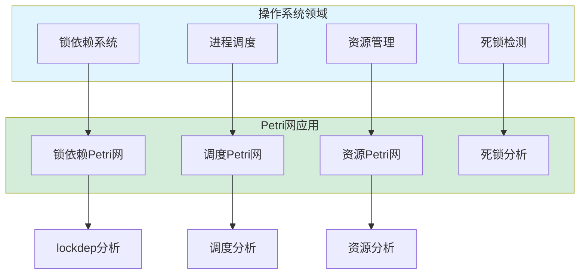

**应用场景**:

- **锁依赖系统**: Linux内核lockdep使用Petri网建模锁依赖关系
- **进程调度**: 使用Petri网建模进程状态转换和调度策略
- **资源管理**: 使用Petri网分析资源分配和释放
- **死锁检测**: 通过可达性分析检测死锁状态

### 1.2 动态图在操作系统中的应用

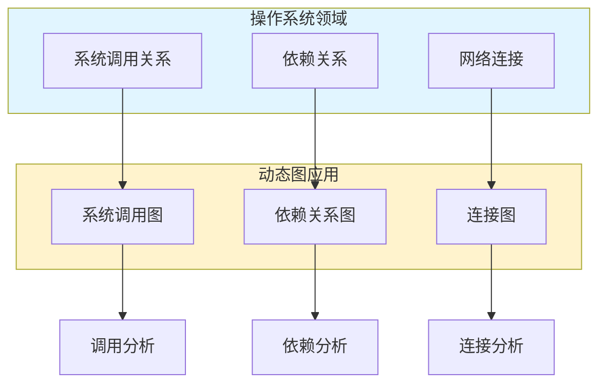

**应用场景**:

- **系统调用关系**: 建模系统调用之间的时序依赖关系
- **依赖关系**: 分析服务、模块之间的依赖关系
- **网络连接**: 跟踪网络连接的建立和断开

### 1.3 拓扑模型在操作系统中的应用

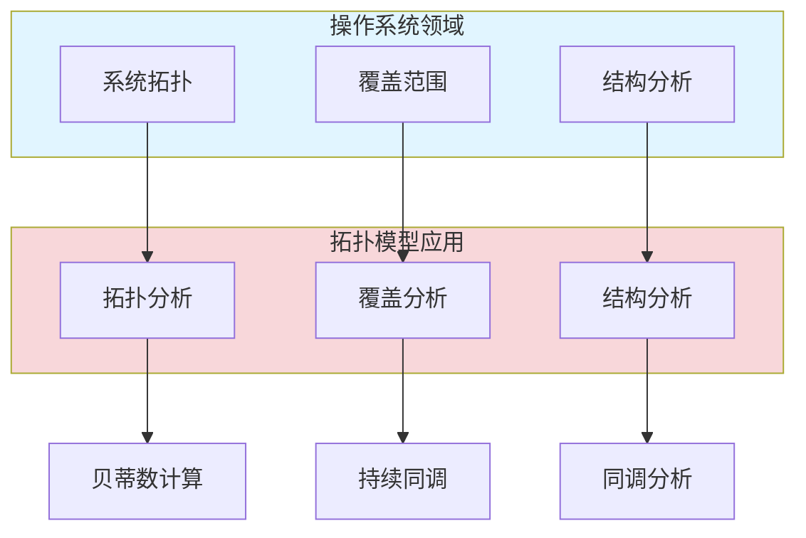

**应用场景**:

- **系统拓扑**: 分析系统组件的拓扑结构
- **覆盖范围**: 分析服务覆盖和通信范围
- **结构分析**: 识别系统的拓扑特征和异常

### 1.4 综合应用关系图

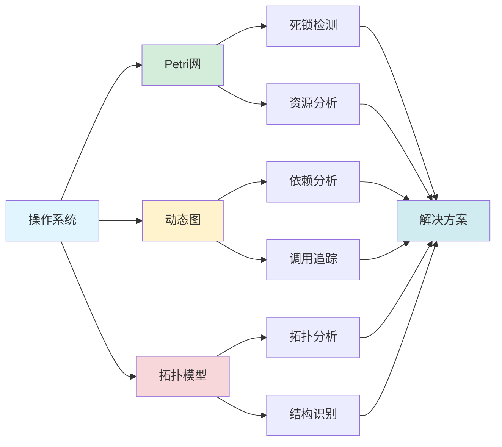

---

## 🌐 **二、分布式系统应用关系图 / Part 2: Distributed System Application Relationship**

### 2.1 Petri网在分布式系统中的应用

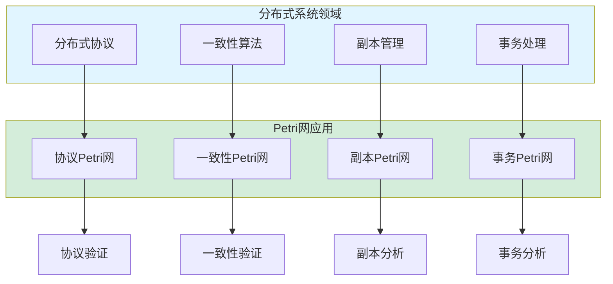

**应用场景**:

- **分布式协议**: 建模和验证Paxos、Raft等分布式协议
- **一致性算法**: 分析一致性算法的正确性
- **副本管理**: 建模副本同步和一致性维护
- **事务处理**: 分析分布式事务的ACID性质

### 2.2 动态图在分布式系统中的应用

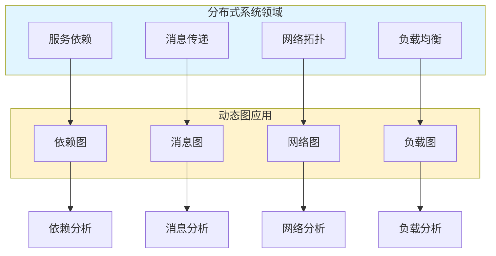

**应用场景**:

- **服务依赖**: 建模微服务架构中的服务依赖网络
- **消息传递**: 跟踪消息在分布式系统中的传递路径
- **网络拓扑**: 分析分布式系统的网络拓扑结构
- **负载均衡**: 优化负载分配和路由策略

### 2.3 拓扑模型在分布式系统中的应用

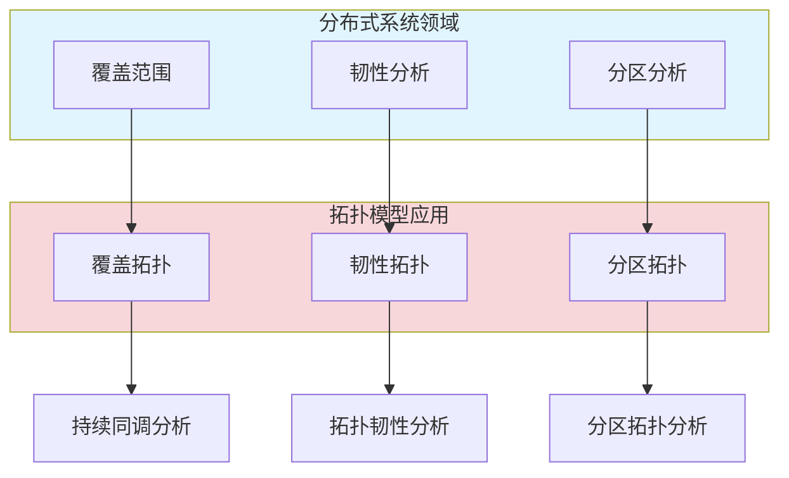

**应用场景**:

- **覆盖范围**: 分析服务覆盖和通信范围
- **韧性分析**: 评估系统的容错能力和恢复能力
- **分区分析**: 分析网络分区对系统的影响

### 2.4 综合应用关系图

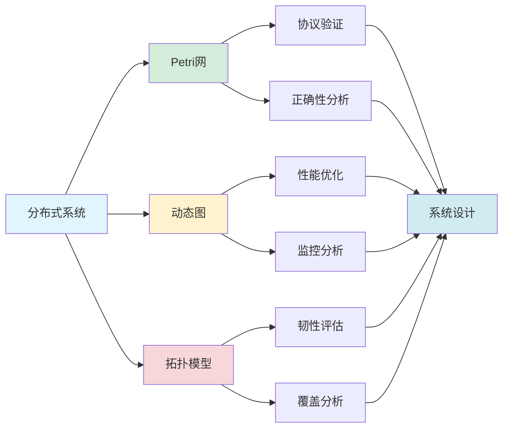

---

## 🤖 **三、AI基础设施应用关系图 / Part 3: AI Infrastructure Application Relationship**

### 3.1 Petri网在AI基础设施中的应用

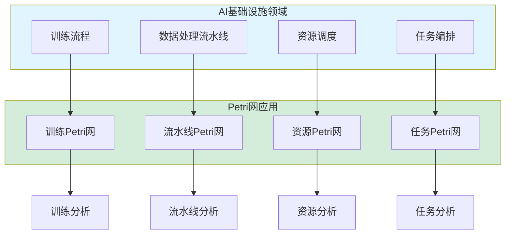

**应用场景**:

- **训练流程**: 建模机器学习训练的各个阶段
- **数据处理流水线**: 分析数据处理的流水线结构
- **资源调度**: 优化GPU、CPU等资源的分配
- **任务编排**: 管理分布式训练任务的执行顺序

### 3.2 动态图在AI基础设施中的应用

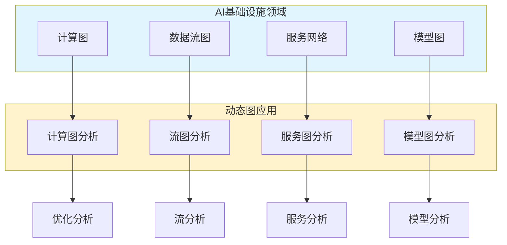

**应用场景**:

- **计算图**: TensorFlow、PyTorch中的计算图表示
- **数据流图**: 分析数据在训练过程中的流动
- **服务网络**: 建模AI服务的调用关系
- **模型图**: 分析神经网络模型的图结构

### 3.3 拓扑模型在AI基础设施中的应用

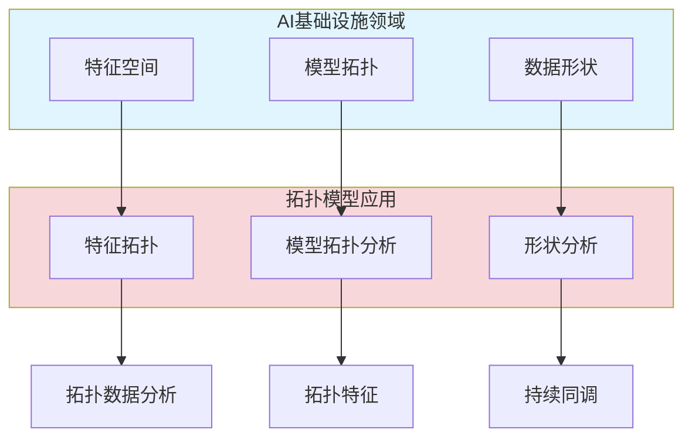

**应用场景**:

- **特征空间**: 分析高维特征空间的拓扑结构
- **模型拓扑**: 研究神经网络模型的拓扑特征
- **数据形状**: 提取数据的拓扑特征用于模型训练

### 3.4 综合应用关系图

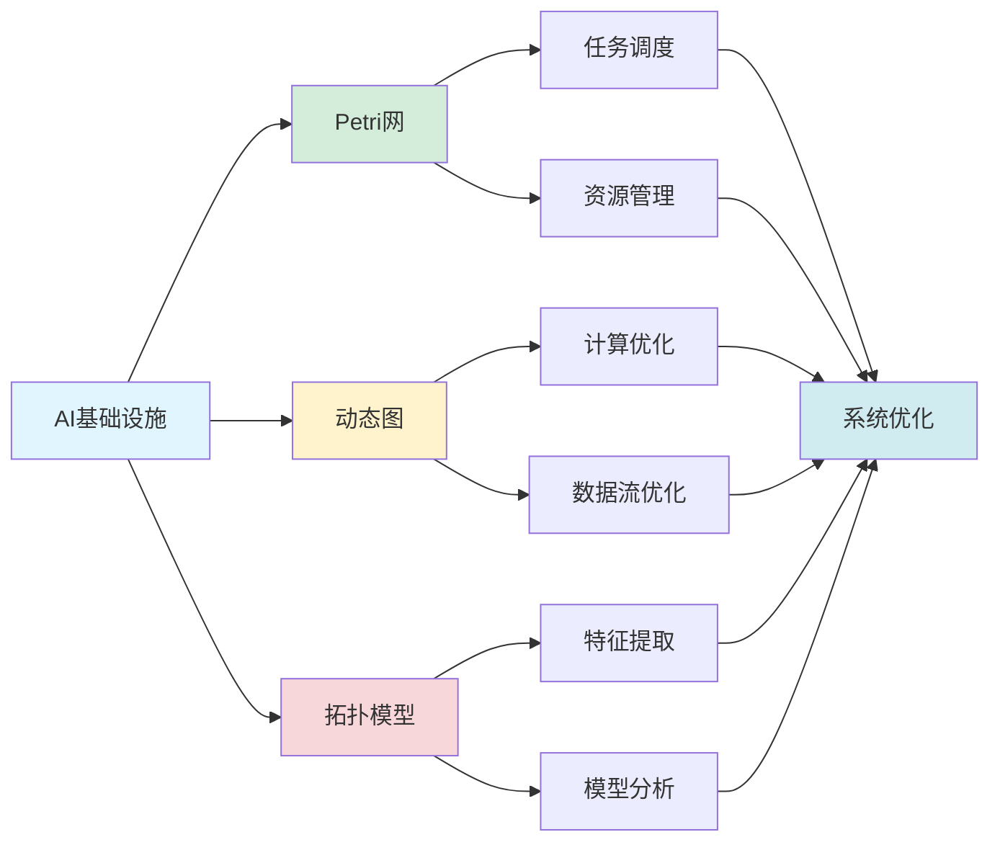

---

## 🔗 **四、跨领域应用关系图 / Part 4: Cross-Domain Application Relationship**

### 4.1 理论选择关系图

**根据应用场景选择理论**

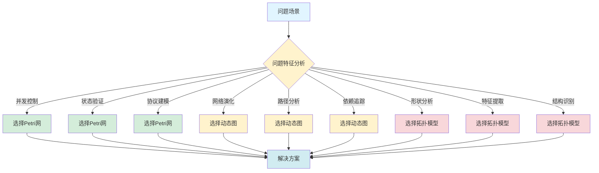

### 4.2 方法组合关系图

**多理论方法的组合使用**

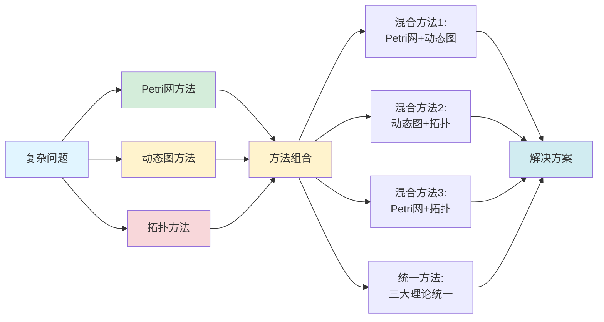

### 4.3 工具链关系图

**统一的分析工具链**

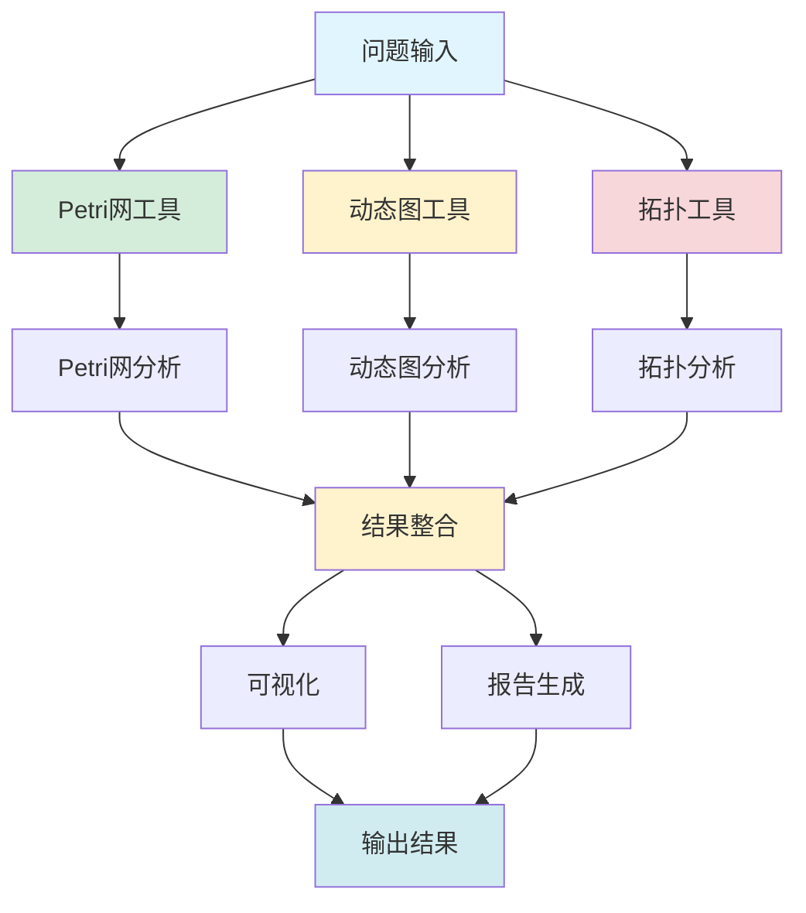

---

## 📚 **五、参考文档 / Part 5: Reference Documents**

### 5.1 模块理论关系梳理文档

- **[分布式系统模块理论关系梳理](../../01-理论逻辑脉络/07-分布式系统模块理论关系梳理.md)**
- **[通信协议模块理论关系梳理](../../01-理论逻辑脉络/06-通信协议模块理论关系梳理.md)**
- **[网络拓扑模块理论关系梳理](../../01-理论逻辑脉络/05-网络拓扑模块理论关系梳理.md)**

### 5.2 应用模式归纳文档

- **[应用模式归纳模块](../../13-应用模式归纳/)** - 详见上级目录的应用模式归纳

### 5.3 决策逻辑文档

- **[模型选择认知路径](../../决策逻辑图谱/01-模型选择认知路径.md)**
- **[应用决策因果链](../03-因果链文档/03-应用决策因果链.md)**

---

**文档版本**: v1.0
**创建时间**: 2025年1月
**最后更新**: 2025年1月
**维护者**: GraphNetWorkCommunicate项目组
**状态**: ✅ 完成
