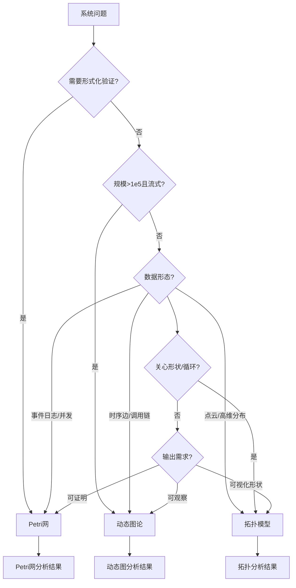
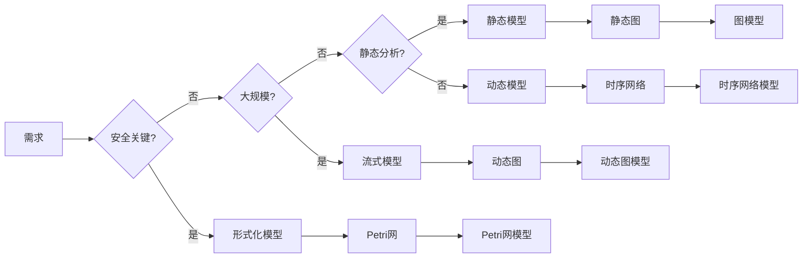
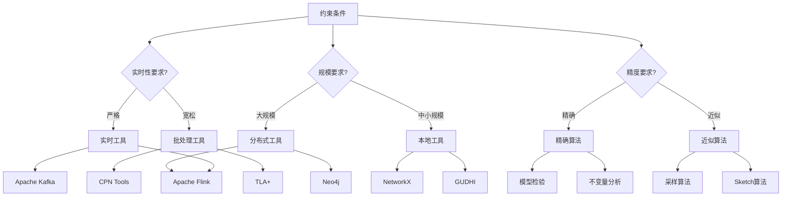

# 理论选择因果链 / Theory Selection Causal Chain

## 📚 **概述 / Overview**

本文档提供理论选择的因果链分析，从问题需求到理论选择的推理路径。

---

## ⚡ **问题 → 理论选择因果链 / Problem → Theory Selection Causal Chain**

---

## 🔄 **需求 → 模型选择因果链 / Requirement → Model Selection Causal Chain**

---

## 🎯 **约束 → 工具选择因果链 / Constraint → Tool Selection Causal Chain**

---

## 📋 **因果链说明 / Causal Chain Description**

### 问题诊断链

1. **问题识别**: 系统出现异常（死锁、性能瓶颈、架构腐化）
2. **需求分析**: 确定分析目标（形式化验证、实时监控、形状分析）
3. **约束识别**: 确定约束条件（规模、实时性、精度）
4. **理论选择**: 根据需求和约束选择理论框架
5. **工具选择**: 根据理论选择相应的工具链

### 决策路径

- **路径1**: 安全关键系统 → 形式化验证 → Petri网 → CPN Tools/TLA+
- **路径2**: 大规模流式系统 → 实时监控 → 动态图 → Flink/Neo4j
- **路径3**: 高维数据分析 → 形状分析 → 拓扑模型 → GUDHI/Ripser

---

## 📚 **参考文档 / Reference Documents**

- [模型选择认知路径](../../决策逻辑图谱/01-模型选择认知路径.md)
- [算法选择认知路径](../../决策逻辑图谱/02-算法选择认知路径.md)
- [应用模式归纳概述](../../../13-应用模式归纳/00-应用模式归纳概述.md)

---

**文档版本**: v1.0
**创建时间**: 2025年1月
**最后更新**: 2025年1月
**维护者**: GraphNetWorkCommunicate项目组
**状态**: ✅ 完成
