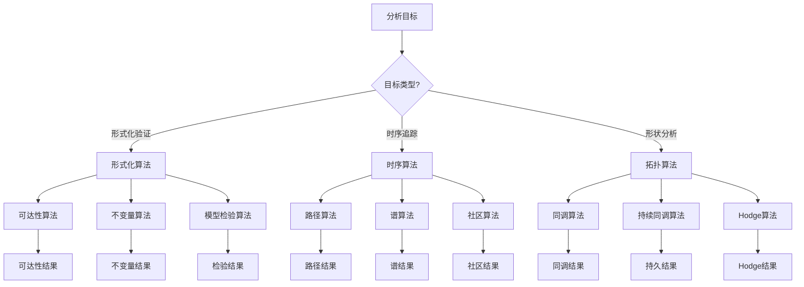
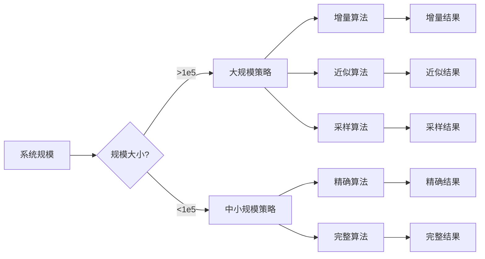
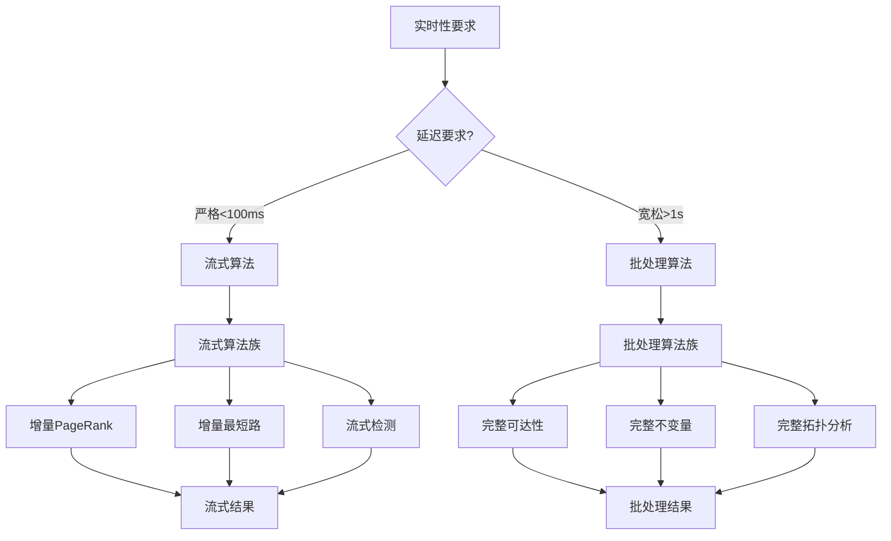
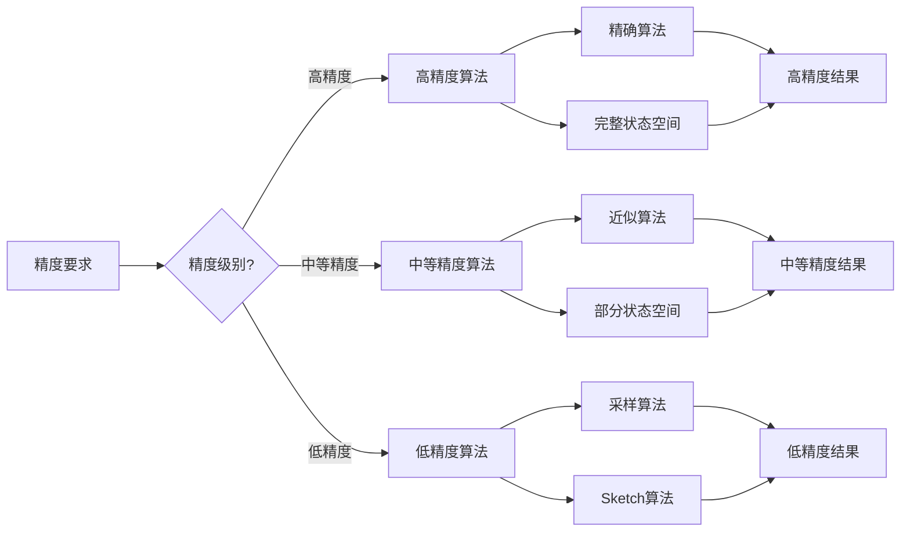

# 算法选择因果链 / Algorithm Selection Causal Chain

## 📚 **概述 / Overview**

本文档提供算法选择的因果链分析，从目标需求到算法选择的推理路径。

---

## ⚡ **目标 → 算法族选择因果链 / Goal → Algorithm Family Selection Causal Chain**

---

## 📊 **规模 → 算法策略选择因果链 / Scale → Algorithm Strategy Selection Causal Chain**

---

## ⏱️ **实时性 → 算法选择因果链 / Real-time → Algorithm Selection Causal Chain**

---

## 🎯 **精度要求 → 算法参数选择因果链 / Accuracy → Algorithm Parameter Selection Causal Chain**

---

## 📋 **因果链说明 / Causal Chain Description**

### 算法选择决策路径

1. **目标识别**: 确定分析目标（形式化验证、时序追踪、形状分析）
2. **规模评估**: 评估系统规模（大规模、中小规模）
3. **实时性评估**: 评估实时性要求（严格、宽松）
4. **精度评估**: 评估精度要求（高、中、低）
5. **算法选择**: 根据以上因素选择算法族和策略
6. **参数设定**: 根据精度要求设定算法参数

### 典型决策路径

- **路径1**: 形式化验证 + 中小规模 + 宽松实时性 + 高精度 → 精确可达性算法 + 完整状态空间
- **路径2**: 时序追踪 + 大规模 + 严格实时性 + 中等精度 → 增量算法 + 流式处理
- **路径3**: 形状分析 + 大规模 + 宽松实时性 + 低精度 → 采样算法 + 近似拓扑分析

---

## 📚 **参考文档 / Reference Documents**

- [算法选择认知路径](../../决策逻辑图谱/02-算法选择认知路径.md)
- [模型选择认知路径](../../决策逻辑图谱/01-模型选择认知路径.md)
- [应用模式归纳概述](../../../13-应用模式归纳/00-应用模式归纳概述.md)

---

**文档版本**: v1.0
**创建时间**: 2025年1月
**最后更新**: 2025年1月
**维护者**: GraphNetWorkCommunicate项目组
**状态**: ✅ 完成
