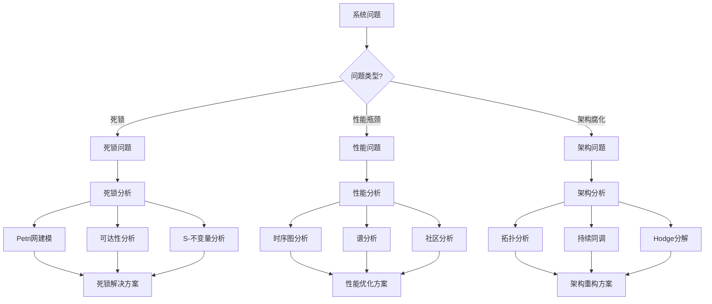
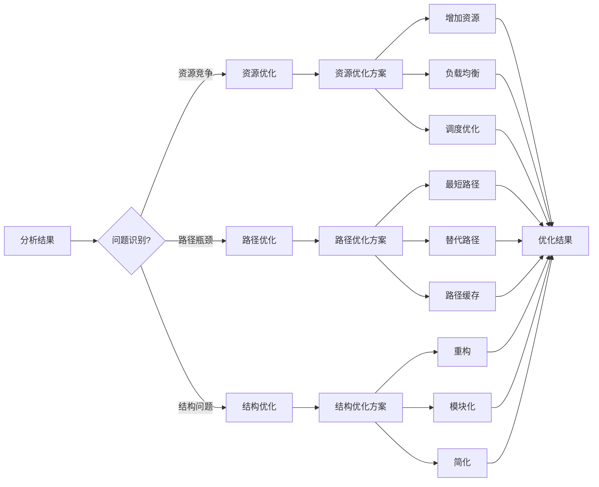
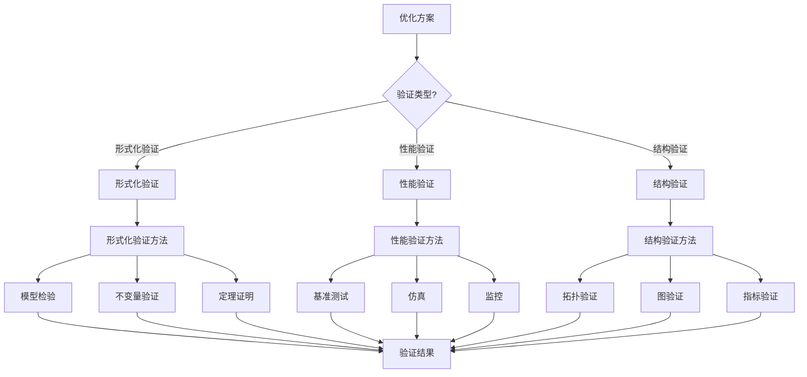

# 应用决策因果链 / Application Decision Causal Chain

## 📚 **概述 / Overview**

本文档提供应用决策的因果链分析，从问题诊断到解决方案的推理路径。

---

## 🔍 **问题诊断 → 分析方法因果链 / Problem Diagnosis → Analysis Method Causal Chain**

---

## 🔧 **分析结果 → 优化方案因果链 / Analysis Result → Optimization Solution Causal Chain**

---

## ✅ **优化方案 → 验证方法因果链 / Optimization Solution → Verification Method Causal Chain**

---

## 📋 **因果链说明 / Causal Chain Description**

### 应用决策流程

1. **问题诊断**: 识别系统问题（死锁、性能瓶颈、架构腐化）
2. **分析方法选择**: 根据问题类型选择分析方法
3. **分析执行**: 执行分析获得结果
4. **问题识别**: 从分析结果中识别具体问题
5. **优化方案设计**: 设计针对性的优化方案
6. **方案验证**: 验证优化方案的有效性

### 典型应用场景

- **场景1**: 死锁问题 → Petri网建模 → 可达性分析 → 死锁检测 → 资源优化 → 模型检验
- **场景2**: 性能瓶颈 → 时序图分析 → 路径分析 → 路径优化 → 性能测试 → 监控验证
- **场景3**: 架构腐化 → 拓扑分析 → 结构分析 → 架构重构 → 拓扑验证 → 指标验证

---

## 📚 **参考文档 / Reference Documents**

- [应用模式归纳概述](../../../13-应用模式归纳/00-应用模式归纳概述.md)
- [操作系统应用模式清单](../../../13-应用模式归纳/01-操作系统应用模式/操作系统应用模式清单.md)
- [分布式系统应用模式清单](../../../13-应用模式归纳/02-分布式系统应用模式/分布式系统应用模式清单.md)

---

**文档版本**: v1.0
**创建时间**: 2025年1月
**最后更新**: 2025年1月
**维护者**: GraphNetWorkCommunicate项目组
**状态**: ✅ 完成
