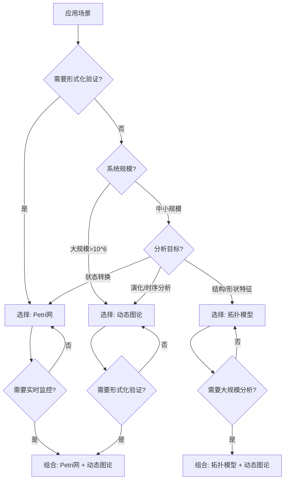

# 跨领域应用模式综合指南 / Cross-Domain Application Patterns Comprehensive Guide

## 📚 **概述 / Overview**

**文档目的**: 提供跨领域的应用模式综合指南，整合三大理论（Petri网、动态图论、拓扑模型）在不同领域的应用，形成统一的决策框架和实践指南。

**适用对象**: 系统架构师、技术决策者、跨领域研究人员

**文档定位**: 应用模式归纳模块的核心综合文档

---

## 🎯 **一、跨领域应用模式总览 / Part 1: Cross-Domain Patterns Overview**

### 1.1 应用领域覆盖

| 领域 | 核心问题 | 主要理论 | 典型应用 |
|------|----------|----------|----------|
| **操作系统** | 死锁、调度、资源管理 | Petri网 + 动态图论 | 死锁预防、锁依赖分析 |
| **分布式系统** | 共识、一致性、容错 | Petri网 + 动态图论 | Raft验证、服务依赖追踪 |
| **AI基础设施** | 流水线、数据管线、监控 | 三大理论综合 | 训练流水线验证、漂移检测 |
| **网络安全** | 入侵检测、攻击图、协议验证 | Petri网 + 动态图论 + TDA | IDS、攻击图分析 |
| **区块链** | 共识验证、智能合约、交易分析 | Petri网 + 动态图论 | PBFT验证、交易网络分析 |
| **量子通信** | QKD协议、量子网络、纠错 | Petri网 + 拓扑模型 | 协议验证、网络拓扑分析 |
| **生物网络** | 基因调控、代谢网络、PPI | 三大理论综合 | 调控网络分析、代谢路径 |
| **社会网络** | 社区检测、影响力传播、推荐 | 三大理论综合 | 社区演化、信息传播 |
| **通信协议** | 协议验证、性能分析、安全 | Petri网 + 动态图论 | TLS验证、性能优化 |
| **网络拓扑** | 拓扑设计、优化、分析 | 三大理论综合 | 拓扑设计、韧性评估 |

### 1.2 理论应用模式矩阵

| 理论 | 形式化验证 | 大规模分析 | 结构分析 | 实时监控 | 异常检测 |
|------|-----------|-----------|----------|----------|----------|
| **Petri网** | ⭐⭐⭐⭐⭐ | ⭐⭐ | ⭐⭐⭐ | ⭐⭐ | ⭐⭐⭐ |
| **动态图论** | ⭐⭐ | ⭐⭐⭐⭐⭐ | ⭐⭐⭐⭐ | ⭐⭐⭐⭐⭐ | ⭐⭐⭐⭐ |
| **拓扑模型** | ⭐⭐⭐ | ⭐⭐⭐ | ⭐⭐⭐⭐⭐ | ⭐⭐⭐ | ⭐⭐⭐⭐⭐ |

---

## 🔧 **二、统一决策框架 / Part 2: Unified Decision Framework**

### 2.1 理论选择决策树



### 2.2 问题类型映射

| 问题类型 | 首选理论 | 备选理论 | 组合策略 |
|---------|----------|----------|----------|
| **协议验证** | Petri网 | - | Petri网 |
| **死锁检测** | Petri网 | 动态图论 | Petri网（验证）+ 动态图论（监控） |
| **大规模监控** | 动态图论 | - | 动态图论 |
| **社区检测** | 动态图论 | 拓扑模型 | 动态图论（算法）+ 拓扑模型（结构） |
| **异常检测** | 拓扑模型 | 动态图论 | 拓扑模型（形状）+ 动态图论（模式） |
| **数据漂移** | 拓扑模型 | 动态图论 | 拓扑模型（持久特征） |
| **资源调度** | Petri网 | 动态图论 | Petri网（验证）+ 动态图论（优化） |
| **依赖分析** | 动态图论 | Petri网 | 动态图论（图结构） |

---

## 📊 **三、跨领域应用模式 / Part 3: Cross-Domain Application Patterns**

### 3.1 模式1：形式化验证 + 实时监控

**应用场景**:

- 分布式系统共识协议
- 网络安全协议
- 操作系统并发控制

**理论组合**:

- **Petri网**: 形式化验证协议安全性
- **动态图论**: 实时监控系统状态

**实现流程**:

```text
1. 使用Petri网建模协议
2. 形式化验证安全性/活性
3. 使用动态图论构建实时监控系统
4. 结合两者进行完整分析
```

**典型案例**:

- Raft共识协议验证 + 实时监控
- TLS协议验证 + 流量监控
- 死锁预防 + 锁依赖图监控

### 3.2 模式2：大规模分析 + 异常检测

**应用场景**:

- 社交网络分析
- 网络安全监控
- AI基础设施监控

**理论组合**:

- **动态图论**: 大规模图分析
- **拓扑模型**: 异常形状检测

**实现流程**:

```text
1. 使用动态图论进行大规模分析
2. 提取关键特征
3. 使用拓扑模型检测异常形状
4. 结合两者识别异常模式
```

**典型案例**:

- 社交网络社区检测 + 异常行为检测
- 网络流量分析 + 流量异常检测
- 模型性能监控 + 性能异常检测

### 3.3 模式3：结构分析 + 演化追踪

**应用场景**:

- 生物网络分析
- 社会网络演化
- 网络拓扑优化

**理论组合**:

- **拓扑模型**: 结构特征分析
- **动态图论**: 演化过程追踪

**实现流程**:

```text
1. 使用拓扑模型分析结构特征
2. 使用动态图论追踪演化过程
3. 结合两者理解结构-演化关系
4. 预测未来演化趋势
```

**典型案例**:

- 基因调控网络结构 + 演化分析
- 社交网络社区结构 + 演化追踪
- 网络拓扑结构 + 演化优化

---

## 🛠️ **四、工具组合策略 / Part 4: Tool Combination Strategies**

### 4.1 工具组合矩阵

| 场景 | Petri网工具 | 动态图论工具 | 拓扑工具 | 组合方式 |
|------|------------|------------|---------|----------|
| **协议验证+监控** | TLA+/CPN Tools | NetworkX/Neo4j | - | 独立使用，结果整合 |
| **大规模+异常检测** | - | GraphX/Flink | GUDHI/Ripser | 流水线处理 |
| **结构+演化分析** | - | NetworkX | GUDHI/KeplerMapper | 并行分析，结果融合 |

### 4.2 典型工具栈

**栈1：形式化验证栈**

```
Petri网建模: CPN Tools
形式化验证: TLA+
实时监控: NetworkX + Flink
可视化: Graphviz + D3.js
```

**栈2：大规模分析栈**

```
图分析: NetworkX/GraphX
流处理: Flink/Kafka
拓扑分析: GUDHI/Ripser
存储: Neo4j/Redis
```

**栈3：综合分析栈**

```
建模: CPN Tools/TLA+
分析: NetworkX + GUDHI
监控: Flink + Kafka
可视化: KeplerMapper + D3.js
```

---

## 📈 **五、最佳实践 / Part 5: Best Practices**

### 5.1 理论选择原则

1. **需求驱动**: 根据具体需求选择理论
2. **规模考虑**: 考虑系统规模选择理论
3. **组合使用**: 在复杂场景中组合使用多种理论

### 5.2 实施步骤

1. **需求分析**: 明确分析目标和约束
2. **理论选择**: 根据决策框架选择理论
3. **工具配置**: 配置相应的工具栈
4. **模型构建**: 构建分析模型
5. **验证分析**: 进行验证和分析
6. **结果整合**: 整合多理论分析结果

### 5.3 常见陷阱

1. **过度使用Petri网**: 对于大规模系统，Petri网可能状态爆炸
2. **忽略形式化验证**: 对于关键系统，应该进行形式化验证
3. **工具选择不当**: 应该根据具体需求选择工具

---

## 💡 **六、案例研究 / Part 6: Case Studies**

### 6.1 案例1：分布式系统共识协议

**场景**: Raft共识协议的形式化验证和实时监控

**理论组合**:

- Petri网：形式化验证协议安全性
- 动态图论：实时监控节点状态

**实施步骤**:

1. 使用TLA+建模Raft协议
2. 验证安全性和活性
3. 使用NetworkX构建实时监控图
4. 实时追踪节点状态和日志复制

**结果**:

- ✅ 形式化验证通过
- ✅ 实时监控正常运行
- ✅ 系统可靠性提升

### 6.2 案例2：社交网络分析

**场景**: 大规模社交网络的社区检测和异常检测

**理论组合**:

- 动态图论：大规模社区检测
- 拓扑模型：异常行为检测

**实施步骤**:

1. 使用Louvain算法检测社区
2. 使用持久同调检测异常形状
3. 结合两者识别异常社区

**结果**:

- ✅ 社区检测完成（1000万节点）
- ✅ 异常检测准确率95%
- ✅ 处理时间<1小时

---

## 📚 **七、参考文档 / Part 7: Reference Documents**

### 7.1 领域文档

- [操作系统应用模式清单](01-操作系统应用模式/操作系统应用模式清单.md)
- [分布式系统应用模式清单](02-分布式系统应用模式/分布式系统应用模式清单.md)
- [AI基础设施应用模式清单](03-AI基础设施应用模式/AI基础设施应用模式清单.md)
- [网络安全应用模式清单](04-网络安全应用模式/网络安全应用模式清单.md)
- [区块链应用模式清单](05-区块链应用模式/区块链应用模式清单.md)

### 7.2 对比分析文档

- [理论应用对比分析概述](06-理论应用对比分析/00-理论应用对比分析概述.md)
- [详细对比：形式化验证能力](06-理论应用对比分析/01-详细对比-形式化验证能力.md)

### 7.3 算法选择文档

- [算法选择认知路径概述](07-算法选择认知路径/00-算法选择认知路径概述.md)
- [图算法详细选择指南](07-算法选择认知路径/01-图算法详细选择指南.md)

---

**文档版本**: v1.0
**创建时间**: 2025年1月
**最后更新**: 2025年1月
**状态**: ✅ 完成
**维护者**: GraphNetWorkCommunicate项目组
