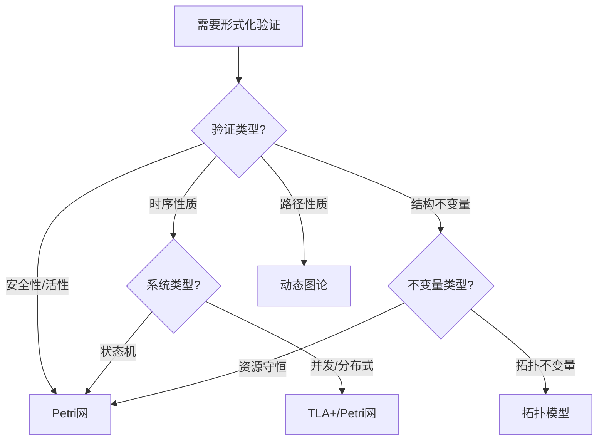
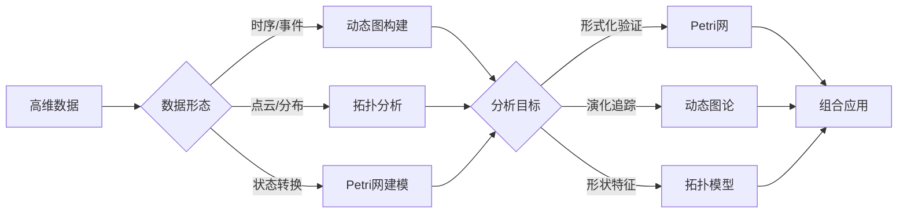

# 理论应用对比分析概述 / Theory Application Comparison Analysis Overview

## 📚 **概述 / Overview**

**文档目的**: 对比分析Petri网、动态图论、拓扑模型三大理论在相同领域的应用差异，揭示各理论的优势场景和适用边界。

**核心对比维度**:

- 形式化验证能力对比
- 大规模系统处理能力对比
- 高维数据分析能力对比
- 实时性与可扩展性对比
- 工具链成熟度对比

**适用对象**: 系统架构师、研究人员、技术决策者

---

## 📋 **目录 / Table of Contents**

- [理论应用对比分析概述 / Theory Application Comparison Analysis Overview](#理论应用对比分析概述--theory-application-comparison-analysis-overview)
  - [📚 **概述 / Overview**](#-概述--overview)
  - [📋 **目录 / Table of Contents**](#-目录--table-of-contents)
  - [🎯 **一、对比分析框架 / Part 1: Comparison Framework**](#-一对比分析框架--part-1-comparison-framework)
    - [1.1 对比维度定义](#11-对比维度定义)
    - [1.2 评分标准](#12-评分标准)
  - [📊 **二、综合能力对比矩阵 / Part 2: Comprehensive Capability Matrix**](#-二综合能力对比矩阵--part-2-comprehensive-capability-matrix)
    - [2.1 核心能力对比](#21-核心能力对比)
    - [2.2 适用场景对比](#22-适用场景对比)
  - [🔧 **三、形式化验证对比 / Part 3: Formal Verification Comparison**](#-三形式化验证对比--part-3-formal-verification-comparison)
    - [3.1 形式化能力详细对比](#31-形式化能力详细对比)
    - [3.2 形式化验证工具对比](#32-形式化验证工具对比)
    - [3.3 形式化验证场景选择](#33-形式化验证场景选择)
  - [📈 **四、大规模系统对比 / Part 4: Large-Scale System Comparison**](#-四大规模系统对比--part-4-large-scale-system-comparison)
    - [4.1 规模处理能力对比](#41-规模处理能力对比)
    - [4.2 大规模场景选择](#42-大规模场景选择)
    - [4.3 规模扩展策略](#43-规模扩展策略)
  - [🔬 **五、高维数据分析对比 / Part 5: High-Dimensional Data Analysis Comparison**](#-五高维数据分析对比--part-5-high-dimensional-data-analysis-comparison)
    - [5.1 高维处理能力对比](#51-高维处理能力对比)
    - [5.2 高维场景选择](#52-高维场景选择)
    - [5.3 理论组合策略](#53-理论组合策略)
  - [📚 **六、参考文档 / Part 6: Reference Documents**](#-六参考文档--part-6-reference-documents)
    - [6.1 相关文档](#61-相关文档)
    - [6.2 理论参考](#62-理论参考)

---

## 🎯 **一、对比分析框架 / Part 1: Comparison Framework**

### 1.1 对比维度定义

| 维度 | 定义 | 评估标准 |
|------|------|----------|
| **形式化能力** | 支持严格数学证明的能力 | 可证明性、完备性、自动化程度 |
| **规模处理** | 处理大规模数据/系统的能力 | 节点数、边数、时间复杂度 |
| **实时性** | 支持实时分析的能力 | 延迟、吞吐量、增量更新 |
| **表达能力** | 建模复杂系统的能力 | 语义丰富度、抽象层次 |
| **工具成熟度** | 工具链的完善程度 | 工具数量、社区活跃度、文档质量 |

### 1.2 评分标准

```text
⭐⭐⭐⭐⭐ 卓越：业界领先，无明显短板
⭐⭐⭐⭐  优秀：能力强，有少量限制
⭐⭐⭐   良好：能满足大部分需求
⭐⭐    一般：有明显限制，需辅助手段
⭐     较弱：不推荐用于此场景
```

---

## 📊 **二、综合能力对比矩阵 / Part 2: Comprehensive Capability Matrix**

### 2.1 核心能力对比

| 能力维度 | Petri网 | 动态图论 | 拓扑模型(TDA) |
|----------|---------|----------|---------------|
| **形式化验证** | ⭐⭐⭐⭐⭐ | ⭐⭐ | ⭐⭐⭐ |
| **大规模处理** | ⭐⭐ | ⭐⭐⭐⭐⭐ | ⭐⭐⭐ |
| **实时分析** | ⭐⭐ | ⭐⭐⭐⭐⭐ | ⭐⭐⭐ |
| **结构特征提取** | ⭐⭐⭐ | ⭐⭐⭐⭐ | ⭐⭐⭐⭐⭐ |
| **并发建模** | ⭐⭐⭐⭐⭐ | ⭐⭐⭐ | ⭐⭐ |
| **时序分析** | ⭐⭐⭐⭐ | ⭐⭐⭐⭐⭐ | ⭐⭐⭐ |
| **异常检测** | ⭐⭐⭐ | ⭐⭐⭐⭐ | ⭐⭐⭐⭐⭐ |
| **可视化** | ⭐⭐⭐ | ⭐⭐⭐⭐⭐ | ⭐⭐⭐⭐ |
| **工具成熟度** | ⭐⭐⭐⭐ | ⭐⭐⭐⭐⭐ | ⭐⭐⭐ |

### 2.2 适用场景对比

| 场景 | 首选理论 | 备选理论 | 理由 |
|------|----------|----------|------|
| **协议验证** | Petri网 | - | 需要形式化证明 |
| **状态机建模** | Petri网 | 动态图论 | 并发语义精确 |
| **大规模网络监控** | 动态图论 | - | 规模和实时性要求 |
| **社区检测** | 动态图论 | 拓扑模型 | 图算法丰富 |
| **异常形状检测** | 拓扑模型 | - | 形状特征稳定 |
| **数据漂移检测** | 拓扑模型 | 动态图论 | 持久同调有效 |
| **资源调度** | Petri网 | 动态图论 | 资源守恒建模 |
| **依赖分析** | 动态图论 | Petri网 | 图结构直观 |

---

## 🔧 **三、形式化验证对比 / Part 3: Formal Verification Comparison**

### 3.1 形式化能力详细对比

| 方面 | Petri网 | 动态图论 | 拓扑模型 |
|------|---------|----------|----------|
| **可达性分析** | ✅ 原生支持，可达图/覆盖树 | ⚠️ 需转换为路径问题 | ⚠️ 间接支持 |
| **活性证明** | ✅ 活性/死锁检测 | ⚠️ 无直接支持 | ⚠️ 无直接支持 |
| **不变量验证** | ✅ S/T不变量 | ⚠️ 需额外建模 | ✅ 贝蒂数不变量 |
| **模型检验** | ✅ CTL/LTL | ⚠️ 需转换 | ⚠️ 需转换 |
| **自动化程度** | ✅ 高（CPN Tools/TLA+） | ⚠️ 中 | ⚠️ 中 |

### 3.2 形式化验证工具对比

| 工具 | 理论基础 | 验证能力 | 自动化 | 应用场景 |
|------|----------|----------|--------|----------|
| **CPN Tools** | Petri网 | 状态空间/不变量 | 高 | 协议/工作流 |
| **TLA+** | 时序逻辑 | 模型检验 | 高 | 分布式系统 |
| **Spin** | Promela | LTL验证 | 高 | 并发系统 |
| **NetworkX** | 图论 | 图算法 | 中 | 网络分析 |
| **GUDHI** | 拓扑 | 持久同调 | 中 | 形状分析 |

### 3.3 形式化验证场景选择



---

## 📈 **四、大规模系统对比 / Part 4: Large-Scale System Comparison**

### 4.1 规模处理能力对比

| 指标 | Petri网 | 动态图论 | 拓扑模型 |
|------|---------|----------|----------|
| **最大节点数** | ~10^4 | ~10^9 | ~10^6 |
| **最大边数** | ~10^5 | ~10^11 | ~10^8 |
| **状态空间** | 指数爆炸 | 线性/多项式 | 多项式 |
| **增量更新** | ⚠️ 困难 | ✅ 原生支持 | ⚠️ 部分支持 |
| **分布式计算** | ⚠️ 有限 | ✅ 完善 | ⚠️ 发展中 |

### 4.2 大规模场景选择

| 场景 | 规模 | 推荐理论 | 关键技术 |
|------|------|----------|----------|
| **社交网络分析** | 10^9+ | 动态图论 | GraphX/Spark |
| **交易网络监控** | 10^6+ | 动态图论 | 增量算法 |
| **工作流验证** | 10^3 | Petri网 | 覆盖树 |
| **点云分析** | 10^5 | 拓扑模型 | 采样+持久同调 |

### 4.3 规模扩展策略

**Petri网扩展策略**:

- 层次化建模（分解为子网）
- 符号化表示（BDD）
- 近似分析（覆盖图）

**动态图论扩展策略**:

- 分布式计算（Spark GraphX）
- 增量算法（流式处理）
- 采样近似（随机游走）

**拓扑模型扩展策略**:

- 稀疏Rips复形
- 采样+插值
- 渐进式计算

---

## 🔬 **五、高维数据分析对比 / Part 5: High-Dimensional Data Analysis Comparison**

### 5.1 高维处理能力对比

| 方面 | Petri网 | 动态图论 | 拓扑模型 |
|------|---------|----------|----------|
| **维度处理** | ⚠️ 不擅长 | ⚠️ 需降维 | ✅ 原生支持 |
| **形状保持** | - | ⚠️ 信息丢失 | ✅ 拓扑保持 |
| **噪声鲁棒** | - | ⚠️ 敏感 | ✅ 持久特征稳定 |
| **特征提取** | ⚠️ 状态特征 | ✅ 图特征 | ✅ 拓扑特征 |

### 5.2 高维场景选择

| 场景 | 数据特征 | 推荐理论 | 关键方法 |
|------|----------|----------|----------|
| **图像特征** | 高维点云 | 拓扑模型 | 持久同调 |
| **时序特征** | 多变量时序 | 动态图论/TDA | 图构建+TDA |
| **网络嵌入** | 图结构 | 动态图论 | Node2Vec/GNN |
| **分布检测** | 特征分布 | 拓扑模型 | 持久图匹配 |

### 5.3 理论组合策略



---

## 📚 **六、参考文档 / Part 6: Reference Documents**

### 6.1 相关文档

- [应用模式归纳概述](../00-应用模式归纳概述.md)
- [操作系统应用模式](../01-操作系统应用模式/操作系统应用模式清单.md)
- [分布式系统应用模式](../02-分布式系统应用模式/分布式系统应用模式清单.md)
- [AI基础设施应用模式](../03-AI基础设施应用模式/AI基础设施应用模式清单.md)
- [网络安全应用模式](../04-网络安全应用模式/网络安全应用模式清单.md)
- [区块链应用模式](../05-区块链应用模式/区块链应用模式清单.md)

### 6.2 理论参考

- [理论关系与认知框架](../../12-理论关系与认知框架/README.md)
- [决策逻辑图谱](../../12-理论关系与认知框架/决策逻辑图谱/)

---

**文档版本**: v1.0
**创建时间**: 2025年1月
**最后更新**: 2025年1月
**状态**: ✅ 完成
**维护者**: GraphNetWorkCommunicate项目组
