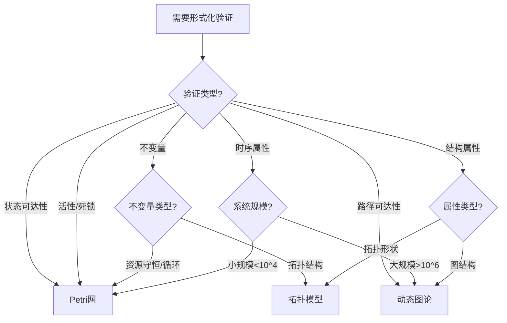

# 详细对比：形式化验证能力 / Detailed Comparison: Formal Verification Capabilities

## 📚 **概述 / Overview**

**文档目的**: 深入对比Petri网、动态图论、拓扑模型三大理论在形式化验证能力方面的差异，提供详细的能力分析和选择指南。

**适用对象**: 系统架构师、形式化方法研究人员、验证工程师

---

## 🎯 **一、形式化验证能力总览 / Part 1: Formal Verification Capabilities Overview**

### 1.1 核心能力对比矩阵

| 能力维度 | Petri网 | 动态图论 | 拓扑模型 | 说明 |
|---------|---------|----------|----------|------|
| **可达性分析** | ⭐⭐⭐⭐⭐ | ⭐⭐ | ⭐⭐ | Petri网原生支持可达图构建 |
| **活性证明** | ⭐⭐⭐⭐⭐ | ⭐ | ⭐ | Petri网有成熟的活性检测算法 |
| **不变量验证** | ⭐⭐⭐⭐⭐ | ⭐⭐ | ⭐⭐⭐ | Petri网的S/T不变量是核心特性 |
| **模型检验** | ⭐⭐⭐⭐⭐ | ⭐⭐ | ⭐⭐ | Petri网支持CTL/LTL模型检验 |
| **自动化程度** | ⭐⭐⭐⭐⭐ | ⭐⭐⭐ | ⭐⭐⭐ | Petri网工具有高度自动化 |
| **可扩展性** | ⭐⭐ | ⭐⭐⭐⭐⭐ | ⭐⭐⭐ | 动态图论可处理大规模系统 |

### 1.2 适用场景对比

| 场景 | Petri网 | 动态图论 | 拓扑模型 | 首选 |
|------|---------|----------|----------|------|
| **协议验证** | ✅ 优秀 | ⚠️ 需转换 | ⚠️ 不适用 | Petri网 |
| **状态机验证** | ✅ 优秀 | ⚠️ 需转换 | ⚠️ 不适用 | Petri网 |
| **并发系统验证** | ✅ 优秀 | ⚠️ 有限 | ⚠️ 不适用 | Petri网 |
| **大规模系统验证** | ⚠️ 状态爆炸 | ✅ 优秀 | ⚠️ 有限 | 动态图论 |
| **结构不变量验证** | ✅ 优秀 | ⚠️ 需建模 | ✅ 优秀 | Petri网/拓扑模型 |

---

## 🔧 **二、Petri网形式化验证能力 / Part 2: Petri Net Formal Verification Capabilities**

### 2.1 可达性分析

**能力描述**:

- Petri网可以构建完整的状态空间（可达图）
- 支持精确的可达性分析
- 可以检测所有可达状态

**实现方法**:

```text
可达图构建算法：
1. 从初始标识开始
2. 计算所有使能变迁
3. 生成后继状态
4. 递归构建直到所有状态被访问
5. 检测死锁状态（无输出变迁的状态）
```

**工具支持**:

- CPN Tools: 自动构建可达图
- GreatSPN: 支持可达图分析
- TLA+: 支持状态空间探索

**复杂度分析**:

- 时间复杂度: O(2^n)（n为状态数，可能指数爆炸）
- 空间复杂度: O(2^n)
- 优化方法: BDD符号化、偏序规约、对称性约简

### 2.2 活性证明

**能力描述**:

- Petri网可以证明变迁的活性（liveness）
- 活性定义：变迁在任意可达状态都可能被触发
- 支持死锁检测（无活性变迁的状态）

**实现方法**:

```text
活性检测算法：
1. 构建可达图
2. 对于每个变迁t：
   a. 检查是否存在从任意状态到使能t的状态的路径
   b. 如果不存在，则t不是活的
3. 如果所有变迁都是活的，则系统是活的
```

**工具支持**:

- CPN Tools: 自动活性检测
- GreatSPN: 支持活性分析
- TLA+: 支持活性属性验证

**应用案例**:

- 协议活性验证（如Raft协议）
- 工作流活性验证
- 资源分配活性验证

### 2.3 不变量验证

**能力描述**:

- Petri网支持S-不变量和T-不变量
- S-不变量：库所令牌数的线性组合守恒
- T-不变量：变迁触发序列的线性组合

**S-不变量验证**:

```text
S-不变量定义：
对于关联矩阵C，S-不变量y满足：C·y = 0

验证方法：
1. 求解线性方程组 C·y = 0
2. 验证所有可达状态M满足：M·y = M₀·y
3. 如果满足，则y是S-不变量
```

**T-不变量验证**:

```text
T-不变量定义：
对于关联矩阵C，T-不变量x满足：C^T·x = 0

验证方法：
1. 求解线性方程组 C^T·x = 0
2. 验证存在触发序列使得系统回到初始状态
3. 如果存在，则x是T-不变量
```

**应用案例**:

- 资源守恒验证（S-不变量）
- 循环行为验证（T-不变量）
- 系统不变量证明

### 2.4 模型检验

**能力描述**:

- Petri网支持CTL（计算树逻辑）和LTL（线性时序逻辑）
- 可以验证时序属性
- 支持自动模型检验

**CTL属性示例**:

```text
EF p: 存在路径使得p最终为真
AG p: 所有路径上p始终为真
AF p: 所有路径上p最终为真
EG p: 存在路径使得p始终为真
```

**LTL属性示例**:

```text
G p: 全局p为真
F p: 最终p为真
X p: 下一个状态p为真
p U q: p直到q为真
```

**工具支持**:

- TLA+: 支持TLA（Temporal Logic of Actions）
- Spin: 支持Promela和LTL
- CPN Tools: 支持状态空间查询

---

## 📊 **三、动态图论形式化验证能力 / Part 3: Dynamic Graph Theory Formal Verification Capabilities**

### 3.1 路径可达性分析

**能力描述**:

- 动态图论可以分析路径可达性
- 支持最短路径、最长路径分析
- 可以检测路径存在性

**实现方法**:

```python
def verify_path_reachability(graph, source, target):
    """
    验证从source到target的路径存在性
    """
    try:
        path = nx.shortest_path(graph, source, target)
        return True, path
    except nx.NetworkXNoPath:
        return False, None
```

**局限性**:

- 不能直接验证状态可达性
- 需要将状态转换转换为图结构
- 无法处理并发语义

### 3.2 图属性验证

**能力描述**:

- 可以验证图的结构属性
- 支持连通性、强连通性验证
- 可以检测环、路径等结构

**实现方法**:

```python
def verify_graph_properties(graph):
    """
    验证图属性
    """
    properties = {
        'connected': nx.is_connected(graph.to_undirected()),
        'strongly_connected': nx.is_strongly_connected(graph),
        'has_cycles': len(list(nx.simple_cycles(graph))) > 0,
        'is_dag': nx.is_directed_acyclic_graph(graph)
    }
    return properties
```

**应用场景**:

- 依赖关系验证
- 循环检测
- 连通性验证

### 3.3 时序属性验证

**能力描述**:

- 可以验证时序图的属性
- 支持时间窗口分析
- 可以检测时序模式

**实现方法**:

```python
def verify_temporal_property(temporal_graph, property_func):
    """
    验证时序属性
    """
    for timestamp in temporal_graph.timestamps:
        snapshot = temporal_graph.get_snapshot(timestamp)
        if not property_func(snapshot):
            return False, timestamp
    return True, None
```

**局限性**:

- 不能直接表达复杂的时序逻辑
- 需要手动实现属性检查
- 无法进行自动模型检验

---

## 🔬 **四、拓扑模型形式化验证能力 / Part 4: Topological Model Formal Verification Capabilities**

### 4.1 拓扑不变量验证

**能力描述**:

- 拓扑模型可以验证拓扑不变量（如贝蒂数）
- 贝蒂数在连续变形下保持不变
- 可以检测拓扑结构的变化

**实现方法**:

```python
from gudhi import RipsComplex, SimplexTree

def verify_topological_invariants(points):
    """
    验证拓扑不变量
    """
    # 构建复形
    rips_complex = RipsComplex(points=points, max_edge_length=1.0)
    simplex_tree = rips_complex.create_simplex_tree(max_dimension=2)

    # 计算贝蒂数
    betti_numbers = simplex_tree.betti_numbers()

    return betti_numbers
```

**应用场景**:

- 数据形状验证
- 结构稳定性验证
- 异常检测

### 4.2 持久同调验证

**能力描述**:

- 可以验证持久同调特征
- 持久特征在噪声下稳定
- 可以检测形状的持久性

**实现方法**:

```python
def verify_persistent_homology(points, filtration_values):
    """
    验证持久同调
    """
    rips_complex = RipsComplex(points=points, max_edge_length=max(filtration_values))
    simplex_tree = rips_complex.create_simplex_tree(max_dimension=2)

    # 计算持久同调
    persistence = simplex_tree.persistence()

    # 提取持久特征
    persistent_features = [
        (dim, (birth, death))
        for dim, (birth, death) in persistence
        if death - birth > threshold
    ]

    return persistent_features
```

**局限性**:

- 不能直接验证系统行为
- 主要用于结构分析
- 无法进行状态可达性分析

---

## 📈 **五、综合对比分析 / Part 5: Comprehensive Comparison Analysis**

### 5.1 能力雷达图

```text
形式化验证能力对比（5分制）：

                Petri网    动态图论    拓扑模型
可达性分析        ⭐⭐⭐⭐⭐   ⭐⭐       ⭐⭐
活性证明          ⭐⭐⭐⭐⭐   ⭐         ⭐
不变量验证        ⭐⭐⭐⭐⭐   ⭐⭐       ⭐⭐⭐
模型检验          ⭐⭐⭐⭐⭐   ⭐⭐       ⭐⭐
自动化程度        ⭐⭐⭐⭐⭐   ⭐⭐⭐     ⭐⭐⭐
可扩展性          ⭐⭐       ⭐⭐⭐⭐⭐   ⭐⭐⭐
```

### 5.2 选择决策树



### 5.3 组合策略

**Petri网 + 动态图论**:

- 使用Petri网进行形式化验证
- 使用动态图论进行大规模监控
- 结合两者进行完整分析

**Petri网 + 拓扑模型**:

- 使用Petri网验证系统行为
- 使用拓扑模型验证结构稳定性
- 结合两者进行综合验证

---

## 💡 **六、最佳实践建议 / Part 6: Best Practice Recommendations**

### 6.1 选择建议

1. **需要严格形式化证明**: 选择Petri网
2. **需要大规模系统分析**: 选择动态图论
3. **需要结构稳定性验证**: 选择拓扑模型
4. **需要综合验证**: 组合使用多种理论

### 6.2 工具选择建议

| 验证需求 | 推荐工具 | 理由 |
|---------|----------|------|
| 协议验证 | TLA+ | 强大的模型检验能力 |
| 工作流验证 | CPN Tools | 可视化友好 |
| 大规模系统 | NetworkX + 分布式框架 | 可扩展性强 |
| 拓扑验证 | GUDHI | 高效的TDA库 |

---

## 📚 **七、参考文档 / Part 7: Reference Documents**

### 7.1 相关文档

- [理论应用对比分析概述](./00-理论应用对比分析概述.md)
- [操作系统应用模式清单](../01-操作系统应用模式/操作系统应用模式清单.md)
- [分布式系统应用模式清单](../02-分布式系统应用模式/分布式系统应用模式清单.md)

### 7.2 理论参考

- [Petri网理论模块](../../10-Petri网理论/README.md)
- [图论基础模块](../../01-图论基础/README.md)
- [网络拓扑模块](../../02-网络拓扑/README.md)

---

**文档版本**: v1.0
**创建时间**: 2025年1月
**最后更新**: 2025年1月
**状态**: ✅ 完成
**维护者**: GraphNetWorkCommunicate项目组
