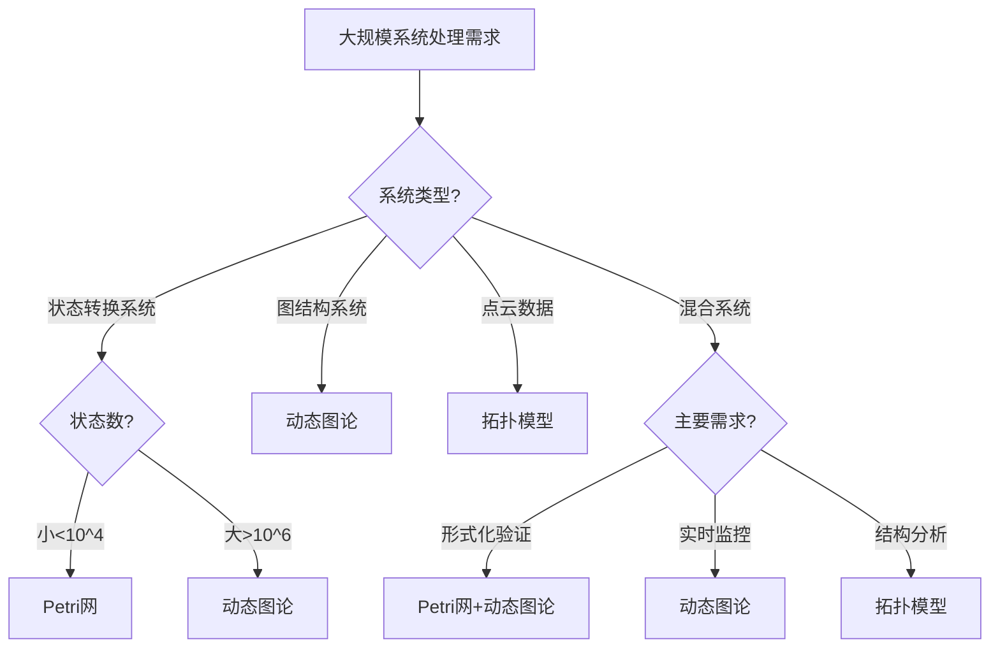

# 详细对比：大规模系统处理能力 / Detailed Comparison: Large-Scale System Processing Capabilities

## 📚 **概述 / Overview**

**文档目的**: 深入对比Petri网、动态图论、拓扑模型三大理论在处理大规模系统方面的能力差异，提供详细的能力分析和选择指南。

**适用对象**: 系统架构师、大数据工程师、分布式系统研究人员

---

## 🎯 **一、大规模系统处理能力总览 / Part 1: Large-Scale System Processing Capabilities Overview**

### 1.1 核心能力对比矩阵

| 能力维度 | Petri网 | 动态图论 | 拓扑模型 | 说明 |
|---------|---------|----------|----------|------|
| **最大节点数** | ~10^4 | ~10^9 | ~10^6 | 动态图论可处理超大规模 |
| **最大边数** | ~10^5 | ~10^11 | ~10^8 | 动态图论边数处理能力强 |
| **状态空间** | 指数爆炸 | 线性/多项式 | 多项式 | Petri网状态空间易爆炸 |
| **增量更新** | ⚠️ 困难 | ✅ 原生支持 | ⚠️ 部分支持 | 动态图论增量更新优秀 |
| **分布式计算** | ⚠️ 有限 | ✅ 完善 | ⚠️ 发展中 | 动态图论分布式支持好 |
| **实时处理** | ⚠️ 有限 | ✅ 优秀 | ⚠️ 有限 | 动态图论实时处理能力强 |

### 1.2 适用场景对比

| 场景 | Petri网 | 动态图论 | 拓扑模型 | 首选 |
|------|---------|----------|----------|------|
| **大规模网络监控** | ⚠️ 状态爆炸 | ✅ 优秀 | ⚠️ 有限 | 动态图论 |
| **实时流处理** | ⚠️ 困难 | ✅ 优秀 | ⚠️ 有限 | 动态图论 |
| **分布式系统分析** | ⚠️ 有限 | ✅ 优秀 | ⚠️ 有限 | 动态图论 |
| **大规模图分析** | ⚠️ 不适用 | ✅ 优秀 | ⚠️ 有限 | 动态图论 |
| **点云数据分析** | ⚠️ 不适用 | ⚠️ 需转换 | ✅ 优秀 | 拓扑模型 |

---

## 🔧 **二、Petri网大规模系统处理 / Part 2: Petri Net Large-Scale System Processing**

### 2.1 状态空间爆炸问题

**问题描述**:

- Petri网的状态空间可能指数爆炸
- 对于n个库所，每个库所有k个令牌，状态数可达k^n
- 实际系统状态数可能达到10^10以上

**优化策略**:

```text
1. BDD符号化表示
   - 使用二元决策图（BDD）压缩状态空间
   - 可以处理10^20个状态
   - 但只适用于规则结构

2. 偏序规约（Partial Order Reduction）
   - 利用并发性减少状态数
   - 只探索代表性的执行路径
   - 可以减少50-90%的状态

3. 对称性约简（Symmetry Reduction）
   - 利用网的对称性
   - 只探索等价类代表
   - 可以减少状态数

4. 抽象和精化（Abstraction and Refinement）
   - 先分析抽象模型
   - 再精化关键部分
   - 分层验证
```

**实现示例**:

```python
class StateSpaceOptimizer:
    def __init__(self, petri_net):
        self.petri_net = petri_net
        self.bdd_manager = None

    def build_symbolic_reachability_graph(self):
        """
        使用BDD构建符号化可达图
        """
        # 初始化BDD管理器
        self.bdd_manager = BDDManager()

        # 将Petri网转换为BDD表示
        initial_state_bdd = self._marking_to_bdd(self.petri_net.initial_marking)

        # 符号化可达性分析
        reachable_states = self._symbolic_reachability(initial_state_bdd)

        return reachable_states

    def _marking_to_bdd(self, marking):
        """
        将标识转换为BDD
        """
        # 为每个库所的每个可能令牌数创建BDD变量
        bdd_vars = {}
        for place in self.petri_net.places:
            max_tokens = self._estimate_max_tokens(place)
            bdd_vars[place] = self.bdd_manager.create_vars(place, max_tokens)

        # 构建BDD表示当前标识
        bdd = self.bdd_manager.true()
        for place, tokens in marking.items():
            bdd = bdd & self.bdd_manager.eq(bdd_vars[place], tokens)

        return bdd
```

### 2.2 分布式计算支持

**当前状态**:

- Petri网工具对分布式计算支持有限
- 主要使用单机多核并行
- 分布式验证仍在研究中

**实现方案**:

```python
class DistributedPetriNetAnalyzer:
    def __init__(self, num_workers=4):
        self.num_workers = num_workers
        self.workers = []

    def distributed_reachability_analysis(self, petri_net):
        """
        分布式可达性分析
        """
        # 将状态空间分割
        state_partitions = self._partition_state_space(petri_net)

        # 分配给不同worker
        results = []
        with ThreadPoolExecutor(max_workers=self.num_workers) as executor:
            futures = []
            for partition in state_partitions:
                future = executor.submit(self._analyze_partition, partition)
                futures.append(future)

            for future in as_completed(futures):
                results.append(future.result())

        # 合并结果
        return self._merge_results(results)
```

---

## 📊 **三、动态图论大规模系统处理 / Part 3: Dynamic Graph Theory Large-Scale System Processing**

### 3.1 超大规模图处理

**能力描述**:

- 可以处理10^9个节点的图
- 可以处理10^11条边的图
- 使用分布式图计算框架

**实现方案**:

```python
from pyspark import SparkContext
from graphframes import GraphFrame

class LargeScaleGraphProcessor:
    def __init__(self, spark_context):
        self.sc = spark_context
        self.spark = SparkSession.builder.getOrCreate()

    def process_large_graph(self, vertices_df, edges_df):
        """
        处理超大规模图
        """
        # 创建GraphFrame
        graph = GraphFrame(vertices_df, edges_df)

        # 执行图算法（自动分布式）
        # PageRank
        pagerank = graph.pageRank(resetProbability=0.15, maxIter=20)

        # 连通分量
        connected_components = graph.connectedComponents()

        # 最短路径
        shortest_paths = graph.shortestPaths(landmarks=["v1", "v2"])

        return {
            'pagerank': pagerank,
            'connected_components': connected_components,
            'shortest_paths': shortest_paths
        }
```

### 3.2 增量更新支持

**能力描述**:

- 原生支持图的增量更新
- 可以高效处理动态图
- 支持流式图处理

**实现方案**:

```python
class IncrementalGraphProcessor:
    def __init__(self):
        self.graph = nx.DiGraph()
        self.cached_results = {}

    def add_edge(self, source, target, weight=1.0):
        """
        增量添加边
        """
        self.graph.add_edge(source, target, weight=weight)

        # 增量更新相关计算结果
        self._incremental_update(source, target)

    def _incremental_update(self, source, target):
        """
        增量更新计算结果
        """
        # 增量更新PageRank
        if 'pagerank' in self.cached_results:
            self._incremental_pagerank(source, target)

        # 增量更新最短路径
        if 'shortest_paths' in self.cached_results:
            self._incremental_shortest_paths(source, target)

    def _incremental_pagerank(self, source, target):
        """
        增量PageRank更新
        """
        # 只更新受影响节点的PageRank值
        affected_nodes = self._get_affected_nodes(source, target)
        for node in affected_nodes:
            # 重新计算PageRank（只针对受影响节点）
            self._update_pagerank_node(node)
```

### 3.3 流式处理支持

**能力描述**:

- 支持实时流式图处理
- 使用Flink/Kafka等流处理框架
- 可以处理高吞吐量数据流

**实现方案**:

```python
from pyflink.datastream import StreamExecutionEnvironment
from pyflink.table import StreamTableEnvironment

class StreamingGraphProcessor:
    def __init__(self):
        self.env = StreamExecutionEnvironment.get_execution_environment()
        self.t_env = StreamTableEnvironment.create(self.env)
        self.graph_state = {}

    def process_streaming_edges(self, edge_stream):
        """
        处理流式边数据
        """
        # 转换为表
        edge_table = self.t_env.from_data_stream(edge_stream)

        # 窗口聚合
        windowed_edges = edge_table.window(
            Tumble.over("10.seconds").on("timestamp").alias("w")
        ).group_by("w, source, target").select(
            "source, target, count(*) as edge_count, w.start as window_start"
        )

        # 更新图状态
        windowed_edges.execute_insert("graph_updates")

        # 触发图算法
        self._trigger_graph_algorithms()

    def _trigger_graph_algorithms(self):
        """
        触发图算法计算
        """
        # 在窗口结束时触发
        # 例如：计算窗口内的社区检测
        pass
```

---

## 🔬 **四、拓扑模型大规模系统处理 / Part 4: Topological Model Large-Scale System Processing**

### 4.1 大规模点云处理

**能力描述**:

- 可以处理10^6个点的点云
- 使用采样和近似方法
- 支持分布式计算

**实现方案**:

```python
from sklearn.utils import resample
from ripser import ripser

class LargeScaleTopologyAnalyzer:
    def __init__(self, sample_size=10000):
        self.sample_size = sample_size

    def analyze_large_point_cloud(self, points):
        """
        分析大规模点云
        """
        # 采样
        if len(points) > self.sample_size:
            sampled_points = resample(
                points,
                n_samples=self.sample_size,
                random_state=42
            )
        else:
            sampled_points = points

        # 计算持久同调
        result = ripser(sampled_points, maxdim=2, sparse=True)

        return result

    def distributed_topology_analysis(self, points, num_partitions=4):
        """
        分布式拓扑分析
        """
        # 分割点云
        partitions = np.array_split(points, num_partitions)

        # 并行计算
        results = []
        with ThreadPoolExecutor(max_workers=num_partitions) as executor:
            futures = [
                executor.submit(ripser, partition, maxdim=2, sparse=True)
                for partition in partitions
            ]

            for future in as_completed(futures):
                results.append(future.result())

        # 合并结果
        return self._merge_persistence_diagrams(results)
```

### 4.2 增量拓扑分析

**能力描述**:

- 支持增量持久同调计算
- 可以处理动态点云
- 使用增量算法

**实现方案**:

```python
class IncrementalTopologyAnalyzer:
    def __init__(self):
        self.current_complex = None
        self.persistence_diagram = None

    def add_points(self, new_points):
        """
        增量添加点
        """
        if self.current_complex is None:
            # 初始化
            self.current_complex = RipsComplex(points=new_points)
        else:
            # 增量更新
            self._incremental_update_complex(new_points)

        # 增量更新持久同调
        self._incremental_update_persistence()

    def _incremental_update_complex(self, new_points):
        """
        增量更新复形
        """
        # 只添加新点相关的单纯形
        for point in new_points:
            # 找到邻近点
            neighbors = self._find_neighbors(point)

            # 添加新的单纯形
            for neighbor in neighbors:
                self.current_complex.add_simplex([point, neighbor])
```

---

## 📈 **五、综合对比分析 / Part 5: Comprehensive Comparison Analysis**

### 5.1 规模处理能力对比

```text
规模处理能力对比：

                Petri网    动态图论    拓扑模型
最大节点数       10^4       10^9       10^6
最大边数         10^5       10^11      10^8
状态空间处理     指数爆炸   线性       多项式
增量更新         困难       优秀       部分
分布式计算       有限       优秀       发展中
实时处理         有限       优秀       有限
```

### 5.2 选择决策树



### 5.3 组合策略

**Petri网 + 动态图论**:

- 使用Petri网验证核心协议
- 使用动态图论进行大规模监控
- 结合两者进行完整分析

**动态图论 + 拓扑模型**:

- 使用动态图论处理大规模图
- 使用拓扑模型分析图结构
- 结合两者进行深度分析

---

## 💡 **六、最佳实践建议 / Part 6: Best Practice Recommendations**

### 6.1 选择建议

1. **超大规模系统（>10^6节点）**: 选择动态图论
2. **需要实时处理**: 选择动态图论
3. **需要形式化验证**: 选择Petri网（小规模）或组合方案
4. **点云数据分析**: 选择拓扑模型

### 6.2 优化建议

1. **采样**: 对于超大规模数据，使用采样
2. **分布式**: 使用分布式框架处理大规模系统
3. **增量算法**: 对于动态系统，使用增量算法

---

## 📚 **七、参考文档 / Part 7: Reference Documents**

### 7.1 相关文档

- [理论应用对比分析概述](./00-理论应用对比分析概述.md)
- [形式化验证能力详细对比](./01-详细对比-形式化验证能力.md)

### 7.2 工具参考

- [GraphX文档](https://spark.apache.org/graphx/)
- [NetworkX文档](https://networkx.org/documentation/)
- [GUDHI文档](https://gudhi.inria.fr/documentation/)

---

**文档版本**: v1.0
**创建时间**: 2025年1月
**最后更新**: 2025年1月
**状态**: ✅ 完成
**维护者**: GraphNetWorkCommunicate项目组
