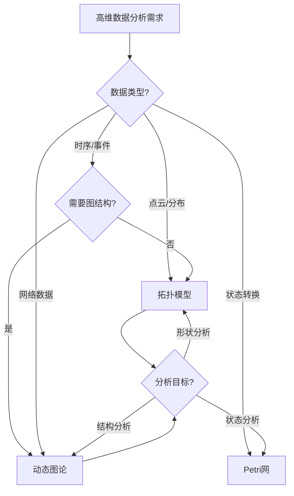

# 详细对比：高维数据分析能力 / Detailed Comparison: High-Dimensional Data Analysis Capabilities

## 📚 **概述 / Overview**

**文档目的**: 深入对比Petri网、动态图论、拓扑模型三大理论在处理高维数据方面的能力差异，提供详细的能力分析和选择指南。

**适用对象**: 数据科学家、机器学习工程师、高维数据分析研究人员

---

## 🎯 **一、高维数据分析能力总览 / Part 1: High-Dimensional Data Analysis Capabilities Overview**

### 1.1 核心能力对比矩阵

| 能力维度 | Petri网 | 动态图论 | 拓扑模型 | 说明 |
|---------|---------|----------|----------|------|
| **维度处理** | ⚠️ 不擅长 | ⚠️ 需降维 | ✅ 原生支持 | 拓扑模型原生支持高维 |
| **形状保持** | - | ⚠️ 信息丢失 | ✅ 拓扑保持 | 拓扑模型保持拓扑结构 |
| **噪声鲁棒** | - | ⚠️ 敏感 | ✅ 持久特征稳定 | 拓扑模型对噪声鲁棒 |
| **特征提取** | ⚠️ 状态特征 | ✅ 图特征 | ✅ 拓扑特征 | 动态图论和拓扑模型都强 |
| **可视化** | ⚠️ 困难 | ✅ 优秀 | ✅ 优秀 | 动态图论和拓扑模型可视化好 |
| **可解释性** | ✅ 优秀 | ⚠️ 中等 | ⚠️ 中等 | Petri网可解释性强 |

### 1.2 适用场景对比

| 场景 | Petri网 | 动态图论 | 拓扑模型 | 首选 |
|------|---------|----------|----------|------|
| **高维点云分析** | ⚠️ 不适用 | ⚠️ 需转换 | ✅ 优秀 | 拓扑模型 |
| **图像特征分析** | ⚠️ 不适用 | ⚠️ 需转换 | ✅ 优秀 | 拓扑模型 |
| **时序特征分析** | ⚠️ 需建模 | ✅ 优秀 | ✅ 优秀 | 动态图论/拓扑模型 |
| **网络嵌入** | ⚠️ 不适用 | ✅ 优秀 | ⚠️ 有限 | 动态图论 |
| **分布检测** | ⚠️ 不适用 | ⚠️ 需转换 | ✅ 优秀 | 拓扑模型 |

---

## 🔧 **二、Petri网高维数据分析 / Part 2: Petri Net High-Dimensional Data Analysis**

### 2.1 局限性分析

**问题描述**:

- Petri网主要用于离散状态系统建模
- 不适合直接处理连续高维数据
- 需要将高维数据转换为离散状态

**转换方法**:

```text
高维数据 → 离散化 → 状态空间 → Petri网建模
```

**实现示例**:

```python
class HighDimToPetriNet:
    def __init__(self, dimension_thresholds):
        self.thresholds = dimension_thresholds

    def discretize_high_dim_data(self, data):
        """
        将高维数据离散化
        """
        discrete_states = []
        for point in data:
            state = []
            for i, value in enumerate(point):
                # 根据阈值离散化
                threshold = self.thresholds[i]
                state.append(self._discretize_value(value, threshold))
            discrete_states.append(tuple(state))

        return discrete_states

    def _discretize_value(self, value, threshold):
        """
        离散化单个值
        """
        if value < threshold[0]:
            return 0
        elif value < threshold[1]:
            return 1
        else:
            return 2
```

**局限性**:

- 信息丢失严重
- 维度诅咒问题
- 不适合高维数据分析

---

## 📊 **三、动态图论高维数据分析 / Part 3: Dynamic Graph Theory High-Dimensional Data Analysis**

### 3.1 图构建方法

**方法1：k-近邻图**:

```python
from sklearn.neighbors import kneighbors_graph
import networkx as nx

def build_knn_graph(data, k=5):
    """
    构建k-近邻图
    """
    # 计算k-近邻图
    knn_graph = kneighbors_graph(data, n_neighbors=k, mode='connectivity')

    # 转换为NetworkX图
    G = nx.from_scipy_sparse_array(knn_graph)

    return G
```

**方法2：ε-邻域图**:

```python
from sklearn.neighbors import radius_neighbors_graph

def build_epsilon_graph(data, epsilon=0.5):
    """
    构建ε-邻域图
    """
    # 计算ε-邻域图
    epsilon_graph = radius_neighbors_graph(data, radius=epsilon, mode='connectivity')

    # 转换为NetworkX图
    G = nx.from_scipy_sparse_array(epsilon_graph)

    return G
```

### 3.2 图嵌入方法

**DeepWalk实现**:

```python
from gensim.models import Word2Vec
import networkx as nx
import random

def deepwalk_embedding(graph, walk_length=80, num_walks=10, dimensions=128):
    """
    DeepWalk图嵌入
    """
    def random_walk(node, length):
        walk = [node]
        for _ in range(length - 1):
            neighbors = list(graph.neighbors(node))
            if neighbors:
                node = random.choice(neighbors)
                walk.append(node)
            else:
                break
        return walk

    # 生成随机游走序列
    walks = []
    for _ in range(num_walks):
        for node in graph.nodes():
            walks.append([str(n) for n in random_walk(node, walk_length)])

    # 训练Word2Vec模型
    model = Word2Vec(walks, vector_size=dimensions, window=5, min_count=0, sg=1)

    # 提取节点嵌入
    embeddings = {node: model.wv[str(node)] for node in graph.nodes()}

    return embeddings
```

**局限性**:

- 需要降维，可能丢失信息
- 对噪声敏感
- 需要合适的图构建方法

---

## 🔬 **四、拓扑模型高维数据分析 / Part 4: Topological Model High-Dimensional Data Analysis**

### 4.1 持久同调分析

**能力描述**:

- 拓扑模型原生支持高维数据
- 不需要降维
- 保持拓扑结构

**实现方法**:

```python
from ripser import ripser
import numpy as np

def analyze_high_dim_topology(data, max_dim=2):
    """
    分析高维数据的拓扑结构
    """
    # 直接计算持久同调（不需要降维）
    result = ripser(data, maxdim=max_dim)

    # 提取持久图
    diagrams = result['dgms']

    # 分析拓扑特征
    topological_features = {}
    for dim, diagram in enumerate(diagrams):
        if len(diagram) > 0:
            # 提取持久特征
            persistent = diagram[diagram[:, 1] != np.inf]
            topological_features[dim] = {
                'num_features': len(persistent),
                'persistence': persistent,
                'max_persistence': np.max(persistent[:, 1] - persistent[:, 0]) if len(persistent) > 0 else 0
            }

    return topological_features, result
```

### 4.2 Mapper算法

**能力描述**:

- 高维数据的可视化摘要
- 保持拓扑结构
- 可以发现数据形状

**实现方法**:

```python
import kmapper as km
from sklearn import cluster
from sklearn.manifold import TSNE

def mapper_high_dim_analysis(data, n_cubes=10, overlap=0.2):
    """
    使用Mapper分析高维数据
    """
    mapper = km.KeplerMapper(verbose=1)

    # 投影到低维（用于覆盖，但保持高维信息）
    projected = mapper.fit_transform(
        data,
        projection=TSNE(n_components=2, random_state=42)
    )

    # 构建覆盖
    cover = km.Cover(n_cubes=n_cubes, perc_overlap=overlap)

    # 聚类（在高维空间）
    graph = mapper.map(
        projected,
        data,  # 使用原始高维数据
        clusterer=cluster.DBSCAN(eps=0.5, min_samples=5),
        cover=cover
    )

    return graph, mapper
```

### 4.3 优势分析

**拓扑模型优势**:

1. **维度无关**: 不依赖数据维度
2. **形状保持**: 保持拓扑结构
3. **噪声鲁棒**: 持久特征对噪声稳定
4. **可解释性**: 拓扑特征有明确的几何意义

---

## 📈 **五、综合对比分析 / Part 5: Comprehensive Comparison Analysis**

### 5.1 能力雷达图

```text
高维数据分析能力对比（5分制）：

                Petri网    动态图论    拓扑模型
维度处理           ⭐         ⭐⭐       ⭐⭐⭐⭐⭐
形状保持           -          ⭐⭐       ⭐⭐⭐⭐⭐
噪声鲁棒           -          ⭐⭐       ⭐⭐⭐⭐⭐
特征提取           ⭐⭐       ⭐⭐⭐⭐     ⭐⭐⭐⭐⭐
可视化             ⭐         ⭐⭐⭐⭐⭐   ⭐⭐⭐⭐
可解释性           ⭐⭐⭐⭐⭐   ⭐⭐⭐     ⭐⭐⭐
```

### 5.2 选择决策树



### 5.3 组合策略

**动态图论 + 拓扑模型**:

- 使用动态图论构建图结构
- 使用拓扑模型分析图拓扑
- 结合两者进行深度分析

**拓扑模型单独**:

- 直接分析高维数据
- 提取拓扑特征
- 进行形状分析

---

## 💡 **六、最佳实践建议 / Part 6: Best Practice Recommendations**

### 6.1 选择建议

1. **高维点云/分布数据**: 选择拓扑模型
2. **需要形状分析**: 选择拓扑模型
3. **需要图结构分析**: 选择动态图论
4. **需要状态分析**: 选择Petri网（需转换）

### 6.2 优化建议

1. **采样**: 对于超大规模高维数据，使用采样
2. **特征选择**: 使用拓扑特征进行特征选择
3. **可视化**: 使用Mapper算法进行可视化

---

## 📚 **七、参考文档 / Part 7: Reference Documents**

### 7.1 相关文档

- [理论应用对比分析概述](./00-理论应用对比分析概述.md)
- [形式化验证能力详细对比](./01-详细对比-形式化验证能力.md)
- [大规模系统处理能力详细对比](./02-详细对比-大规模系统处理能力.md)

### 7.2 工具参考

- [GUDHI文档](https://gudhi.inria.fr/documentation/)
- [Ripser文档](https://ripser.scikit-tda.org/)
- [NetworkX文档](https://networkx.org/documentation/)

---

**文档版本**: v1.0
**创建时间**: 2025年1月
**最后更新**: 2025年1月
**状态**: ✅ 完成
**维护者**: GraphNetWorkCommunicate项目组
