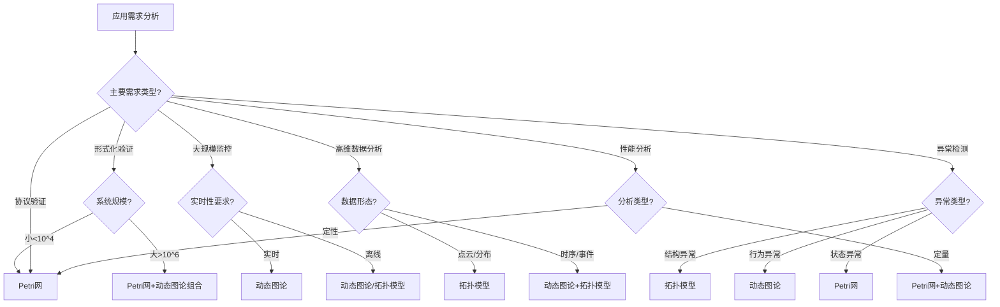

# 综合对比分析总结 / Comprehensive Comparison Analysis Summary

## 📚 **概述 / Overview**

**文档目的**: 综合总结Petri网、动态图论、拓扑模型三大理论在各方面能力的对比分析，提供完整的能力矩阵和选择指南。

**适用对象**: 系统架构师、研究人员、技术决策者

---

## 🎯 **一、综合能力对比矩阵 / Part 1: Comprehensive Capability Comparison Matrix**

### 1.1 核心能力对比

| 能力维度 | Petri网 | 动态图论 | 拓扑模型 | 最佳选择 |
|---------|---------|----------|----------|----------|
| **形式化验证** | ⭐⭐⭐⭐⭐ | ⭐⭐ | ⭐⭐⭐ | Petri网 |
| **大规模处理** | ⭐⭐ | ⭐⭐⭐⭐⭐ | ⭐⭐⭐ | 动态图论 |
| **高维数据分析** | ⭐ | ⭐⭐ | ⭐⭐⭐⭐⭐ | 拓扑模型 |
| **实时处理** | ⭐⭐ | ⭐⭐⭐⭐⭐ | ⭐⭐⭐ | 动态图论 |
| **并发建模** | ⭐⭐⭐⭐⭐ | ⭐⭐⭐ | ⭐⭐ | Petri网 |
| **时序分析** | ⭐⭐⭐⭐ | ⭐⭐⭐⭐⭐ | ⭐⭐⭐ | 动态图论 |
| **异常检测** | ⭐⭐⭐ | ⭐⭐⭐⭐ | ⭐⭐⭐⭐⭐ | 拓扑模型 |
| **可视化** | ⭐⭐⭐ | ⭐⭐⭐⭐⭐ | ⭐⭐⭐⭐ | 动态图论 |
| **工具成熟度** | ⭐⭐⭐⭐ | ⭐⭐⭐⭐⭐ | ⭐⭐⭐ | 动态图论 |

### 1.2 适用场景综合对比

| 场景 | Petri网 | 动态图论 | 拓扑模型 | 首选 | 备选 |
|------|---------|----------|----------|------|------|
| **协议验证** | ⭐⭐⭐⭐⭐ | ⭐⭐ | ⭐ | Petri网 | - |
| **状态机验证** | ⭐⭐⭐⭐⭐ | ⭐⭐ | ⭐ | Petri网 | - |
| **大规模网络监控** | ⭐⭐ | ⭐⭐⭐⭐⭐ | ⭐⭐ | 动态图论 | - |
| **实时流处理** | ⭐⭐ | ⭐⭐⭐⭐⭐ | ⭐⭐ | 动态图论 | - |
| **社区检测** | ⭐⭐ | ⭐⭐⭐⭐⭐ | ⭐⭐⭐ | 动态图论 | 拓扑模型 |
| **异常形状检测** | ⭐ | ⭐⭐ | ⭐⭐⭐⭐⭐ | 拓扑模型 | - |
| **数据漂移检测** | ⭐ | ⭐⭐ | ⭐⭐⭐⭐⭐ | 拓扑模型 | 动态图论 |
| **资源调度** | ⭐⭐⭐⭐⭐ | ⭐⭐⭐ | ⭐⭐ | Petri网 | 动态图论 |
| **依赖分析** | ⭐⭐⭐ | ⭐⭐⭐⭐⭐ | ⭐⭐⭐ | 动态图论 | Petri网 |
| **高维数据分析** | ⭐ | ⭐⭐ | ⭐⭐⭐⭐⭐ | 拓扑模型 | - |

---

## 🔧 **二、详细能力对比汇总 / Part 2: Detailed Capability Comparison Summary**

### 2.1 形式化验证能力对比

**Petri网优势**:

- ✅ 可达性分析：⭐⭐⭐⭐⭐
- ✅ 活性证明：⭐⭐⭐⭐⭐
- ✅ 不变量验证：⭐⭐⭐⭐⭐
- ✅ 模型检验：⭐⭐⭐⭐⭐

**动态图论局限性**:

- ⚠️ 路径可达性：⭐⭐
- ⚠️ 图属性验证：⭐⭐
- ⚠️ 时序属性验证：⭐⭐

**拓扑模型局限性**:

- ⚠️ 拓扑不变量验证：⭐⭐⭐
- ⚠️ 持久同调验证：⭐⭐⭐
- ⚠️ 不能直接验证系统行为

**参考**: [形式化验证能力详细对比](./01-详细对比-形式化验证能力.md)

### 2.2 大规模系统处理能力对比

**动态图论优势**:

- ✅ 最大节点数：10^9
- ✅ 最大边数：10^11
- ✅ 增量更新：原生支持
- ✅ 分布式计算：完善支持

**Petri网局限性**:

- ⚠️ 最大节点数：10^4
- ⚠️ 状态空间：指数爆炸
- ⚠️ 增量更新：困难

**拓扑模型局限性**:

- ⚠️ 最大点云数：10^6
- ⚠️ 增量更新：部分支持

**参考**: [大规模系统处理能力详细对比](./02-详细对比-大规模系统处理能力.md)

### 2.3 高维数据分析能力对比

**拓扑模型优势**:

- ✅ 维度处理：原生支持
- ✅ 形状保持：拓扑保持
- ✅ 噪声鲁棒：持久特征稳定

**Petri网局限性**:

- ⚠️ 不适合高维数据
- ⚠️ 需要离散化

**动态图论局限性**:

- ⚠️ 需要降维
- ⚠️ 信息可能丢失

**参考**: [高维数据分析能力详细对比](./03-详细对比-高维数据分析能力.md)

---

## 📊 **三、选择决策框架 / Part 3: Selection Decision Framework**

### 3.1 综合决策树

### 3.2 快速选择表

| 场景特征 | 推荐理论 | 理由 |
|---------|----------|------|
| 需要严格证明 + 小规模 | Petri网 | 形式化验证能力强 |
| 需要严格证明 + 大规模 | Petri网+动态图论 | 验证+监控组合 |
| 大规模实时监控 | 动态图论 | 实时处理能力强 |
| 高维点云分析 | 拓扑模型 | 原生支持高维 |
| 社区检测演化 | 动态图论 | 图算法丰富 |
| 异常形状检测 | 拓扑模型 | 形状分析能力强 |
| 资源调度验证 | Petri网 | 资源建模精确 |
| 服务依赖追踪 | 动态图论 | 图结构直观 |

---

## 🔬 **四、组合策略总结 / Part 4: Combination Strategy Summary**

### 4.1 Petri网 + 动态图论

**组合模式**:

- Petri网：形式化验证核心协议
- 动态图论：大规模实时监控

**适用场景**:

- 协议验证 + 实时监控
- 系统建模 + 依赖追踪
- 核心验证 + 大规模分析

### 4.2 Petri网 + 拓扑模型

**组合模式**:

- Petri网：验证系统行为
- 拓扑模型：分析系统结构

**适用场景**:

- 系统验证 + 结构分析
- 性能分析 + 分布分析
- 行为验证 + 形状分析

### 4.3 动态图论 + 拓扑模型

**组合模式**:

- 动态图论：处理大规模图
- 拓扑模型：分析图拓扑

**适用场景**:

- 网络分析 + 形状检测
- 数据流分析 + 分布分析
- 图分析 + 拓扑特征提取

### 4.4 三大理论组合

**组合模式**:

- Petri网：核心验证
- 动态图论：大规模监控
- 拓扑模型：结构分析

**适用场景**:

- 完整系统分析
- 多层次验证
- 综合性能优化

---

## 💡 **五、最佳实践建议 / Part 5: Best Practice Recommendations**

### 5.1 理论选择原则

1. **需求优先**: 根据主要需求选择理论
2. **规模考虑**: 根据系统规模选择理论
3. **精度权衡**: 在精度和效率间权衡
4. **组合使用**: 复杂场景组合使用多种理论

### 5.2 实施建议

1. **分阶段实施**: 先实施核心理论，再添加辅助理论
2. **工具集成**: 使用统一的工具链
3. **结果验证**: 交叉验证不同理论的结果

---

## 📚 **六、参考文档 / Part 6: Reference Documents**

### 6.1 相关文档

- [理论应用对比分析概述](./00-理论应用对比分析概述.md)
- [形式化验证能力详细对比](./01-详细对比-形式化验证能力.md)
- [大规模系统处理能力详细对比](./02-详细对比-大规模系统处理能力.md)
- [高维数据分析能力详细对比](./03-详细对比-高维数据分析能力.md)

### 6.2 领域文档

- [应用模式归纳概述](../00-应用模式归纳概述.md)
- [跨领域应用模式综合](../08-跨领域应用模式综合.md)

---

**文档版本**: v1.0
**创建时间**: 2025年1月
**最后更新**: 2025年1月
**状态**: ✅ 完成
**维护者**: GraphNetWorkCommunicate项目组
