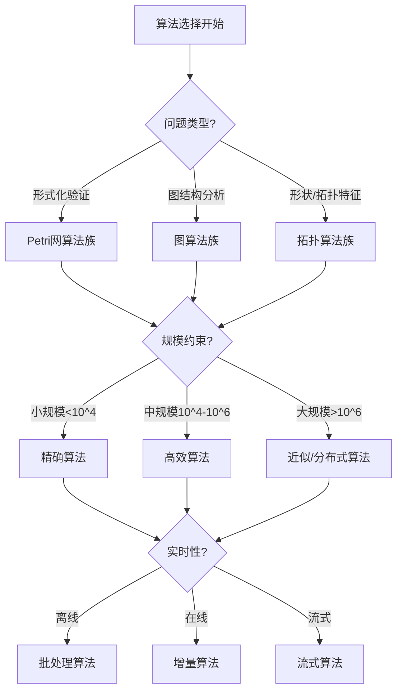
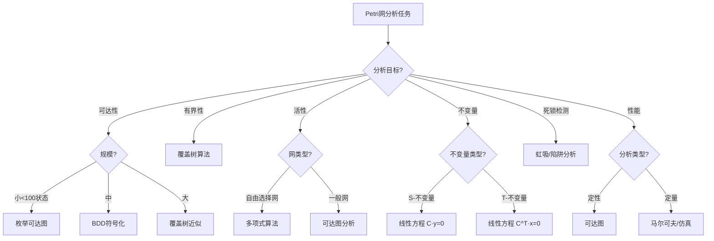
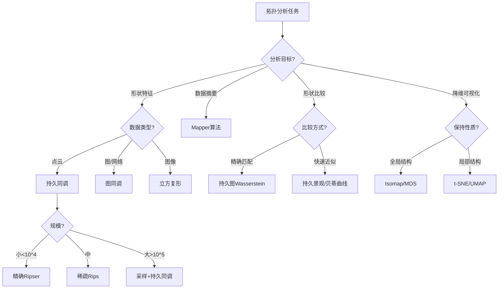
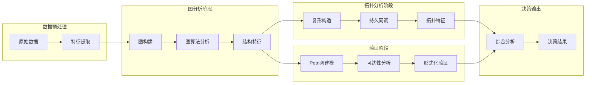

# 算法选择认知路径概述 / Algorithm Selection Cognitive Path Overview

## 📚 **概述 / Overview**

**文档目的**: 梳理在不同理论框架下选择算法的认知决策路径，提供系统化的算法选择指南和理论依据。

**核心内容**:

- 图算法选择逻辑
- Petri网算法选择逻辑
- 拓扑分析算法选择逻辑
- 跨理论算法组合策略

**适用对象**: 算法工程师、系统架构师、研究人员

---

## 📋 **目录 / Table of Contents**

- [算法选择认知路径概述 / Algorithm Selection Cognitive Path Overview](#算法选择认知路径概述--algorithm-selection-cognitive-path-overview)
  - [📚 **概述 / Overview**](#-概述--overview)
  - [📋 **目录 / Table of Contents**](#-目录--table-of-contents)
  - [🎯 **一、算法选择框架 / Part 1: Algorithm Selection Framework**](#-一算法选择框架--part-1-algorithm-selection-framework)
  - [📊 **二、图算法选择逻辑 / Part 2: Graph Algorithm Selection Logic**](#-二图算法选择逻辑--part-2-graph-algorithm-selection-logic)
  - [🔧 **三、Petri网算法选择逻辑 / Part 3: Petri Net Algorithm Selection Logic**](#-三petri网算法选择逻辑--part-3-petri-net-algorithm-selection-logic)
  - [🔬 **四、拓扑分析算法选择逻辑 / Part 4: Topological Analysis Algorithm Selection Logic**](#-四拓扑分析算法选择逻辑--part-4-topological-analysis-algorithm-selection-logic)
  - [🔗 **五、跨理论算法组合 / Part 5: Cross-Theory Algorithm Combination**](#-五跨理论算法组合--part-5-cross-theory-algorithm-combination)
  - [📚 **六、参考文档 / Part 6: Reference Documents**](#-六参考文档--part-6-reference-documents)

---

## 🎯 **一、算法选择框架 / Part 1: Algorithm Selection Framework**

### 1.1 选择维度

| 维度 | 说明 | 关键问题 |
|------|------|----------|
| **问题类型** | 分析目标是什么 | 验证/检测/优化/预测？ |
| **数据规模** | 数据量级 | 节点数/边数/状态数？ |
| **实时性** | 时间约束 | 离线/在线/流式？ |
| **精度要求** | 结果精度 | 精确/近似？ |
| **资源约束** | 计算资源 | 内存/CPU/分布式？ |

### 1.2 通用选择流程



---

## 📊 **二、图算法选择逻辑 / Part 2: Graph Algorithm Selection Logic**

### 2.1 按问题类型选择

| 问题类型 | 小规模算法 | 大规模算法 | 流式算法 |
|----------|------------|------------|----------|
| **最短路径** | Dijkstra/BFS | A*/双向搜索 | 增量Dijkstra |
| **连通性** | DFS/BFS | Union-Find | 增量连通 |
| **中心性** | 精确计算 | 近似采样 | 增量更新 |
| **社区检测** | 精确模块度 | Louvain/LPA | 流式Louvain |
| **图匹配** | 精确子图同构 | 近似匹配 | 流式模式匹配 |
| **PageRank** | 幂迭代 | 分布式PR | 增量PR |

### 2.2 图算法决策树

```mermaid
graph TD
    A[图分析任务] --> B{分析目标?}

    B -- 路径问题 --> C{边权重?}
    C -- 无权/等权 --> C1[BFS]
    C -- 正权 --> C2[Dijkstra]
    C -- 负权 --> C3[Bellman-Ford]
    C -- 所有对 --> C4[Floyd-Warshall/Johnson]

    B -- 中心性 --> D{中心性类型?}
    D -- 度中心性 --> D1[直接计算 O(n)]
    D -- 介数中心性 --> D2{规模?}
    D2 -- 小 --> D3[Brandes O(nm)]
    D2 -- 大 --> D4[采样近似]
    D -- PageRank --> D5[幂迭代]

    B -- 社区检测 --> E{规模?}
    E -- 小<10^4 --> E1[精确模块度]
    E -- 中 --> E2[Louvain]
    E -- 大>10^6 --> E3[标签传播LPA]

    B -- 连通分量 --> F[DFS/Union-Find]

    B -- 图嵌入 --> G{目标?}
    G -- 结构保持 --> G1[DeepWalk/Node2Vec]
    G -- 属性保持 --> G2[GraphSAGE/GAT]
    G -- 端到端 --> G3[GCN/GNN]
```

### 2.3 图算法复杂度参考

| 算法 | 时间复杂度 | 空间复杂度 | 适用规模 |
|------|------------|------------|----------|
| BFS/DFS | O(V+E) | O(V) | 任意 |
| Dijkstra | O((V+E)logV) | O(V) | 中小 |
| Bellman-Ford | O(VE) | O(V) | 小 |
| Floyd-Warshall | O(V³) | O(V²) | 小 |
| Brandes(介数) | O(VE) | O(V+E) | 中小 |
| Louvain | O(nlogn) | O(n) | 大 |
| PageRank | O(kE) | O(V) | 任意 |

---

## 🔧 **三、Petri网算法选择逻辑 / Part 3: Petri Net Algorithm Selection Logic**

### 3.1 按分析目标选择

| 分析目标 | 推荐算法 | 复杂度 | 适用范围 |
|----------|----------|--------|----------|
| **可达性** | 可达图构建 | 指数 | 小规模 |
| **有界性** | 覆盖树 | 指数 | 中小规模 |
| **活性** | 可达图+活性检测 | 指数 | 小规模 |
| **不变量** | 线性方程求解 | 多项式 | 任意 |
| **死锁检测** | 虹吸/陷阱分析 | 多项式 | 任意 |
| **性能分析** | 仿真/马尔可夫分析 | - | 任意 |

### 3.2 Petri网算法决策树



### 3.3 状态空间爆炸应对策略

| 策略 | 方法 | 适用场景 |
|------|------|----------|
| **符号化** | BDD/OBDD表示 | 规则结构 |
| **偏序规约** | 剪枝等价路径 | 并发系统 |
| **对称性** | 利用网对称性 | 对称网 |
| **抽象** | 简化网结构 | 大规模网 |
| **组合** | 分解+组合验证 | 模块化系统 |

---

## 🔬 **四、拓扑分析算法选择逻辑 / Part 4: Topological Analysis Algorithm Selection Logic**

### 4.1 按分析目标选择

| 分析目标 | 推荐算法 | 复杂度 | 适用范围 |
|----------|----------|--------|----------|
| **持久同调** | Ripser/GUDHI | O(n³)~O(n^ω) | 中小规模 |
| **贝蒂数** | 矩阵约化 | O(n³) | 中小规模 |
| **Mapper** | Mapper算法 | O(n²)~O(nlogn) | 中大规模 |
| **持久图匹配** | Wasserstein距离 | O(n³) | 小规模 |
| **流形学习** | Isomap/t-SNE/UMAP | O(n²)~O(n³) | 中规模 |

### 4.2 拓扑算法决策树



### 4.3 复形构造选择

| 构造方法 | 复杂度 | 优点 | 缺点 |
|----------|--------|------|------|
| **Vietoris-Rips** | O(n²)~O(2^n) | 简单直观 | 规模敏感 |
| **Čech复形** | O(n²)~O(2^n) | 理论精确 | 计算昂贵 |
| **Alpha复形** | O(n^⌈d/2⌉) | 高效 | 维度敏感 |
| **Witness复形** | O(kn²) | 可扩展 | 近似 |
| **稀疏Rips** | O(n) | 快速 | 近似 |

---

## 🔗 **五、跨理论算法组合 / Part 5: Cross-Theory Algorithm Combination**

### 5.1 组合策略

| 组合模式 | 算法组合 | 应用场景 |
|----------|----------|----------|
| **图→Petri网** | 图构建→状态机转换→可达性分析 | 协议验证 |
| **图→拓扑** | 图构建→图同调→持久同调 | 网络异常检测 |
| **Petri网→图** | Petri网展开→可达图→图分析 | 状态空间分析 |
| **拓扑→图** | 持久同调→持久图→图匹配 | 形状比较 |

### 5.2 典型组合流水线



### 5.3 算法选择总结表

| 场景 | 首选算法 | 备选算法 | 组合策略 |
|------|----------|----------|----------|
| **协议验证** | Petri网可达图 | TLA+模型检验 | - |
| **大规模网络分析** | Louvain+增量算法 | GraphX分布式 | 图→采样→分析 |
| **异常检测** | 持久同调 | 图中心性 | 图→拓扑→检测 |
| **系统建模** | Petri网 | 状态机 | Petri网→仿真→验证 |
| **形状分析** | Ripser持久同调 | Mapper | 采样→复形→同调 |

---

## 📚 **六、参考文档 / Part 6: Reference Documents**

### 6.1 相关文档

- [应用模式归纳概述](../00-应用模式归纳概述.md)
- [理论应用对比分析](../06-理论应用对比分析/00-理论应用对比分析概述.md)
- [决策逻辑图谱](../../12-理论关系与认知框架/决策逻辑图谱/)

### 6.2 工具参考

- 图算法: NetworkX, igraph, PyG, DGL, GraphX
- Petri网: CPN Tools, TLA+, Spin, GreatSPN
- 拓扑分析: GUDHI, Ripser, giotto-tda, KeplerMapper

---

**文档版本**: v1.0
**创建时间**: 2025年1月
**最后更新**: 2025年1月
**状态**: ✅ 完成
**维护者**: GraphNetWorkCommunicate项目组
