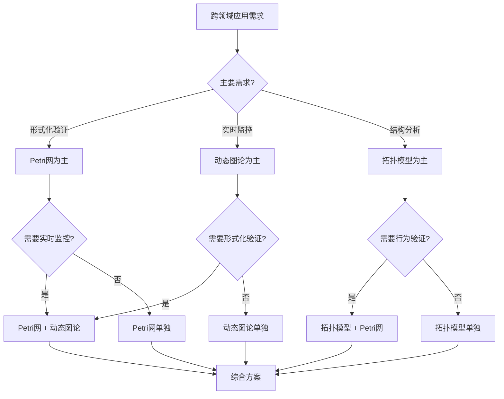

# 跨领域应用模式综合 / Cross-Domain Application Patterns Synthesis

## 📚 **概述 / Overview**

**文档目的**: 综合归纳三大理论（Petri网、动态图论、拓扑模型）在不同领域的应用模式，揭示跨领域的通用模式和组合策略。

**适用对象**: 系统架构师、跨领域研究人员、技术决策者

---

## 🎯 **一、跨领域模式识别 / Part 1: Cross-Domain Pattern Recognition**

### 1.1 通用应用模式

| 模式类型 | Petri网应用 | 动态图论应用 | 拓扑模型应用 | 跨领域共性 |
|---------|------------|-------------|-------------|-----------|
| **死锁/阻塞检测** | 操作系统、分布式系统 | 锁依赖图、服务依赖 | 循环结构检测 | 检测系统阻塞状态 |
| **资源管理** | 操作系统、AI基础设施 | 资源竞争追踪 | 资源分布分析 | 资源分配和监控 |
| **协议验证** | 分布式系统、网络安全 | 协议状态追踪 | 协议形状分析 | 协议正确性保证 |
| **异常检测** | 系统状态异常 | 图结构异常 | 拓扑形状异常 | 识别异常模式 |
| **性能分析** | 系统吞吐量 | 图流量分析 | 性能分布分析 | 系统性能优化 |

### 1.2 领域间模式映射

**操作系统 ↔ 分布式系统**:

- 死锁检测 → 共识协议验证
- 锁依赖图 → 服务依赖图
- 资源管理 → 副本管理

**网络安全 ↔ 区块链**:

- 攻击图分析 → 交易图分析
- 协议验证 → 智能合约验证
- 异常检测 → 异常交易检测

**AI基础设施 ↔ 社会网络**:

- 数据流追踪 → 信息传播追踪
- 模型依赖 → 社交关系
- 性能监控 → 影响力分析

---

## 🔧 **二、理论组合策略 / Part 2: Theory Combination Strategies**

### 2.1 Petri网 + 动态图论组合

**组合模式**:

```text
Petri网建模 → 形式化验证 → 动态图监控 → 实时分析
```

**应用场景**:

1. **协议验证 + 实时监控**
   - 使用Petri网验证协议正确性
   - 使用动态图论进行实时监控
   - 结合两者进行完整分析

2. **系统建模 + 依赖追踪**
   - 使用Petri网建模系统行为
   - 使用动态图论追踪依赖关系
   - 验证模型与实际系统的一致性

**实现示例**:

```python
class CombinedAnalyzer:
    def __init__(self):
        self.petri_net_model = None
        self.dynamic_graph = None

    def verify_and_monitor(self, system_spec):
        """
        验证并监控系统
        """
        # 1. Petri网建模和验证
        self.petri_net_model = self._build_petri_net(system_spec)
        verification_result = self._verify_petri_net(self.petri_net_model)

        # 2. 动态图监控
        self.dynamic_graph = self._build_dynamic_graph(system_spec)
        monitoring_result = self._monitor_dynamic_graph(self.dynamic_graph)

        # 3. 综合分析
        return self._synthesize_results(verification_result, monitoring_result)
```

### 2.2 Petri网 + 拓扑模型组合

**组合模式**:

```text
Petri网建模 → 状态空间分析 → 拓扑特征提取 → 形状分析
```

**应用场景**:

1. **系统验证 + 结构分析**
   - 使用Petri网验证系统行为
   - 使用拓扑模型分析系统结构
   - 检测结构异常

2. **性能分析 + 分布分析**
   - 使用Petri网进行性能分析
   - 使用拓扑模型分析性能分布
   - 识别性能瓶颈

### 2.3 动态图论 + 拓扑模型组合

**组合模式**:

```text
动态图构建 → 图分析 → 拓扑特征提取 → 形状分析
```

**应用场景**:

1. **网络分析 + 形状检测**
   - 使用动态图论分析网络结构
   - 使用拓扑模型检测网络形状
   - 识别网络异常

2. **数据流分析 + 分布分析**
   - 使用动态图论追踪数据流
   - 使用拓扑模型分析数据分布
   - 检测数据漂移

---

## 📊 **三、跨领域应用案例 / Part 3: Cross-Domain Application Cases**

### 3.1 案例1：微服务系统综合分析

**问题描述**:

- 需要验证微服务系统的正确性
- 需要实时监控服务依赖
- 需要检测系统异常

**解决方案**:

```text
1. Petri网建模：建模服务调用协议
   - 验证服务调用的正确性
   - 检测死锁和阻塞

2. 动态图论：构建服务依赖图
   - 实时追踪服务调用关系
   - 分析服务依赖链

3. 拓扑模型：分析系统拓扑结构
   - 检测系统拓扑异常
   - 识别关键服务节点
```

**实现流程**:

```python
class MicroserviceAnalyzer:
    def __init__(self):
        self.petri_net = ServiceCallPetriNet()
        self.dependency_graph = ServiceDependencyGraph()
        self.topology_analyzer = SystemTopologyAnalyzer()

    def analyze_microservices(self, service_spec):
        """
        综合分析微服务系统
        """
        # 1. Petri网验证
        petri_result = self.petri_net.verify_service_calls(service_spec)

        # 2. 动态图监控
        graph_result = self.dependency_graph.track_dependencies(service_spec)

        # 3. 拓扑分析
        topology_result = self.topology_analyzer.analyze_topology(service_spec)

        # 4. 综合报告
        return {
            'verification': petri_result,
            'monitoring': graph_result,
            'topology': topology_result,
            'recommendations': self._generate_recommendations(
                petri_result, graph_result, topology_result
            )
        }
```

### 3.2 案例2：区块链系统综合验证

**问题描述**:

- 需要验证共识协议的正确性
- 需要分析交易网络结构
- 需要检测异常交易

**解决方案**:

```text
1. Petri网建模：建模共识协议
   - 验证共识协议的安全性
   - 检测分叉和双花

2. 动态图论：构建交易网络图
   - 追踪交易关系
   - 分析资金流

3. 拓扑模型：分析交易网络拓扑
   - 检测交易网络异常
   - 识别异常交易模式
```

### 3.3 案例3：AI训练系统综合监控

**问题描述**:

- 需要验证训练流水线的正确性
- 需要监控数据流和模型依赖
- 需要检测数据漂移

**解决方案**:

```text
1. Petri网建模：建模训练流水线
   - 验证流水线的无死锁性
   - 检测资源泄漏

2. 动态图论：构建数据流图
   - 追踪数据流路径
   - 分析模型依赖关系

3. 拓扑模型：分析数据分布
   - 检测数据漂移
   - 识别异常数据模式
```

---

## 🔬 **四、模式选择决策框架 / Part 4: Pattern Selection Decision Framework**

### 4.1 决策树



### 4.2 选择矩阵

| 需求组合 | 推荐理论组合 | 理由 |
|---------|------------|------|
| 验证 + 监控 | Petri网 + 动态图论 | 验证正确性，监控实时性 |
| 验证 + 结构 | Petri网 + 拓扑模型 | 验证行为，分析结构 |
| 监控 + 结构 | 动态图论 + 拓扑模型 | 实时监控，结构分析 |
| 验证 + 监控 + 结构 | 三大理论组合 | 完整分析 |

---

## 💡 **五、最佳实践建议 / Part 5: Best Practice Recommendations**

### 5.1 组合使用原则

1. **明确目标**: 明确每个理论的使用目标
2. **分工明确**: 不同理论负责不同方面
3. **结果整合**: 综合各理论的分析结果

### 5.2 实施建议

1. **分阶段实施**: 先实施核心理论，再添加辅助理论
2. **工具集成**: 使用统一的工具链
3. **结果验证**: 交叉验证不同理论的结果

---

## 📚 **六、参考文档 / Part 6: Reference Documents**

### 6.1 相关文档

- [应用模式归纳概述](./00-应用模式归纳概述.md)
- [理论应用对比分析概述](./06-理论应用对比分析/00-理论应用对比分析概述.md)
- [算法选择认知路径概述](./07-算法选择认知路径/00-算法选择认知路径概述.md)

### 6.2 领域文档

- [操作系统应用模式清单](./01-操作系统应用模式/操作系统应用模式清单.md)
- [分布式系统应用模式清单](./02-分布式系统应用模式/分布式系统应用模式清单.md)
- [AI基础设施应用模式清单](./03-AI基础设施应用模式/AI基础设施应用模式清单.md)

---

**文档版本**: v1.0
**创建时间**: 2025年1月
**最后更新**: 2025年1月
**状态**: ✅ 完成
**维护者**: GraphNetWorkCommunicate项目组
