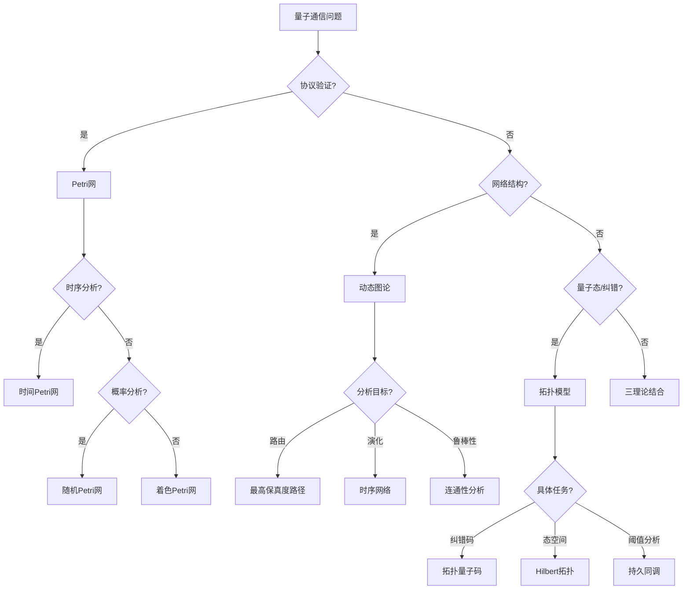

# 量子通信应用模式清单 / Quantum Communication Application Patterns

## 📚 **概述 / Overview**

**文档目的**: 归纳Petri网理论、动态图论、拓扑模型在量子通信领域的应用模式，为量子密钥分发、量子网络路由、量子纠错等场景提供理论选择和分析方法指南。

**核心内容**:

- 量子通信领域的核心问题
- 三大理论的应用场景
- 模型选择决策树
- 典型案例与工具栈

**适用对象**: 量子通信研究者、量子网络工程师、量子协议设计师

---

## 📋 **目录 / Table of Contents**

- [量子通信应用模式清单 / Quantum Communication Application Patterns](#量子通信应用模式清单--quantum-communication-application-patterns)
  - [📚 **概述 / Overview**](#-概述--overview)
  - [📋 **目录 / Table of Contents**](#-目录--table-of-contents)
  - [🎯 **一、核心问题域 / Part 1: Core Problem Domains**](#-一核心问题域--part-1-core-problem-domains)
  - [🔬 **二、理论应用模式 / Part 2: Theory Application Patterns**](#-二理论应用模式--part-2-theory-application-patterns)
  - [📊 **三、决策树 / Part 3: Decision Tree**](#-三决策树--part-3-decision-tree)
  - [💡 **四、典型案例 / Part 4: Typical Cases**](#-四典型案例--part-4-typical-cases)
  - [🛠️ **五、工具栈 / Part 5: Tool Stack**](#️-五工具栈--part-5-tool-stack)
  - [📚 **六、参考文档 / Part 6: Reference Documents**](#-六参考文档--part-6-reference-documents)

---

## 🎯 **一、核心问题域 / Part 1: Core Problem Domains**

### 1.1 量子通信核心问题

| 问题类型 | 具体问题 | 挑战 |
|---------|---------|------|
| **量子密钥分发(QKD)** | 密钥安全性验证、窃听检测 | 协议正确性、安全性证明 |
| **量子网络路由** | 量子比特传输、纠缠分发 | 退相干、保真度衰减 |
| **量子纠错** | 错误检测与纠正 | 高维状态空间、实时纠错 |
| **量子中继** | 纠缠交换、纠缠纯化 | 多跳传输、端到端保真度 |
| **量子协议验证** | 协议安全性、正确性 | 量子状态不可克隆 |

### 1.2 问题特征分析

| 特征 | 描述 | 理论适配 |
|------|------|----------|
| **状态空间** | 量子态叠加、纠缠 | 拓扑模型（高维结构） |
| **协议建模** | 离散步骤、并发操作 | Petri网（形式化验证） |
| **网络结构** | 量子节点、量子信道 | 动态图论（拓扑分析） |
| **概率性** | 测量概率、退相干 | 随机Petri网 |

---

## 🔬 **二、理论应用模式 / Part 2: Theory Application Patterns**

### 2.1 Petri网应用模式

| 应用场景 | 建模方法 | 分析目标 |
|---------|---------|---------|
| **QKD协议建模** | 着色Petri网 | 协议正确性、死锁检测 |
| **量子门操作序列** | 时间Petri网 | 时序验证、并发控制 |
| **量子中继协议** | 层次Petri网 | 端到端可达性 |
| **纠缠分发** | 随机Petri网 | 成功概率分析 |

**Petri网建模示例（BB84协议）**:

```
BB84协议Petri网模型
│
├─── 库所
│    ├─── Alice_ready: Alice准备发送
│    ├─── Channel: 量子信道
│    ├─── Bob_receive: Bob接收状态
│    └─── Key_shared: 密钥共享完成
│
├─── 变迁
│    ├─── prepare: Alice准备量子比特
│    ├─── send: 量子比特发送
│    ├─── measure: Bob测量
│    └─── sift: 基矢筛选
│
└─── 分析
     ├─── 活性: 协议能否完成
     ├─── 安全性: 窃听检测能力
     └─── 有界性: 资源使用有限
```

### 2.2 动态图论应用模式

| 应用场景 | 建模方法 | 分析目标 |
|---------|---------|---------|
| **量子网络拓扑** | 时序网络 | 路径可达性、网络演化 |
| **纠缠图分析** | 加权图 | 纠缠度量、路由选择 |
| **量子互联网** | 多层网络 | 物理层+逻辑层映射 |
| **退相干追踪** | 动态图 | 保真度演化 |

**动态图建模示例（量子网络）**:

```
量子网络图模型 G = (V, E, W)
│
├─── 节点V
│    ├─── 量子终端节点
│    ├─── 量子中继节点
│    └─── 量子交换节点
│
├─── 边E
│    ├─── 量子信道（光纤/自由空间）
│    └─── 经典信道（控制通信）
│
├─── 权重W
│    ├─── 纠缠保真度
│    ├─── 传输损耗
│    └─── 操作成功率
│
└─── 分析
     ├─── 最高保真度路径
     ├─── 网络连通性
     └─── 故障容错能力
```

### 2.3 拓扑模型应用模式

| 应用场景 | 建模方法 | 分析目标 |
|---------|---------|---------|
| **量子纠错码** | 拓扑量子码 | 码距、纠错能力 |
| **量子态空间** | 希尔伯特空间拓扑 | 状态演化轨迹 |
| **错误阈值分析** | 持久同调 | 稳定结构识别 |
| **量子态分类** | 拓扑不变量 | 纠缠类型分类 |

**拓扑建模示例（表面码）**:

```
表面码拓扑结构
│
├─── 胞腔复形
│    ├─── 0-胞腔: 数据量子比特位置
│    ├─── 1-胞腔: 稳定子生成元
│    └─── 2-胞腔: 平面区域
│
├─── 同调分析
│    ├─── H₀: 连通分量（逻辑量子比特数）
│    ├─── H₁: 循环结构（编码空间维度）
│    └─── 边界算子: 稳定子测量
│
└─── 纠错
     ├─── 综合征提取 → 边缘检测
     ├─── 错误定位 → 同调类匹配
     └─── 纠正操作 → 最小权重匹配
```

---

## 📊 **三、决策树 / Part 3: Decision Tree**

### 3.1 文本决策树

```
量子通信问题
│
├─── 是否需要协议验证？
│    │
│    ├─── 是 → Petri网
│    │    │
│    │    ├─── 需要时序分析？ → 时间Petri网
│    │    ├─── 需要概率分析？ → 随机Petri网
│    │    └─── 需要层次抽象？ → 着色Petri网
│    │
│    └─── 否 → 继续判断
│
├─── 是否关注网络结构？
│    │
│    ├─── 是 → 动态图论
│    │    │
│    │    ├─── 关注路由？ → 最短路径/最高保真度路径
│    │    ├─── 关注演化？ → 时序网络分析
│    │    └─── 关注鲁棒性？ → 图连通性分析
│    │
│    └─── 否 → 继续判断
│
└─── 是否关注量子态/纠错？
     │
     ├─── 是 → 拓扑模型
     │    │
     │    ├─── 纠错码设计？ → 拓扑量子码
     │    ├─── 态空间分析？ → 希尔伯特空间拓扑
     │    └─── 错误阈值？ → 持久同调
     │
     └─── 综合问题 → 三理论结合
```

### 3.2 Mermaid决策树



---

## 💡 **四、典型案例 / Part 4: Typical Cases**

### 4.1 案例1：QKD协议形式化验证

**问题**: 验证BB84量子密钥分发协议的安全性

**理论选择**: Petri网 + 形式化验证

**实现方案**:

```
1. 建模阶段
   - 使用着色Petri网建模协议步骤
   - 量子比特状态作为令牌颜色
   - 测量基选择作为变迁条件

2. 验证阶段
   - 可达性分析: 验证密钥共享可达
   - 活性分析: 验证协议不会死锁
   - 安全性分析: 验证窃听可检测

3. 工具链
   - CPN Tools: 协议建模
   - SPIN/NuSMV: 模型检测
   - ProVerif: 安全性证明
```

### 4.2 案例2：量子网络路由优化

**问题**: 在量子互联网中找到最高保真度的纠缠分发路径

**理论选择**: 动态图论

**实现方案**:

```
1. 网络建模
   - 节点: 量子终端、中继器
   - 边: 量子信道
   - 权重: 纠缠保真度（随时间衰减）

2. 路由算法
   - 目标: 最大化端到端保真度
   - 方法: 改进Dijkstra（乘法代价）
   - 约束: 中继器容量、纠缠生存时间

3. 分析方法
   - 保真度演化追踪
   - 网络瓶颈识别
   - 备用路径计算
```

### 4.3 案例3：表面码纠错分析

**问题**: 分析表面码的纠错阈值和错误恢复能力

**理论选择**: 拓扑模型

**实现方案**:

```
1. 拓扑建模
   - 表面码 → 2D格点复形
   - 数据量子比特 → 边
   - 稳定子 → 面/顶点

2. 错误分析
   - 错误 → 1-链（边的子集）
   - 综合征 → 0-链（边界）
   - 解码 → 同调类推断

3. 阈值计算
   - 持久同调分析错误传播
   - Monte Carlo模拟错误阈值
   - 贝蒂数监控码空间
```

---

## 🛠️ **五、工具栈 / Part 5: Tool Stack**

### 5.1 Petri网工具

| 工具 | 用途 | 量子通信应用 |
|------|------|-------------|
| **CPN Tools** | 着色Petri网建模 | QKD协议建模 |
| **PIPE** | P/T网分析 | 简单协议验证 |
| **GreatSPN** | 随机Petri网 | 概率协议分析 |
| **ProVerif** | 安全协议验证 | QKD安全性证明 |

### 5.2 动态图工具

| 工具 | 用途 | 量子通信应用 |
|------|------|-------------|
| **NetworkX** | 图算法 | 量子网络拓扑分析 |
| **igraph** | 大规模图处理 | 量子互联网建模 |
| **QuTiP** | 量子系统仿真 | 量子态演化 |
| **Qiskit** | 量子计算框架 | 量子电路设计 |

### 5.3 拓扑分析工具

| 工具 | 用途 | 量子通信应用 |
|------|------|-------------|
| **GUDHI** | 持久同调 | 错误阈值分析 |
| **Ripser** | 快速持久同调 | 大规模码分析 |
| **Stim** | 稳定子仿真 | 表面码仿真 |
| **PyMatching** | 最小权重匹配 | 错误解码 |

---

## 📚 **六、参考文档 / Part 6: Reference Documents**

### 6.1 模块内文档

- [量子通信模块README](../../05-量子通信/README.md)
- [量子密钥分发](../../05-量子通信/02-量子密钥分发.md)
- [量子网络与路由](../../05-量子通信/03-量子网络与路由.md)

### 6.2 相关理论文档

- [量子通信模块理论关系梳理](../../12-理论关系与认知框架/01-理论逻辑脉络/08-量子通信模块理论关系梳理.md)
- [Petri网理论逻辑脉络](../../12-理论关系与认知框架/01-理论逻辑脉络/01-Petri网理论逻辑脉络.md)
- [拓扑模型逻辑脉络](../../12-理论关系与认知框架/01-理论逻辑脉络/03-拓扑模型逻辑脉络.md)

### 6.3 其他应用模式文档

- [网络安全应用模式清单](../04-网络安全应用模式/网络安全应用模式清单.md)
- [分布式系统应用模式清单](../02-分布式系统应用模式/分布式系统应用模式清单.md)

---

**文档版本**: v1.0
**创建时间**: 2025年1月
**最后更新**: 2025年1月
**状态**: ✅ 完成
**维护者**: GraphNetWorkCommunicate项目组
