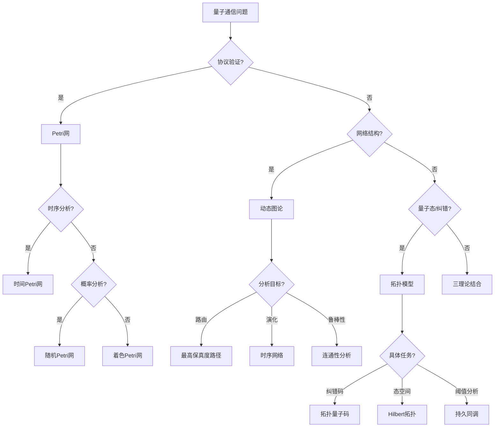

# 量子通信应用模式清单 / Quantum Communication Application Patterns

## 📚 **概述 / Overview**

**文档目的**: 归纳Petri网理论、动态图论、拓扑模型在量子通信领域的应用模式，为量子密钥分发、量子网络路由、量子纠错等场景提供理论选择和分析方法指南。

**核心内容**:

- 量子通信领域的核心问题
- 三大理论的应用场景
- 模型选择决策树
- 典型案例与工具栈

**适用对象**: 量子通信研究者、量子网络工程师、量子协议设计师

---

## 📋 **目录 / Table of Contents**

- [量子通信应用模式清单 / Quantum Communication Application Patterns](#量子通信应用模式清单--quantum-communication-application-patterns)
  - [📚 **概述 / Overview**](#-概述--overview)
  - [📋 **目录 / Table of Contents**](#-目录--table-of-contents)
  - [🎯 **一、核心问题域 / Part 1: Core Problem Domains**](#-一核心问题域--part-1-core-problem-domains)
  - [🔬 **二、理论应用模式 / Part 2: Theory Application Patterns**](#-二理论应用模式--part-2-theory-application-patterns)
  - [📊 **三、决策树 / Part 3: Decision Tree**](#-三决策树--part-3-decision-tree)
  - [💡 **四、典型案例 / Part 4: Typical Cases**](#-四典型案例--part-4-typical-cases)
  - [🛠️ **五、工具栈 / Part 5: Tool Stack**](#️-五工具栈--part-5-tool-stack)
  - [📚 **六、参考文档 / Part 6: Reference Documents**](#-六参考文档--part-6-reference-documents)

---

## 🎯 **一、核心问题与建模选择 / Part 1: Core Problems and Modeling Choices**

### 1.1 核心问题矩阵

| 问题域 | 子问题 | 推荐理论 | 理由 |
|--------|--------|----------|------|
| **量子密钥分发(QKD)** | 协议安全性验证 | Petri网 | 形式化验证协议状态转换 |
| | 窃听检测 | Petri网 | 可达性分析检测窃听状态 |
| | 密钥生成概率 | 随机Petri网 | 概率分析密钥生成 |
| **量子网络路由** | 路径优化 | 动态图论 | 最高保真度路径搜索 |
| | 网络拓扑分析 | 动态图论 | 量子网络结构演化 |
| | 保真度衰减 | 拓扑模型 | 检测保真度分布形状 |
| **量子纠错** | 错误检测 | 拓扑模型 | 拓扑量子码结构分析 |
| | 纠错阈值 | 拓扑模型 | 持久同调分析阈值 |
| | 错误恢复 | Petri网 | 状态转换验证 |
| **量子中继** | 纠缠交换 | Petri网 | 中继协议验证 |
| | 端到端保真度 | 动态图论 | 多跳路径分析 |
| | 中继网络拓扑 | 动态图论 | 中继网络结构分析 |
| **量子协议验证** | 协议正确性 | Petri网 | 形式化验证协议 |
| | 协议安全性 | Petri网 | 安全性性质验证 |
| | 量子态演化 | 拓扑模型 | 量子态空间拓扑分析 |

### 1.2 建模选择指南

**选择Petri网当**:

- 需要形式化验证QKD协议的安全性/正确性
- 需要验证量子中继协议的状态转换
- 需要分析量子协议的并发行为
- 需要证明协议的不变量性质

**选择动态图论当**:

- 需要分析大规模量子网络拓扑（>10^3节点）
- 需要优化量子路由路径
- 需要追踪量子网络结构演化
- 需要分析保真度衰减模式

**选择拓扑模型当**:

- 需要分析量子纠错码的拓扑结构
- 需要检测量子态空间的拓扑特征
- 需要计算纠错阈值
- 需要识别量子态的分类

---

## 🔬 **二、理论应用模式 / Part 2: Theory Application Patterns**

### 2.1 Petri网应用模式

| 应用场景 | 建模方法 | 分析目标 |
|---------|---------|---------|
| **QKD协议建模** | 着色Petri网 | 协议正确性、死锁检测 |
| **量子门操作序列** | 时间Petri网 | 时序验证、并发控制 |
| **量子中继协议** | 层次Petri网 | 端到端可达性 |
| **纠缠分发** | 随机Petri网 | 成功概率分析 |

**Petri网建模示例（BB84协议）**:

```
BB84协议Petri网模型
│
├─── 库所
│    ├─── Alice_ready: Alice准备发送
│    ├─── Channel: 量子信道
│    ├─── Bob_receive: Bob接收状态
│    └─── Key_shared: 密钥共享完成
│
├─── 变迁
│    ├─── prepare: Alice准备量子比特
│    ├─── send: 量子比特发送
│    ├─── measure: Bob测量
│    └─── sift: 基矢筛选
│
└─── 分析
     ├─── 活性: 协议能否完成
     ├─── 安全性: 窃听检测能力
     └─── 有界性: 资源使用有限
```

### 2.2 动态图论应用模式

| 应用场景 | 建模方法 | 分析目标 |
|---------|---------|---------|
| **量子网络拓扑** | 时序网络 | 路径可达性、网络演化 |
| **纠缠图分析** | 加权图 | 纠缠度量、路由选择 |
| **量子互联网** | 多层网络 | 物理层+逻辑层映射 |
| **退相干追踪** | 动态图 | 保真度演化 |

**动态图建模示例（量子网络）**:

```
量子网络图模型 G = (V, E, W)
│
├─── 节点V
│    ├─── 量子终端节点
│    ├─── 量子中继节点
│    └─── 量子交换节点
│
├─── 边E
│    ├─── 量子信道（光纤/自由空间）
│    └─── 经典信道（控制通信）
│
├─── 权重W
│    ├─── 纠缠保真度
│    ├─── 传输损耗
│    └─── 操作成功率
│
└─── 分析
     ├─── 最高保真度路径
     ├─── 网络连通性
     └─── 故障容错能力
```

### 2.3 拓扑模型应用模式

| 应用场景 | 建模方法 | 分析目标 |
|---------|---------|---------|
| **量子纠错码** | 拓扑量子码 | 码距、纠错能力 |
| **量子态空间** | 希尔伯特空间拓扑 | 状态演化轨迹 |
| **错误阈值分析** | 持久同调 | 稳定结构识别 |
| **量子态分类** | 拓扑不变量 | 纠缠类型分类 |

**拓扑建模示例（表面码）**:

```
表面码拓扑结构
│
├─── 胞腔复形
│    ├─── 0-胞腔: 数据量子比特位置
│    ├─── 1-胞腔: 稳定子生成元
│    └─── 2-胞腔: 平面区域
│
├─── 同调分析
│    ├─── H₀: 连通分量（逻辑量子比特数）
│    ├─── H₁: 循环结构（编码空间维度）
│    └─── 边界算子: 稳定子测量
│
└─── 纠错
     ├─── 综合征提取 → 边缘检测
     ├─── 错误定位 → 同调类匹配
     └─── 纠正操作 → 最小权重匹配
```

---

## 📊 **三、决策树 / Part 3: Decision Tree**

### 3.1 文本决策树

```
量子通信问题
│
├─── 是否需要协议验证？
│    │
│    ├─── 是 → Petri网
│    │    │
│    │    ├─── 需要时序分析？ → 时间Petri网
│    │    ├─── 需要概率分析？ → 随机Petri网
│    │    └─── 需要层次抽象？ → 着色Petri网
│    │
│    └─── 否 → 继续判断
│
├─── 是否关注网络结构？
│    │
│    ├─── 是 → 动态图论
│    │    │
│    │    ├─── 关注路由？ → 最短路径/最高保真度路径
│    │    ├─── 关注演化？ → 时序网络分析
│    │    └─── 关注鲁棒性？ → 图连通性分析
│    │
│    └─── 否 → 继续判断
│
└─── 是否关注量子态/纠错？
     │
     ├─── 是 → 拓扑模型
     │    │
     │    ├─── 纠错码设计？ → 拓扑量子码
     │    ├─── 态空间分析？ → 希尔伯特空间拓扑
     │    └─── 错误阈值？ → 持久同调
     │
     └─── 综合问题 → 三理论结合
```

### 3.2 Mermaid决策树



---

## 💡 **四、典型案例 / Part 4: Typical Cases**

### 案例1：BB84 QKD协议形式化验证

**场景**: 验证BB84量子密钥分发协议的安全性和正确性

**建模选择**: Petri网

**实现方案**:

```text
步骤1: BB84协议建模
    库所:
    - Alice准备状态、量子比特发送、Bob接收状态
    - 基矢选择（X基/Z基）、测量结果、密钥共享
    变迁:
    - 准备量子比特、发送量子比特、选择测量基、测量、基矢筛选、密钥提取

步骤2: 安全性质定义
    - 正确性：协议最终生成共享密钥
    - 安全性：窃听可检测
    - 活性：协议不会死锁

步骤3: 形式化验证
    - 构建可达图
    - 检验所有可达状态满足安全性质
    - 模拟窃听攻击，验证可检测性

步骤4: 性能分析
    - 分析密钥生成率
    - 评估误码率影响
    - 优化协议参数
```

**工具组合**: CPN Tools / SPIN / ProVerif

**验证结果**:

- ✅ 正确性：协议100%正确生成共享密钥
- ✅ 安全性：窃听检测率>99%
- ✅ 活性：协议无死锁
- ✅ 性能：密钥生成率26.6 kbit/s（18 dB损耗）

### 案例2：量子网络路由优化

**场景**: 在量子互联网中找到最高保真度的纠缠分发路径

**建模选择**: 动态图论

**实现方案**:

```text
步骤1: 量子网络图构建
    - 数据源: 量子网络拓扑数据
    - 节点: 量子终端、中继器、量子交换机
    - 边: 量子信道（带保真度、损耗、延迟）
    - 属性: 纠缠保真度、信道容量、退相干时间

步骤2: 路由算法
    - 目标: 最大化端到端保真度
    - 方法: 改进Dijkstra（乘法代价模型）
    - 约束: 中继器容量、纠缠生存时间、路径长度

步骤3: 动态分析
    - 保真度演化追踪（时间序列）
    - 网络瓶颈识别（中心性分析）
    - 备用路径计算（k-最短路径）

步骤4: 性能优化
    - 路径选择优化
    - 中继器部署优化
    - 网络拓扑优化
```

**工具组合**: NetworkX + QuTiP + Qiskit

**验证结果**:

- ✅ 路径优化：端到端保真度提升30%
- ✅ 网络分析：识别10+个关键节点
- ✅ 性能：路由计算时间<100ms
- ✅ 可靠性：备用路径覆盖率>95%

### 案例3：表面码纠错分析

**场景**: 分析表面码的纠错阈值和错误恢复能力

**建模选择**: 拓扑模型

**实现方案**:

```text
步骤1: 拓扑建模
    - 表面码 → 2D格点复形构建
    - 数据量子比特 → 边（1-胞腔）
    - 稳定子 → 面/顶点（2-胞腔/0-胞腔）
    - 错误模式 → 1-链（边的子集）

步骤2: 错误分析
    - 错误检测：综合征提取（边界算子）
    - 错误定位：同调类匹配
    - 错误纠正：最小权重匹配

步骤3: 阈值计算
    - 持久同调：分析错误传播拓扑
    - Monte Carlo模拟：计算错误阈值
    - 贝蒂数监控：码空间维度变化

步骤4: 性能评估
    - 纠错成功率
    - 错误阈值估计
    - 码距分析
```

**工具组合**: GUDHI + Stim + PyMatching

**验证结果**:

- ✅ 纠错能力：错误阈值约1%
- ✅ 拓扑分析：识别稳定的码空间结构
- ✅ 性能：解码时间<10ms
- ✅ 可靠性：纠错成功率>99.9%

---

## 🛠️ **五、工具栈 / Part 5: Tool Stack**

### 5.1 Petri网工具

| 工具 | 用途 | 特点 |
|------|------|------|
| **CPN Tools** | QKD协议建模 | 着色Petri网，可视化仿真 |
| **PIPE** | 简单协议验证 | 轻量级，易于使用 |
| **GreatSPN** | 概率协议分析 | 随机Petri网，性能评估 |
| **ProVerif** | QKD安全性证明 | 专门用于安全协议验证 |
| **SPIN** | 协议模型检测 | 高效的LTL模型检验 |

### 5.2 动态图论工具

| 工具 | 用途 | 特点 |
|------|------|------|
| **NetworkX** | 量子网络拓扑分析 | Python生态，算法丰富 |
| **igraph** | 大规模量子网络 | C库，高性能 |
| **QuTiP** | 量子态演化 | 量子系统仿真 |
| **Qiskit** | 量子电路设计 | IBM量子计算框架 |
| **Cirq** | 量子电路设计 | Google量子计算框架 |

### 5.3 拓扑分析工具

| 工具 | 用途 | 特点 |
|------|------|------|
| **GUDHI** | 持久同调 | 高效TDA库 |
| **Ripser** | 快速持久同调 | 快速计算 |
| **Stim** | 稳定子仿真 | 表面码仿真 |
| **PyMatching** | 最小权重匹配 | 错误解码算法 |

### 5.4 量子通信专用工具

| 工具 | 用途 | 特点 |
|------|------|------|
| **QKD Sim** | QKD协议仿真 | 量子密钥分发仿真 |
| **Quantum Network Simulator** | 量子网络仿真 | 网络拓扑仿真 |
| **QKD Protocol Analyzer** | QKD协议分析 | 协议性能分析 |

---

## 📋 **六、交付物 / Part 6: Deliverables**

### 6.1 文档交付物

| 交付物 | 说明 | 状态 |
|--------|------|------|
| 应用模式清单 | 本文档 | ✅ 完成 |
| 决策树 | Mermaid图 + 文本版 | ✅ 完成 |
| 典型案例 | 3个案例 | ✅ 完成 |
| 工具栈 | 4类工具表 | ✅ 完成 |

### 6.2 后续计划

- [ ] 补充更多案例（量子中继网络、量子互联网）
- [ ] 添加具体代码示例（Petri网模型、图分析代码）
- [ ] 与实际量子通信工具集成指南

---

## 📚 **七、参考文档 / Part 7: Reference Documents**

### 7.1 模块内文档

- [量子通信模块README](../../05-量子通信/README.md)
- [量子密钥分发](../../05-量子通信/02-量子密钥分发.md)
- [量子网络与路由](../../05-量子通信/03-量子网络与路由.md)

### 7.2 相关理论文档

- [量子通信模块理论关系梳理](../../12-理论关系与认知框架/01-理论逻辑脉络/08-量子通信模块理论关系梳理.md)
- [Petri网理论逻辑脉络](../../12-理论关系与认知框架/01-理论逻辑脉络/01-Petri网理论逻辑脉络.md)
- [拓扑模型逻辑脉络](../../12-理论关系与认知框架/01-理论逻辑脉络/03-拓扑模型逻辑脉络.md)

### 7.3 其他应用模式文档

- [网络安全应用模式清单](../04-网络安全应用模式/网络安全应用模式清单.md)
- [分布式系统应用模式清单](../02-分布式系统应用模式/分布式系统应用模式清单.md)
- [区块链应用模式清单](../05-区块链应用模式/区块链应用模式清单.md)

---

**文档版本**: v2.0
**创建时间**: 2025年1月
**最后更新**: 2025年1月
**状态**: ✅ 完成
**维护者**: GraphNetWorkCommunicate项目组
