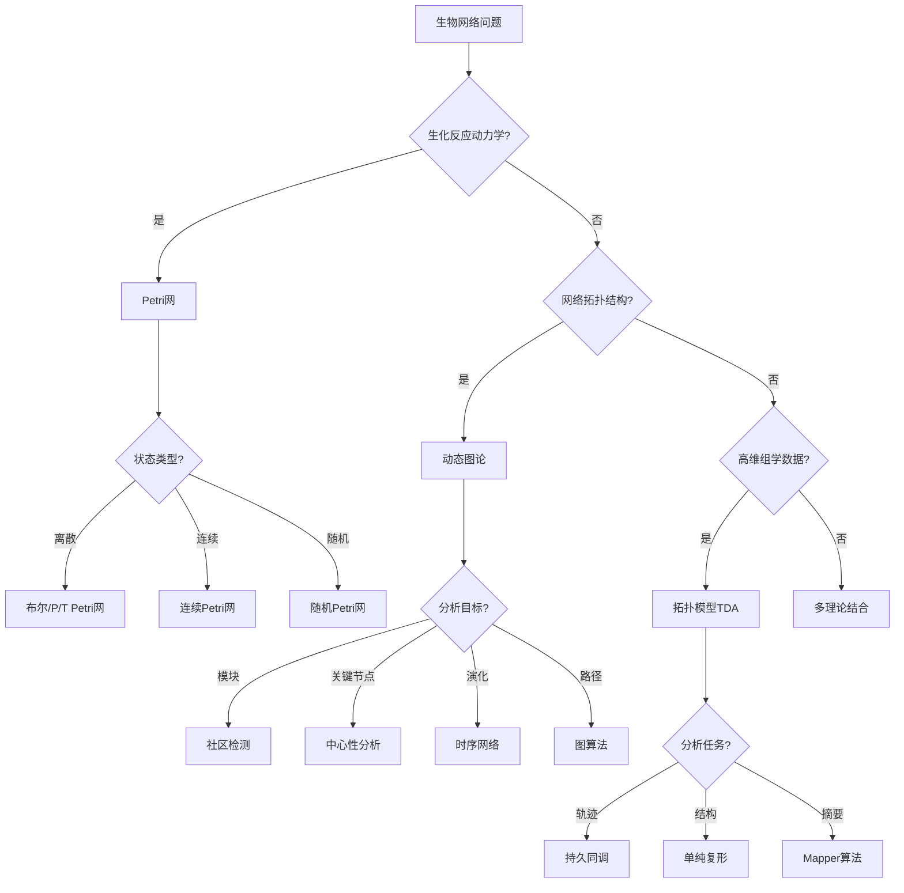

# 生物网络应用模式清单 / Biological Network Application Patterns

## 📚 **概述 / Overview**

**文档目的**: 归纳Petri网理论、动态图论、拓扑模型在生物网络领域的应用模式，为基因调控网络、代谢网络、神经网络、蛋白质相互作用网络等场景提供理论选择和分析方法指南。

**核心内容**:

- 生物网络领域的核心问题
- 三大理论的应用场景
- 模型选择决策树
- 典型案例与工具栈

**适用对象**: 系统生物学研究者、生物信息学工程师、计算生物学家

---

## 📋 **目录 / Table of Contents**

- [生物网络应用模式清单 / Biological Network Application Patterns](#生物网络应用模式清单--biological-network-application-patterns)
  - [📚 **概述 / Overview**](#-概述--overview)
  - [📋 **目录 / Table of Contents**](#-目录--table-of-contents)
  - [🎯 **一、核心问题域 / Part 1: Core Problem Domains**](#-一核心问题域--part-1-core-problem-domains)
  - [🔬 **二、理论应用模式 / Part 2: Theory Application Patterns**](#-二理论应用模式--part-2-theory-application-patterns)
  - [📊 **三、决策树 / Part 3: Decision Tree**](#-三决策树--part-3-decision-tree)
  - [💡 **四、典型案例 / Part 4: Typical Cases**](#-四典型案例--part-4-typical-cases)
  - [🛠️ **五、工具栈 / Part 5: Tool Stack**](#️-五工具栈--part-5-tool-stack)
  - [📚 **六、参考文档 / Part 6: Reference Documents**](#-六参考文档--part-6-reference-documents)

---

## 🎯 **一、核心问题域 / Part 1: Core Problem Domains**

### 1.1 生物网络核心问题

| 问题类型 | 具体问题 | 挑战 |
|---------|---------|------|
| **基因调控网络(GRN)** | 转录因子调控、基因表达 | 高维度、非线性动力学 |
| **代谢网络** | 代谢通路、通量分析 | 守恒约束、稳态分析 |
| **蛋白质相互作用(PPI)** | 蛋白质功能预测、复合物识别 | 噪声数据、动态变化 |
| **神经网络** | 神经元连接、信号传导 | 大规模、时空动态 |
| **信号转导** | 信号通路、级联反应 | 多尺度、反馈环路 |
| **生态网络** | 食物网、物种相互作用 | 动态演化、稳定性 |

### 1.2 问题特征分析

| 特征 | 描述 | 理论适配 |
|------|------|----------|
| **动力学建模** | 离散/连续动态演化 | Petri网（代谢通路） |
| **网络拓扑** | 无标度、模块化结构 | 动态图论（社区检测） |
| **形状特征** | 高维数据、拓扑结构 | 拓扑模型（TDA） |
| **多尺度** | 分子到细胞到组织 | 层次Petri网 |

---

## 🔬 **二、理论应用模式 / Part 2: Theory Application Patterns**

### 2.1 Petri网应用模式

| 应用场景 | 建模方法 | 分析目标 |
|---------|---------|---------|
| **代谢网络** | P/T Petri网 | 通量平衡、稳态分析 |
| **基因调控** | 布尔Petri网 | 基因开关、稳定态 |
| **信号通路** | 着色Petri网 | 信号传导、级联反应 |
| **酶催化反应** | 连续Petri网 | 反应速率、动力学 |

**Petri网建模示例（代谢通路）**:

```
代谢通路Petri网模型
│
├─── 库所（代谢物）
│    ├─── S1: 底物1（葡萄糖）
│    ├─── S2: 底物2（ATP）
│    ├─── P1: 产物1（丙酮酸）
│    └─── P2: 产物2（ADP）
│
├─── 变迁（酶催化反应）
│    ├─── E1: 己糖激酶
│    ├─── E2: 磷酸果糖激酶
│    └─── E3: 丙酮酸激酶
│
├─── 不变量分析
│    ├─── S-不变量: 质量守恒
│    ├─── T-不变量: 稳态通量分布
│    └─── 活性: 代谢通路可达性
│
└─── 应用
     ├─── 代谢工程优化
     ├─── 药物靶点识别
     └─── 疾病代谢异常检测
```

### 2.2 动态图论应用模式

| 应用场景 | 建模方法 | 分析目标 |
|---------|---------|---------|
| **PPI网络** | 静态/动态图 | 功能模块、复合物 |
| **基因共表达** | 相关性网络 | 共调控模块 |
| **神经连接组** | 有向加权图 | 信息流、枢纽节点 |
| **生态食物网** | 有向图 | 营养级、能量流 |

**动态图建模示例（PPI网络）**:

```
蛋白质相互作用网络 G = (V, E, W)
│
├─── 节点V（蛋白质）
│    ├─── 功能注释
│    ├─── 亚细胞定位
│    └─── 表达水平
│
├─── 边E（相互作用）
│    ├─── 物理相互作用
│    ├─── 功能关联
│    └─── 时间依赖性
│
├─── 权重W
│    ├─── 置信度分数
│    ├─── 共表达强度
│    └─── 实验验证次数
│
└─── 分析方法
     ├─── 社区检测: 功能模块识别
     ├─── 中心性分析: 关键蛋白识别
     ├─── 图聚类: 蛋白质复合物预测
     └─── 路径分析: 信号通路重建
```

### 2.3 拓扑模型应用模式

| 应用场景 | 建模方法 | 分析目标 |
|---------|---------|---------|
| **单细胞数据** | 持久同调 | 细胞状态、分化轨迹 |
| **蛋白质结构** | 拓扑数据分析 | 结构特征、折叠模式 |
| **神经活动** | Mapper算法 | 脑区连接、功能网络 |
| **基因表达** | TDA流形学习 | 表达状态空间 |

**拓扑建模示例（单细胞轨迹分析）**:

```
单细胞TDA分析
│
├─── 数据预处理
│    ├─── 降维: PCA/UMAP
│    ├─── 构建距离矩阵
│    └─── 定义过滤参数
│
├─── 持久同调计算
│    ├─── Vietoris-Rips复形构建
│    ├─── 过滤序列计算
│    └─── 持久图生成
│
├─── 拓扑特征提取
│    ├─── β₀: 细胞群体数（聚类）
│    ├─── β₁: 循环结构（细胞周期）
│    └─── 持久性: 稳定的生物学状态
│
└─── 应用
     ├─── 细胞分化轨迹推断
     ├─── 细胞类型识别
     └─── 疾病亚型发现
```

---

## 📊 **三、决策树 / Part 3: Decision Tree**

### 3.1 文本决策树

```
生物网络问题
│
├─── 是否涉及生化反应动力学？
│    │
│    ├─── 是 → Petri网
│    │    │
│    │    ├─── 离散状态？ → 布尔/P/T Petri网
│    │    ├─── 连续浓度？ → 连续/混合Petri网
│    │    └─── 随机效应？ → 随机Petri网
│    │
│    └─── 否 → 继续判断
│
├─── 是否关注网络拓扑结构？
│    │
│    ├─── 是 → 动态图论
│    │    │
│    │    ├─── 模块识别？ → 社区检测算法
│    │    ├─── 关键节点？ → 中心性分析
│    │    ├─── 动态演化？ → 时序网络
│    │    └─── 路径分析？ → 图算法
│    │
│    └─── 否 → 继续判断
│
└─── 是否处理高维组学数据？
     │
     ├─── 是 → 拓扑模型(TDA)
     │    │
     │    ├─── 细胞轨迹？ → 持久同调
     │    ├─── 结构特征？ → 单纯复形
     │    └─── 数据摘要？ → Mapper算法
     │
     └─── 综合问题 → 多理论结合
```

### 3.2 Mermaid决策树



---

## 💡 **四、典型案例 / Part 4: Typical Cases**

### 4.1 案例1：代谢网络通量分析

**问题**: 分析大肠杆菌代谢网络的通量分布和代谢工程优化

**理论选择**: Petri网 + 通量平衡分析

**实现方案**:

```
1. 建模阶段
   - 代谢物 → 库所
   - 酶反应 → 变迁
   - 化学计量系数 → 弧权重

2. 分析阶段
   - T-不变量计算: 基本模式（Elementary Flux Modes）
   - 稳态分析: 通量平衡约束
   - 可达性分析: 代谢物可产生性

3. 应用
   - 目标产物产率优化
   - 基因敲除预测
   - 代谢瓶颈识别

4. 工具链
   - COPASI: 动力学模拟
   - COBRApy: 通量平衡分析
   - Snoopy: Petri网分析
```

### 4.2 案例2：PPI网络功能模块识别

**问题**: 从人类蛋白质相互作用网络中识别功能模块和疾病相关蛋白

**理论选择**: 动态图论

**实现方案**:

```
1. 网络构建
   - 数据源: STRING, BioGRID, IntAct
   - 边权重: 实验置信度
   - 预处理: 去噪、网络整合

2. 模块识别
   - 算法: Louvain, MCL, MCODE
   - 功能富集: GO富集分析
   - 疾病关联: OMIM数据库

3. 关键蛋白识别
   - 度中心性: Hub蛋白
   - 介数中心性: Bottleneck蛋白
   - 接近中心性: 信息传递核心

4. 工具链
   - Cytoscape: 网络可视化
   - NetworkX/igraph: 图算法
   - clusterProfiler: 功能富集
```

### 4.3 案例3：单细胞RNA-seq轨迹分析

**问题**: 从单细胞RNA-seq数据推断细胞分化轨迹

**理论选择**: 拓扑模型(TDA)

**实现方案**:

```
1. 数据预处理
   - 质量控制: 过滤低质量细胞
   - 归一化: 去批次效应
   - 降维: PCA → UMAP

2. TDA分析
   - 持久同调: 识别稳定的细胞状态
   - Mapper: 构建细胞状态图
   - 分支点检测: 命运决定点

3. 轨迹推断
   - 伪时间排序
   - 分支识别
   - 基因动态变化

4. 工具链
   - Scanpy: 数据预处理
   - giotto-tda/GUDHI: TDA计算
   - Monocle3: 轨迹分析
```

### 4.4 案例4：基因调控网络推断

**问题**: 从表达数据推断基因调控关系

**理论选择**: 动态图论 + Petri网

**实现方案**:

```
1. 网络推断
   - 相关性分析: Pearson/Spearman
   - 因果推断: Granger因果/PC算法
   - 机器学习: GENIE3/SCENIC

2. 动力学建模
   - 布尔网络: 离散状态
   - ODE模型: 连续动力学
   - Petri网: 形式化验证

3. 网络验证
   - ChIP-seq验证
   - 功能扰动实验
   - 文献挖掘

4. 工具链
   - ARACNe: 互信息网络
   - pySCENIC: 调控网络推断
   - BoolNet: 布尔网络分析
```

---

## 🛠️ **五、工具栈 / Part 5: Tool Stack**

### 5.1 Petri网工具

| 工具 | 用途 | 生物网络应用 |
|------|------|-------------|
| **Snoopy** | 生物Petri网 | 代谢网络建模 |
| **COPASI** | 生化系统仿真 | 反应动力学 |
| **CellNetAnalyzer** | 代谢网络 | 通量分析 |
| **BioModel** | 生物模型库 | 模型共享 |

### 5.2 动态图工具

| 工具 | 用途 | 生物网络应用 |
|------|------|-------------|
| **Cytoscape** | 网络可视化 | PPI可视化 |
| **NetworkX** | 图算法 | 拓扑分析 |
| **igraph** | 大规模图 | 社区检测 |
| **STRING-db** | PPI数据库 | 蛋白质网络 |

### 5.3 拓扑分析工具

| 工具 | 用途 | 生物网络应用 |
|------|------|-------------|
| **giotto-tda** | TDA for ML | 单细胞分析 |
| **GUDHI** | 持久同调 | 高维数据分析 |
| **KeplerMapper** | Mapper算法 | 数据摘要 |
| **Ripser** | 快速持久同调 | 大规模计算 |

### 5.4 生物信息学专用工具

| 工具 | 用途 | 应用 |
|------|------|------|
| **Scanpy** | 单细胞分析 | scRNA-seq |
| **Seurat** | 单细胞分析 | 多组学整合 |
| **COBRApy** | 代谢建模 | 通量分析 |
| **pySCENIC** | 调控网络 | GRN推断 |

---

## 📚 **六、参考文档 / Part 6: Reference Documents**

### 6.1 模块内文档

- [生物网络模块README](../../06-生物网络/README.md)
- [神经网络](../../06-生物网络/01-神经网络.md)
- [基因调控网络](../../06-生物网络/02-基因调控网络.md)
- [网络模体与异质性](../../06-生物网络/03-网络模体与异质性.md)

### 6.2 相关理论文档

- [生物网络模块理论关系梳理](../../12-理论关系与认知框架/01-理论逻辑脉络/09-生物网络模块理论关系梳理.md)
- [Petri网理论逻辑脉络](../../12-理论关系与认知框架/01-理论逻辑脉络/01-Petri网理论逻辑脉络.md)
- [动态图论逻辑脉络](../../12-理论关系与认知框架/01-理论逻辑脉络/02-动态图论逻辑脉络.md)
- [拓扑模型逻辑脉络](../../12-理论关系与认知框架/01-理论逻辑脉络/03-拓扑模型逻辑脉络.md)

### 6.3 其他应用模式文档

- [AI基础设施应用模式清单](../03-AI基础设施应用模式/AI基础设施应用模式清单.md)
- [复杂系统与多尺度建模模块理论关系梳理](../../12-理论关系与认知框架/01-理论逻辑脉络/13-复杂系统与多尺度建模模块理论关系梳理.md)

---

**文档版本**: v1.0
**创建时间**: 2025年1月
**最后更新**: 2025年1月
**状态**: ✅ 完成
**维护者**: GraphNetWorkCommunicate项目组
