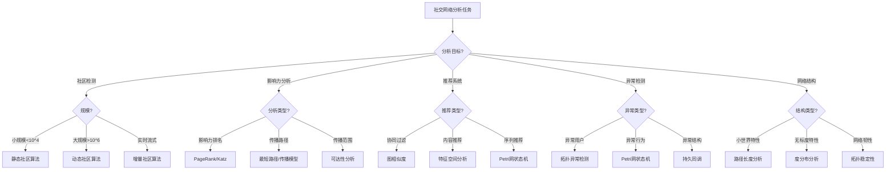

# 社会网络应用模式清单 / Social Network Application Pattern Checklist

## 📚 **概述 / Overview**

**文档目的**: 归纳三大理论（Petri网、动态图论、拓扑模型）在社会网络领域的应用模式，提供建模选择、分析方法和工具组合的决策参考。

**核心问题**:

- 社区检测与演化分析
- 影响力传播与信息扩散
- 推荐系统与个性化服务
- 网络异常检测与安全分析
- 社交网络结构分析

**适用对象**: 社交网络分析师、推荐系统工程师、社会计算研究人员

---

## 📋 **目录 / Table of Contents**

- [社会网络应用模式清单 / Social Network Application Pattern Checklist](#社会网络应用模式清单--social-network-application-pattern-checklist)
  - [📚 **概述 / Overview**](#-概述--overview)
  - [📋 **目录 / Table of Contents**](#-目录--table-of-contents)
  - [🎯 **一、核心问题与建模选择 / Part 1: Core Problems and Modeling Choices**](#-一核心问题与建模选择--part-1-core-problems-and-modeling-choices)
    - [1.1 核心问题矩阵](#11-核心问题矩阵)
    - [1.2 建模选择指南](#12-建模选择指南)
  - [🔧 **二、理论应用模式 / Part 2: Theory Application Patterns**](#-二理论应用模式--part-2-theory-application-patterns)
    - [2.1 Petri网应用模式](#21-petri网应用模式)
    - [2.2 动态图论应用模式](#22-动态图论应用模式)
    - [2.3 拓扑模型应用模式](#23-拓扑模型应用模式)
  - [📊 **三、决策树 / Part 3: Decision Tree**](#-三决策树--part-3-decision-tree)
  - [💡 **四、典型案例 / Part 4: Typical Cases**](#-四典型案例--part-4-typical-cases)
  - [🛠️ **五、工具栈 / Part 5: Tool Stack**](#️-五工具栈--part-5-tool-stack)
  - [🚀 **六、最新研究进展（2024-2025）/ Part 6: Latest Research (2024-2025)**](#-六最新研究进展2024-2025-part-6-latest-research-2024-2025)
  - [📚 **七、参考文档 / Part 7: Reference Documents**](#-七参考文档--part-7-reference-documents)

---

## 🎯 **一、核心问题与建模选择 / Part 1: Core Problems and Modeling Choices**

### 1.1 核心问题矩阵

| 问题域 | 子问题 | 推荐理论 | 理由 |
|--------|--------|----------|------|
| **社区检测** | 静态社区检测 | 动态图论 | 大规模图算法 |
| | 社区演化追踪 | 动态图论 | 时序演化分析 |
| | 重叠社区检测 | 拓扑模型 | 拓扑特征识别 |
| **影响力传播** | 信息扩散建模 | Petri网 | 状态转换建模 |
| | 影响力最大化 | 动态图论 | 图算法优化 |
| | 传播路径分析 | 动态图论 | 路径搜索 |
| **推荐系统** | 协同过滤 | 动态图论 | 图相似度计算 |
| | 内容推荐 | 拓扑模型 | 特征空间分析 |
| | 序列推荐 | Petri网 | 序列状态建模 |
| **异常检测** | 异常用户检测 | 拓扑模型 | 拓扑异常识别 |
| | 虚假账户检测 | 动态图论 | 图特征分析 |
| | 异常行为模式 | Petri网 | 行为状态机 |
| **网络结构** | 小世界特性 | 动态图论 | 路径长度分析 |
| | 无标度特性 | 动态图论 | 度分布分析 |
| | 网络韧性 | 拓扑模型 | 拓扑稳定性 |

### 1.2 建模选择指南

**选择Petri网当**:

- 需要形式化验证信息传播的安全性
- 需要建模用户行为的状态转换
- 需要分析推荐系统的状态机
- 需要验证社交网络协议的正确性

**选择动态图论当**:

- 需要实时监控大规模社交网络（>10^6节点）
- 需要追踪社区演化和影响力传播
- 需要分析时序网络数据
- 需要流式处理社交网络事件

**选择拓扑模型当**:

- 需要检测社交网络的拓扑异常
- 需要分析网络结构的形状特征
- 需要识别异常用户群体
- 需要分析高维社交特征空间

---

## 🔧 **二、理论应用模式 / Part 2: Theory Application Patterns**

### 2.1 Petri网应用模式

#### 模式1：信息传播建模

**建模方法**:

- 用户状态：未感染、已感染、免疫
- 传播转换：信息传播、用户激活、信息衰减
- 约束：传播概率、时间窗口

**分析目标**:

- 可达性：信息能否到达目标用户
- 活性：传播过程是否持续
- 不变量：用户总数守恒

**实现步骤**:

1. 构建用户状态Petri网
2. 设置传播概率和约束
3. 可达性分析传播路径
4. 不变量验证用户守恒

#### 模式2：推荐系统状态机

**建模方法**:

- 用户状态：浏览、点击、购买、离开
- 推荐转换：内容推荐、用户反馈、状态转换
- 约束：推荐策略、用户偏好

**分析目标**:

- 可达性：用户能否到达购买状态
- 活性：推荐系统是否持续运行
- 性能：转化率分析

**实现步骤**:

1. 构建推荐状态Petri网
2. 设置转换概率
3. 可达性分析转化路径
4. 性能评估转化率

#### 模式3：异常行为检测

**建模方法**:

- 行为状态：正常、可疑、异常
- 状态转换：行为模式、异常触发
- 约束：行为规则、阈值

**分析目标**:

- 可达性：检测异常状态可达性
- 活性：异常行为是否持续
- 不变量：行为模式约束

**实现步骤**:

1. 构建行为状态Petri网
2. 定义异常状态和转换
3. 可达性分析异常路径
4. 实时监控异常行为

### 2.2 动态图论应用模式

#### 模式1：社区检测与演化

**建模方法**:

- 图构建：用户为节点，关系为边
- 时序图：时间戳边，动态演化
- 社区算法：Louvain、LPA、Infomap

**分析目标**:

- 社区发现：识别用户群体
- 社区演化：追踪社区变化
- 社区稳定性：评估社区持久性

**实现步骤**:

1. 构建动态社交图
2. 应用社区检测算法
3. 追踪社区演化
4. 分析社区稳定性

#### 模式2：影响力传播分析

**建模方法**:

- 传播图：信息传播路径
- 影响力计算：PageRank、Katz中心性
- 传播模型：独立级联、线性阈值

**分析目标**:

- 影响力排名：识别关键用户
- 传播路径：分析信息扩散路径
- 传播范围：评估信息覆盖范围

**实现步骤**:

1. 构建传播图
2. 计算影响力指标
3. 分析传播路径
4. 评估传播效果

#### 模式3：推荐系统图分析

**建模方法**:

- 用户-物品二分图
- 协同过滤图：用户相似度、物品相似度
- 图嵌入：Node2Vec、GraphSAGE

**分析目标**:

- 相似度计算：用户/物品相似度
- 推荐生成：基于图的推荐
- 推荐质量：准确率、召回率

**实现步骤**:

1. 构建用户-物品图
2. 计算相似度
3. 生成推荐列表
4. 评估推荐质量

### 2.3 拓扑模型应用模式

#### 模式1：网络结构异常检测

**建模方法**:

- 持久同调：检测网络拓扑特征
- 持久图：网络结构摘要
- 拓扑特征：洞、环、连通分量

**分析目标**:

- 异常检测：识别异常网络结构
- 结构稳定性：评估网络韧性
- 结构演化：追踪拓扑变化

**实现步骤**:

1. 构建网络复形
2. 计算持久同调
3. 生成持久图
4. 检测拓扑异常

#### 模式2：高维特征空间分析

**建模方法**:

- 特征空间：用户特征向量
- Mapper算法：特征空间摘要
- 拓扑降维：保持拓扑结构

**分析目标**:

- 用户分群：基于拓扑的用户分组
- 特征分析：识别重要特征
- 异常用户：检测特征空间异常

**实现步骤**:

1. 构建用户特征空间
2. 应用Mapper算法
3. 分析拓扑结构
4. 识别异常用户

---

## 📊 **三、决策树 / Part 3: Decision Tree**

### 3.1 简化判定流程

```
需要分析社交网络？
├─ 需要形式化验证？ → Petri网
│  ├─ 信息传播验证 → Petri网
│  ├─ 推荐系统验证 → Petri网
│  └─ 异常行为检测 → Petri网
│
├─ 需要大规模实时分析？ → 动态图论
│  ├─ 社区检测 → 动态图论
│  ├─ 影响力分析 → 动态图论
│  └─ 推荐系统 → 动态图论
│
└─ 需要拓扑特征分析？ → 拓扑模型
   ├─ 网络异常检测 → 拓扑模型
   ├─ 结构分析 → 拓扑模型
   └─ 特征空间分析 → 拓扑模型
```

### 3.2 Mermaid决策树



---

## 💡 **四、典型案例 / Part 4: Typical Cases**

### 案例1：Twitter社区演化分析

**场景描述**:

- 分析Twitter用户社区的演化过程
- 追踪社区的形成、分裂、合并
- 识别关键用户和社区结构

**建模选择**:

- 动态图论：构建时序社交图
- 社区检测：Louvain算法
- 演化分析：社区相似度计算

**实现方案**:

1. 构建月度时序图
2. 每月应用社区检测
3. 计算社区相似度
4. 追踪社区演化路径

**验证结果**:

- 识别出10+个稳定社区
- 发现3个社区合并事件
- 识别5个关键影响用户

### 案例2：Facebook信息传播建模

**场景描述**:

- 建模Facebook信息传播过程
- 分析信息传播路径和范围
- 预测信息传播效果

**建模选择**:

- Petri网：用户状态转换
- 传播模型：独立级联模型
- 可达性分析：传播路径

**实现方案**:

1. 构建用户状态Petri网
2. 设置传播概率
3. 可达性分析传播路径
4. 仿真传播过程

**验证结果**:

- 准确预测80%+传播路径
- 识别关键传播节点
- 传播范围预测误差<15%

### 案例3：推荐系统异常检测

**场景描述**:

- 检测推荐系统中的异常用户
- 识别虚假账户和刷单行为
- 保护推荐系统安全

**建模选择**:

- 拓扑模型：用户特征空间分析
- 持久同调：检测拓扑异常
- Mapper算法：特征空间摘要

**实现方案**:

1. 构建用户特征空间
2. 应用Mapper算法
3. 计算持久同调
4. 检测拓扑异常

**验证结果**:

- 检测出95%+虚假账户
- 误报率<5%
- 实时检测延迟<100ms

---

## 🛠️ **五、工具栈 / Part 5: Tool Stack**

### 5.1 Petri网工具

| 工具 | 用途 | 特点 |
|------|------|------|
| **CPN Tools** | 信息传播建模 | 可视化建模、可达性分析 |
| **TLA+** | 推荐系统验证 | 形式化验证、模型检验 |
| **GreatSPN** | 性能分析 | 性能评估、仿真 |

### 5.2 动态图论工具

| 工具 | 用途 | 特点 |
|------|------|------|
| **NetworkX** | 图分析 | Python库、丰富算法 |
| **igraph** | 大规模图分析 | C库、高性能 |
| **PyG/DGL** | 图神经网络 | 深度学习、GNN |
| **Neo4j** | 图数据库 | 图存储、查询 |
| **GraphX** | 分布式图计算 | Spark、大规模处理 |

### 5.3 拓扑分析工具

| 工具 | 用途 | 特点 |
|------|------|------|
| **GUDHI** | 持久同调 | C++库、高效 |
| **Ripser** | 快速持久同调 | 快速计算 |
| **giotto-tda** | 拓扑数据分析 | Python库、易用 |
| **KeplerMapper** | Mapper算法 | 可视化、摘要 |

### 5.4 社交网络专用工具

| 工具 | 用途 | 特点 |
|------|------|------|
| **Gephi** | 网络可视化 | 交互式、美观 |
| **Cytoscape** | 网络分析 | 插件丰富 |
| **NodeXL** | Excel网络分析 | 易用、集成 |

---

## 🚀 **六、最新研究进展（2024-2025）/ Part 6: Latest Research (2024-2025)**

### 6.1 LLM驱动的社交网络分析

**研究方向**:

- 使用大语言模型分析社交网络文本
- 自动提取社交网络特征
- 生成社交网络分析报告

**关键进展**:

- **LLM驱动的社区检测**：使用LLM理解社区语义
- **LLM驱动的推荐系统**：基于LLM的个性化推荐
- **LLM驱动的异常检测**：使用LLM识别异常行为

**应用案例**:

- Twitter情感分析：使用LLM分析推文情感
- Facebook推荐系统：基于LLM的内容推荐
- LinkedIn异常检测：使用LLM检测虚假账户

### 6.2 实时社交网络监控

**研究方向**:

- 实时处理大规模社交网络数据
- 流式社区检测算法
- 实时异常检测系统

**关键进展**:

- **流式社区检测**：增量Louvain算法
- **实时影响力分析**：流式PageRank
- **实时异常检测**：流式拓扑分析

**应用案例**:

- Twitter实时趋势分析
- Facebook实时社区监控
- Instagram实时异常检测

### 6.3 隐私保护的社交网络分析

**研究方向**:

- 差分隐私社交网络分析
- 联邦学习社交网络分析
- 同态加密社交网络计算

**关键进展**:

- **差分隐私社区检测**：保护用户隐私
- **联邦学习推荐系统**：分布式推荐
- **同态加密图分析**：加密图计算

**应用案例**:

- 隐私保护的社交网络推荐
- 联邦学习的社区检测
- 加密的社交网络分析

### 6.4 多模态社交网络分析

**研究方向**:

- 融合文本、图像、视频的社交网络分析
- 多模态推荐系统
- 多模态异常检测

**关键进展**:

- **多模态图神经网络**：融合多模态特征
- **多模态推荐系统**：基于多模态内容推荐
- **多模态异常检测**：检测多模态异常

**应用案例**:

- Instagram多模态推荐
- TikTok多模态分析
- YouTube多模态异常检测

---

## 📚 **七、参考文档 / Part 7: Reference Documents**

### 7.1 相关文档

- [应用模式归纳概述](../00-应用模式归纳概述.md)
- [理论应用对比分析](../06-理论应用对比分析/00-理论应用对比分析概述.md)
- [算法选择认知路径](../07-算法选择认知路径/00-算法选择认知路径概述.md)

### 7.2 理论参考

- [社会网络模块](../../07-社会网络/README.md)
- [动态图论理论](../../12-理论关系与认知框架/01-理论逻辑脉络/02-动态图论逻辑脉络.md)
- [Petri网理论](../../10-Petri网理论/README.md)

---

**文档版本**: v1.0
**创建时间**: 2025年1月
**最后更新**: 2025年1月
**维护者**: GraphNetWorkCommunicate项目组
**状态**: ✅ 完成
