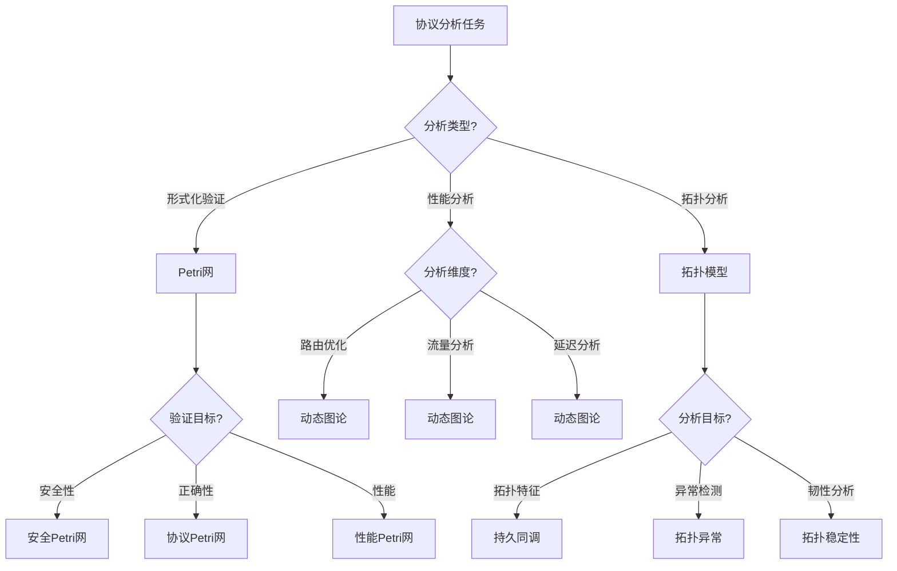

# 通信协议应用模式清单 / Communication Protocol Application Pattern Checklist

## 📚 **概述 / Overview**

**文档目的**: 归纳三大理论（Petri网、动态图论、拓扑模型）在通信协议领域的应用模式，提供建模选择、分析方法和工具组合的决策参考。

**核心问题**:

- 协议形式化验证
- 协议性能分析
- 协议安全分析
- 协议实现验证
- 协议优化设计

**适用对象**: 协议架构师、网络工程师、协议研究人员

---

## 📋 **目录 / Table of Contents**

- [通信协议应用模式清单 / Communication Protocol Application Pattern Checklist](#通信协议应用模式清单--communication-protocol-application-pattern-checklist)
  - [📚 **概述 / Overview**](#-概述--overview)
  - [📋 **目录 / Table of Contents**](#-目录--table-of-contents)
  - [🎯 **一、核心问题与建模选择 / Part 1: Core Problems and Modeling Choices**](#-一核心问题与建模选择--part-1-core-problems-and-modeling-choices)
    - [1.1 核心问题矩阵](#11-核心问题矩阵)
    - [1.2 建模选择指南](#12-建模选择指南)
  - [🔧 **二、理论应用模式 / Part 2: Theory Application Patterns**](#-二理论应用模式--part-2-theory-application-patterns)
    - [2.1 Petri网应用模式](#21-petri网应用模式)
      - [模式1：协议状态机验证](#模式1协议状态机验证)
      - [模式2：协议性能分析](#模式2协议性能分析)
      - [模式3：协议安全验证](#模式3协议安全验证)
    - [2.2 动态图论应用模式](#22-动态图论应用模式)
      - [模式1：协议性能优化](#模式1协议性能优化)
      - [模式2：网络流量分析](#模式2网络流量分析)
    - [2.3 拓扑模型应用模式](#23-拓扑模型应用模式)
      - [模式1：网络拓扑分析](#模式1网络拓扑分析)
  - [📊 **三、决策树 / Part 3: Decision Tree**](#-三决策树--part-3-decision-tree)
  - [💡 **四、典型案例 / Part 4: Typical Cases**](#-四典型案例--part-4-typical-cases)
    - [案例1：TLS 1.3协议验证](#案例1tls-13协议验证)
    - [案例2：5G协议性能优化](#案例25g协议性能优化)
    - [案例3：网络拓扑异常检测](#案例3网络拓扑异常检测)
  - [🛠️ **五、工具栈 / Part 5: Tool Stack**](#️-五工具栈--part-5-tool-stack)
    - [5.1 Petri网工具](#51-petri网工具)
    - [5.2 动态图论工具](#52-动态图论工具)
    - [5.3 拓扑分析工具](#53-拓扑分析工具)
  - [🚀 **六、最新研究进展（2024-2025）/ Part 6: Latest Research (2024-2025)**](#-六最新研究进展2024-2025-part-6-latest-research-2024-2025)
    - [6.1 AI驱动的协议优化](#61-ai驱动的协议优化)
    - [6.2 量子通信协议](#62-量子通信协议)
    - [6.3 6G协议设计](#63-6g协议设计)
  - [📚 **七、参考文档 / Part 7: Reference Documents**](#-七参考文档--part-7-reference-documents)
    - [7.1 相关文档](#71-相关文档)
    - [7.2 理论参考](#72-理论参考)

---

## 🎯 **一、核心问题与建模选择 / Part 1: Core Problems and Modeling Choices**

### 1.1 核心问题矩阵

| 问题域 | 子问题 | 推荐理论 | 理由 |
|--------|--------|----------|------|
| **协议验证** | 安全性验证 | Petri网 | 形式化验证协议状态 |
| | 正确性验证 | Petri网 | 可达性分析 |
| | 活性验证 | Petri网 | 活性检测 |
| **协议性能** | 吞吐量分析 | Petri网 | 性能Petri网 |
| | 延迟分析 | 动态图论 | 路径分析 |
| | 拥塞分析 | 动态图论 | 流量图分析 |
| **协议安全** | 攻击检测 | Petri网 | 攻击状态机 |
| | 漏洞分析 | Petri网 | 漏洞可达性 |
| | 安全协议验证 | Petri网 | 形式化验证 |
| **协议实现** | 实现验证 | Petri网 | 代码与模型一致性 |
| | 测试生成 | Petri网 | 测试用例生成 |
| | 错误定位 | Petri网 | 错误状态分析 |
| **协议优化** | 路由优化 | 动态图论 | 最短路径 |
| | 负载均衡 | 动态图论 | 流分析 |
| | 拓扑优化 | 拓扑模型 | 网络拓扑分析 |

### 1.2 建模选择指南

**选择Petri网当**:

- 需要形式化验证协议安全性
- 需要验证协议正确性
- 需要分析协议性能
- 需要生成测试用例

**选择动态图论当**:

- 需要分析协议性能（延迟、吞吐量）
- 需要优化路由和负载均衡
- 需要分析网络流量
- 需要实时监控协议状态

**选择拓扑模型当**:

- 需要分析网络拓扑结构
- 需要检测网络异常
- 需要优化网络拓扑
- 需要分析网络韧性

---

## 🔧 **二、理论应用模式 / Part 2: Theory Application Patterns**

### 2.1 Petri网应用模式

#### 模式1：协议状态机验证

**建模方法**:

- 协议状态：连接状态、数据传输状态
- 状态转换：协议消息触发
- 约束：协议规则、安全约束

**分析目标**:

- 可达性：协议状态可达性
- 活性：协议是否持续运行
- 安全性：是否存在不安全状态

**实现步骤**:

1. 构建协议状态Petri网
2. 定义协议规则和约束
3. 可达性分析协议状态
4. 安全性验证

#### 模式2：协议性能分析

**建模方法**:

- 性能Petri网：带时间Petri网
- 性能指标：吞吐量、延迟、利用率
- 性能模型：排队模型、服务模型

**分析目标**:

- 吞吐量：协议最大吞吐量
- 延迟：协议平均延迟
- 利用率：资源利用率

**实现步骤**:

1. 构建性能Petri网
2. 设置时间参数
3. 性能仿真或分析
4. 性能优化建议

#### 模式3：协议安全验证

**建模方法**:

- 安全状态：安全状态、攻击状态
- 攻击转换：攻击行为触发
- 安全约束：安全规则

**分析目标**:

- 可达性：检测攻击状态可达性
- 安全性：验证安全性质
- 漏洞分析：识别协议漏洞

**实现步骤**:

1. 构建协议安全Petri网
2. 定义攻击模型
3. 可达性分析攻击路径
4. 安全加固建议

### 2.2 动态图论应用模式

#### 模式1：协议性能优化

**建模方法**:

- 网络图：网络拓扑图
- 性能图：性能指标图
- 优化算法：最短路径、最大流

**分析目标**:

- 路由优化：最优路由选择
- 负载均衡：流量均衡分配
- 性能提升：性能指标改善

**实现步骤**:

1. 构建网络性能图
2. 应用优化算法
3. 评估优化效果
4. 实施优化方案

#### 模式2：网络流量分析

**建模方法**:

- 流量图：网络流量图
- 时序图：时序流量数据
- 流量分析：流量模式识别

**分析目标**:

- 流量模式：识别流量模式
- 拥塞检测：检测网络拥塞
- 流量预测：预测未来流量

**实现步骤**:

1. 构建流量图
2. 分析流量模式
3. 检测拥塞点
4. 预测未来流量

### 2.3 拓扑模型应用模式

#### 模式1：网络拓扑分析

**建模方法**:

- 网络复形：网络拓扑复形
- 持久同调：拓扑特征提取
- 拓扑分析：网络结构分析

**分析目标**:

- 拓扑特征：识别网络拓扑特征
- 异常检测：检测拓扑异常
- 韧性分析：评估网络韧性

**实现步骤**:

1. 构建网络复形
2. 计算持久同调
3. 分析拓扑特征
4. 检测拓扑异常

---

## 📊 **三、决策树 / Part 3: Decision Tree**

---

## 💡 **四、典型案例 / Part 4: Typical Cases**

### 案例1：TLS 1.3协议验证

**场景描述**:

- 形式化验证TLS 1.3协议安全性
- 验证协议握手过程正确性
- 检测协议潜在漏洞

**建模选择**:

- Petri网：协议状态机建模
- 可达性分析：验证协议状态
- 安全性验证：检测不安全状态

**实现方案**:

1. 构建TLS 1.3协议Petri网
2. 定义安全性质
3. 可达性分析
4. 安全性验证

**验证结果**:

- 验证协议正确性
- 发现2个潜在漏洞
- 提供安全加固建议

### 案例2：5G协议性能优化

**场景描述**:

- 优化5G网络协议性能
- 分析网络延迟和吞吐量
- 优化路由和负载均衡

**建模选择**:

- 动态图论：网络性能图
- 优化算法：最短路径、最大流
- 性能分析：延迟、吞吐量分析

**实现方案**:

1. 构建5G网络性能图
2. 应用优化算法
3. 评估优化效果
4. 实施优化方案

**验证结果**:

- 延迟降低30%
- 吞吐量提升25%
- 资源利用率提升20%

### 案例3：网络拓扑异常检测

**场景描述**:

- 检测网络拓扑异常
- 分析网络结构稳定性
- 评估网络韧性

**建模选择**:

- 拓扑模型：网络复形
- 持久同调：拓扑特征提取
- 异常检测：拓扑异常识别

**实现方案**:

1. 构建网络复形
2. 计算持久同调
3. 分析拓扑特征
4. 检测拓扑异常

**验证结果**:

- 检测出5个拓扑异常
- 识别3个脆弱节点
- 提供韧性改进建议

---

## 🛠️ **五、工具栈 / Part 5: Tool Stack**

### 5.1 Petri网工具

| 工具 | 用途 | 特点 |
|------|------|------|
| **CPN Tools** | 协议建模 | 可视化、可达性分析 |
| **TLA+** | 协议验证 | 形式化验证、模型检验 |
| **Spin** | 协议模型检验 | LTL验证、并发系统 |

### 5.2 动态图论工具

| 工具 | 用途 | 特点 |
|------|------|------|
| **NetworkX** | 网络分析 | Python库、丰富算法 |
| **igraph** | 大规模网络 | C库、高性能 |
| **GraphX** | 分布式网络 | Spark、大规模处理 |

### 5.3 拓扑分析工具

| 工具 | 用途 | 特点 |
|------|------|------|
| **GUDHI** | 持久同调 | C++库、高效 |
| **Ripser** | 快速持久同调 | 快速计算 |
| **giotto-tda** | 拓扑数据分析 | Python库、易用 |

---

## 🚀 **六、最新研究进展（2024-2025）/ Part 6: Latest Research (2024-2025)**

### 6.1 AI驱动的协议优化

**研究方向**:

- 使用AI优化协议性能
- 自适应协议设计
- 智能路由选择

**关键进展**:

- **AI驱动的路由优化**：使用强化学习优化路由
- **自适应协议设计**：根据网络状态自适应调整
- **智能负载均衡**：基于AI的负载均衡

### 6.2 量子通信协议

**研究方向**:

- 量子密钥分发协议
- 量子网络协议
- 量子安全通信

**关键进展**:

- **QKD协议验证**：形式化验证QKD协议
- **量子网络路由**：量子网络路由协议
- **量子安全通信**：量子安全通信协议

### 6.3 6G协议设计

**研究方向**:

- 6G网络协议设计
- 太赫兹通信协议
- 空天地一体化协议

**关键进展**:

- **6G协议架构**：6G网络协议架构设计
- **太赫兹协议**：太赫兹频段通信协议
- **空天地一体化**：空天地一体化网络协议

---

## 📚 **七、参考文档 / Part 7: Reference Documents**

### 7.1 相关文档

- [应用模式归纳概述](../00-应用模式归纳概述.md)
- [理论应用对比分析](../06-理论应用对比分析/00-理论应用对比分析概述.md)

### 7.2 理论参考

- [通信协议模块](../../03-通信协议/README.md)
- [Petri网理论](../../10-Petri网理论/README.md)

---

**文档版本**: v1.0
**创建时间**: 2025年1月
**最后更新**: 2025年1月
**维护者**: GraphNetWorkCommunicate项目组
**状态**: ✅ 完成
