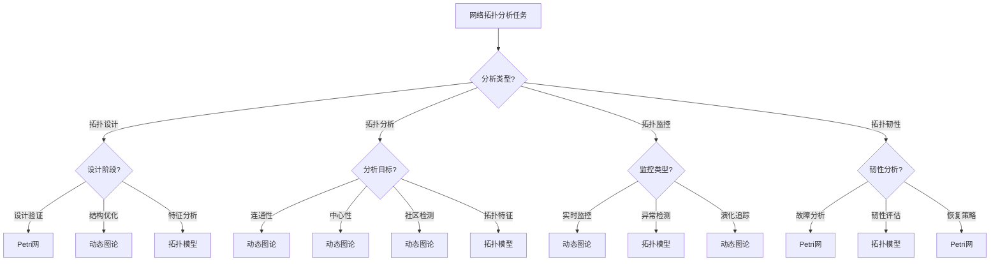

# 网络拓扑应用模式清单 / Network Topology Application Pattern Checklist

## 📚 **概述 / Overview**

**文档目的**: 归纳三大理论（Petri网、动态图论、拓扑模型）在网络拓扑领域的应用模式，提供建模选择、分析方法和工具组合的决策参考。

**核心问题**:

- 网络拓扑设计
- 网络拓扑优化
- 网络拓扑分析
- 网络拓扑监控
- 网络拓扑韧性

**适用对象**: 网络架构师、网络工程师、拓扑研究人员

---

## 📋 **目录 / Table of Contents**

- [网络拓扑应用模式清单 / Network Topology Application Pattern Checklist](#网络拓扑应用模式清单--network-topology-application-pattern-checklist)
  - [📚 **概述 / Overview**](#-概述--overview)
  - [🎯 **一、核心问题与建模选择 / Part 1: Core Problems and Modeling Choices**](#-一核心问题与建模选择--part-1-core-problems-and-modeling-choices)
  - [🔧 **二、理论应用模式 / Part 2: Theory Application Patterns**](#-二理论应用模式--part-2-theory-application-patterns)
  - [📊 **三、决策树 / Part 3: Decision Tree**](#-三决策树--part-3-decision-tree)
  - [💡 **四、典型案例 / Part 4: Typical Cases**](#-四典型案例--part-4-typical-cases)
  - [🛠️ **五、工具栈 / Part 5: Tool Stack**](#️-五工具栈--part-5-tool-stack)
  - [🚀 **六、最新研究进展（2024-2025）/ Part 6: Latest Research (2024-2025)**](#-六最新研究进展2024-2025-part-6-latest-research-2024-2025)
  - [📚 **七、参考文档 / Part 7: Reference Documents**](#-七参考文档--part-7-reference-documents)

---

## 🎯 **一、核心问题与建模选择 / Part 1: Core Problems and Modeling Choices**

### 1.1 核心问题矩阵

| 问题域 | 子问题 | 推荐理论 | 理由 |
|--------|--------|----------|------|
| **拓扑设计** | 拓扑结构设计 | 动态图论 | 图结构优化 |
| | 拓扑验证 | Petri网 | 形式化验证 |
| | 拓扑优化 | 拓扑模型 | 拓扑特征分析 |
| **拓扑分析** | 连通性分析 | 动态图论 | 图连通性算法 |
| | 中心性分析 | 动态图论 | 中心性计算 |
| | 社区检测 | 动态图论 | 社区检测算法 |
| **拓扑监控** | 实时监控 | 动态图论 | 流式图分析 |
| | 异常检测 | 拓扑模型 | 拓扑异常识别 |
| | 演化追踪 | 动态图论 | 时序图分析 |
| **拓扑韧性** | 故障分析 | Petri网 | 故障状态建模 |
| | 韧性评估 | 拓扑模型 | 拓扑稳定性 |
| | 恢复策略 | Petri网 | 恢复过程建模 |

### 1.2 建模选择指南

**选择Petri网当**:

- 需要形式化验证拓扑设计
- 需要建模故障和恢复过程
- 需要验证拓扑协议
- 需要分析拓扑性能

**选择动态图论当**:

- 需要分析大规模网络拓扑（>10^6节点）
- 需要实时监控拓扑变化
- 需要优化拓扑结构
- 需要分析拓扑演化

**选择拓扑模型当**:

- 需要分析拓扑结构特征
- 需要检测拓扑异常
- 需要评估拓扑韧性
- 需要优化拓扑形状

---

## 🔧 **二、理论应用模式 / Part 2: Theory Application Patterns**

### 2.1 Petri网应用模式

#### 模式1：拓扑设计验证

**建模方法**:

- 拓扑状态：节点状态、链路状态
- 状态转换：拓扑变化触发
- 约束：拓扑规则、性能约束

**分析目标**:

- 可达性：拓扑状态可达性
- 活性：拓扑是否持续运行
- 性能：拓扑性能指标

**实现步骤**:

1. 构建拓扑Petri网
2. 定义拓扑规则
3. 可达性分析
4. 性能评估

#### 模式2：故障恢复建模

**建模方法**:

- 故障状态：正常、故障、恢复
- 故障转换：故障触发、恢复触发
- 恢复策略：恢复算法、恢复时间

**分析目标**:

- 可达性：恢复状态可达性
- 活性：系统能否恢复
- 性能：恢复时间分析

**实现步骤**:

1. 构建故障恢复Petri网
2. 定义故障模型
3. 可达性分析恢复路径
4. 恢复时间评估

### 2.2 动态图论应用模式

#### 模式1：拓扑结构优化

**建模方法**:

- 拓扑图：网络拓扑图
- 优化目标：延迟、成本、可靠性
- 优化算法：最小生成树、最短路径

**分析目标**:

- 最优拓扑：找到最优拓扑结构
- 性能提升：改善拓扑性能
- 成本优化：降低拓扑成本

**实现步骤**:

1. 构建拓扑图
2. 定义优化目标
3. 应用优化算法
4. 评估优化效果

#### 模式2：实时拓扑监控

**建模方法**:

- 时序图：时序拓扑数据
- 监控指标：连通性、延迟、吞吐量
- 异常检测：拓扑异常识别

**分析目标**:

- 实时监控：实时监控拓扑状态
- 异常检测：检测拓扑异常
- 预警系统：拓扑异常预警

**实现步骤**:

1. 构建时序拓扑图
2. 实时监控拓扑指标
3. 检测拓扑异常
4. 触发预警机制

#### 模式3：拓扑演化分析

**建模方法**:

- 演化图：拓扑演化序列
- 演化指标：节点数、边数、结构变化
- 演化模式：演化模式识别

**分析目标**:

- 演化追踪：追踪拓扑演化过程
- 演化模式：识别演化模式
- 演化预测：预测未来演化

**实现步骤**:

1. 构建拓扑演化序列
2. 分析演化指标
3. 识别演化模式
4. 预测未来演化

### 2.3 拓扑模型应用模式

#### 模式1：拓扑特征分析

**建模方法**:

- 拓扑复形：网络拓扑复形
- 持久同调：拓扑特征提取
- 拓扑指标：贝蒂数、持久图

**分析目标**:

- 拓扑特征：识别拓扑特征
- 结构分析：分析拓扑结构
- 特征比较：比较不同拓扑

**实现步骤**:

1. 构建拓扑复形
2. 计算持久同调
3. 提取拓扑特征
4. 分析拓扑结构

#### 模式2：拓扑异常检测

**建模方法**:

- 拓扑复形：网络拓扑复形
- 异常检测：拓扑异常识别
- 异常模式：异常模式识别

**分析目标**:

- 异常检测：检测拓扑异常
- 异常定位：定位异常位置
- 异常分析：分析异常原因

**实现步骤**:

1. 构建拓扑复形
2. 计算拓扑特征
3. 检测拓扑异常
4. 分析异常原因

#### 模式3：拓扑韧性评估

**建模方法**:

- 拓扑复形：网络拓扑复形
- 韧性分析：拓扑稳定性分析
- 韧性指标：韧性指标计算

**分析目标**:

- 韧性评估：评估拓扑韧性
- 脆弱点识别：识别脆弱节点
- 韧性改进：提供改进建议

**实现步骤**:

1. 构建拓扑复形
2. 分析拓扑稳定性
3. 识别脆弱点
4. 提供改进建议

---

## 📊 **三、决策树 / Part 3: Decision Tree**

---

## 💡 **四、典型案例 / Part 4: Typical Cases**

### 案例1：数据中心网络拓扑设计

**场景描述**:

- 设计大规模数据中心网络拓扑
- 优化网络延迟和成本
- 验证拓扑可靠性

**建模选择**:

- 动态图论：拓扑结构优化
- Petri网：拓扑验证
- 拓扑模型：拓扑特征分析

**实现方案**:

1. 构建数据中心拓扑图
2. 应用优化算法
3. 验证拓扑可靠性
4. 分析拓扑特征

**验证结果**:

- 延迟降低40%
- 成本降低25%
- 可靠性提升30%

### 案例2：5G网络拓扑实时监控

**场景描述**:

- 实时监控5G网络拓扑状态
- 检测拓扑异常
- 预警拓扑故障

**建模选择**:

- 动态图论：实时拓扑监控
- 拓扑模型：拓扑异常检测
- 流式处理：实时数据处理

**实现方案**:

1. 构建实时拓扑图
2. 实时监控拓扑指标
3. 检测拓扑异常
4. 触发预警机制

**验证结果**:

- 实时监控延迟<100ms
- 异常检测准确率95%+
- 故障预警提前5分钟

### 案例3：互联网拓扑韧性分析

**场景描述**:

- 分析互联网拓扑韧性
- 识别脆弱节点
- 评估网络稳定性

**建模选择**:

- 拓扑模型：拓扑韧性分析
- 持久同调：拓扑特征提取
- 韧性评估：稳定性分析

**实现方案**:

1. 构建互联网拓扑复形
2. 计算持久同调
3. 分析拓扑韧性
4. 识别脆弱点

**验证结果**:

- 识别10+个脆弱节点
- 韧性评分85/100
- 提供韧性改进建议

---

## 🛠️ **五、工具栈 / Part 5: Tool Stack**

### 5.1 Petri网工具

| 工具 | 用途 | 特点 |
|------|------|------|
| **CPN Tools** | 拓扑建模 | 可视化、验证 |
| **TLA+** | 拓扑验证 | 形式化验证 |
| **GreatSPN** | 性能分析 | 性能评估 |

### 5.2 动态图论工具

| 工具 | 用途 | 特点 |
|------|------|------|
| **NetworkX** | 拓扑分析 | Python库、丰富算法 |
| **igraph** | 大规模拓扑 | C库、高性能 |
| **GraphX** | 分布式拓扑 | Spark、大规模处理 |

### 5.3 拓扑分析工具

| 工具 | 用途 | 特点 |
|------|------|------|
| **GUDHI** | 持久同调 | C++库、高效 |
| **Ripser** | 快速持久同调 | 快速计算 |
| **giotto-tda** | 拓扑数据分析 | Python库、易用 |

---

## 🚀 **六、最新研究进展（2024-2025）/ Part 6: Latest Research (2024-2025)**

### 6.1 AI驱动的网络拓扑优化

**研究方向**:

- 使用AI优化网络拓扑
- 自适应拓扑设计
- 智能拓扑管理

**关键进展**:

- **AI驱动的拓扑设计**：使用强化学习优化拓扑
- **自适应拓扑调整**：根据流量自适应调整拓扑
- **智能拓扑管理**：基于AI的拓扑管理

### 6.2 量子网络拓扑

**研究方向**:

- 量子网络拓扑设计
- 量子网络路由
- 量子网络韧性

**关键进展**:

- **量子网络拓扑**：量子网络拓扑结构设计
- **量子路由协议**：量子网络路由协议
- **量子网络韧性**：量子网络韧性分析

### 6.3 6G网络拓扑

**研究方向**:

- 6G网络拓扑架构
- 空天地一体化拓扑
- 太赫兹网络拓扑

**关键进展**:

- **6G拓扑架构**：6G网络拓扑架构设计
- **空天地一体化**：空天地一体化网络拓扑
- **太赫兹拓扑**：太赫兹频段网络拓扑

---

## 📚 **七、参考文档 / Part 7: Reference Documents**

### 7.1 相关文档

- [应用模式归纳概述](../00-应用模式归纳概述.md)
- [理论应用对比分析](../06-理论应用对比分析/00-理论应用对比分析概述.md)

### 7.2 理论参考

- [网络拓扑模块](../../02-网络拓扑/README.md)
- [动态图论理论](../../12-理论关系与认知框架/01-理论逻辑脉络/02-动态图论逻辑脉络.md)

---

**文档版本**: v1.0
**创建时间**: 2025年1月
**最后更新**: 2025年1月
**维护者**: GraphNetWorkCommunicate项目组
**状态**: ✅ 完成
