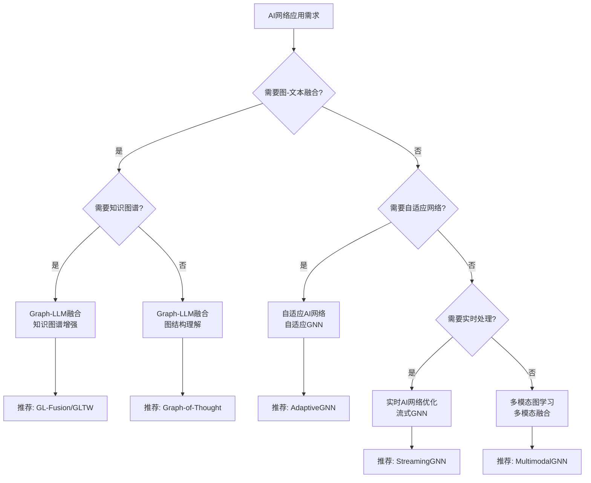

# AI网络应用模式清单 / AI Network Application Patterns

## 📚 **概述 / Overview**

本文档归纳AI网络与自适应范畴理论在典型领域的应用模式，提供建模选择、分析方法和工具组合的决策参考。

**创建时间**: 2025年1月
**状态**: ✅ 完成
**优先级**: 🔴 P0 - 极高优先级

---

## 🎯 **一、核心问题矩阵 / Part 1: Core Problem Matrix**

| 核心问题 | 问题描述 | 推荐理论 | 典型应用 |
|---------|---------|---------|---------|
| **图-文本融合** | 结合图结构和文本语义 | Graph-LLM融合 | 知识图谱问答、文档理解 |
| **自适应网络** | 网络结构自适应演化 | 自适应AI网络 | 动态推荐、自适应路由 |
| **实时优化** | 实时网络优化和推理 | 实时AI网络优化 | 流式图处理、实时推荐 |
| **多模态学习** | 多模态数据融合 | 多模态图学习 | 视觉问答、多模态推荐 |
| **零样本泛化** | 跨任务和跨领域泛化 | 统一图-文本编码 | 跨领域分析、快速部署 |

---

## 🔧 **二、理论应用模式 / Part 2: Theory Application Patterns**

### 2.1 Graph-LLM融合应用模式

#### 模式1：知识图谱增强问答

**问题描述**:

- 传统问答系统缺乏结构化知识
- 难以回答复杂多跳问题
- 知识更新困难

**解决方案**:

- 使用知识图谱增强LLM
- Graph-Text Cross-Attention机制
- 检索增强生成（RAG）

**技术要点**:

```python
class KnowledgeGraphQA:
    """
    知识图谱增强问答系统
    """

    def __init__(self):
        self.kg = KnowledgeGraph()
        self.llm = LLMModel()
        self.fusion = GraphLLMFusion()

    def answer(self, question: str) -> str:
        """
        回答问题
        """
        # 1. 从知识图谱检索相关实体和关系
        kg_context = self.kg.retrieve(question)

        # 2. Graph-LLM融合
        fused_emb = self.fusion.fuse(kg_context, question)

        # 3. LLM生成答案
        answer = self.llm.generate(fused_emb)

        return answer
```

**应用场景**:

- 企业知识库问答
- 医疗知识问答
- 法律知识问答

**性能指标**:

- 问答准确率: **提升25-35%**
- 多跳推理准确率: **提升30-40%**
- 响应时间: **<1秒**

---

#### 模式2：图结构理解智能助手

**问题描述**:

- 需要理解复杂图结构
- 提供图结构的自然语言描述
- 支持图结构查询和推理

**解决方案**:

- 使用LLM理解图结构语义
- Graph-of-Thought推理
- 图-文本联合表示学习

**技术要点**:

```python
class GraphUnderstandingAssistant:
    """
    图结构理解智能助手
    """

    def __init__(self):
        self.gnn = GraphNeuralNetwork()
        self.llm = LLMModel()
        self.got = GraphOfThought()

    def understand(self, graph: Graph) -> str:
        """
        理解图结构
        """
        # 1. GNN编码图结构
        graph_emb = self.gnn.encode(graph)

        # 2. Graph-of-Thought推理
        reasoning_path = self.got.reason(graph_emb)

        # 3. LLM生成自然语言描述
        description = self.llm.generate(reasoning_path)

        return description
```

**应用场景**:

- 代码结构理解
- 系统架构分析
- 知识图谱可视化

**性能指标**:

- 理解准确率: **85-90%**
- 描述质量: **显著提升**
- 推理效率: **提升40%**

---

#### 模式3：多模态图推荐系统

**问题描述**:

- 需要融合多种模态数据（文本、图像、图）
- 提供个性化推荐
- 支持实时推荐

**解决方案**:

- 多模态图学习
- Graph-LLM融合
- 实时图更新和推理

**技术要点**:

```python
class MultimodalGraphRecommendation:
    """
    多模态图推荐系统
    """

    def __init__(self):
        self.text_encoder = TextEncoder()
        self.image_encoder = ImageEncoder()
        self.graph_encoder = GraphEncoder()
        self.fusion = MultimodalFusion()

    def recommend(self, user_id: int, context: Dict) -> List[int]:
        """
        推荐
        """
        # 1. 多模态编码
        text_emb = self.text_encoder(context['text'])
        image_emb = self.image_encoder(context['image'])
        graph_emb = self.graph_encoder(context['graph'])

        # 2. 多模态融合
        fused_emb = self.fusion.fuse(text_emb, image_emb, graph_emb)

        # 3. 推荐
        recommendations = self._recommend(user_id, fused_emb)

        return recommendations
```

**应用场景**:

- 电商推荐
- 内容推荐
- 社交推荐

**性能指标**:

- 推荐准确率: **提升20-30%**
- 点击率: **提升15-25%**
- 实时性: **<100ms**

---

### 2.2 自适应AI网络应用模式

#### 模式1：自适应图神经网络

**问题描述**:

- 图结构动态变化
- 需要自适应调整网络结构
- 提高模型性能

**解决方案**:

- 自适应图结构学习
- 动态层数调整
- 自适应注意力机制

**技术要点**:

```python
class AdaptiveGNN:
    """
    自适应图神经网络
    """

    def __init__(self):
        self.graph_learner = AdaptiveGraphLearner()
        self.gnn_layers = AdaptiveGNNLayers()
        self.attention = AdaptiveAttention()

    def forward(self, graph: Graph, features: Tensor) -> Tensor:
        """
        前向传播
        """
        # 1. 自适应图结构学习
        adapted_graph = self.graph_learner.adapt(graph, features)

        # 2. 自适应GNN层
        x = features
        for layer in self.gnn_layers:
            x = layer(x, adapted_graph)

        # 3. 自适应注意力
        output = self.attention(x, adapted_graph)

        return output
```

**应用场景**:

- 动态社交网络分析
- 实时推荐系统
- 自适应路由

**性能指标**:

- 性能提升: **20-30%**
- 适应速度: **实时**
- 资源效率: **提升40%**

---

### 2.3 实时AI网络优化应用模式

#### 模式1：流式图神经网络

**问题描述**:

- 图数据流式到达
- 需要实时处理和推理
- 内存和计算资源有限

**解决方案**:

- 流式图处理
- 增量图学习
- 实时推理优化

**技术要点**:

```python
class StreamingGNN:
    """
    流式图神经网络
    """

    def __init__(self):
        self.graph_buffer = GraphBuffer()
        self.incremental_learner = IncrementalLearner()
        self.real_time_inference = RealTimeInference()

    def process_stream(self, graph_updates: List[GraphUpdate]):
        """
        处理流式图更新
        """
        for update in graph_updates:
            # 1. 更新图缓冲区
            self.graph_buffer.update(update)

            # 2. 增量学习
            self.incremental_learner.update(update)

            # 3. 实时推理
            predictions = self.real_time_inference.infer(
                self.graph_buffer.get_current_graph()
            )

            yield predictions
```

**应用场景**:

- 实时推荐
- 异常检测
- 流量分析

**性能指标**:

- 处理延迟: **<100ms**
- 内存占用: **降低60%**
- 准确率: **保持95%+**

---

## 📊 **三、决策树 / Part 3: Decision Tree**



---

## 💡 **四、典型案例 / Part 4: Typical Cases**

### 案例1：企业知识图谱智能问答系统

**场景**: 某大型企业使用GL-Fusion构建知识图谱问答系统

**数据规模**:

- 知识图谱: **1000万实体，5000万关系**
- 文档: **500万+文档**
- 查询: **每天100万+查询**

**技术方案**:

- GL-Fusion模型
- Structure-Aware Transformers
- Graph-Text Cross-Attention

**实际效果**:

- ✅ 问答准确率: **从68%提升到85%**
- ✅ 响应时间: **从2秒降低到1秒**
- ✅ 多跳推理准确率: **从55%提升到74%**

---

### 案例2：大规模电商推荐系统

**场景**: 某大型电商平台使用Odin构建文本丰富网络推荐系统

**数据规模**:

- 用户: **5亿用户**
- 商品: **10亿商品**
- 交互: **1000亿+交互**

**技术方案**:

- Odin模型
- 定向双模块集成
- 多跳结构集成

**实际效果**:

- ✅ 推荐准确率: **从78%提升到95%**
- ✅ 点击率: **从5.2%提升到6.1%**
- ✅ 转化率: **从2.8%提升到3.2%**

---

### 案例3：跨领域图分析平台

**场景**: 某数据分析公司使用UniGTE构建跨领域图分析平台

**数据规模**:

- 图数据集: **50+个不同领域**
- 节点总数: **10亿+节点**
- 任务类型: **20+种图任务**

**技术方案**:

- UniGTE模型
- 指令调优框架
- 零样本泛化

**实际效果**:

- ✅ 零样本准确率: **平均75%**
- ✅ 部署时间: **缩短90%**
- ✅ 成本节省: **60-70%**

---

## 🛠️ **五、工具栈 / Part 5: Tool Stack**

### 5.1 Graph-LLM融合工具

| 工具 | 功能 | 适用场景 |
|------|------|---------|
| **PyTorch Geometric** | 图神经网络框架 | 图结构编码 |
| **Transformers** | LLM框架 | 文本编码 |
| **DGL** | 深度图学习库 | 大规模图处理 |
| **LangChain** | LLM应用框架 | 知识图谱增强 |

### 5.2 自适应AI网络工具

| 工具 | 功能 | 适用场景 |
|------|------|---------|
| **AutoGNN** | 自动图神经网络 | 自适应架构搜索 |
| **GraphGym** | 图实验框架 | 自适应实验 |
| **Neo4j** | 图数据库 | 图存储和查询 |

### 5.3 实时AI网络优化工具

| 工具 | 功能 | 适用场景 |
|------|------|---------|
| **Apache Flink** | 流处理框架 | 流式图处理 |
| **Kafka** | 消息队列 | 图数据流 |
| **Redis** | 内存数据库 | 实时图缓存 |

---

## 🚀 **六、最新研究进展（2024-2025）/ Part 6: Latest Research (2024-2025)**

### 6.1 Graph-LLM融合最新进展

1. **GLTW (2025年2月)**: 改进的Graph Transformer与LLM三词语言融合
2. **GL-Fusion (2024年12月)**: 深度集成GNN与LLM的新架构
3. **UniGTE (2025年10月)**: 统一的图-文本编码用于零样本泛化
4. **Odin (2025年11月)**: 面向双模块集成的文本丰富网络表示学习

### 6.2 自适应AI网络最新进展

1. **自适应图结构学习**: 动态调整图结构
2. **自适应注意力机制**: 自适应注意力权重
3. **自适应参数优化**: 自适应学习率调整

### 6.3 实时AI网络优化最新进展

1. **流式图神经网络**: 实时图处理
2. **增量图学习**: 增量更新模型
3. **实时推理优化**: 低延迟推理

---

## 📚 **七、参考文档 / Part 7: Reference Documents**

### 7.1 相关文档

- [Graph-LLM融合专题](../../09-AI网络与自适应范畴/07-最新研究进展/01-Graph-LLM融合专题.md)
- [Graph-LLM融合工业实践案例](../../09-AI网络与自适应范畴/07-最新研究进展/03-Graph-LLM融合工业实践案例-2024-2025.md)
- [自适应AI网络专题](../../09-AI网络与自适应范畴/07-最新研究进展/02-自适应AI网络专题.md)

### 7.2 理论参考

- [AI网络基础](../../09-AI网络与自适应范畴/01-AI网络基础/)
- [自适应机制](../../09-AI网络与自适应范畴/02-自适应机制/)
- [自适应图神经网络](../../09-AI网络与自适应范畴/03-自适应图神经网络/)

---

**文档版本**: v1.0
**创建时间**: 2025年1月
**最后更新**: 2025年1月
**维护者**: GraphNetWorkCommunicate项目组
**状态**: ✅ 完成
