# 跨模块思维表征工具 / Cross-Module Mental Representation Tools 2025-01

## 📚 **概述 / Overview**

本文档提供跨模块的思维表征工具，包括模块关系图、知识体系图、学习路径图等，帮助理解不同模块之间的关联关系和整体知识体系。

**创建时间**: 2025年1月
**状态**: ✅ 持续更新中
**目标**: 建立系统性的跨模块思维表征体系

---

## 📑 **目录 / Table of Contents**

- [一、模块关系图](#一模块关系图)
- [二、知识体系图](#二知识体系图)
- [三、学习路径图](#三学习路径图)
- [四、概念关系多维矩阵](#四概念关系多维矩阵)
- [五、跨模块推理链路图](#五跨模块推理链路图)
- [六、统一理论框架图](#六统一理论框架图)

---

## 🗺️ **一、模块关系图 / Module Relationship Diagrams**

### 1.1 核心模块关系图

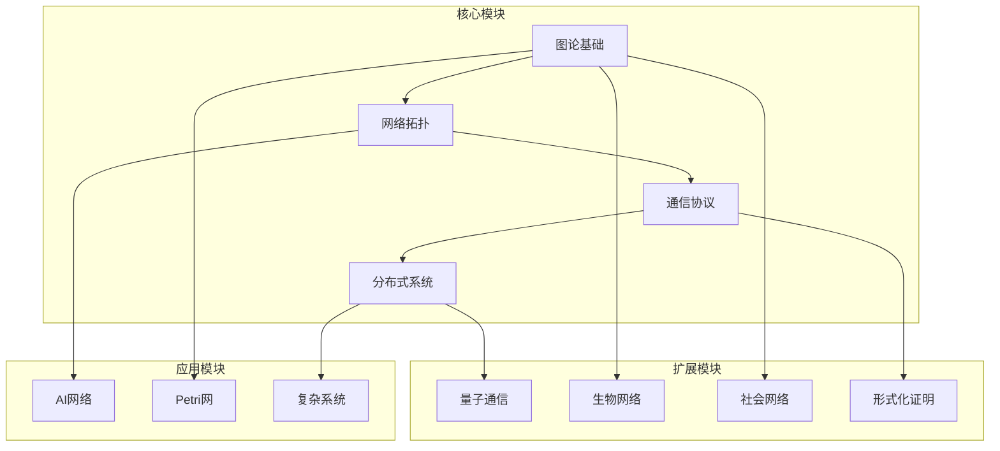

### 1.2 模块依赖关系图

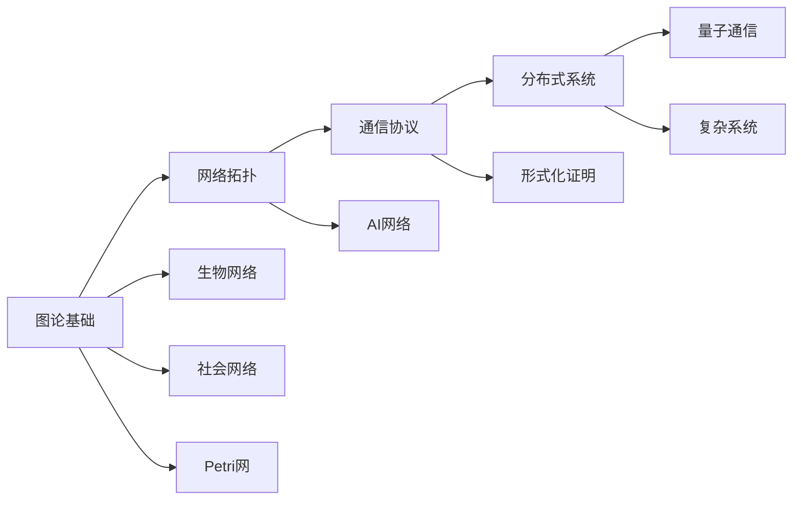

---

## 📊 **二、知识体系图 / Knowledge System Diagrams**

### 2.1 整体知识体系思维导图

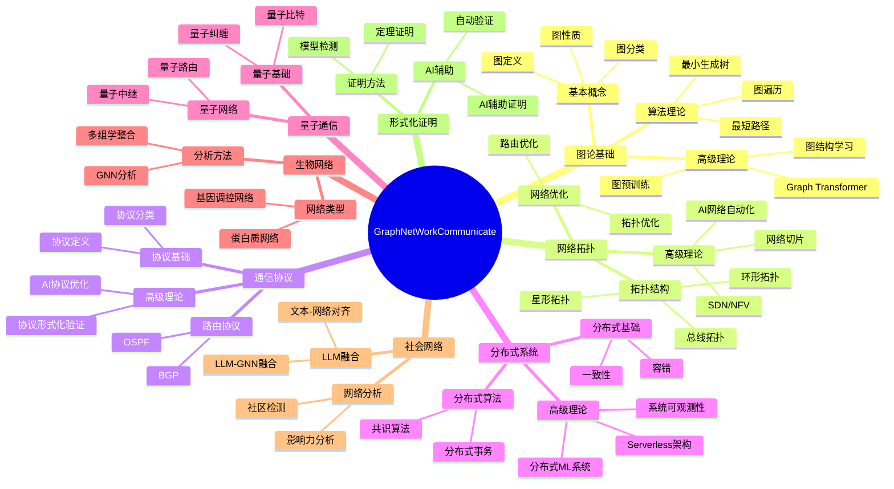

---

## 🛤️ **三、学习路径图 / Learning Path Diagrams**

### 3.1 跨模块学习路径

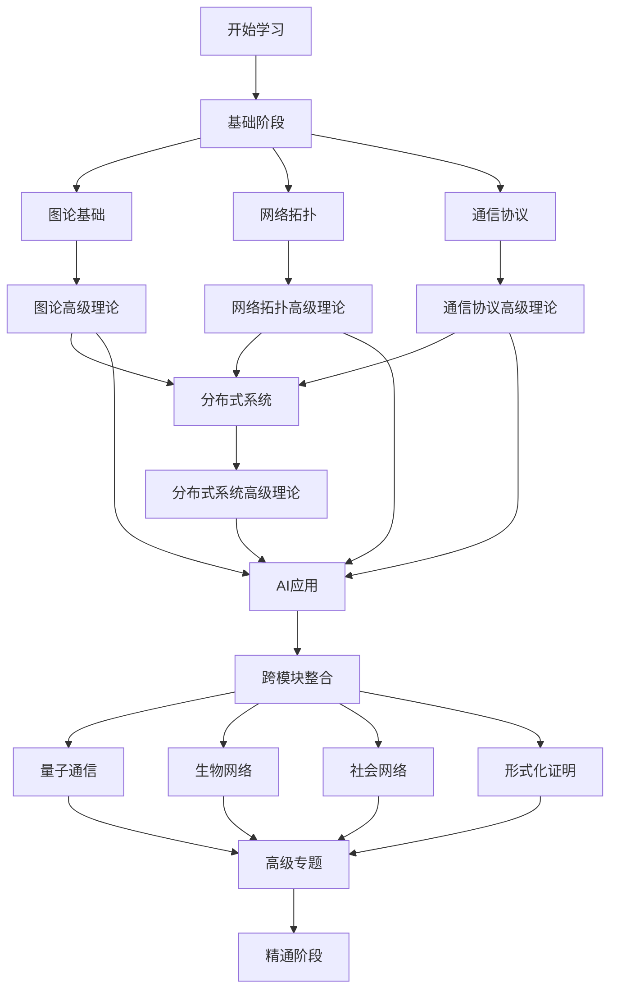

### 3.2 专题学习路径

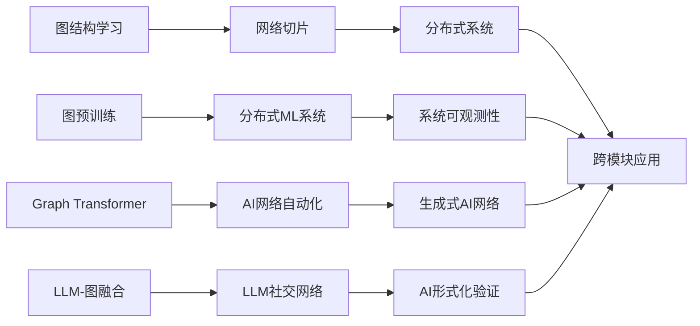

---

## 📋 **四、概念关系多维矩阵 / Concept Relationship Multi-dimensional Matrix**

### 4.1 跨模块核心概念关系矩阵

| 概念类别 | 图论基础 | 网络拓扑 | 通信协议 | 分布式系统 | 量子通信 | 生物网络 | 社会网络 | 形式化证明 |
|---------|---------|---------|---------|-----------|---------|---------|---------|-----------|
| **结构学习** | 图结构学习 | 网络结构学习 | 协议结构学习 | 系统结构学习 | 量子网络结构学习 | 生物网络结构学习 | 社交网络结构学习 | 证明结构学习 |
| **预训练** | 图预训练 | 网络预训练 | 协议预训练 | 系统预训练 | 量子网络预训练 | 生物网络预训练 | 社交网络预训练 | 证明预训练 |
| **强化学习** | 图强化学习 | 网络强化学习 | 协议强化学习 | 系统强化学习 | 量子网络强化学习 | 生物网络强化学习 | 社交网络强化学习 | 证明强化学习 |
| **Transformer** | Graph Transformer | 网络Transformer | 协议Transformer | 系统Transformer | 量子网络Transformer | 生物网络Transformer | 社交网络Transformer | 证明Transformer |
| **LLM融合** | LLM-图融合 | LLM-网络融合 | LLM-协议融合 | LLM-系统融合 | LLM-量子网络融合 | LLM-生物网络融合 | LLM-社交网络融合 | LLM-证明融合 |
| **解释性** | GNN解释性 | 网络解释性 | 协议解释性 | 系统解释性 | 量子网络解释性 | 生物网络解释性 | 社交网络解释性 | 证明解释性 |
| **可扩展性** | 可扩展GNN | 可扩展网络 | 可扩展协议 | 可扩展系统 | 可扩展量子网络 | 可扩展生物网络 | 可扩展社交网络 | 可扩展证明 |
| **优化** | 图结构优化 | 网络拓扑优化 | 协议性能优化 | 系统性能优化 | 量子网络优化 | 生物网络优化 | 社交网络优化 | 证明优化 |

---

### 4.2 跨模块技术栈关系矩阵

| 技术栈 | 图论基础 | 网络拓扑 | 通信协议 | 分布式系统 | 量子通信 | 生物网络 | 社会网络 | 形式化证明 |
|-------|---------|---------|---------|-----------|---------|---------|---------|-----------|
| **AI/ML** | GNN, Graph Transformer | AI网络自动化 | AI协议优化 | 分布式ML系统 | AI量子网络 | AI生物网络 | LLM社交网络 | AI形式化验证 |
| **学习范式** | 图结构学习、预训练 | 网络结构学习 | 协议学习 | 系统学习 | 量子网络学习 | 生物网络学习 | 社交网络学习 | 证明学习 |
| **优化方法** | 图结构优化 | 网络优化 | 协议优化 | 系统优化 | 量子网络优化 | 生物网络优化 | 社交网络优化 | 证明优化 |
| **可扩展性** | 可扩展GNN | 可扩展网络 | 可扩展协议 | 可扩展系统 | 可扩展量子网络 | 可扩展生物网络 | 可扩展社交网络 | 可扩展证明 |

---

## 🔗 **五、跨模块推理链路图 / Cross-Module Reasoning Chain Diagrams**

### 5.1 推理链路1：从图结构学习到系统性能优化

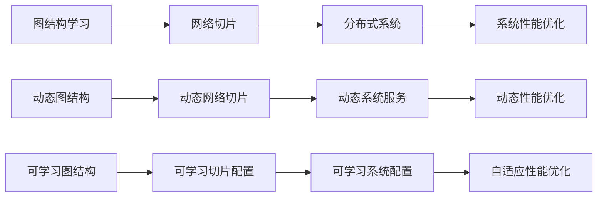

### 5.2 推理链路2：从图预训练到分布式机器学习

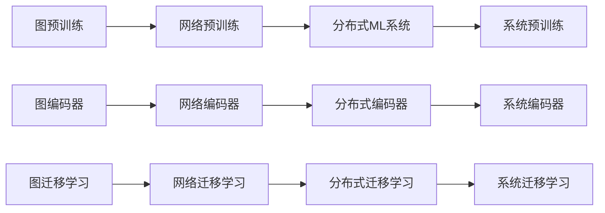

### 5.3 推理链路3：从GNN解释性到系统可观测性

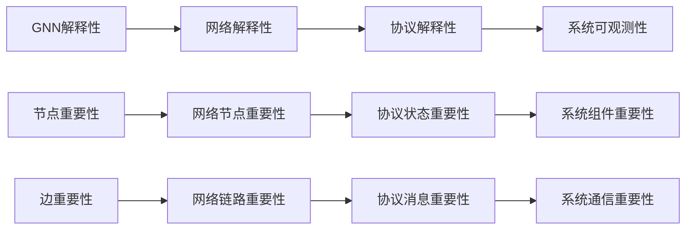

---

## 🎯 **六、统一理论框架图 / Unified Theoretical Framework Diagrams**

### 6.1 统一理论框架思维导图

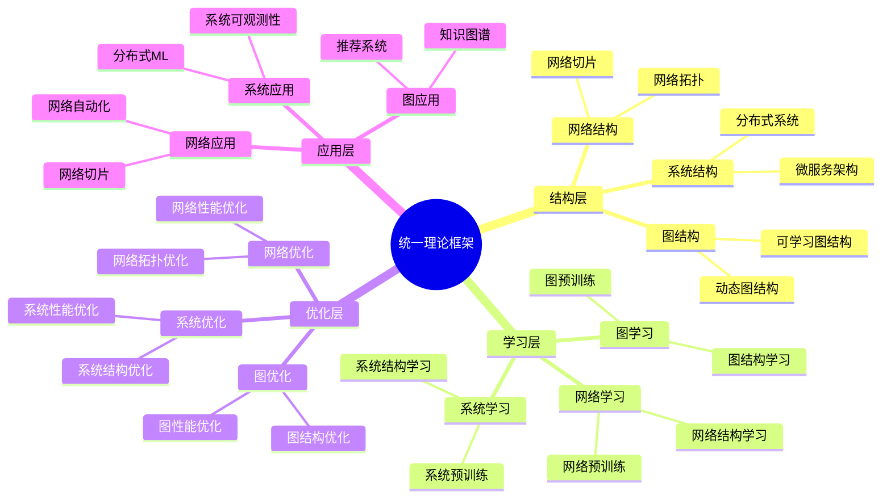

---

### 6.2 跨模块统一框架概念地图

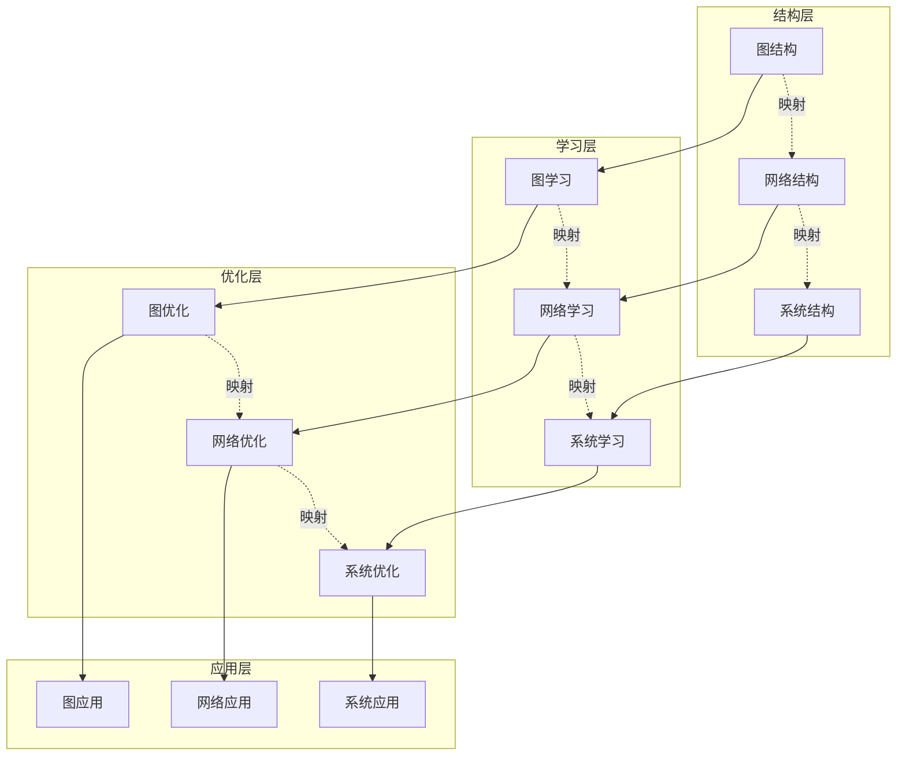

---

## 📝 **七、跨模块学习路径详细规划 / Detailed Cross-Module Learning Path Planning**

### 7.1 基础路径（图论→网络→协议→系统）

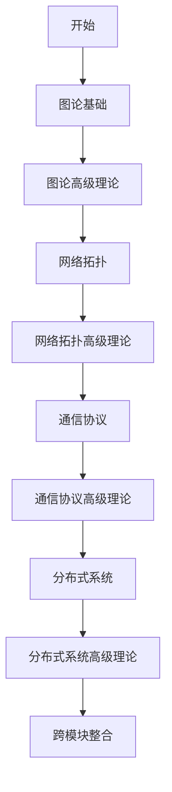

### 7.2 应用路径（AI应用→跨模块应用）

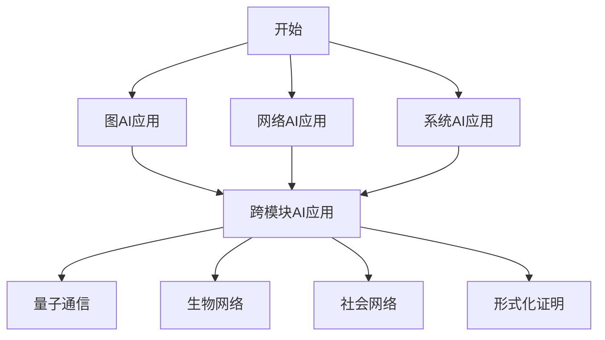

---

## 📊 **八、跨模块概念映射强度矩阵 / Cross-Module Concept Mapping Strength Matrix**

### 8.1 映射强度定义

| 强度等级 | 说明 | 标准 |
|---------|------|------|
| **强** | 概念本质相同，映射直接 | 结构保持、性质保持、算法可迁移 |
| **中** | 概念相关，映射需要转换 | 部分性质保持、需要适配 |
| **弱** | 概念相似，映射需要抽象 | 抽象层次映射、概念类比 |

### 8.2 核心概念映射强度矩阵

| 概念 | 图→网络 | 网络→协议 | 协议→系统 | 图→系统 | 网络→系统 | 映射强度 |
|------|---------|----------|----------|---------|-----------|---------|
| **结构学习** | 强 | 中 | 强 | 中 | 强 | 强 |
| **预训练** | 强 | 强 | 强 | 强 | 强 | 强 |
| **强化学习** | 强 | 中 | 强 | 中 | 强 | 强 |
| **Transformer** | 强 | 中 | 强 | 中 | 强 | 强 |
| **LLM融合** | 强 | 强 | 强 | 强 | 强 | 强 |
| **解释性** | 强 | 中 | 强 | 中 | 强 | 强 |
| **可扩展性** | 强 | 强 | 强 | 强 | 强 | 强 |
| **优化** | 强 | 强 | 强 | 强 | 强 | 强 |

---

## 🎯 **九、跨模块应用场景映射 / Cross-Module Application Scenario Mapping**

### 9.1 应用场景映射矩阵

| 应用场景 | 图论基础 | 网络拓扑 | 通信协议 | 分布式系统 | 映射关系 |
|---------|---------|---------|---------|-----------|---------|
| **推荐系统** | 图结构学习 | 网络结构学习 | 协议优化 | 分布式推荐系统 | 图→网络→系统 |
| **知识图谱** | 图预训练 | 网络预训练 | 协议预训练 | 分布式知识图谱 | 图→网络→协议→系统 |
| **社交网络** | 图结构学习 | 网络结构学习 | - | 分布式社交网络 | 图→网络→系统 |
| **网络切片** | - | 网络切片 | 协议切片 | 系统切片 | 网络→协议→系统 |
| **分布式ML** | 图分布式训练 | 网络分布式训练 | - | 分布式ML系统 | 图→网络→系统 |

---

## 📝 **十、总结 / Summary**

本文档提供了系统性的跨模块思维表征工具，包括：

- ✅ **模块关系图**: 展示模块间的依赖和关联关系
- ✅ **知识体系图**: 展示整体知识体系结构
- ✅ **学习路径图**: 提供跨模块学习路径规划
- ✅ **概念关系矩阵**: 对比跨模块核心概念
- ✅ **推理链路图**: 展示跨模块推理过程
- ✅ **统一理论框架图**: 展示统一理论框架

---

**文档版本**: v1.0
**创建时间**: 2025年1月
**维护者**: GraphNetWorkCommunicate项目组
**状态**: ✅ 持续更新中
