# 跨模块知识关联图谱 / Cross-Module Knowledge Association Map 2024-2025

## 📚 **概述 / Overview**

本文档提供跨模块知识关联的可视化图谱，帮助理解不同模块之间的理论联系、应用关联和技术融合。

**创建时间**: 2025年1月
**状态**: ✅ 完成
**维护者**: GraphNetWorkCommunicate项目组

---

## 🗺️ **一、核心模块关联图谱 / Core Module Association Map**

### 1.1 整体模块关联图

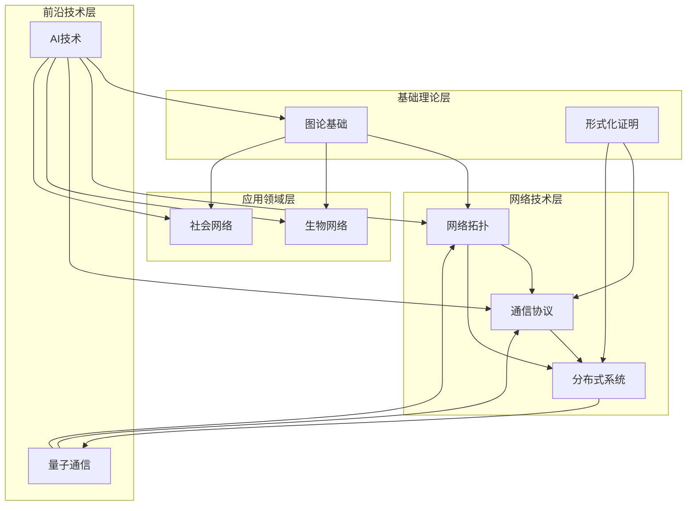

### 1.2 AI技术跨模块应用图谱

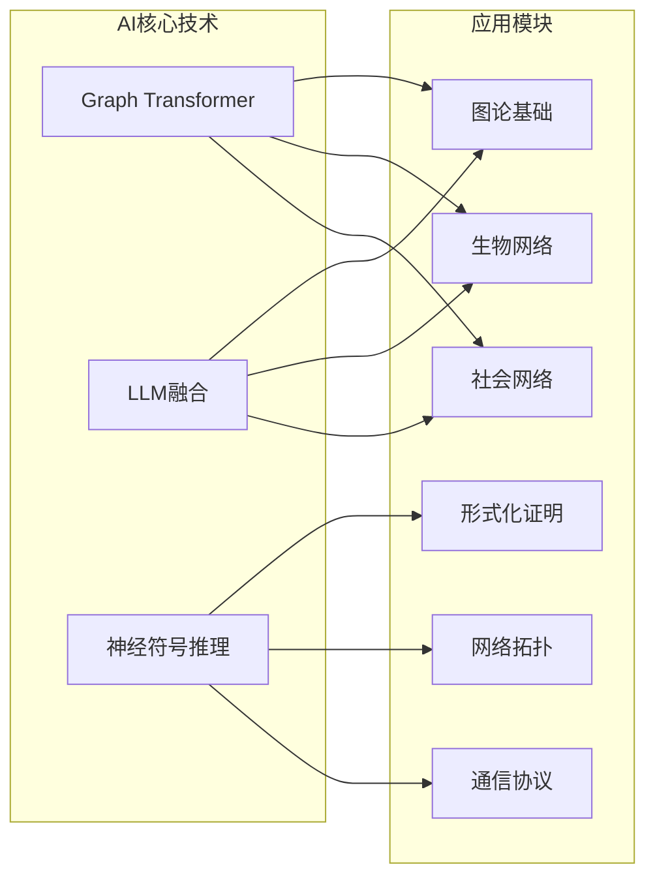

---

## 🔗 **二、专题关联图谱 / Topic Association Map**

### 2.1 2024-2025最新研究专题关联

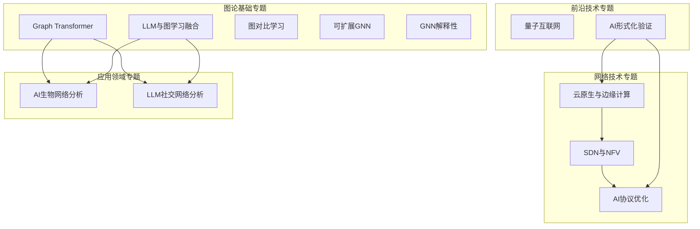

### 2.2 技术融合关系图

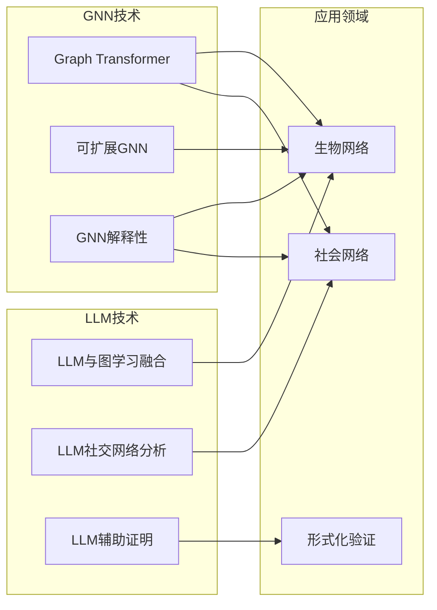

---

## 📊 **三、知识流向图谱 / Knowledge Flow Map**

### 3.1 理论到应用的知识流

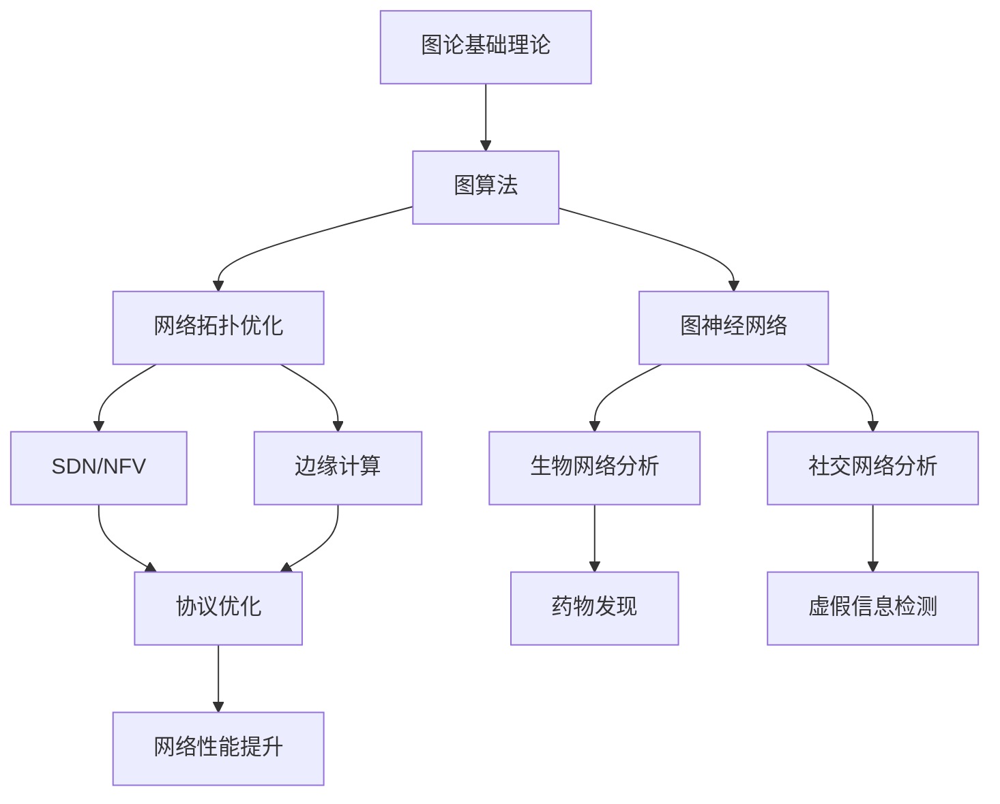

### 3.2 AI技术应用流

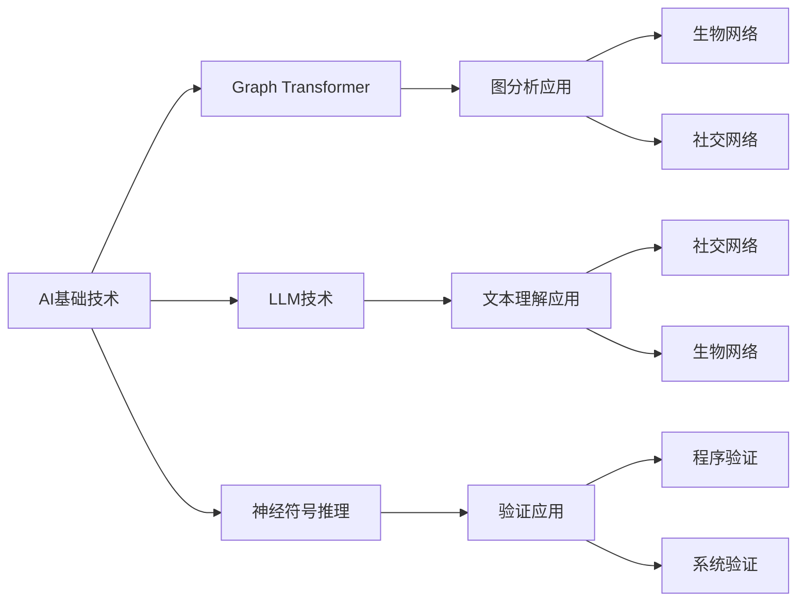

---

## 🎯 **四、应用场景关联图谱 / Application Scenario Association Map**

### 4.1 实际应用场景关联

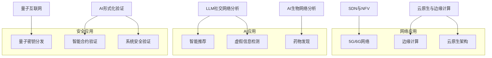

---

## 🔄 **五、技术演进图谱 / Technology Evolution Map**

### 5.1 技术发展时间线

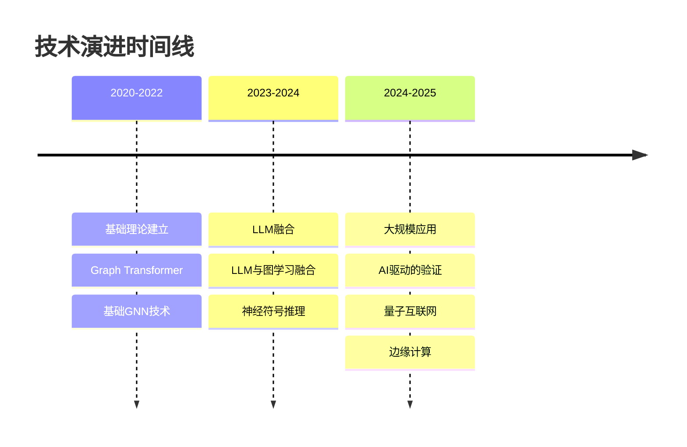

### 5.2 技术成熟度图谱

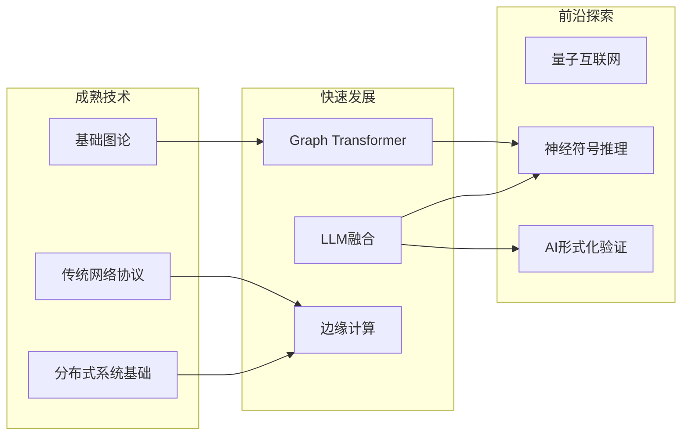

---

## 📈 **六、学习路径关联图谱 / Learning Path Association Map**

### 6.1 跨模块学习路径

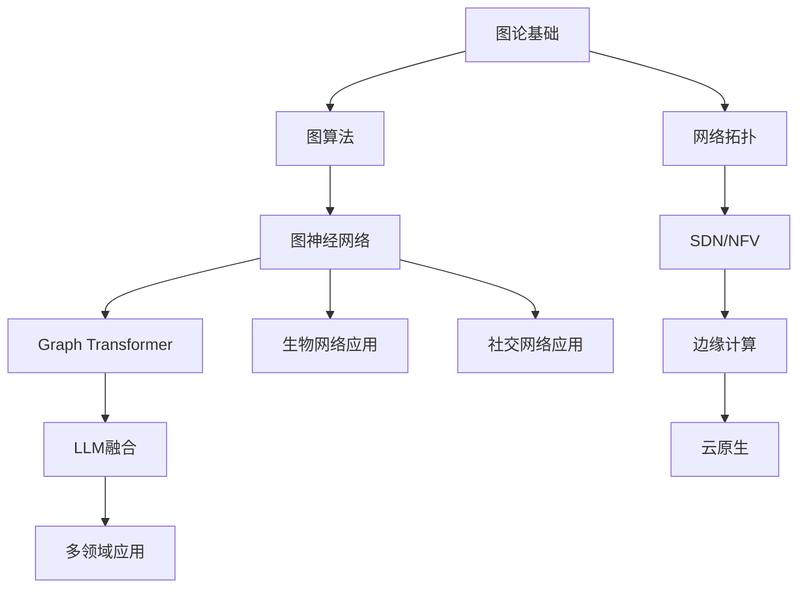

---

## 🎓 **七、研究领域关联图谱 / Research Domain Association Map**

### 7.1 研究领域交叉关系

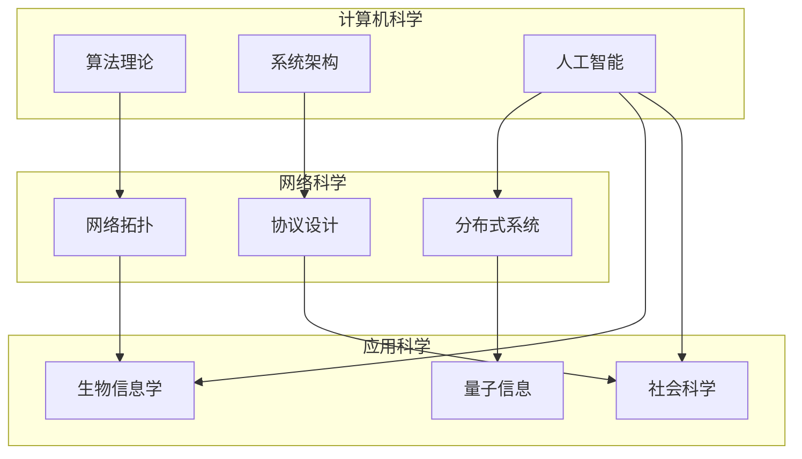

---

## 📚 **八、文档关联索引 / Document Association Index**

### 8.1 核心文档关联

| 模块 | 核心文档 | 关联模块 | 关联专题 |
|------|---------|---------|---------|
| **图论基础** | Graph Transformer专题 | 生物网络、社会网络 | AI生物网络分析、LLM社交网络分析 |
| **网络拓扑** | SDN与NFV专题 | 通信协议、分布式系统 | AI协议优化、云原生与边缘计算 |
| **通信协议** | AI协议优化专题 | 网络拓扑、分布式系统 | SDN与NFV、边缘计算 |
| **分布式系统** | 云原生与边缘计算专题 | 网络拓扑、通信协议 | SDN与NFV、AI协议优化 |
| **量子通信** | 量子互联网专题 | 网络拓扑、通信协议 | SDN与NFV、AI协议优化 |
| **形式化证明** | AI形式化验证专题 | 通信协议、分布式系统 | AI协议优化、云原生 |
| **生物网络** | AI生物网络分析专题 | 图论基础 | Graph Transformer、LLM融合 |
| **社会网络** | LLM社交网络分析专题 | 图论基础 | Graph Transformer、LLM融合 |

---

**文档版本**: v1.0
**创建时间**: 2025年1月
**最后更新**: 2025年1月
**维护者**: GraphNetWorkCommunicate项目组
**状态**: ✅ 完成
