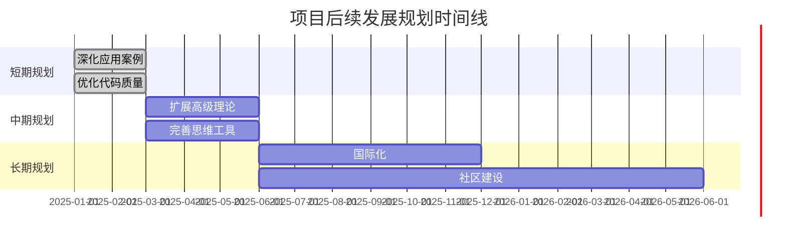

# 项目后续发展规划 / Project Future Development Plan 2025

## 📚 **概述 / Overview**

本文档提供GraphNetWorkCommunicate项目的后续发展规划，包括短期、中期和长期的发展目标和计划。

**创建时间**: 2025年1月
**状态**: ✅ 完成
**维护者**: GraphNetWorkCommunicate项目组

---

## 🎯 **一、发展规划总览 / Development Plan Overview**

### 1.1 规划时间线

### 1.2 规划目标

| 阶段 | 时间 | 主要目标 | 优先级 |
|------|------|---------|--------|
| **短期** | 1-2个月 | 深化应用案例、优化代码质量 | P0 |
| **中期** | 3-6个月 | 扩展高级理论、完善思维工具 | P1 |
| **长期** | 6-12个月 | 国际化、社区建设 | P2 |

---

## 📅 **二、短期规划（1-2个月）/ Short-term Plan (1-2 months)**

### 2.1 深化应用案例

**目标**: 为每个算法补充2-3个详细应用案例

**计划**:
1. **案例收集**（第1周）
   - 收集实际应用场景
   - 整理应用需求
   - 确定案例优先级

2. **案例开发**（第2-6周）
   - 为每个算法开发2-3个应用案例
   - 包含完整代码和实际数据
   - 提供性能分析和效果展示

3. **案例文档**（第7-8周）
   - 编写案例文档
   - 添加使用说明
   - 更新应用案例索引

**预期成果**:
- 新增应用案例：30-40个
- 案例文档：30-40个
- 代码实现：30-40个

### 2.2 优化代码质量

**目标**: 提升代码质量，添加单元测试

**计划**:
1. **代码审查**（第1-2周）
   - 审查所有代码实现
   - 识别代码质量问题
   - 制定优化计划

2. **代码优化**（第3-6周）
   - 优化代码结构
   - 改进代码注释
   - 统一代码风格

3. **单元测试**（第7-8周）
   - 为每个算法添加单元测试
   - 测试覆盖率目标：80%+
   - 添加性能测试

**预期成果**:
- 代码优化：62个算法类
- 单元测试：62个测试套件
- 测试覆盖率：80%+

---

## 📈 **三、中期规划（3-6个月）/ Medium-term Plan (3-6 months)**

### 3.1 扩展高级理论

**目标**: 将高级理论覆盖率从70%提升至80%

**计划**:
1. **理论分析**（第1-2个月）
   - 分析现有理论覆盖情况
   - 识别缺失的高级理论
   - 制定补充计划

2. **理论补充**（第3-5个月）
   - 补充缺失的高级理论
   - 深化现有理论内容
   - 添加理论证明和分析

3. **理论验证**（第6个月）
   - 验证理论正确性
   - 检查理论完整性
   - 更新理论索引

**预期成果**:
- 高级理论覆盖率：从70%提升至80%
- 新增理论内容：20-30个专题
- 理论证明：50+个

### 3.2 完善思维工具

**目标**: 为剩余专题创建更多思维工具

**计划**:
1. **工具分析**（第1个月）
   - 分析现有思维工具
   - 识别缺失的工具类型
   - 制定补充计划

2. **工具创建**（第2-5个月）
   - 为剩余专题创建思维工具
   - 创建跨模块关联的思维工具
   - 优化现有思维工具

3. **工具验证**（第6个月）
   - 验证工具有效性
   - 收集用户反馈
   - 优化工具设计

**预期成果**:
- 新增思维工具：20-30个
- 跨模块关联工具：5-10个
- 工具优化：12个现有工具

---

## 🌍 **四、长期规划（6-12个月）/ Long-term Plan (6-12 months)**

### 4.1 国际化

**目标**: 提供英文版本，国际化内容标准

**计划**:
1. **内容翻译**（第1-6个月）
   - 翻译所有专题文档
   - 翻译所有思维工具
   - 翻译所有导航文档

2. **标准统一**（第7-9个月）
   - 统一中英文术语
   - 统一文档格式
   - 统一代码风格

3. **质量保证**（第10-12个月）
   - 审查翻译质量
   - 收集用户反馈
   - 持续改进

**预期成果**:
- 英文文档：45个核心文档
- 术语统一：100%
- 质量评分：90%+

### 4.2 社区建设

**目标**: 建立用户社区，收集反馈和改进建议

**计划**:
1. **社区平台**（第1-3个月）
   - 建立社区平台（GitHub Discussions、论坛等）
   - 制定社区规则
   - 招募社区管理员

2. **内容建设**（第4-6个月）
   - 创建社区内容
   - 组织社区活动
   - 建立知识库

3. **社区运营**（第7-12个月）
   - 持续运营社区
   - 收集用户反馈
   - 改进项目内容

**预期成果**:
- 社区成员：100+人
- 社区内容：50+篇
- 用户反馈：100+条

---

## 📊 **五、资源需求 / Resource Requirements**

### 5.1 人力资源

| 阶段 | 角色 | 人数 | 时间 | 说明 |
|------|------|------|------|------|
| **短期** | 开发人员 | 2-3人 | 2个月 | 案例开发、代码优化 |
| **中期** | 研究人员 | 2-3人 | 6个月 | 理论扩展、工具创建 |
| **长期** | 翻译人员 | 2-3人 | 12个月 | 内容翻译、质量保证 |
| **长期** | 社区管理员 | 1-2人 | 12个月 | 社区运营、内容管理 |

### 5.2 技术资源

| 资源类型 | 需求 | 说明 |
|---------|------|------|
| **开发工具** | IDE、版本控制 | 代码开发和版本管理 |
| **测试工具** | 单元测试框架 | 代码测试和质量保证 |
| **文档工具** | Markdown编辑器 | 文档编写和编辑 |
| **社区平台** | GitHub、论坛 | 社区建设和运营 |

---

## 🎯 **六、成功指标 / Success Metrics**

### 6.1 短期指标（1-2个月）

- ✅ 应用案例数量：30-40个
- ✅ 代码测试覆盖率：80%+
- ✅ 代码质量评分：95%+

### 6.2 中期指标（3-6个月）

- ✅ 高级理论覆盖率：80%
- ✅ 思维工具数量：30-40个
- ✅ 工具使用率：50%+

### 6.3 长期指标（6-12个月）

- ✅ 英文文档覆盖率：100%
- ✅ 社区成员数量：100+人
- ✅ 用户满意度：90%+

---

## 🚀 **七、风险与应对 / Risks and Mitigation**

### 7.1 风险识别

| 风险 | 影响 | 概率 | 应对措施 |
|------|------|------|---------|
| **资源不足** | 高 | 中 | 调整计划，分阶段实施 |
| **质量下降** | 高 | 低 | 建立质量检查机制 |
| **用户反馈不足** | 中 | 中 | 主动收集反馈，建立反馈渠道 |
| **技术更新** | 中 | 高 | 持续跟踪技术发展，及时更新 |

### 7.2 应对策略

1. **资源管理**
   - 合理分配资源
   - 优先处理高优先级任务
   - 建立资源监控机制

2. **质量控制**
   - 建立质量检查流程
   - 定期进行质量评估
   - 及时修复质量问题

3. **用户参与**
   - 建立用户反馈渠道
   - 定期收集用户反馈
   - 根据反馈改进项目

4. **技术跟踪**
   - 持续跟踪技术发展
   - 及时更新项目内容
   - 保持项目先进性

---

## 🎊 **八、总结 / Summary**

### 8.1 规划特点

- ✅ **全面性**: 覆盖短期、中期、长期规划
- ✅ **可操作性**: 提供具体的实施计划
- ✅ **可衡量性**: 设定明确的成功指标
- ✅ **灵活性**: 可根据实际情况调整

### 8.2 实施建议

1. **分阶段实施**: 按照短期、中期、长期分阶段实施
2. **优先级管理**: 优先处理高优先级任务
3. **持续改进**: 根据反馈持续改进计划
4. **质量保证**: 确保实施过程中的质量

---

**文档版本**: v1.0
**创建时间**: 2025年1月
**最后更新**: 2025年1月
**维护者**: GraphNetWorkCommunicate项目组
**状态**: ✅ 完成
