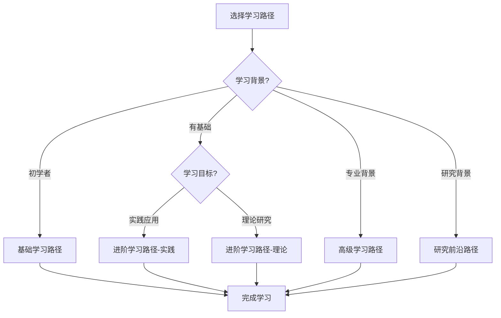

# 项目学习路径完整指南 / Project Learning Path Complete Guide 2025

## 📚 **概述 / Overview**

本文档提供GraphNetWorkCommunicate项目的完整学习路径指南，帮助不同背景的学习者找到合适的学习路径。

**创建时间**: 2025年1月
**状态**: ✅ 完成
**维护者**: GraphNetWorkCommunicate项目组

---

## 🎯 **一、学习路径分类 / Learning Path Categories**

### 1.1 按背景分类

| 背景 | 推荐路径 | 预计时间 | 难度 |
|------|---------|---------|------|
| **初学者** | 基础学习路径 | 2-3个月 | ⭐⭐ |
| **有基础** | 进阶学习路径 | 3-4个月 | ⭐⭐⭐ |
| **专业背景** | 高级学习路径 | 4-6个月 | ⭐⭐⭐⭐ |
| **研究背景** | 研究前沿路径 | 6-12个月 | ⭐⭐⭐⭐⭐ |

### 1.2 按目标分类

| 学习目标 | 推荐路径 | 重点内容 |
|---------|---------|---------|
| **理论学习** | 理论深入学习路径 | 理论框架、证明、分析 |
| **实践应用** | 应用实践路径 | 代码实现、应用案例 |
| **研究探索** | 研究前沿路径 | 最新研究、未来方向 |

---

## 📖 **二、基础学习路径 / Beginner Learning Path**

### 2.1 路径概览

```
阶段1: 基础理论（1个月）
  ├── 图论基础
  │   ├── 基本概念
  │   ├── 图的算法
  │   └── 图机器学习基础
  └── 网络拓扑基础
      ├── 拓扑结构
      └── 拓扑优化基础

阶段2: 图神经网络（1个月）
  ├── Graph Transformer专题
  └── 应用案例学习

阶段3: 实践应用（1个月）
  ├── 应用案例学习
  └── 代码实现练习
```

### 2.2 推荐文档

1. **图论基础**
   - [图论基础-基本概念](01-图论基础/01-基本概念.md)
   - [图论基础-图的算法](01-图论基础/03-图的算法.md)

2. **图神经网络**
   - [Graph Transformer专题](01-图论基础/05-高级理论/Graph-Transformer专题-2024-2025.md)
   - [Graph Transformer思维工具](01-图论基础/05-高级理论/思维表征工具-Graph-Transformer专题-2024-2025.md)

3. **应用案例**
   - [应用案例与代码示例补充](应用案例与代码示例补充-2025.md)

### 2.3 学习目标

- ✅ 理解图论基本概念
- ✅ 掌握图算法基础
- ✅ 了解图神经网络
- ✅ 能够阅读和应用代码

---

## 🚀 **三、进阶学习路径 / Intermediate Learning Path**

### 3.1 路径概览

```
阶段1: 图神经网络进阶（1.5个月）
  ├── Graph Transformer深入
  ├── LLM与图学习融合
  ├── 图对比学习
  └── 可扩展GNN

阶段2: 网络技术（1个月）
  ├── SDN与NFV
  ├── AI驱动的协议优化
  └── 云原生与边缘计算

阶段3: 应用领域（1.5个月）
  ├── AI驱动的生物网络分析
  ├── LLM与GNN驱动的社交网络分析
  └── 实际项目实践
```

### 3.2 推荐文档

1. **图神经网络进阶**
   - [LLM与图学习融合专题](01-图论基础/05-高级理论/LLM与图学习融合专题-2024-2025.md)
   - [可扩展GNN专题](01-图论基础/05-高级理论/可扩展图神经网络专题-2024-2025.md)
   - [GNN解释性专题](01-图论基础/05-高级理论/图神经网络解释性专题-2024-2025.md)

2. **网络技术**
   - [SDN与NFV专题](02-网络拓扑/05-高级理论/SDN与NFV专题-2024-2025.md)
   - [AI驱动的协议优化专题](03-通信协议/05-高级理论/AI驱动的协议优化专题-2024-2025.md)

3. **应用领域**
   - [AI驱动的生物网络分析专题](06-生物网络/05-高级理论/AI驱动的生物网络分析专题-2024-2025.md)
   - [LLM与GNN驱动的社交网络分析专题](07-社会网络/05-高级理论/LLM与GNN驱动的社交网络分析专题-2024-2025.md)

### 3.3 学习目标

- ✅ 深入理解图神经网络
- ✅ 掌握网络技术
- ✅ 了解应用领域
- ✅ 能够设计和实现系统

---

## 🎓 **四、高级学习路径 / Advanced Learning Path**

### 4.1 路径概览

```
阶段1: 前沿技术（2个月）
  ├── 量子互联网
  ├── AI驱动的形式化验证
  └── 最新研究专题

阶段2: 跨学科整合（1.5个月）
  ├── 跨模块知识关联
  ├── 理论关系分析
  └── 应用模式归纳

阶段3: 研究探索（2.5个月）
  ├── 最新研究跟踪
  ├── 未来方向探索
  └── 研究项目实践
```

### 4.2 推荐文档

1. **前沿技术**
   - [量子互联网专题](05-量子通信/05-高级理论/量子互联网与大规模网络专题-2024-2025.md)
   - [AI驱动的形式化验证专题](08-形式化证明/05-高级理论/AI驱动的形式化验证专题-2024-2025.md)

2. **跨学科整合**
   - [跨模块知识关联图谱](跨模块知识关联图谱-2024-2025.md)
   - [项目整体知识体系导航](项目整体知识体系导航-2025.md)

3. **研究探索**
   - 所有专题文档的最新研究部分
   - 参考文献中的最新论文

### 4.3 学习目标

- ✅ 掌握前沿技术
- ✅ 理解跨学科整合
- ✅ 能够进行独立研究
- ✅ 能够跟踪最新研究

---

## 🔬 **五、研究前沿路径 / Research Frontier Path**

### 5.1 路径概览

```
阶段1: 理论基础（2个月）
  ├── 所有专题文档
  └── 理论框架深入

阶段2: 最新研究（2个月）
  ├── 2024-2025最新论文
  ├── 顶级会议论文
  └── 研究趋势分析

阶段3: 研究实践（4个月）
  ├── 研究项目设计
  ├── 实验实施
  └── 论文撰写
```

### 5.2 推荐资源

1. **专题文档**
   - 所有12个专题文档
   - 80+篇最新论文引用

2. **研究资源**
   - NeurIPS, ICLR, ICML 2024-2025论文
   - SIGCOMM, CAV等顶级会议论文
   - Nature, Science等顶级期刊论文

### 5.3 研究目标

- ✅ 深入理解前沿理论
- ✅ 跟踪最新研究进展
- ✅ 能够进行原创研究
- ✅ 能够发表高质量论文

---

## 📊 **六、学习路径对比 / Learning Path Comparison**

### 6.1 路径对比矩阵

| 路径 | 时间 | 难度 | 深度 | 广度 | 实践 |
|------|------|------|------|------|------|
| **基础路径** | 2-3月 | ⭐⭐ | 中等 | 窄 | 低 |
| **进阶路径** | 3-4月 | ⭐⭐⭐ | 高 | 中等 | 中等 |
| **高级路径** | 4-6月 | ⭐⭐⭐⭐ | 很高 | 宽 | 高 |
| **研究路径** | 6-12月 | ⭐⭐⭐⭐⭐ | 最高 | 最宽 | 最高 |

### 6.2 路径选择建议



---

## 🎯 **七、学习检查点 / Learning Checkpoints**

### 7.1 基础路径检查点

| 检查点 | 内容 | 标准 |
|--------|------|------|
| **检查点1** | 图论基础 | 理解基本概念和算法 |
| **检查点2** | 图神经网络 | 理解Graph Transformer |
| **检查点3** | 应用实践 | 能够运行和修改代码 |

### 7.2 进阶路径检查点

| 检查点 | 内容 | 标准 |
|--------|------|------|
| **检查点1** | 图神经网络进阶 | 理解多种GNN架构 |
| **检查点2** | 网络技术 | 理解SDN/NFV和协议优化 |
| **检查点3** | 应用领域 | 能够设计应用系统 |

### 7.3 高级路径检查点

| 检查点 | 内容 | 标准 |
|--------|------|------|
| **检查点1** | 前沿技术 | 理解量子互联网和AI验证 |
| **检查点2** | 跨学科整合 | 理解跨模块关联 |
| **检查点3** | 研究探索 | 能够跟踪最新研究 |

---

## 📚 **八、学习资源推荐 / Learning Resources Recommendation**

### 8.1 核心文档

- [项目整体知识体系导航](项目整体知识体系导航-2025.md)
- [项目使用指南](项目使用指南-2025.md)
- [项目快速参考指南](项目快速参考指南-2025.md)

### 8.2 专题文档

- 所有12个专题文档
- 所有12个思维工具文档

### 8.3 应用案例

- [应用案例与代码示例补充](应用案例与代码示例补充-2025.md)

---

## 🎊 **九、总结 / Summary**

### 9.1 路径特点

- ✅ **多样性**: 多种学习路径适应不同需求
- ✅ **完整性**: 覆盖从基础到研究的所有阶段
- ✅ **实用性**: 提供具体的学习建议和检查点
- ✅ **灵活性**: 可以根据需要调整路径

### 9.2 使用建议

1. **选择合适路径**: 根据背景和目标选择
2. **按阶段学习**: 循序渐进，不要跳跃
3. **实践结合**: 理论学习与实践相结合
4. **定期检查**: 使用检查点评估学习进度

---

**文档版本**: v1.0
**创建时间**: 2025年1月
**最后更新**: 2025年1月
**维护者**: GraphNetWorkCommunicate项目组
**状态**: ✅ 完成
