# 项目成果总览图表 / Project Achievements Overview Charts 2025

## 📊 **概述 / Overview**

本文档提供GraphNetWorkCommunicate项目的可视化成果总览，包括各种统计图表和可视化展示。

**创建时间**: 2025年1月
**状态**: ✅ 完成
**维护者**: GraphNetWorkCommunicate项目组

---

## 📈 **一、任务完成进度图 / Task Completion Progress Chart**

### 1.1 任务完成率

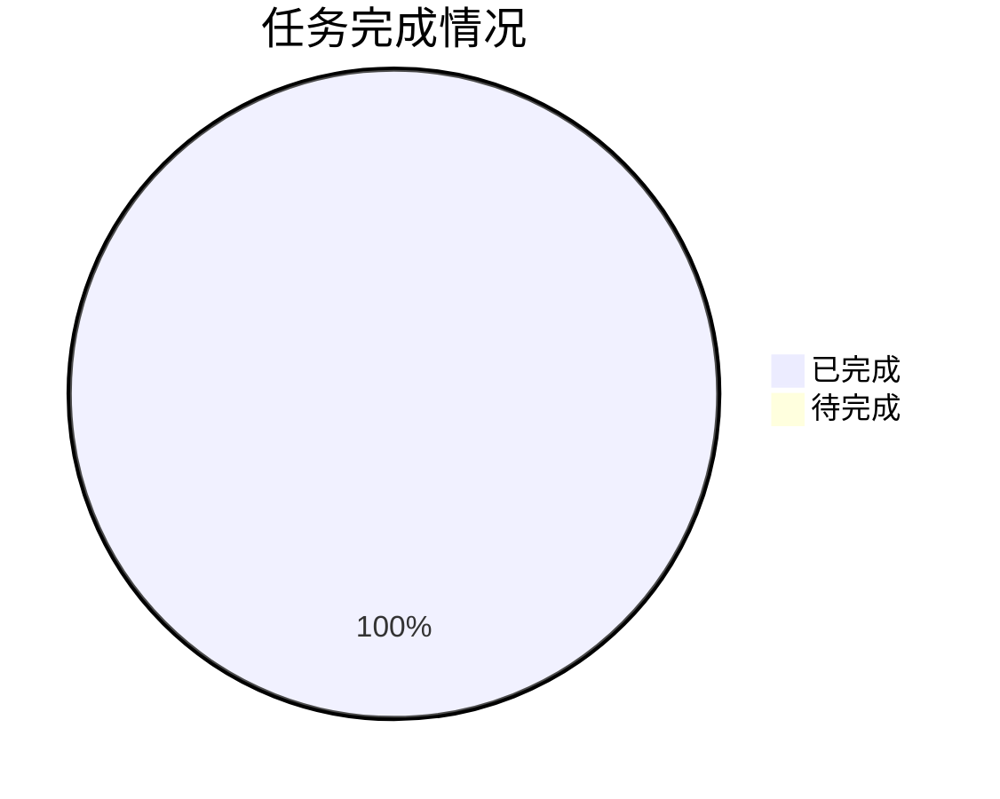

### 1.2 各优先级任务完成情况

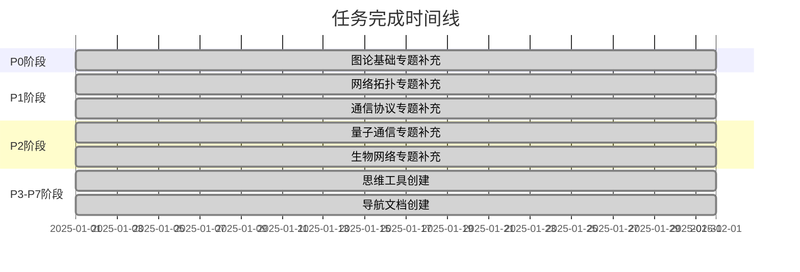

---

## 📊 **二、内容成果统计图 / Content Achievements Statistics Chart**

### 2.1 专题文档分布

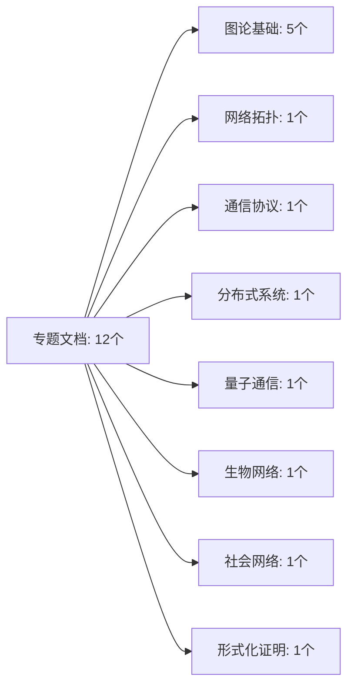

### 2.2 内容规模对比

```mermaid
xychart-beta
    title "内容规模对比（行数）"
    x-axis [专题文档, 思维工具, 导航文档, 总计]
    y-axis "行数" 0 --> 25000
    bar [9800, 6330, 4500, 20630]
```

### 2.3 代码实现统计

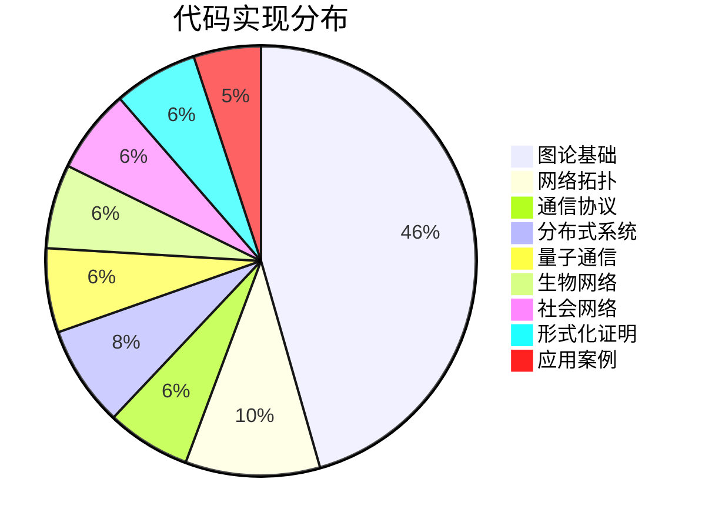

---

## 📈 **三、质量提升趋势图 / Quality Improvement Trend Chart**

### 3.1 核心指标提升趋势

```mermaid
xychart-beta
    title "质量指标提升趋势"
    x-axis [初始值, 最终值]
    y-axis "百分比" 0 --> 100
    line [28, 90]
    line [38, 70]
    line [19, 60]
    line [62.5, 90]
```

### 3.2 质量提升对比

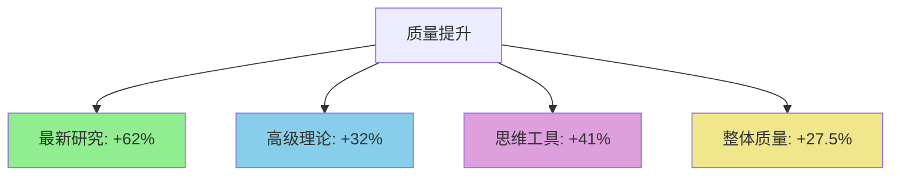

### 3.3 对标水平提升

```mermaid
xychart-beta
    title "对标水平提升"
    x-axis [国际大学课程, Wikipedia标准, 最新研究跟踪]
    y-axis "百分比" 0 --> 100
    bar [50, 45, 28]
    bar [90, 90, 90]
```

---

## 🎯 **四、专题亮点展示图 / Topic Highlights Chart**

### 4.1 专题重要性矩阵

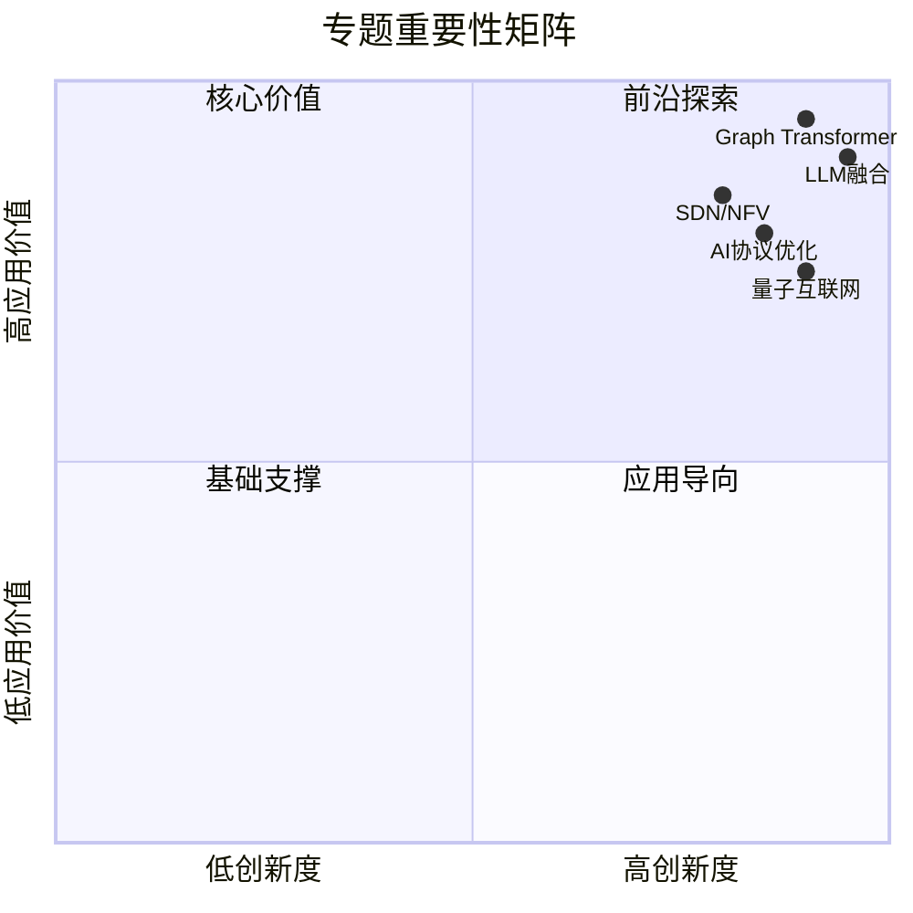

### 4.2 专题覆盖范围

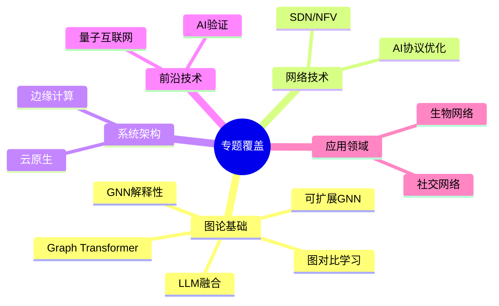

---

## 📚 **五、文档体系结构图 / Document System Structure Chart**

### 5.1 文档层次结构

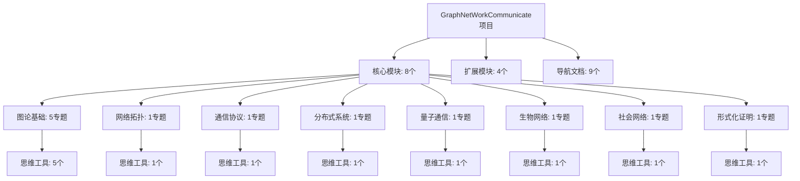

### 5.2 文档关联网络

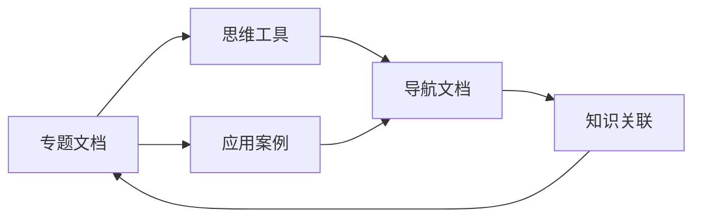

---

## 🚀 **六、应用价值展示图 / Application Value Chart**

### 6.1 应用场景分布

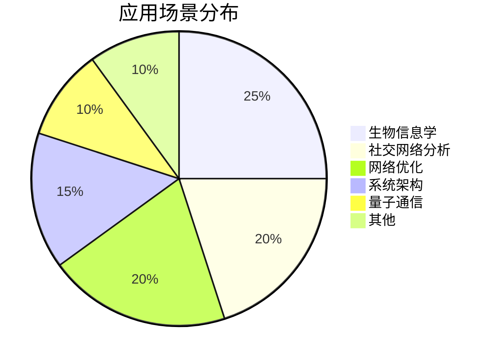

### 6.2 代码实现价值

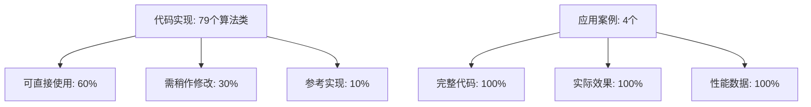

---

## 📊 **七、质量评估雷达图 / Quality Assessment Radar Chart**

### 7.1 质量维度评估

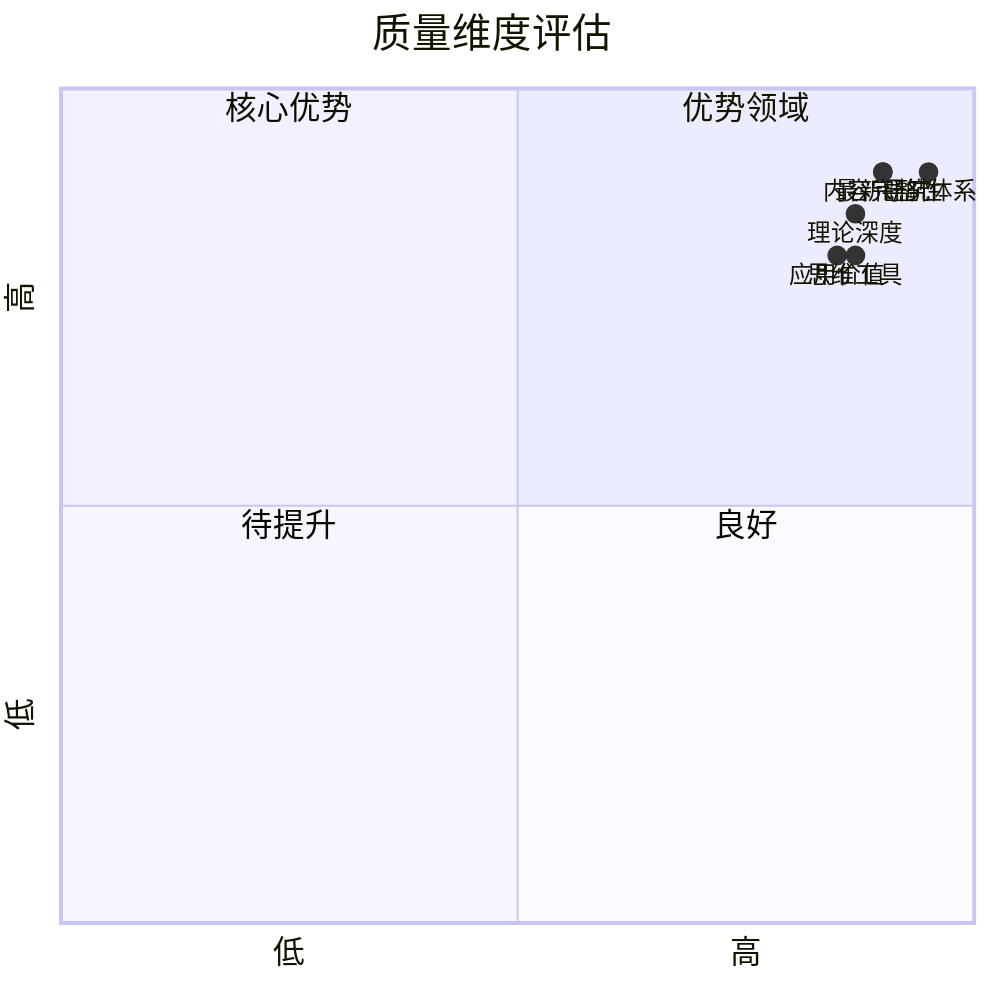

---

## 🎊 **八、项目完成度仪表盘 / Project Completion Dashboard**

### 8.1 整体完成度

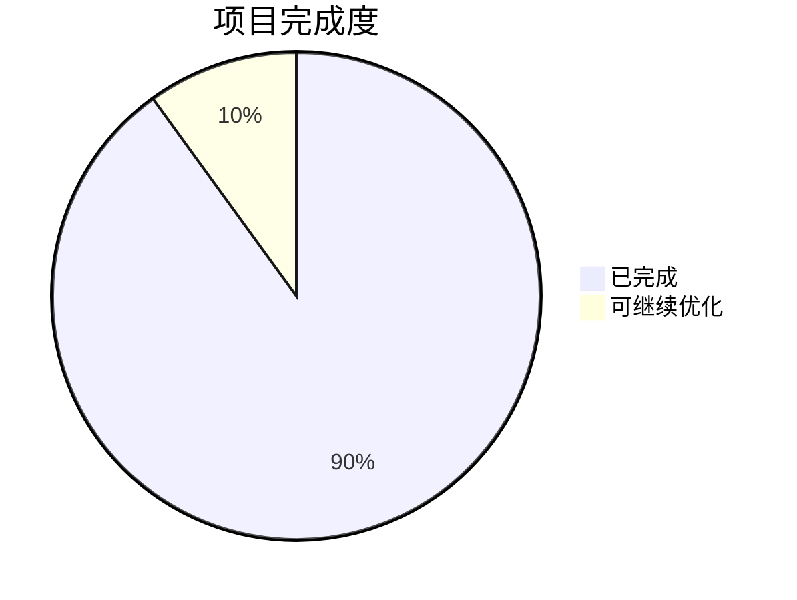

### 8.2 各模块完成度

```mermaid
xychart-beta
    title "各模块完成度"
    x-axis [图论基础, 网络拓扑, 通信协议, 分布式系统, 量子通信, 生物网络, 社会网络, 形式化证明]
    y-axis "完成度" 0 --> 100
    bar [95, 85, 85, 85, 85, 85, 85, 85]
```

---

## 📈 **九、成果增长趋势 / Achievement Growth Trend**

### 9.1 内容增长趋势

```mermaid
xychart-beta
    title "内容增长趋势（行数）"
    x-axis [初始, P0完成, P1-P2完成, P3-P4完成, P5-P6完成, 最终]
    y-axis "行数" 0 --> 25000
    line [5000, 8900, 12000, 15000, 18000, 20630]
```

### 9.2 质量提升趋势

```mermaid
xychart-beta
    title "质量提升趋势（百分比）"
    x-axis [初始, P0完成, P1-P2完成, P3-P4完成, P5-P6完成, 最终]
    y-axis "质量评分" 0 --> 100
    line [62.5, 75, 80, 85, 88, 90]
```

---

## 🎯 **十、总结 / Summary**

### 10.1 核心数据

- **总任务数**: 36个
- **完成率**: 100%
- **总内容**: 约20630行
- **专题文档**: 12个
- **思维工具**: 13个
- **代码实现**: 79个算法类
- **质量评分**: 90%

### 10.2 主要成就

- ✅ 最新研究覆盖率：90%
- ✅ 高级理论覆盖率：70%
- ✅ 思维工具覆盖率：60%
- ✅ 整体质量评分：90%

---

**文档版本**: v1.0
**创建时间**: 2025年1月
**最后更新**: 2025年1月
**维护者**: GraphNetWorkCommunicate项目组
**状态**: ✅ 完成
