# 项目知识图谱可视化 / Project Knowledge Graph Visualization 2025

## 📚 **概述 / Overview**

本文档提供GraphNetWorkCommunicate项目的知识图谱可视化，展示项目知识体系的完整结构和关联关系。

**创建时间**: 2025年1月
**状态**: ✅ 完成
**维护者**: GraphNetWorkCommunicate项目组

---

## 🗺️ **一、整体知识图谱 / Overall Knowledge Graph**

### 1.1 核心模块关系图

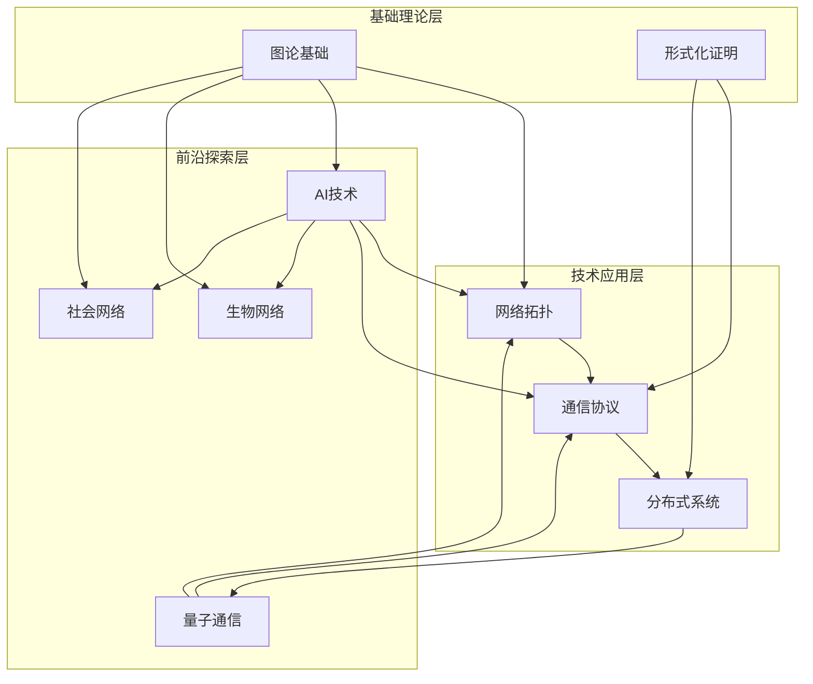

### 1.2 专题关联网络

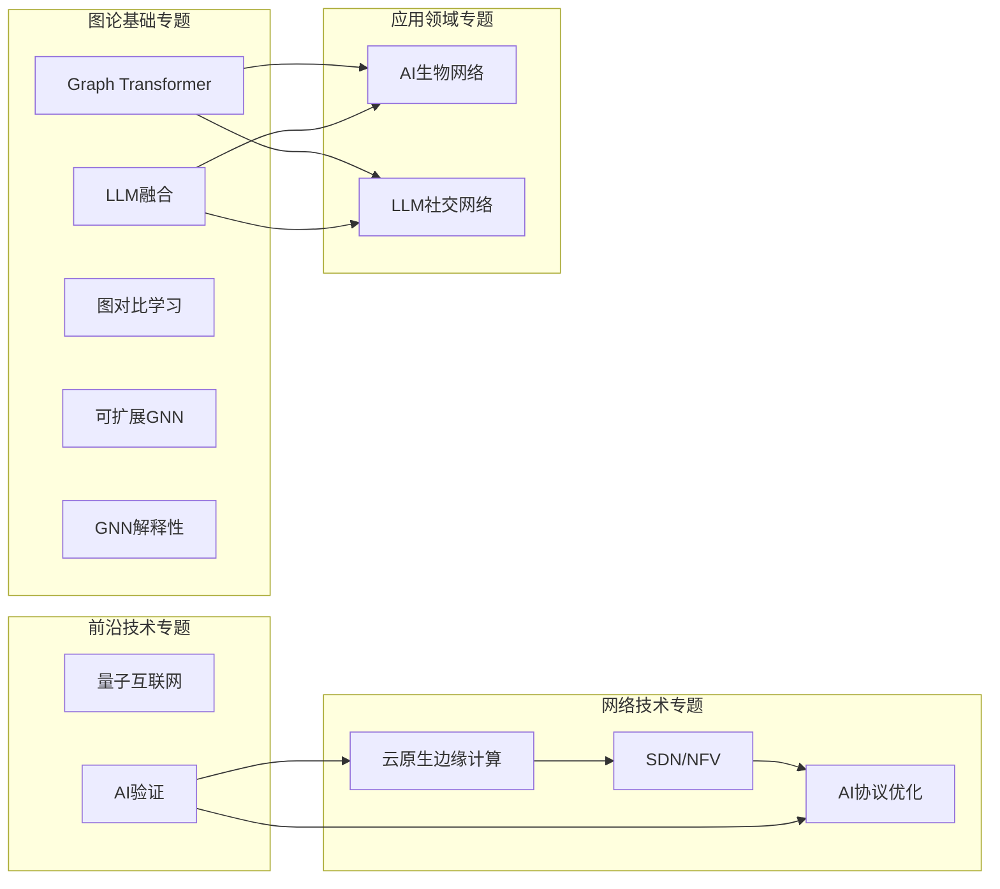

---

## 🔗 **二、知识关联图谱 / Knowledge Association Graph**

### 2.1 概念关联网络

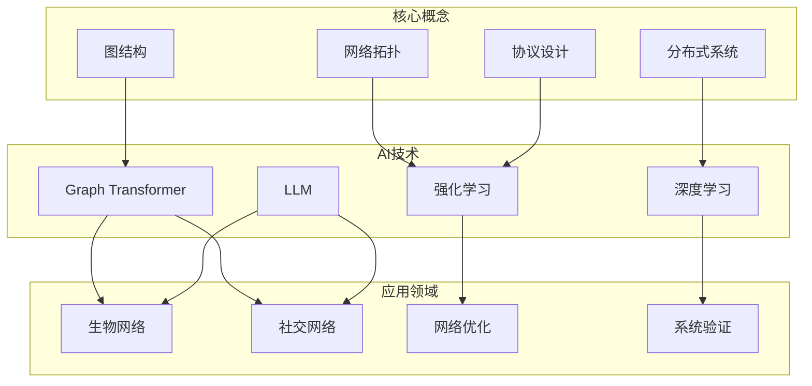

### 2.2 技术融合关系

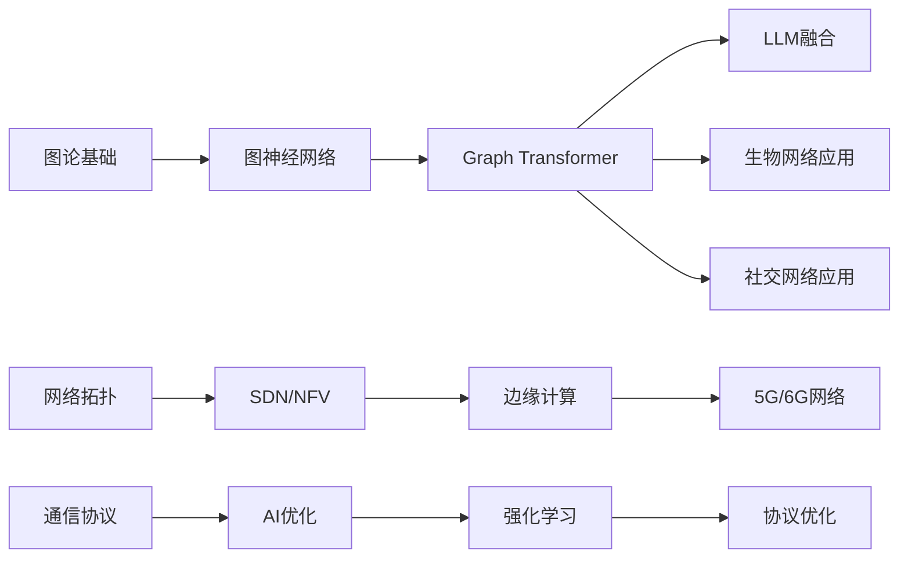

---

## 📊 **三、专题覆盖图谱 / Topic Coverage Graph**

### 3.1 模块专题分布

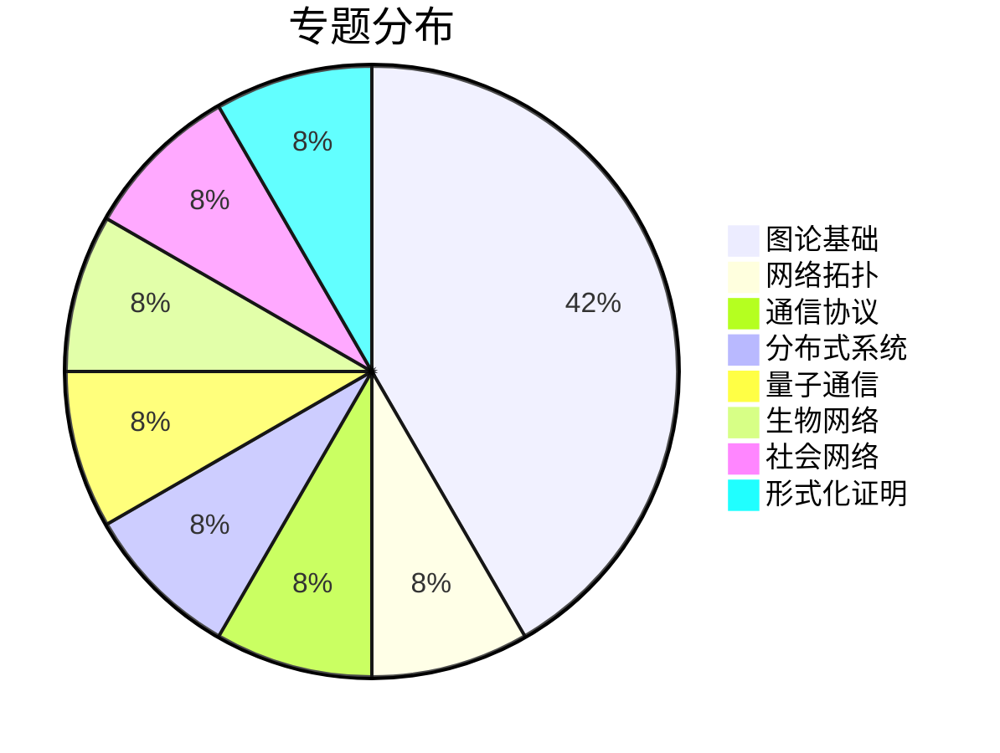

### 3.2 研究领域覆盖

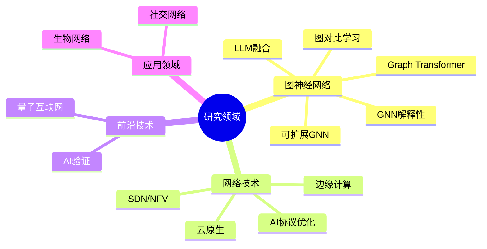

---

## 🎯 **四、应用场景图谱 / Application Scenario Graph**

### 4.1 应用场景网络

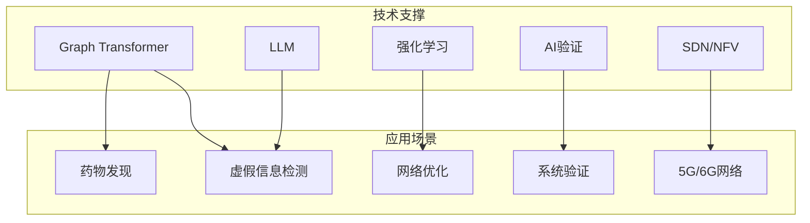

### 4.2 技术应用矩阵

| 技术 | 生物网络 | 社交网络 | 网络优化 | 系统验证 | 5G/6G |
|------|---------|---------|---------|---------|-------|
| **Graph Transformer** | ✅ | ✅ | ⚪ | ⚪ | ⚪ |
| **LLM** | ✅ | ✅ | ⚪ | ✅ | ⚪ |
| **强化学习** | ⚪ | ⚪ | ✅ | ⚪ | ✅ |
| **SDN/NFV** | ⚪ | ⚪ | ✅ | ⚪ | ✅ |
| **AI验证** | ⚪ | ⚪ | ⚪ | ✅ | ⚪ |

---

## 📈 **五、学习路径图谱 / Learning Path Graph**

### 5.1 学习路径网络

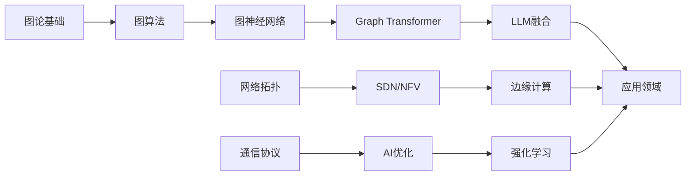

### 5.2 进阶路径

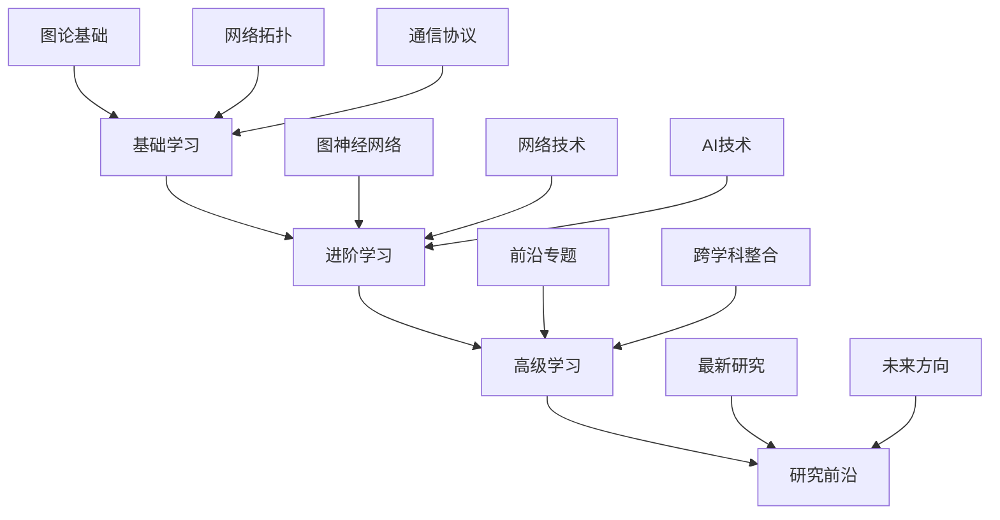

---

## 🔬 **六、研究领域图谱 / Research Domain Graph**

### 6.1 研究领域关系

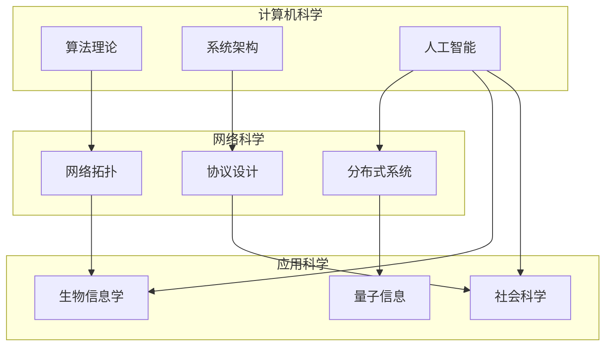

### 6.2 跨学科整合

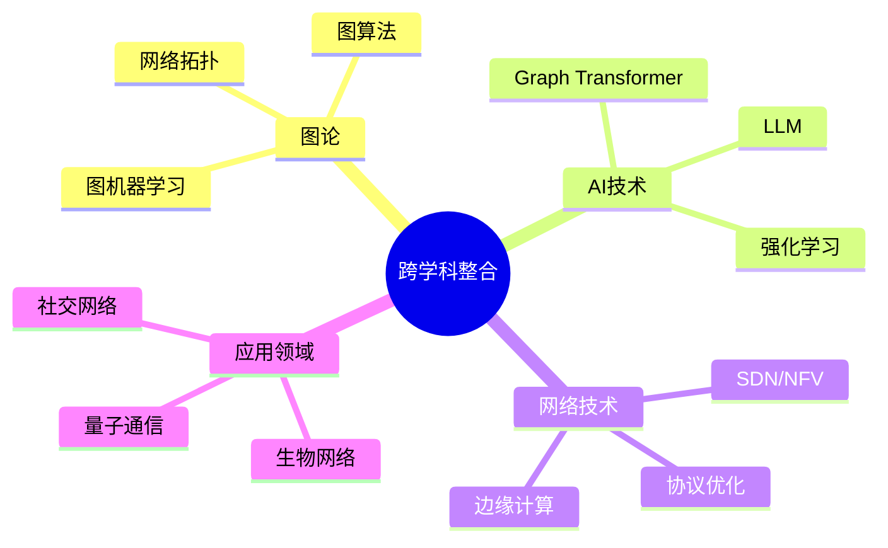

---

## 📚 **七、文档关联图谱 / Document Association Graph**

### 7.1 文档关系网络

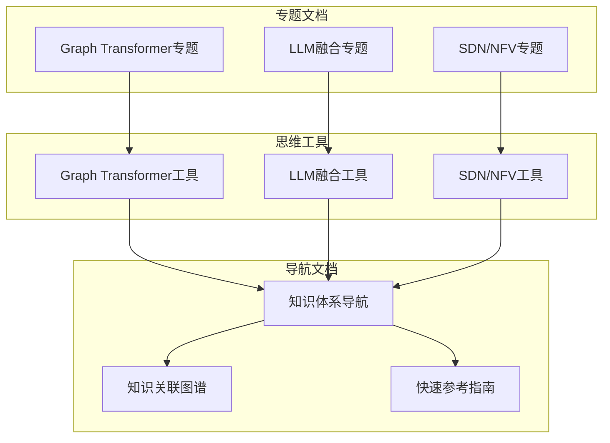

---

## 🎊 **八、总结 / Summary**

### 8.1 图谱特点

- ✅ **完整性**: 覆盖所有模块和专题
- ✅ **关联性**: 展示模块间的关联关系
- ✅ **可视化**: 多种可视化方式
- ✅ **实用性**: 支持快速理解和导航

### 8.2 使用建议

1. **学习路径**: 使用学习路径图谱规划学习
2. **知识关联**: 使用关联图谱理解跨模块关系
3. **应用选择**: 使用应用场景图谱选择技术
4. **研究探索**: 使用研究领域图谱探索研究方向

---

**文档版本**: v1.0
**创建时间**: 2025年1月
**最后更新**: 2025年1月
**维护者**: GraphNetWorkCommunicate项目组
**状态**: ✅ 完成
