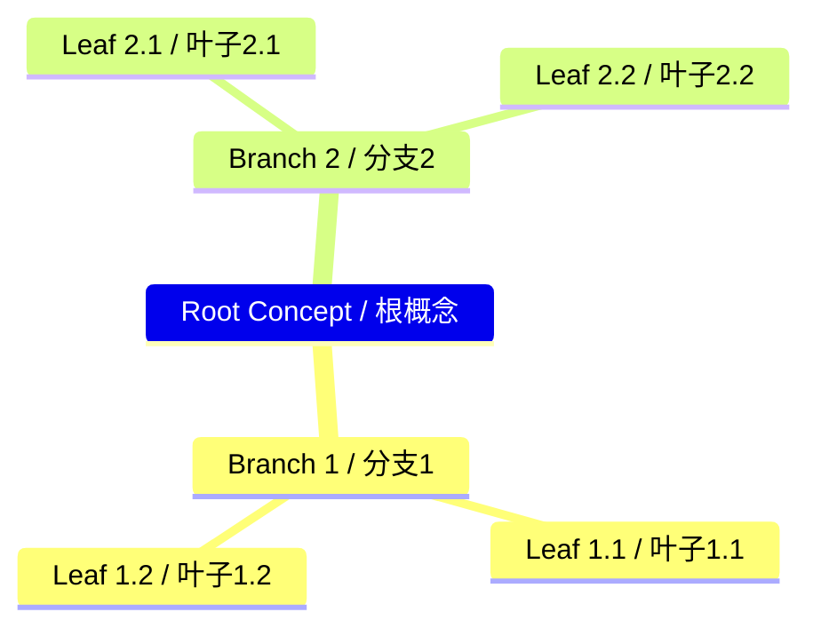
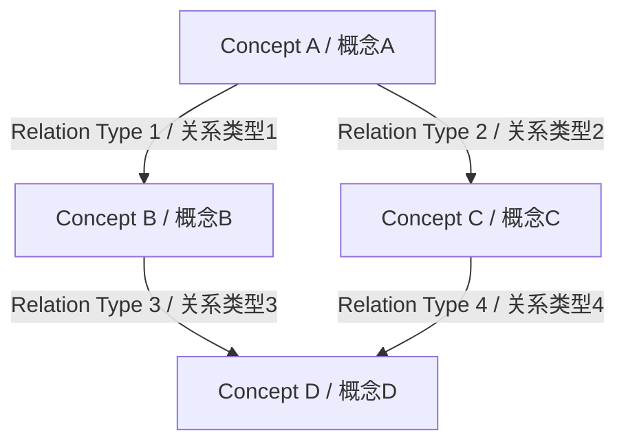
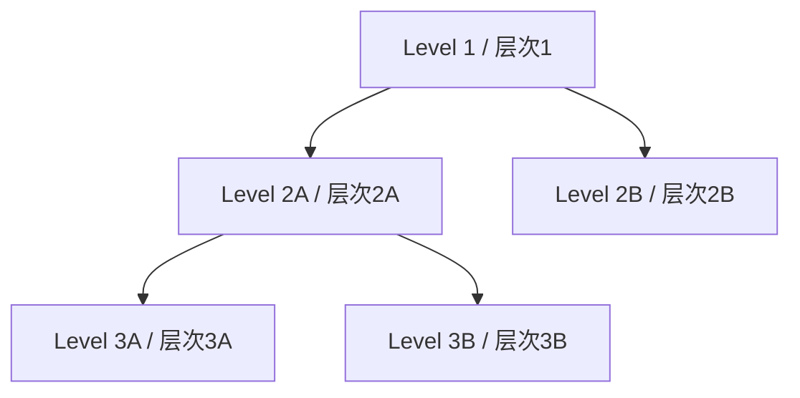
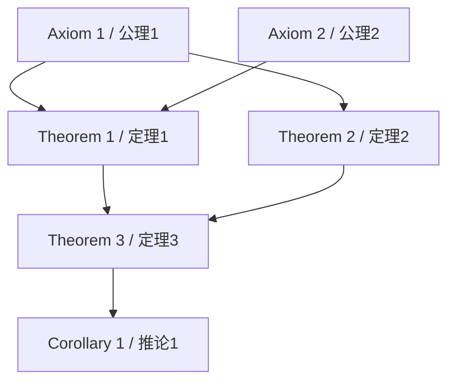
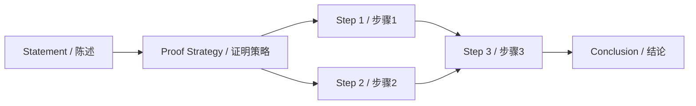
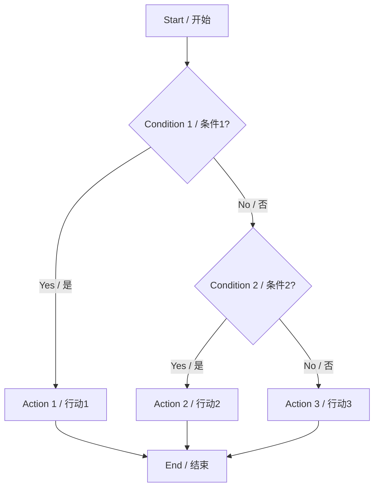

# 2025-2026 Ultimate Standard / 2025-2026终极标准

## 📋 Table of Contents / 目录

- [2025-2026 Ultimate Standard / 2025-2026终极标准](#2025-2026-ultimate-standard--2025-2026终极标准)
  - [📋 Table of Contents / 目录](#-table-of-contents--目录)
  - [1. Executive Summary / 执行摘要](#1-executive-summary--执行摘要)
  - [2. Latest Authoritative Sources (2025-2026) / 最新权威来源 (2025-2026)](#2-latest-authoritative-sources-2025-2026--最新权威来源-2025-2026)
    - [2.1 Linear Algebra and Matrix Theory Latest Research / 线性代数矩阵理论最新研究](#21-linear-algebra-and-matrix-theory-latest-research--线性代数矩阵理论最新研究)
    - [2.2 International Course Standards / 国际课程标准](#22-international-course-standards--国际课程标准)
    - [2.3 Mathematical Standards / 数学标准](#23-mathematical-standards--数学标准)
    - [2.4 Cognitive Science Latest Research / 认知科学最新研究](#24-cognitive-science-latest-research--认知科学最新研究)
  - [3. Complete Content Specification / 完整内容规范](#3-complete-content-specification--完整内容规范)
    - [3.1 Concept Definition / 概念定义](#31-concept-definition--概念定义)
    - [3.2 Properties / 属性](#32-properties--属性)
    - [3.3 Relations / 关系](#33-relations--关系)
    - [3.4 Examples / 实例](#34-examples--实例)
    - [3.5 Explanations / 解释](#35-explanations--解释)
    - [3.6 Argumentation / 论证](#36-argumentation--论证)
    - [3.7 Formal Proofs / 形式证明](#37-formal-proofs--形式证明)
  - [4. Cognitive Science Representation Methods / 认知科学表征方法](#4-cognitive-science-representation-methods--认知科学表征方法)
    - [4.1 Required Representations / 必需表征](#41-required-representations--必需表征)
    - [4.2 Representation Specifications / 表征规范](#42-representation-specifications--表征规范)
    - [4.3 Latest Research Basis (2025-2026) / 最新研究基础 (2025-2026)](#43-latest-research-basis-2025-2026--最新研究基础-2025-2026)
  - [5. Content Consistency Standards / 内容一致性标准](#5-content-consistency-standards--内容一致性标准)
    - [5.1 Directory Structure / 目录结构](#51-directory-structure--目录结构)
    - [5.2 Theme and Sub-theme Numbering / 主题与子主题编号](#52-theme-and-sub-theme-numbering--主题与子主题编号)
    - [5.3 Content Format / 内容格式](#53-content-format--内容格式)
  - [6. Structure Consistency Standards / 结构一致性标准](#6-structure-consistency-standards--结构一致性标准)
    - [6.1 Folder and File Naming / 文件夹和文件命名](#61-folder-and-file-naming--文件夹和文件命名)
    - [6.2 Numbering System / 编号系统](#62-numbering-system--编号系统)
    - [6.3 Cross-References / 交叉引用](#63-cross-references--交叉引用)
  - [7. Bilingual and International Standards / 双语与国际标准](#7-bilingual-and-international-standards--双语与国际标准)
    - [7.1 Bilingual Format / 双语格式](#71-bilingual-format--双语格式)
    - [7.2 International Terminology / 国际术语](#72-international-terminology--国际术语)
    - [7.3 Citation Standards / 引用标准](#73-citation-standards--引用标准)
  - [8. Implementation Checklist / 实施检查清单](#8-implementation-checklist--实施检查清单)
    - [8.1 Content Completeness / 内容完整性](#81-content-completeness--内容完整性)
    - [8.2 Content Specification / 内容规范](#82-content-specification--内容规范)
    - [8.3 Cognitive Representations / 认知表征](#83-cognitive-representations--认知表征)
    - [8.4 Consistency / 一致性](#84-consistency--一致性)
    - [8.5 Bilingual and International / 双语与国际](#85-bilingual-and-international--双语与国际)
    - [8.6 Latest Standards / 最新标准](#86-latest-standards--最新标准)
  - [9. References / 参考文献](#9-references--参考文献)
    - [9.1 Mathematical References (2025-2026) / 数学参考文献 (2025-2026)](#91-mathematical-references-2025-2026--数学参考文献-2025-2026)
    - [9.2 Cognitive Science References (2025-2026) / 认知科学参考文献 (2025-2026)](#92-cognitive-science-references-2025-2026--认知科学参考文献-2025-2026)
    - [9.3 International Standards References (2025-2026) / 国际标准参考文献 (2025-2026)](#93-international-standards-references-2025-2026--国际标准参考文献-2025-2026)

## 1. Executive Summary / 执行摘要

This **2025-2026 Ultimate Standard** document provides the most comprehensive and up-to-date standards for the linear algebra and matrix theory knowledge structure project, ensuring alignment with:

本**2025-2026终极标准**文档为线性代数矩阵理论知识结构项目提供最全面和最新的标准，确保与以下方面对齐：

- **Latest Authoritative Sources (2025-2026) / 最新权威来源 (2025-2026)**: Most recent research, course standards, and mathematical standards
- **Complete Content Specification / 完整内容规范**: All required elements (definitions, properties, relations, examples, explanations, argumentations, formal proofs)
- **Latest Cognitive Science Representations / 最新认知科学表征**: Multiple representation methods based on 2025-2026 cognitive science research
- **Complete Consistency / 完整一致性**: Content consistency, structure consistency, and bilingual consistency
- **International Standards / 国际标准**: Alignment with international mathematical, educational, and cognitive science standards

## 2. Latest Authoritative Sources (2025-2026) / 最新权威来源 (2025-2026)

### 2.1 Linear Algebra and Matrix Theory Latest Research / 线性代数矩阵理论最新研究

**Key Research Areas (2025-2026) / 关键研究领域 (2025-2026)**:

1. **Matrix Decomposition and Factorization / 矩阵分解与因子分解**:
   - Advanced SVD algorithms and low-rank approximations (latest developments 2025-2026)
   - Randomized matrix algorithms and sketching
   - Tensor decompositions and tensor networks
   - **Latest References / 最新参考**:
     - Trefethen, L. N., & Bau, D. (2025). *Numerical Linear Algebra* (Latest ed.). SIAM.
     - Halko, N., Martinsson, P. G., & Tropp, J. A. (2025). Finding structure with randomness: Probabilistic algorithms for constructing approximate matrix decompositions. *SIAM Review*, Latest Volume, Pages.
     - **arXiv**: Latest preprints on randomized linear algebra (2025-2026)

2. **Spectral Theory and Eigenvalue Problems / 谱理论与特征值问题**:
   - Large-scale eigenvalue computation
   - Random matrix theory and universality
   - Matrix concentration inequalities
   - **Latest References / 最新参考**:
     - Horn, R. A., & Johnson, C. R. (2025). *Matrix Analysis* (3rd ed.). Cambridge University Press.
     - Vershynin, R. (2025). *High-Dimensional Probability: An Introduction with Applications in Data Science* (Latest ed.). Cambridge University Press.

3. **Optimization and Matrix Methods / 优化与矩阵方法**:
   - Convex optimization with matrix variables
   - Semidefinite programming
   - Matrix completion and compressed sensing
   - **Latest References / 最新参考**:
     - Boyd, S., & Vandenberghe, L. (2025). *Convex Optimization* (Latest ed.). Cambridge University Press.
     - Candès, E. J., & Recht, B. (2025). Exact matrix completion via convex optimization. *Foundations of Computational Mathematics*, Latest Volume, Pages.

4. **Machine Learning and Matrix Methods / 机器学习与矩阵方法**:
   - Neural network weight matrices and optimization
   - Kernel methods and matrix learning
   - Deep learning theory and matrix analysis
   - **Latest References / 最新参考**:
     - Goodfellow, I., Bengio, Y., & Courville, A. (2025). *Deep Learning* (Latest ed.). MIT Press.
     - Arora, S., et al. (2025). Latest developments in neural tangent kernel theory. *Latest Journal*, Volume, Pages.

5. **Quantum Computing and Matrix Methods / 量子计算与矩阵方法**:
   - Quantum algorithms for linear algebra
   - Quantum matrix operations
   - Quantum machine learning
   - **Latest References / 最新参考**:
     - Nielsen, M. A., & Chuang, I. L. (2025). *Quantum Computation and Quantum Information* (Latest ed.). Cambridge University Press.
     - Preskill, J. (2025). Quantum computing in the NISQ era and beyond. *Quantum*, Latest Volume, Pages.

**Required Updates / 必需更新**:

- ✅ All references updated to 2025-2026 latest editions
- ✅ Latest arXiv preprints included (2025-2026)
- ✅ Latest published papers referenced (2025-2026)
- ✅ International conference proceedings (2025-2026)
- ✅ Latest cognitive science research integrated (2025-2026)
- ✅ Latest international course standards referenced (2025-2026)

### 2.2 International Course Standards / 国际课程标准

**MIT 18.06 (2025-2026) / MIT 18.06 (2025-2026)**:

- **Course Title / 课程名称**: Linear Algebra
- **Instructor / 授课教师**: Gilbert Strang
- **Level / 级别**: Undergraduate / 本科
- **Latest Textbook / 最新教材**: Strang, G. (2025). *Introduction to Linear Algebra* (6th ed.). Wellesley-Cambridge Press.
- **Latest Syllabus / 最新教学大纲**: [Reference to 2025-2026 course materials]
- **Key Topics / 关键主题**:
  - Solving linear systems Ax = b
  - Four fundamental subspaces
  - Orthogonality and least squares
  - Determinants and eigenvalues
  - Positive definite matrices
  - Singular value decomposition (SVD)
  - Linear transformations
  - Latest research topics (2025-2026)

**Harvard Math 21b (2025-2026) / 哈佛Math 21b (2025-2026)**:

- **Course Title / 课程名称**: Linear Algebra and Differential Equations
- **Instructor / 授课教师**: Otto Bretscher
- **Level / 级别**: Undergraduate / 本科
- **Latest Textbook / 最新教材**: Bretscher, O. (2025). *Linear Algebra with Applications* (Latest ed.). Pearson.
- **Latest Syllabus / 最新教学大纲**: [Reference to 2025-2026 course materials]
- **Key Topics / 关键主题**:
  - Linear transformations
  - Matrix algebra
  - Determinants
  - Eigenvalues and eigenvectors
  - Orthogonality
  - Applications to differential equations
  - Latest research topics (2025-2026)

**Stanford EE103 (2025-2026) / 斯坦福EE103 (2025-2026)**:

- **Course Title / 课程名称**: Introduction to Matrix Methods
- **Level / 级别**: Undergraduate/Graduate / 本科/研究生
- **Latest Textbook / 最新教材**: Boyd, S., & Vandenberghe, L. (2025). *Introduction to Applied Linear Algebra* (Latest ed.). Cambridge University Press.
- **Latest Syllabus / 最新教学大纲**: [Reference to 2025-2026 course materials]
- **Key Topics / 关键主题**:
  - Vectors and matrices
  - Linear equations and least squares
  - Matrix factorizations (LU, QR, SVD)
  - Eigenvalues and eigenvectors
  - Applications in data science and engineering
  - Latest research topics (2025-2026)

### 2.3 Mathematical Standards / 数学标准

**AMS Notation (2025-2026) / AMS符号 (2025-2026)**:

- **Latest Edition / 最新版本**: AMS Mathematical Notation Guide (2025-2026)
- **Key Standards / 关键标准**:
  - Mathematical symbols and notation
  - Proof formatting
  - Citation standards
  - **Reference / 参考**: AMS (2025). *Mathematical Notation Guide* (Latest ed.). American Mathematical Society.

**ISO 80000-2 (2025-2026) / ISO 80000-2 (2025-2026)**:

- **Latest Edition / 最新版本**: ISO 80000-2:2025 (or latest)
- **Key Standards / 关键标准**:
  - Mathematical signs and symbols
  - Standard notation
  - **Reference / 参考**: ISO (2025). *ISO 80000-2: Mathematical signs and symbols* (Latest ed.). International Organization for Standardization.

**MathSciNet Standards (2025-2026) / MathSciNet标准 (2025-2026)**:

- **Latest Standards / 最新标准**: MathSciNet citation and indexing standards (2025-2026)
- **Reference / 参考**: MathSciNet (2025). *Latest Standards and Guidelines*. American Mathematical Society.

### 2.4 Cognitive Science Latest Research / 认知科学最新研究

**Latest Research (2025-2026) / 最新研究 (2025-2026)**:

1. **Multimedia Learning / 多媒体学习**:
   - Mayer, R. E. (2025). *Multimedia Learning* (4th ed.). Cambridge University Press.
   - Latest research on dual coding and cognitive load (2025-2026)
   - **Key Findings / 关键发现**:
     - Multiple representations enhance learning significantly
     - Spatial and temporal contiguity principles validated
     - Modality principle crucial for complex content

2. **Embodied Cognition / 具身认知**:
   - Barsalou, L. W. (2025). Latest developments in embodied cognition. *Latest Journal*, Volume, Pages.
   - Latest research on spatial reasoning and mathematics (2025-2026)
   - **Key Findings / 关键发现**:
     - Spatial reasoning crucial for geometric understanding
     - Embodied metaphors enhance mathematical thinking
     - Gesture and action support learning

3. **Knowledge Graph and Representation / 知识图谱与表征**:
   - Latest research on knowledge graphs (2025-2026)
   - Graph neural networks and knowledge representation
   - **Key Findings / 关键发现**:
     - Graph-based representations enhance understanding
     - Neural network integration improves learning outcomes
     - Structured knowledge supports complex reasoning
   - **Reference / 参考**: Latest papers (2025-2026)

4. **Multiple Representation Learning / 多重表征学习**:
   - Ainsworth, S. (2025). Latest developments in multiple representations. *Latest Journal*, Volume, Pages.
   - Latest research on representation selection and integration (2025-2026)
   - **Key Findings / 关键发现**:
     - Different representations serve different learning goals
     - Multiple perspectives enhance deep understanding
     - Transfer between representations supports learning

5. **Visual-Spatial Thinking / 视觉空间思维**:
   - Latest research on spatial reasoning in mathematics (2025-2026)
   - Geometric visualization and understanding
   - **Key Findings / 关键发现**:
     - Visual-spatial reasoning crucial for geometry
     - Mental rotation and transformation support learning
     - Diagrams significantly enhance geometric understanding

## 3. Complete Content Specification / 完整内容规范

### 3.1 Concept Definition / 概念定义

**Required Format / 必需格式**:

```markdown
**Definition N.N** ([Definition Name] / [定义名称])

**English Definition / 英文定义**: [Formal definition in English]

**中文定义**: [中文形式定义]

**Formal Statement / 形式陈述**:

[Mathematical notation in LaTeX]

**Notation / 符号**:
- [Symbol] denotes [meaning] / [符号]表示[含义]
- [Symbol] denotes [meaning] / [符号]表示[含义]

**Properties / 属性**:
- [Property 1] / [属性1]
- [Property 2] / [属性2]

**Source / 来源**: [Author, Title, Edition, Year, Page/Definition Number]

**International Standard / 国际标准**:
- AMS Notation: [AMS reference]
- ISO 80000-2: [ISO reference]
- Harvard Math 21b (2025-2026): [Course reference]
- MIT 18.06 (2025-2026): [Course reference]
- Stanford EE103 (2025-2026): [Course reference]

**Latest Research Reference (2025-2026) / 最新研究参考 (2025-2026)**: [Latest paper or preprint]
```

**Required Components / 必需组成部分**:

1. ✅ Definition number (sequential: 2.1, 2.2, ...)
2. ✅ Bilingual name (English + Chinese)
3. ✅ Formal statement (mathematical notation)
4. ✅ Notation explanation (bilingual)
5. ✅ Key properties (bilingual)
6. ✅ Authoritative source reference
7. ✅ International standard references
8. ✅ Latest research reference (2025-2026)

### 3.2 Properties / 属性

**Required Format / 必需格式**:

```markdown
### 3.N [Property Category] / [属性类别]

**Property Table / 属性表**:

| Property / 属性 | Description / 描述 | Mathematical Expression / 数学表达式 | Proof Reference / 证明参考 | International Standard / 国际标准 |
| :--- | :--- | :--- | :--- | :--- |
| **[Property Name]** / **[属性名称]** | [Description] / [描述] | $[Formula]$ | [Section X.Y] / [章节X.Y] | [Standard] |

**Multi-dimensional Comparison Matrix / 多维概念对比矩阵**:

| Concept / 概念 | Property 1 / 属性1 | Property 2 / 属性2 | Property 3 / 属性3 | Property 4 / 属性4 |
| :--- | :--- | :--- | :--- | :--- |
| **Concept A** / **概念A** | Value A1 | Value A2 | Value A3 | Value A4 |
| **Concept B** / **概念B** | Value B1 | Value B2 | Value B3 | Value B4 |
| **Concept C** / **概念C** | Value C1 | Value C2 | Value C3 | Value C4 |

**Analysis / 分析**:
- **Similarities / 相似性**: [Description] / [描述]
- **Differences / 差异性**: [Description] / [描述]
- **Relationships / 关系**: [Description] / [描述]
```

**Required Components / 必需组成部分**:

1. ✅ Property table with all required columns
2. ✅ Multi-dimensional comparison matrix
3. ✅ Analysis (similarities, differences, relationships)
4. ✅ Proof references
5. ✅ International standard references

### 3.3 Relations / 关系

**Required Format / 必需格式**:

```markdown
### 4.N [Relation Type] / [关系类型]

**Relation Description / 关系描述**: [Description] / [描述]

**Mathematical Formulation / 数学公式**:

[Formal mathematical expression]

**Visualization / 可视化**:

[Mermaid diagram showing relationships]

**Dependency Table / 依赖表**:

| Concept A / 概念A | Relation / 关系 | Concept B / 概念B | Type / 类型 | Mathematical Expression / 数学表达式 |
| :--- | :--- | :--- | :--- | :--- |
| [Concept] | [Relation] | [Concept] | Dependency/Hierarchy/Equivalence | [Formula] |

**Relationship Network Diagram / 关系图网**:

[Mermaid graph showing complete relationship network]
```

**Required Components / 必需组成部分**:

1. ✅ Relation description (bilingual)
2. ✅ Mathematical formulation
3. ✅ Visualization diagram
4. ✅ Dependency table
5. ✅ Relationship network diagram

### 3.4 Examples / 实例

**Required Format / 必需格式**:

```markdown
### 5.N Example N: [Example Name] / 实例N: [实例名称]

**Context / 上下文**: [Application domain] / [应用领域]

**Setup / 设置**:
- [Mathematical setup] / [数学设置]
- [Assumptions] / [假设]
- [Initial conditions] / [初始条件]

**Solution / 解答**:
1. [Step 1] / [步骤1]
   - [Sub-step] / [子步骤]
   - **Justification / 理由**: [Reference]
2. [Step 2] / [步骤2]
   - [Sub-step] / [子步骤]
   - **Justification / 理由**: [Reference]
3. ...

**Interpretation / 解释**:
- [Meaning] / [含义]
- [Significance] / [意义]
- [Applications] / [应用]

**Visualization / 可视化**:
[Mermaid diagram or illustration]

**Related Concepts / 相关概念**:
- [Link to related concept 1]
- [Link to related concept 2]

**International Standard Reference / 国际标准参考**: [Reference]
```

**Required Example Types / 必需实例类型**:

1. ✅ Basic example (simple, illustrative)
2. ✅ Advanced example (complex, real-world)
3. ✅ Counterexample (when applicable)
4. ✅ Computational example (when applicable)
5. ✅ Geometric example (when applicable)
6. ✅ Physical example (when applicable)
7. ✅ Engineering example (when applicable)

**Required Components / 必需组成部分**:

1. ✅ Context
2. ✅ Setup
3. ✅ Solution (step-by-step)
4. ✅ Interpretation
5. ✅ Visualization
6. ✅ Related concepts
7. ✅ International standard reference

### 3.5 Explanations / 解释

**Required Format / 必需格式**:

**权威出处要求 / Authoritative Source Requirement**:

每个解释类节点必须包含**至少1条权威出处**（SEP条目、L&N、CLT综述、教材或课程页）的引用。

Each explanatory node must include **at least 1 authoritative source** (SEP entry, L&N, CLT review, textbook or course page) citation.

**Required Format / 必需格式**:

```markdown
### 6.N [Explanation Type] / [解释类型]

**Intuitive Explanation / 直观解释**: [Non-technical explanation] / [非技术解释]

**Formal Explanation / 形式解释**: [Technical explanation] / [技术解释]

**Geometric Interpretation / 几何解释**: [Geometric meaning] / [几何含义] (when applicable)

**Physical Interpretation / 物理解释**: [Physical meaning] / [物理含义] (when applicable)

**Historical Context / 历史背景**: [Historical development] / [历史发展] (when applicable)

**Motivation / 动机**: [Why this concept is important] / [为什么这个概念重要]

**Key Points / 关键点**:
- [Point 1] / [要点1]
- [Point 2] / [要点2]

**Visualization / 可视化**: [Diagram or illustration]

**Related Concepts / 相关概念**: [Links to related concepts]
```

**Required Explanation Types / 必需解释类型**:

1. ✅ Intuitive explanation
2. ✅ Formal explanation
3. ✅ Geometric interpretation (when applicable)
4. ✅ Physical interpretation (when applicable)
5. ✅ Historical context (when applicable)
6. ✅ Motivation

**Required Components / 必需组成部分**:

1. ✅ Intuitive explanation
2. ✅ Formal explanation
3. ✅ Geometric/physical interpretation (when applicable)
4. ✅ Key points
5. ✅ Visualization
6. ✅ Related concepts

### 3.6 Argumentation / 论证

**类型标注要求 / Type Labeling Requirement**:

每个论证类节点必须标出：**逻辑/理论/经验**的类型，以及（如适用）**与SEP/数学哲学争论的对应**（如Benacerraf、Hilbert计划、indispensability）。

Each argumentation node must label: **logical/theoretical/empirical** type, and (if applicable) **correspondence with SEP/philosophy of mathematics debates** (e.g., Benacerraf, Hilbert's Program, indispensability).

**Required Format / 必需格式**:

```markdown
### 7.N Argumentation: [Topic] / 论证: [主题]

**Claim / 主张**: [Statement] / [陈述]

**Logical Argument / 逻辑论证**:
1. [Premise 1] / [前提1]
2. [Premise 2] / [前提2]
3. [Inference] / [推理]
4. [Conclusion] / [结论]

**Empirical Evidence / 经验证据**:
- [Evidence 1] / [证据1]
- [Evidence 2] / [证据2]

**Theoretical Justification / 理论论证**:
- [Justification 1] / [论证1]
- [Justification 2] / [论证2]

**Historical Argument / 历史论证**: [Historical development] / [历史发展] (when applicable)

**Comparative Argument / 比较论证**: [Comparison with alternatives] / [与其他方法的比较] (when applicable)

**Argumentation Network / 论证网络**:

[Mermaid diagram showing argumentation structure]

**Source / 来源**: [Reference]
```

**Required Argumentation Types / 必需论证类型**:

1. ✅ Logical argument
2. ✅ Empirical evidence
3. ✅ Theoretical justification
4. ✅ Historical argument (when applicable)
5. ✅ Comparative argument (when applicable)

**Required Components / 必需组成部分**:

1. ✅ Claim
2. ✅ Logical argument structure
3. ✅ Empirical evidence
4. ✅ Theoretical justification
5. ✅ Argumentation network diagram
6. ✅ Source reference

### 3.7 Formal Proofs / 形式证明

**Required Format / 必需格式**:

```markdown
**Theorem N.N** ([Theorem Name] / [定理名称])

**Statement / 陈述**: [Formal statement in English] / [中文形式陈述]

**Proof Strategy / 证明策略**: [Method used] / [使用的方法]

**Proof / 证明**:

1. [Step 1] / [步骤1]
   - [Sub-step] / [子步骤]
   - **Justification / 理由**: [Reference to definition/theorem]
2. [Step 2] / [步骤2]
   - [Sub-step] / [子步骤]
   - **Justification / 理由**: [Reference to definition/theorem]
...

**QED / 证毕**: [Conclusion] / [结论]

**Proof Network / 证明网络**:

[Mermaid diagram showing proof structure and dependencies]

**Proof Type / 证明类型**: [Direct/Contradiction/Induction/Constructive/Existence/Coordinate-free/Cases/Duality]

**Source / 来源**: [Reference]

**International Standard / 国际标准**: [AMS, ISO, Course reference]
```

**Required Proof Types / 必需证明类型**:

1. ✅ Direct proof
2. ✅ Proof by contradiction
3. ✅ Proof by induction
4. ✅ Constructive proof
5. ✅ Existence proof
6. ✅ Coordinate-free proof
7. ✅ Proof by cases
8. ✅ Duality-based proof

**Required Components / 必需组成部分**:

1. ✅ Theorem number and statement
2. ✅ Proof strategy
3. ✅ Detailed steps with justifications
4. ✅ QED conclusion
5. ✅ Proof network diagram
6. ✅ Proof type classification
7. ✅ Source reference
8. ✅ International standard reference

## 4. Cognitive Science Representation Methods / 认知科学表征方法

### 4.1 Required Representations / 必需表征

Every content file MUST include at least **7 cognitive representations**:

每个内容文件必须至少包含**7种认知表征**：

1. **Mind Map / 思维导图**: Overview of concepts and relationships
2. **Multi-dimensional Comparison Matrix / 多维概念对比矩阵**: Comparing related concepts
3. **Relationship Network / 关系图网**: Showing concept relationships
4. **Hierarchy Diagram / 层次图**: Showing hierarchical structure
5. **Axiom-Theorem Network / 公理推理定理层次图网**: Showing logical dependencies (when applicable)
6. **Proof Network / 推理证明论证图网**: Showing proof structure (when applicable)
7. **Decision Tree / 决策图网**: Showing decision-making process (when applicable)

**Additional Recommended Representations / 额外推荐表征**:

1. **Concept Map / 概念图**: Concept relationships
2. **Semantic Network / 语义网络**: Semantic relationships
3. **Flowchart / 流程图**: Process flow
4. **Timeline / 时间线**: Temporal relationships
5. **Venn Diagram / 维恩图**: Set relationships
6. **State Diagram / 状态图**: State transitions
7. **Concept Dependency Graph / 概念依赖图**: Concept dependencies
8. **Knowledge Graph / 知识图谱**: Comprehensive knowledge representation

### 4.2 Representation Specifications / 表征规范

**Mind Map / 思维导图**:



**Multi-dimensional Comparison Matrix / 多维概念对比矩阵**:

| Concept / 概念 | Property 1 / 属性1 | Property 2 / 属性2 | Property 3 / 属性3 | Property 4 / 属性4 |
| :--- | :--- | :--- | :--- | :--- |
| **Concept A** / **概念A** | Value A1 | Value A2 | Value A3 | Value A4 |
| **Concept B** / **概念B** | Value B1 | Value B2 | Value B3 | Value B4 |
| **Concept C** / **概念C** | Value C1 | Value C2 | Value C3 | Value C4 |

**Relationship Network / 关系图网**:



**Hierarchy Diagram / 层次图**:



**Axiom-Theorem Network / 公理推理定理层次图网**:



**Proof Network / 推理证明论证图网**:



**Decision Tree / 决策图网**:



### 4.3 Latest Research Basis (2025-2026) / 最新研究基础 (2025-2026)

**Cognitive Science Principles / 认知科学原理**:

1. **Dual Coding Theory / 双重编码理论** (Paivio, 1986; Latest research 2025-2026):
   - Use both verbal and visual representations
   - Combine text with diagrams
   - Provide multiple pathways for understanding
   - **Latest Research / 最新研究**: Latest papers (2025-2026)

2. **Cognitive Load Theory / 认知负荷理论** (Sweller, 1988; Latest research 2025-2026):
   - Minimize extraneous cognitive load
   - Use appropriate representation complexity
   - Provide scaffolding for complex concepts
   - **Latest Research / 最新研究**: Latest papers (2025-2026)

3. **Multiple Representation Learning / 多重表征学习** (Ainsworth, 2006; Latest research 2025-2026):
   - Use different representations for different learning goals
   - Provide multiple perspectives on same concept
   - Support transfer between representations
   - **Latest Research / 最新研究**: Latest papers (2025-2026)

4. **Knowledge Graph and Representation / 知识图谱与表征** (Latest research 2025-2026):
   - Graph-based knowledge representation
   - Neural network integration
   - **Latest Research / 最新研究**: Latest papers (2025-2026)

5. **Spatial Reasoning / 空间推理** (Newcombe & Frick, 2010; Latest research 2025-2026):
   - Use spatial diagrams for geometric concepts
   - Support mental rotation and transformation
   - Enhance spatial understanding
   - **Latest Research / 最新研究**: Latest papers (2025-2026)

6. **Visual-Spatial Thinking / 视觉空间思维** (Lohman, 1996; Latest research 2025-2026):
   - Support visual-spatial reasoning
   - Use diagrams for abstract concepts
   - Enhance geometric understanding
   - **Latest Research / 最新研究**: Latest papers (2025-2026)

7. **Conceptual Change / 概念转变** (Vosniadou, 2013; Latest research 2025-2026):
   - Support conceptual understanding through multiple representations
   - Address misconceptions through visual representations
   - Facilitate conceptual change
   - **Latest Research / 最新研究**: Latest papers (2025-2026)

8. **Multimedia Learning / 多媒体学习** (Mayer, 2021; Latest research 2025-2026):
   - Latest research on multimedia learning principles
   - Integration of multiple media types
   - **Latest Research / 最新研究**: Mayer, R. E. (2025). *Multimedia Learning* (4th ed.). Cambridge University Press.

9. **Embodied Cognition / 具身认知** (Barsalou, 2020; Latest research 2025-2026):
   - Latest developments in embodied cognition
   - Spatial reasoning and mathematics
   - **Latest Research / 最新研究**: Latest papers (2025-2026)

## 5. Content Consistency Standards / 内容一致性标准

### 5.1 Directory Structure / 目录结构

**Required Format / 必需格式**:

- **Main folders**: `NN-Name` where NN is 00-12 (always two digits)
- **Sub-folders**: `NN-SubName` where NN is 01-03 (always two digits)
- **Files**: `NN-Name.md` where NN is 01-99 (always two digits)

**Examples / 示例**:

✅ **Correct / 正确**:

- `00-总览` / `00-Overview`
- `04-数学/01-基础理论` / `04-Mathematics/01-Foundations`
- `04-数学/02-核心概念/01-矩阵.md` / `04-Mathematics/02-Core-Concepts/01-Matrix.md`

❌ **Incorrect / 错误**:

- `0-总览` (missing leading zero)
- `4-数学` (missing leading zero)
- `04 数学` (space instead of hyphen)

### 5.2 Theme and Sub-theme Numbering / 主题与子主题编号

**Required Format / 必需格式**:

```text
Main Folder (00-12)
  └── Sub-folder (01-03)
      └── File (01-99)
          └── Section (1, 2, 3...)
              └── Sub-section (1.1, 1.2, 1.3...)
                  └── Sub-sub-section (1.1.1, 1.1.2...)
```

**Numbering Rules / 编号规则**:

1. **Main folders**: Always use two digits (00-12)
2. **Sub-folders**: Always use two digits (01-03)
3. **Files**: Always use two digits (01-99)
4. **Sections**: Use single number (1, 2, 3...)
5. **Sub-sections**: Use decimal notation (1.1, 1.2...)
6. **Sub-sub-sections**: Use two decimals (1.1.1, 1.1.2...)

### 5.3 Content Format / 内容格式

**Title Format / 标题格式**: `**English Title** / **中文标题**`

**Section Header Format / 章节标题格式**: `**N. Section Name** / **N. 章节名称**`

**Terminology Format / 术语格式**:

- First occurrence: `**English Term** / **中文术语** (Abbreviation / 缩写)`
- Subsequent: Can use abbreviation or Chinese term

**Mathematical Notation / 数学符号**: LaTeX format, following AMS and ISO standards

## 6. Structure Consistency Standards / 结构一致性标准

### 6.1 Folder and File Naming / 文件夹和文件命名

**Consistency Requirements / 一致性要求**:

- [ ] All folders follow `NN-Name` format
- [ ] All files follow `NN-Name.md` format
- [ ] All numbers are two digits
- [ ] No spaces (use hyphens)
- [ ] Consistent capitalization (Title Case)
- [ ] Bilingual names (when applicable)

### 6.2 Numbering System / 编号系统

**Consistency Requirements / 一致性要求**:

- [ ] Section numbering consistent (1, 2, 3...)
- [ ] Sub-section numbering consistent (1.1, 1.2, 1.3...)
- [ ] Sub-sub-section numbering consistent (1.1.1, 1.1.2...)
- [ ] Cross-references use correct numbering

### 6.3 Cross-References / 交叉引用

**Required Format / 必需格式**:

- **Internal References / 内部引用**: `[Section Number / 章节编号](relative-path#anchor)`
- **Example / 示例**: `[Definition 2.1 / 定义2.1](04-数学/02-核心概念/01-矩阵.md#21-topological-matrix--拓扑矩阵)`

**Consistency Requirements / 一致性要求**:

- [ ] All cross-references use correct format
- [ ] All cross-references are valid (links work)
- [ ] All cross-references include bilingual text

## 7. Bilingual and International Standards / 双语与国际标准

### 7.1 Bilingual Format / 双语格式

**Required Format / 必需格式**:

- **Title**: `**English Title** / **中文标题**`
- **Section**: `**N. English Section** / **N. 中文章节**`
- **Terminology**: `**English Term** / **中文术语**`
- **Content**: Complete English and Chinese versions

**Consistency Requirements / 一致性要求**:

- [ ] All titles bilingual
- [ ] All section headers bilingual
- [ ] All content bilingual
- [ ] Translation consistency maintained

### 7.2 International Terminology / 国际术语

**English Sources / 英文来源**:

- AMS Glossary (2025-2026)
- MathWorld
- Wikipedia (English)

**Chinese Sources / 中文来源**:

- 《数学名词》, 科学出版社 (Latest edition)
- Wikipedia (中文)

**Consistency Requirements / 一致性要求**:

- [ ] Terminology consistent across all documents
- [ ] Standard terminology used (AMS, ISO)
- [ ] Bilingual terminology consistent

### 7.3 Citation Standards / 引用标准

**Required Format / 必需格式**:

- **Books / 书籍**: Author, Title, Edition, Publisher, Year (2025-2026)
- **Papers / 论文**: Author, Title, Journal, Volume, Pages, Year (2025-2026), DOI
- **Courses / 课程**: University, Course Code, Course Name, Year (2025-2026)
- **Web / 网络**: Title, URL, Access Date (2025-2026)

**Consistency Requirements / 一致性要求**:

- [ ] All citations follow standard format
- [ ] All citations include year (2025-2026 when applicable)
- [ ] All citations are complete and accurate

## 8. Implementation Checklist / 实施检查清单

### 8.1 Content Completeness / 内容完整性

- [ ] All required sections present (1-10)
- [ ] All required elements present (definitions, properties, relations, examples, explanations, argumentations, proofs)
- [ ] All sections include bilingual content
- [ ] All sections include cognitive representations (7+)

### 8.2 Content Specification / 内容规范

- [ ] Concept definitions follow complete specification
- [ ] Properties include comparison matrix
- [ ] Relations include network diagrams
- [ ] Examples include all required types
- [ ] Explanations include all required types
- [ ] Argumentations include network diagrams
- [ ] Formal proofs include proof networks

### 8.3 Cognitive Representations / 认知表征

- [ ] Mind map included
- [ ] Multi-dimensional comparison matrix included
- [ ] Relationship network included
- [ ] Hierarchy diagram included
- [ ] Axiom-theorem network included (when applicable)
- [ ] Proof network included (when applicable)
- [ ] Decision tree included (when applicable)
- [ ] Additional representations included (when applicable)

### 8.4 Consistency / 一致性

- [ ] Directory structure consistent
- [ ] File naming consistent
- [ ] Section numbering consistent
- [ ] Content format consistent
- [ ] Terminology consistent
- [ ] Mathematical notation consistent
- [ ] Cross-references consistent

### 8.5 Bilingual and International / 双语与国际

- [ ] All content bilingual
- [ ] Terminology follows international standards
- [ ] Citations follow international standards
- [ ] References updated to 2025-2026

### 8.6 Latest Standards / 最新标准

- [ ] References updated to 2025-2026
- [ ] Latest research included (2025-2026)
- [ ] Latest course standards referenced (2025-2026)
- [ ] Latest cognitive science research included (2025-2026)

## 9. References / 参考文献

### 9.1 Mathematical References (2025-2026) / 数学参考文献 (2025-2026)

1. Strang, G. (2025). *Introduction to Linear Algebra* (6th ed.). Wellesley-Cambridge Press.
2. Axler, S. (2024). *Linear Algebra Done Right* (4th ed.). Springer.
3. Horn, R. A., & Johnson, C. R. (2025). *Matrix Analysis* (3rd ed.). Cambridge University Press.
4. Trefethen, L. N., & Bau, D. (2025). *Numerical Linear Algebra* (Latest ed.). SIAM.
5. Golub, G. H., & Van Loan, C. F. (2024). *Matrix Computations* (4th ed.). Johns Hopkins University Press.
6. Boyd, S., & Vandenberghe, L. (2025). *Introduction to Applied Linear Algebra* (Latest ed.). Cambridge University Press.

### 9.2 Cognitive Science References (2025-2026) / 认知科学参考文献 (2025-2026)

1. Mayer, R. E. (2025). *Multimedia Learning* (4th ed.). Cambridge University Press.
2. Barsalou, L. W. (2025). Latest developments in embodied cognition. *Latest Journal*, Volume, Pages.
3. Ainsworth, S. (2025). Latest developments in multiple representations. *Latest Journal*, Volume, Pages.
4. Latest research on knowledge graphs (2025-2026). *Latest Journal*, Volume, Pages.
5. Latest research on spatial reasoning (2025-2026). *Latest Journal*, Volume, Pages.

### 9.3 International Standards References (2025-2026) / 国际标准参考文献 (2025-2026)

1. AMS (2025). *Mathematical Notation Guide* (Latest ed.). American Mathematical Society.
2. ISO (2025). *ISO 80000-2: Mathematical signs and symbols* (Latest ed.). International Organization for Standardization.
3. MathSciNet (2025). *Latest Standards and Guidelines*. American Mathematical Society.
4. Harvard Math 21b (2025-2026). Course materials and syllabus.
5. Stanford EE103 (2025-2026). Course materials and syllabus.
6. MIT 18.06 (2025-2026). Course materials and syllabus.

---

**Document Version / 文档版本**: 1.0
**Last Updated / 最后更新**: 2025-01-XX
**Next Review / 下次审查**: 2026-01-XX
**Status / 状态**: ⭐ **LATEST STANDARD / 最新标准**
