# View文件夹思维表征工具规划 / View Files Thinking Representation Tools Planning 2025

## 📋 **文档说明**

本文档系统规划view文件夹内所有文件的思维表征工具，包括思维导图、决策树、证明树、关系图等，统一使用Mermaid格式。

**创建时间**: 2025年1月
**状态**: 🚀 进行中
**维护者**: GraphNetWorkCommunicate项目组

---

## 🗺️ **一、思维表征工具类型清单 / Thinking Representation Tools Type List**

### 1.1 工具类型分类

根据项目定位和文件内容，需要为每个主题创建以下10种思维表征工具：

| **工具类型** | **Mermaid类型** | **用途** | **覆盖文件** | **状态** |
|------------|----------------|---------|-------------|---------|
| **1. 思维导图** | `mindmap` | 展示知识结构和概念关系 | 所有文件 | ⏳ 待创建 |
| **2. 决策树图** | `flowchart TD` | 帮助选择理论、算法、工具 | graph_view00-04 | ⏳ 待创建 |
| **3. 证明树图** | `graph TD` | 展示定理证明的逻辑结构 | graph_view00, graph_view01, graph_view05 | ⏳ 待创建 |
| **4. 理论模型层次树图** | `graph TD` | 展示理论的层次关系 | graph_view00, graph_view01 | ⏳ 待创建 |
| **5. 概念关系多维矩阵** | 表格 | 对比不同理论的概念 | graph_view00, graph_view01 | ✅ 已创建 |
| **6. 数据流图** | `flowchart TD` | 展示算法或过程的数据流 | graph_view04 | ⏳ 待创建 |
| **7. 论证思维图** | `graph TD` | 展示论证的逻辑结构 | graph_view00, graph_view01 | ⏳ 待创建 |
| **8. 交换图** | `graph TD` | 展示函子交换性 | graph_view00, graph_view01 | ⏳ 待创建 |
| **9. 时序图** | `gantt` 或 `graph LR` | 展示理论演化时间线 | graph_view01 | ⏳ 待创建 |
| **10. 坐标系统** | `graph` | 多维度定位理论 | graph_view01 | ⏳ 待创建 |

---

## 📊 **二、思维导图规划 / Mind Map Planning**

### 2.1 全局思维导图（覆盖所有主题）

**文件**: `View文件夹思维表征工具集-2025.md`

**内容**: 统一理论全景思维导图

**Mermaid格式**:

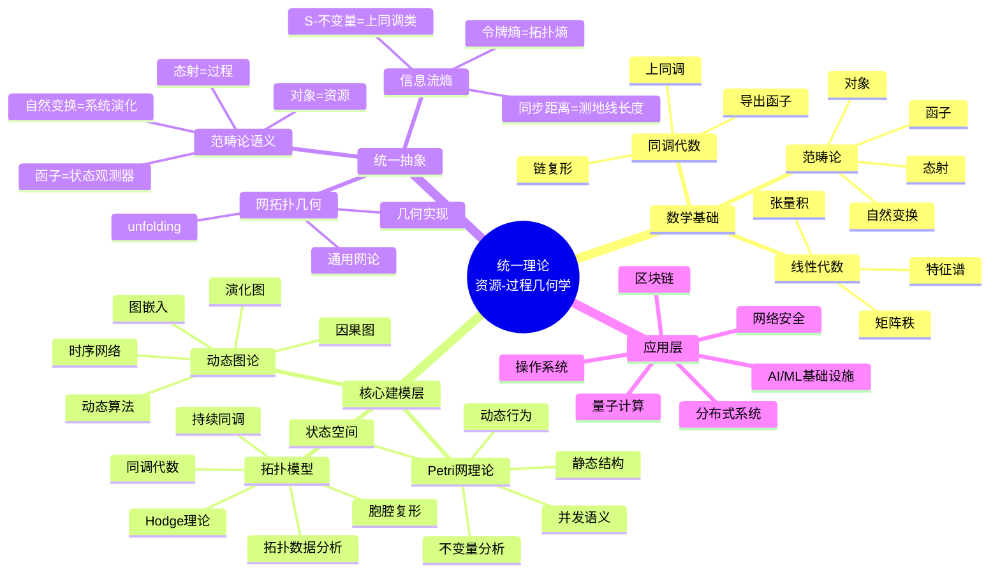

---

### 2.2 主题级思维导图

#### 2.2.1 Petri网理论思维导图

**文件**: `graph_view00.md`, `graph_view01.md`

**Mermaid格式**:

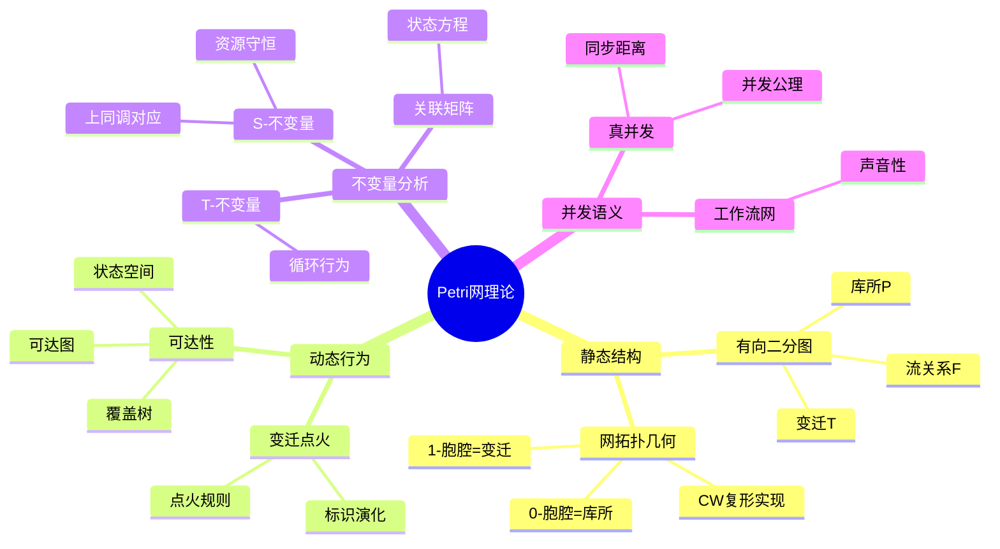

---

## 🔀 **三、决策树图规划 / Decision Tree Planning**

### 3.1 模型选择决策树

**文件**: `graph_view00.md`, `graph_view01.md`, `graph_view02.md`, `graph_view03.md`

**Mermaid格式**:

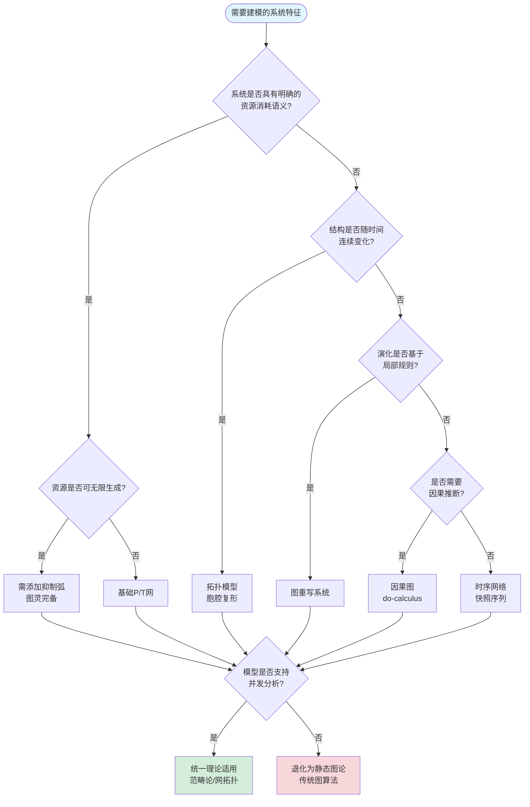

---

### 3.2 复杂度导航决策树

**文件**: `graph_view01.md`

**Mermaid格式**:

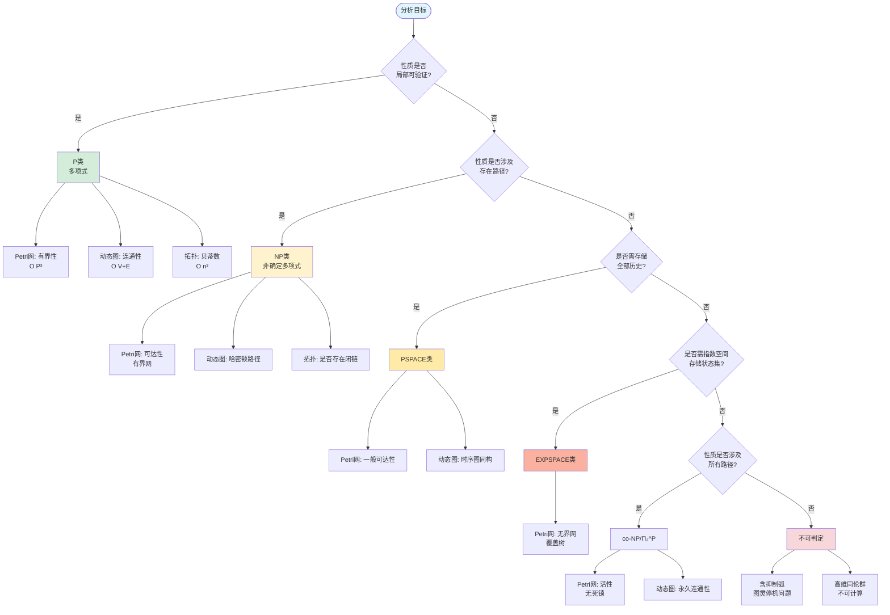

---

### 3.3 算法选择决策树

**文件**: `graph_view04.md`

**Mermaid格式**:

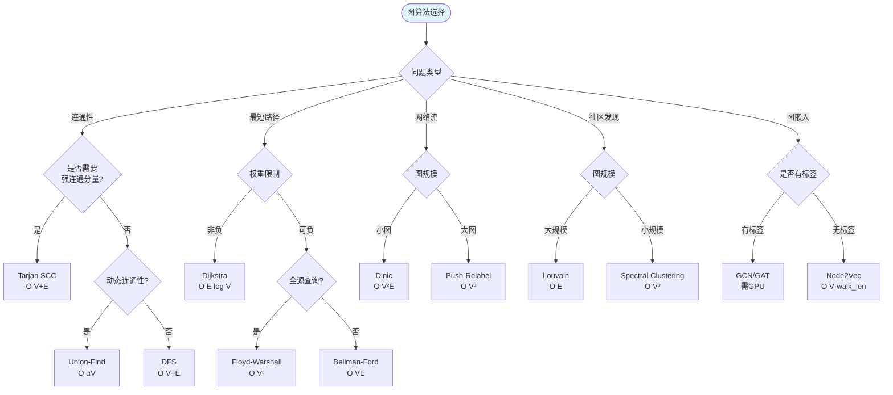

---

## 🏗️ **四、证明树图规划 / Proof Tree Planning**

### 4.1 统一性定理证明树

**文件**: `graph_view00.md`, `graph_view01.md`, `graph_view03.md`

**Mermaid格式**:

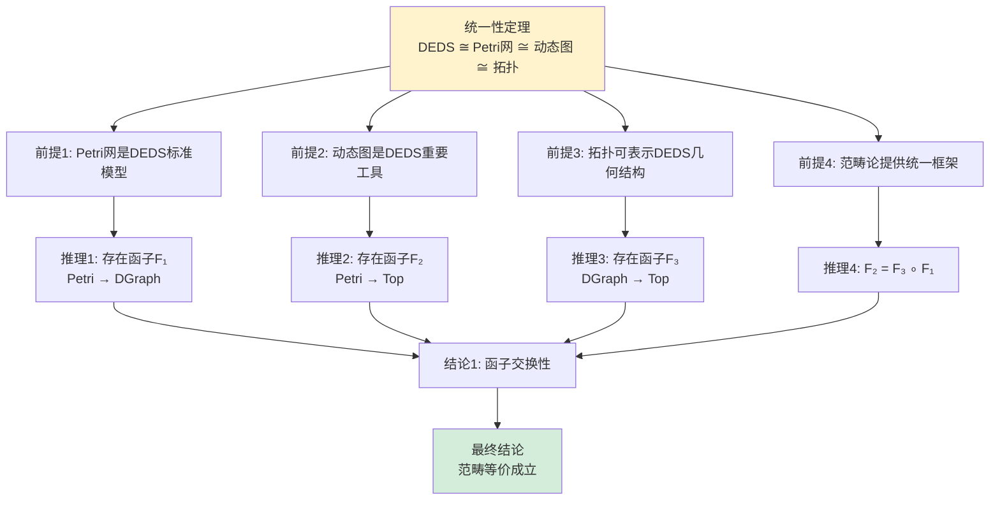

---

### 4.2 S-不变量 = 上同调类证明树

**文件**: `graph_view00.md`, `graph_view01.md`

**Mermaid格式**:

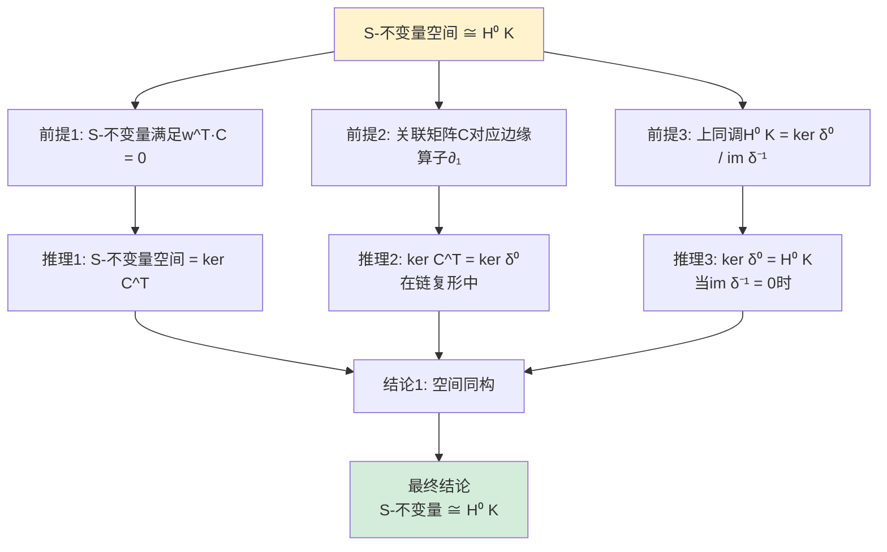

---

### 4.3 树形结构数学必然性证明树

**文件**: `graph_view05.md`

**Mermaid格式**:

```mermaid
graph TD
    Theorem[树形结构是组织关系的<br/>最小充分描述] --> P1[证明1: 信息熵最小化原理]
    Theorem --> P2[证明2: 控制复杂度上界定理]
    Theorem --> P3[证明3: 激励相容性博弈]

    P1 --> R1[推理1: 树形图边数E_tree = N-1]
    P1 --> R2[推理2: 完全图边数E_complete = N N-1 /2]
    R1 --> C1[结论1: I_tree / I_complete → 0<br/>当N→∞]

    P2 --> R3[推理3: 树形协调复杂度O N log N]
    P2 --> R4[推理4: 扁平结构复杂度O N²]
    R3 --> C2[结论2: C_tree / C_flat < 5%<br/>当N>100]

    P3 --> R5[推理5: 最优分支因子k* = σ/√c_s]
    P3 --> R6[推理6: 层级数h = log_{k*} N]
    R5 --> C3[结论3: 树形是成本最小化<br/>激励对齐的均衡结构]

    C1 --> Final[最终结论<br/>树形结构数学必然]
    C2 --> Final
    C3 --> Final

    style Theorem fill:#fff3cd
    style Final fill:#d4edda
```

---

## 🔗 **五、交换图规划 / Commutative Diagram Planning**

### 5.1 核心函子方块交换图

**文件**: `graph_view00.md`, `graph_view01.md`

**Mermaid格式**:

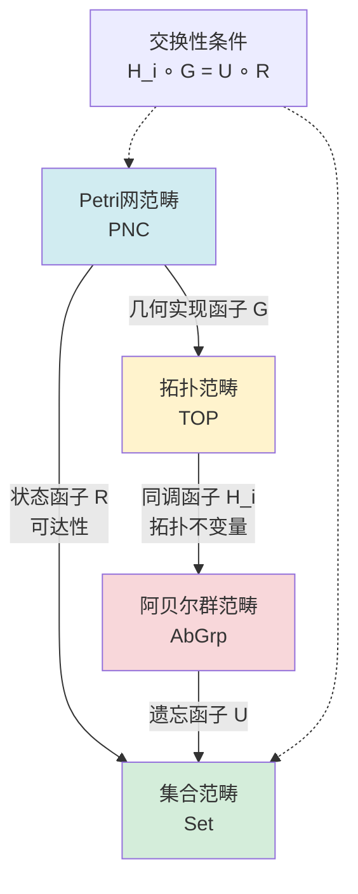

---

### 5.2 双向模拟函子交换图

**文件**: `graph_view01.md`

**Mermaid格式**:

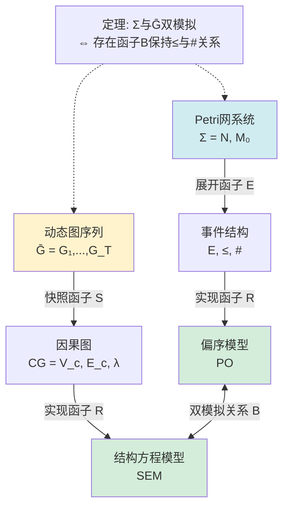

---

## 📈 **六、时序图规划 / Temporal Diagram Planning**

### 6.1 理论演化时序图

**文件**: `graph_view01.md`

**Mermaid格式**:

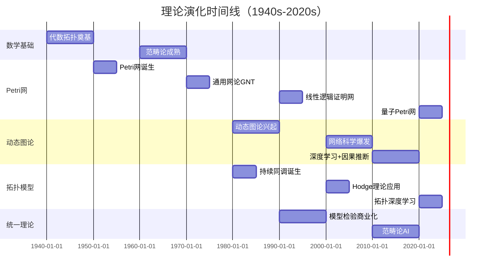

---

### 6.2 关键理论融合节点时序图

**文件**: `graph_view01.md`

**Mermaid格式**:

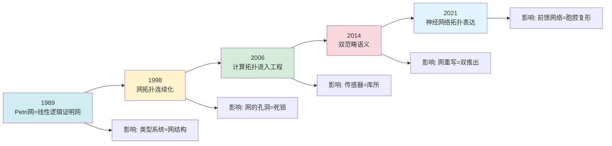

---

## 🎯 **七、坐标系统规划 / Coordinate System Planning**

### 7.1 五维认知坐标系

**文件**: `graph_view01.md`

**Mermaid格式**:

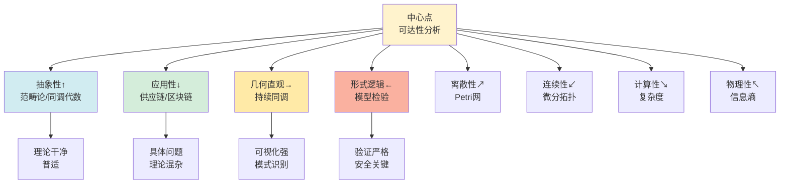

---

## 📊 **八、数据流图规划 / Data Flow Diagram Planning**

### 8.1 拓扑特征提取流水线

**文件**: `graph_view04.md`

**Mermaid格式**:

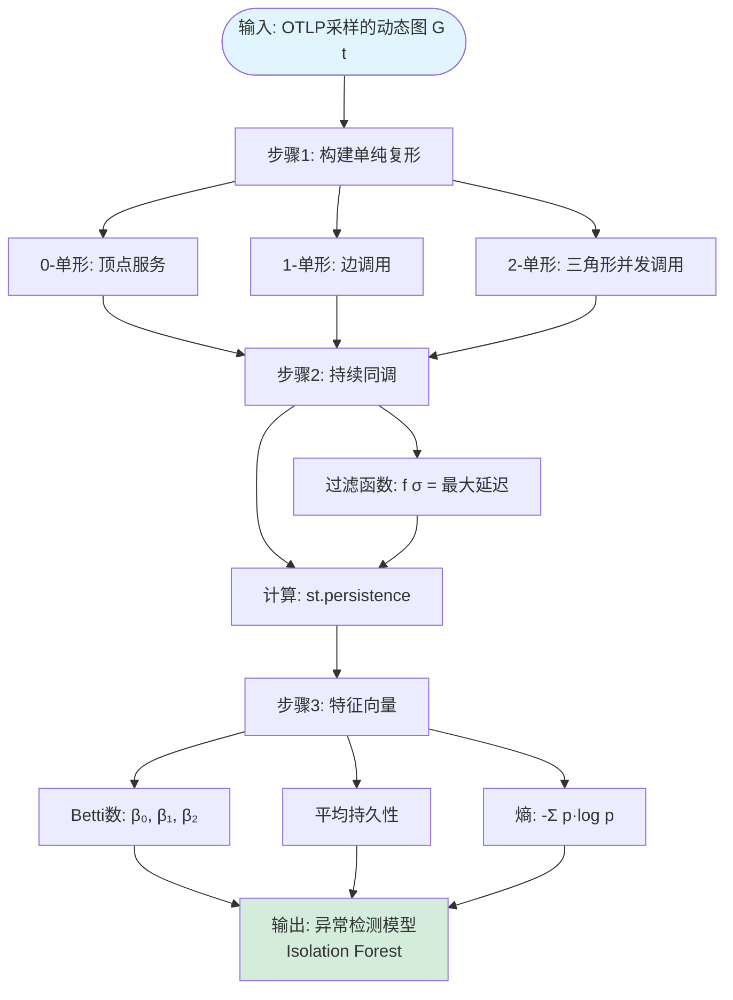

---

### 8.2 实时拓扑监控架构数据流

**文件**: `graph_view04.md`

**Mermaid格式**:

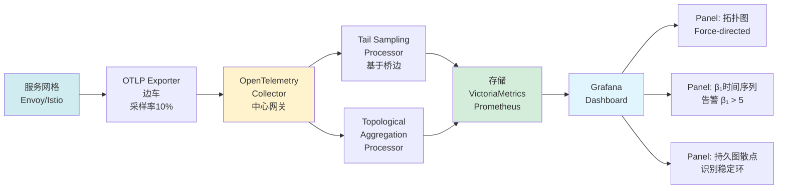

---

## 🎯 **九、论证思维图规划 / Argumentation Map Planning**

### 9.1 统一性论证思维图

**文件**: `graph_view00.md`, `graph_view01.md`

**Mermaid格式**:

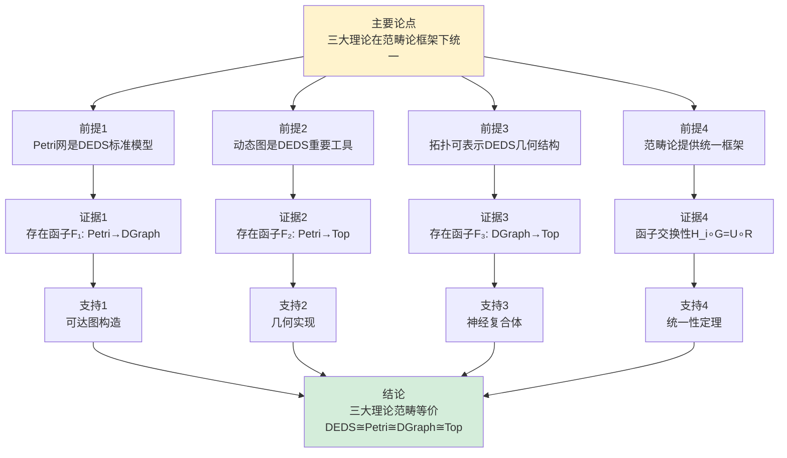

---

### 9.2 S-不变量论证思维图

**文件**: `graph_view00.md`, `graph_view01.md`

**Mermaid格式**:

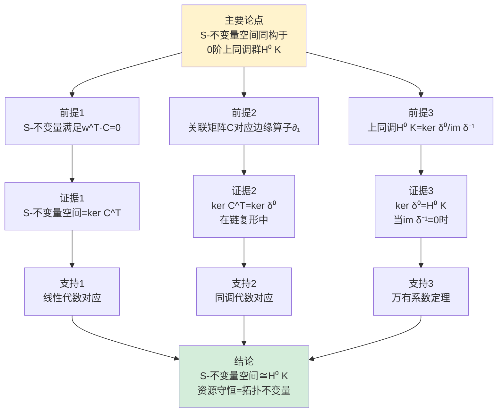

---

## 🌳 **十、理论模型层次树图规划 / Theory Model Hierarchy Tree Planning**

### 10.1 三大理论层次树

**文件**: `graph_view00.md`, `graph_view01.md`

**Mermaid格式**:

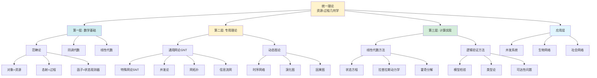

---

### 10.2 理论嵌入关系格

**文件**: `graph_view01.md`

**Mermaid格式**:

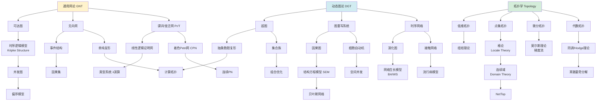

---

## 📊 **十一、工具创建进度 / Tools Creation Progress**

### 11.1 按文件分布

| 文件名 | 需要工具数 | 已创建 | 待创建 | 完成率 |
|--------|-----------|--------|--------|--------|
| `graph_view00.md` | 8个 | 0个 | 8个 | 0% |
| `graph_view01.md` | 10个 | 0个 | 10个 | 0% |
| `graph_view02.md` | 5个 | 0个 | 5个 | 0% |
| `graph_view03.md` | 6个 | 0个 | 6个 | 0% |
| `graph_view04.md` | 7个 | 0个 | 7个 | 0% |
| `graph_view05.md` | 4个 | 0个 | 4个 | 0% |
| **总计** | **40个** | **0个** | **40个** | **0%** |

### 11.2 按工具类型分布

| 工具类型 | 需要数量 | 已创建 | 待创建 | 完成率 |
|---------|---------|--------|--------|--------|
| 思维导图 | 7个 | 0个 | 7个 | 0% |
| 决策树图 | 8个 | 0个 | 8个 | 0% |
| 证明树图 | 5个 | 0个 | 5个 | 0% |
| 理论层次树 | 3个 | 0个 | 3个 | 0% |
| 数据流图 | 4个 | 0个 | 4个 | 0% |
| 论证思维图 | 4个 | 0个 | 4个 | 0% |
| 交换图 | 3个 | 0个 | 3个 | 0% |
| 时序图 | 2个 | 0个 | 2个 | 0% |
| 坐标系统 | 1个 | 0个 | 1个 | 0% |
| 其他 | 3个 | 0个 | 3个 | 0% |
| **总计** | **40个** | **0个** | **40个** | **0%** |

---

## 📚 **十二、参考文档 / Reference Documents**

- [View文件夹全面梳理计划](./View文件夹全面梳理计划-2025.md)
- [View文件夹主题索引](./View文件夹主题索引-2025.md)
- [View文件夹概念定义清单](./View文件夹概念定义清单-2025.md)
- [View文件夹概念关系网络](./View文件夹概念关系网络-2025.md)
- [View文件夹对比矩阵集](./View文件夹对比矩阵集-2025.md)
- [思维表征图集](./思维表征图集-2025.md)

---

**文档版本**: v1.0
**创建时间**: 2025年1月
**最后更新**: 2025年1月
**状态**: ✅ 思维表征工具规划完成（40个工具规划），待实际创建Mermaid图表
