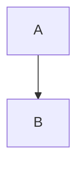
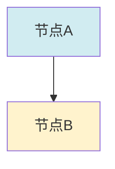

# View文件夹文档结构统一规范 / View Files Document Structure Unification Standard 2025

## 📋 **文档说明**

本文档定义view文件夹内所有文件的统一文档结构标准，确保所有文档遵循一致的格式和编号体系。

**创建时间**: 2025年1月
**状态**: ✅ 完成（规范已建立，6个文档已统一）
**维护者**: GraphNetWorkCommunicate项目组

---

## 📐 **一、统一文档结构标准 / Unified Document Structure Standard**

### 1.1 标准文档结构模板

```markdown
# [文档标题] / [English Title]

## 📚 **概述 / Overview**
- 文档目的
- 核心主题
- 主要内容
- 适用对象

## 📋 **目录 / Table of Contents**
- [自动生成或手动维护]

## 🎯 **一、[第一部分标题] / Part 1: [English Title]**
### **1.1 [子标题]**（必须加粗）
#### 1.1.1 [更细标题]
##### 1.1.1.1 [最细标题]

## 🔬 **二、[第二部分标题] / Part 2: [English Title]**
### **2.1 [子标题]**（必须加粗）
...

## 📊 **三、[第三部分标题] / Part 3: [English Title]**
### 3.1 [子标题]
...

## 🗺️ **四、思维表征工具 / Thinking Representation Tools**
### **4.1 [思维表征类型1]**（必须加粗）
### **4.2 [思维表征类型2]**（必须加粗）
...

## 📚 **五、参考文档 / Reference Documents**
- [相关文档链接]
- [权威来源链接]

---
**文档版本**: vX.X
**创建时间**: YYYY年MM月
**最后更新**: YYYY年MM月
**维护者**: GraphNetWorkCommunicate项目组
**状态**: [状态标识]
```

---

## 🔢 **二、标题编号规则 / Heading Numbering Rules**

### 2.1 编号体系

**一级标题**: `## 🎯 **一、[标题] / Part 1: [English Title]**`

- 使用中文数字：一、二、三、四、五...
- 使用emoji标识：🎯、🔬、📊、🗺️、📚...
- 包含中英文标题

**二级标题**: `### 1.1 [标题]`

- 使用阿拉伯数字：1.1, 1.2, 1.3...
- 不包含emoji（可选）

**三级标题**: `#### 1.1.1 [标题]`

- 使用阿拉伯数字：1.1.1, 1.1.2...

**四级标题**: `##### 1.1.1.1 [标题]`

- 使用阿拉伯数字：1.1.1.1, 1.1.1.2...

### 2.2 编号示例

```markdown
## 🎯 **一、理论统一性论证框架 / Part 1: Theoretical Unification Framework**
### 1.1 三大理论同构关系
#### 1.1.1 结构同构
##### 1.1.1.1 Petri网结构
### 1.2 函子映射关系
#### 1.2.1 可达性函子
## 🔬 **二、概念多维矩阵 / Part 2: Conceptual Hypermatrix**
### 2.1 三维度对比矩阵
### 2.2 理论映射关系矩阵
```

---

## 📑 **三、必需部分清单 / Required Sections Checklist**

### 3.1 文档头部（必需）

- [x] 文档标题（中英文）
- [x] 概述/Overview部分
- [x] 目录/Table of Contents部分

### 3.2 核心内容部分（至少3个主要部分）

- [x] 第一部分：理论/概念/定义
- [x] 第二部分：关系/矩阵/对比
- [x] 第三部分：应用/实践/工具
- [ ] 第四部分：思维表征工具（如适用）
- [ ] 第五部分：参考文档

### 3.3 文档尾部（必需）

- [x] 文档版本号
- [x] 创建时间
- [x] 最后更新时间
- [x] 维护者
- [x] 状态标识

---

## 🎨 **四、格式规范 / Format Standards**

### 4.1 标题格式

**一级标题格式**:

```markdown
## 🎯 **一、[中文标题] / Part 1: [English Title]**
```

**二级标题格式**:

```markdown
### **1.1 [标题]**（必须加粗）
```

**注意**: 所有二级标题（子标题）必须使用加粗格式，格式为 `### **X.X [标题]**`

**三级标题格式**:

```markdown
#### 1.1.1 [标题]
```

### 4.2 表格格式

**标准表格格式**:

```markdown
| **列1** | **列2** | **列3** |
|---------|---------|---------|
| 内容1 | 内容2 | 内容3 |
```

**要求**:

- 表头加粗
- 对齐清晰
- 内容完整

### 4.3 代码块格式

**Mermaid图表**:

````markdown

````

**数学公式**:

````markdown
```数学
M' = M + C·σ
```
````

**文本代码**:

````markdown
```
代码内容
```
````

### 4.4 列表格式

**有序列表**:

```markdown
1. 第一项
2. 第二项
3. 第三项
```

**无序列表**:

```markdown
- 第一项
- 第二项
- 第三项
```

**任务列表**:

```markdown
- [x] 已完成任务
- [ ] 待完成任务
```

---

## 🔗 **五、交叉引用规范 / Cross-Reference Standards**

### 5.1 内部文档引用

**格式**: `[文档名称](./文档文件名.md)`

**示例**:

```markdown
- [View文件夹主题索引](./View文件夹主题索引-2025.md)
- [View文件夹概念定义清单](./View文件夹概念定义清单-2025.md)
```

### 5.2 外部权威来源引用

**格式**: `[来源名称](URL)`

**示例**:

```markdown
- [Wikipedia: Petri net](https://en.wikipedia.org/wiki/Petri_net)
- [Wikipedia: Category theory](https://en.wikipedia.org/wiki/Category_theory)
```

### 5.3 概念引用

**格式**: `**概念名称**` 或 `[概念名称](#概念锚点)`

**示例**:

```markdown
**Petri网**的定义是...
参见[Petri网定义](#概念1.1)
```

---

## 📊 **六、思维表征工具规范 / Thinking Representation Tools Standards**

### 6.1 Mermaid图表规范

**要求**:

- 所有图表使用Mermaid格式
- 图表标题清晰
- 节点标签简洁
- 颜色区分不同类别

**示例**:



### 6.2 图表位置规范

- 思维导图：放在概述后或相关章节开头
- 决策树：放在决策相关章节
- 证明树：放在证明相关章节
- 关系图：放在关系分析章节

---

## 📝 **七、术语统一规范 / Terminology Unification Standards**

### 7.1 核心术语对照表

| **中文术语** | **英文术语** | **缩写** | **使用场景** |
|------------|------------|---------|------------|
| Petri网 | Petri Net | PN | 理论描述 |
| 动态图论 | Dynamic Graph Theory | DGT | 理论描述 |
| 拓扑模型 | Topological Model | - | 理论描述 |
| 范畴论 | Category Theory | - | 理论描述 |
| 同调群 | Homology Group | H_i | 数学公式 |
| 上同调群 | Cohomology Group | H^i | 数学公式 |
| 可达性 | Reachability | - | 性质描述 |
| 不变量 | Invariant | - | 性质描述 |

### 7.2 术语使用要求

- **首次出现**: 使用完整术语（中文 + 英文）
- **后续出现**: 可使用中文或英文
- **数学公式**: 使用标准数学符号
- **专业术语**: 保持一致性

---

## 🎯 **八、文档分类标准 / Document Classification Standards**

### 8.1 按内容类型分类

| **文档类型** | **结构特点** | **必需部分** | **示例** |
|------------|------------|------------|---------|
| **理论梳理文档** | 重点在理论定义和关系 | 概念定义、关系网络、证明 | graph_view00.md |
| **应用实践文档** | 重点在应用案例 | 应用矩阵、决策树、工具链 | graph_view02.md |
| **工程实现文档** | 重点在算法和实现 | 算法对比、决策树、数据流图 | graph_view04.md |
| **管理规划文档** | 重点在计划和进度 | 任务清单、进度统计、行动计划 | View文件夹全面梳理计划-2025.md |

### 8.2 按主题模块分类

| **模块** | **主要文件** | **结构特点** |
|---------|------------|------------|
| **Petri网理论** | graph_view00.md, graph_view01.md | 理论定义、证明、关系 |
| **动态图论** | graph_view00.md, graph_view01.md | 时序网络、演化、算法 |
| **拓扑模型** | graph_view00.md, graph_view01.md | 同调、持续同调、TDA |
| **行业应用** | graph_view02.md, graph_view03.md | 应用矩阵、技术栈、工具链 |
| **工程实践** | graph_view04.md | 算法对比、决策树、OTLP |
| **通用模型** | graph_view05.md | 形式化证明、应用矩阵 |

---

## ✅ **九、文档检查清单 / Document Checklist**

### 9.1 结构检查

- [ ] 文档标题包含中英文
- [ ] 有概述/Overview部分
- [ ] 有目录/Table of Contents部分
- [ ] 至少有3个主要部分
- [ ] 有思维表征工具部分（如适用）
- [ ] 有参考文档部分
- [ ] 有文档元信息（版本、时间、维护者、状态）

### 9.2 格式检查

- [ ] 标题编号规范（一、二、三...）
- [ ] 二级标题编号规范（1.1, 1.2...）
- [ ] **子标题格式统一（必须加粗：`### **X.X ...**`）**
- [ ] **目录链接格式统一（必须加粗：`[**X.X ...**]`）**
- [ ] 表格格式统一
- [ ] Mermaid图表格式正确
- [ ] 交叉引用格式正确
- [ ] 术语使用一致

### 9.3 内容检查

- [ ] 概念定义准确
- [ ] 关系描述清晰
- [ ] 矩阵数据准确
- [ ] 思维表征工具完整
- [ ] 参考文档链接有效

---

## 📚 **十、参考示例 / Reference Examples**

### 10.1 标准文档结构示例

参见以下文档作为标准参考：

- `View文件夹主题索引-2025.md` - 主题索引文档标准
- `View文件夹概念定义清单-2025.md` - 概念定义文档标准
- `View文件夹概念关系网络-2025.md` - 关系网络文档标准
- `View文件夹对比矩阵集-2025.md` - 矩阵文档标准

### 10.2 文档统一状态清单

| 文件名 | 当前结构状态 | 格式统一状态 | 状态 |
|--------|------------|------------|------|
| `graph_view00.md` | ✅ 已统一 | ✅ 格式已完全统一（子标题和目录链接） | ✅ 完成 |
| `graph_view01.md` | ✅ 已统一 | ✅ 格式已完全统一（子标题和目录链接） | ✅ 完成 |
| `graph_view02.md` | ✅ 已统一 | ✅ 格式已完全统一（子标题和目录链接） | ✅ 完成 |
| `graph_view03.md` | ✅ 已统一 | ✅ 格式已完全统一（子标题和目录链接） | ✅ 完成 |
| `graph_view04.md` | ✅ 已统一 | ✅ 格式已完全统一（子标题和目录链接） | ✅ 完成 |
| `graph_view05.md` | ✅ 已统一 | ✅ 格式已完全统一（子标题和目录链接） | ✅ 完成 |

**说明**: 所有6个视图文档已完成结构统一和格式统一，包括：

- ✅ 文档结构统一（概述、目录、思维表征工具、参考文档、元信息）
- ✅ 子标题格式统一（所有 `### X.X` 格式的子标题已加粗为 `### **X.X**`）
- ✅ 目录链接格式统一（所有目录中的子标题链接已加粗为 `[**X.X ...**]`）

---

## 🚀 **十一、统一执行计划 / Unification Execution Plan**

### 11.1 执行步骤

1. **步骤1**: 分析现有文档结构
2. **步骤2**: 创建统一结构模板
3. **步骤3**: 逐个文件统一结构
4. **步骤4**: 验证格式一致性
5. **步骤5**: 更新交叉引用

### 11.2 优先级顺序

1. **高优先级**: graph_view00.md, graph_view01.md（核心理论文件）
2. **中优先级**: graph_view02.md, graph_view03.md, graph_view04.md（应用和工程文件）
3. **低优先级**: graph_view05.md, 其他文件（补充文件）

---

## 📚 **十二、参考文档 / Reference Documents**

- [View文件夹全面梳理计划](./View文件夹全面梳理计划-2025.md)
- [View文件夹主题索引](./View文件夹主题索引-2025.md)
- [View文件夹概念定义清单](./View文件夹概念定义清单-2025.md)

---

**文档版本**: v1.1
**创建时间**: 2025年1月
**最后更新**: 2025年1月
**状态**: ✅ 规范制定完成，所有文档格式已完全统一（子标题格式和目录链接格式）
