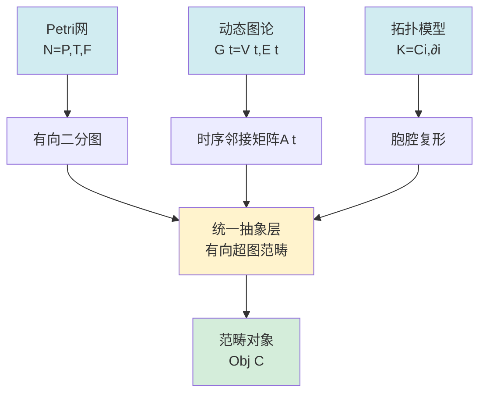
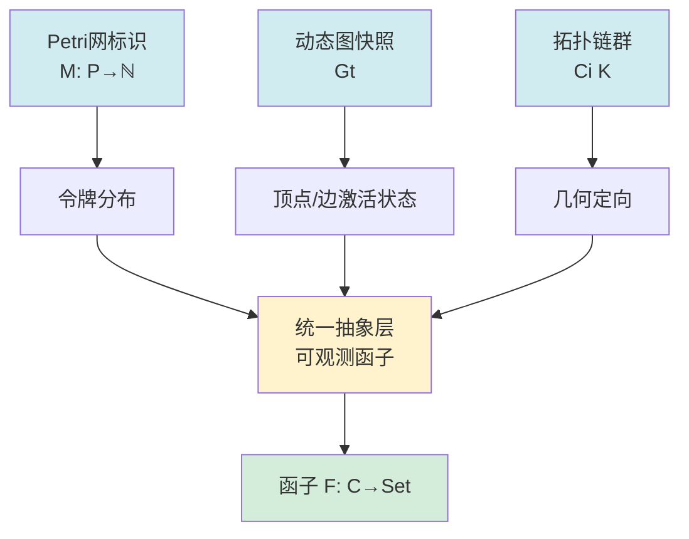
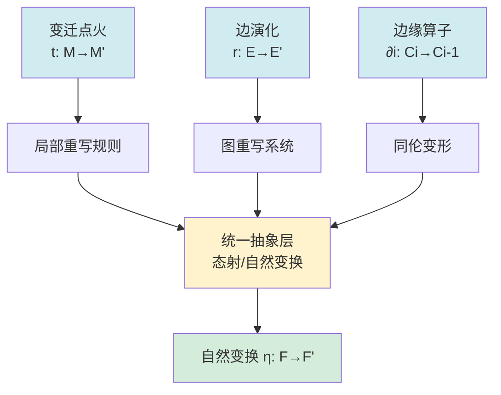
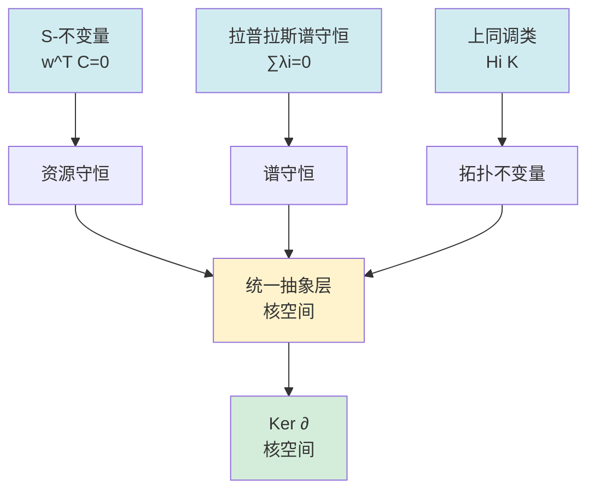
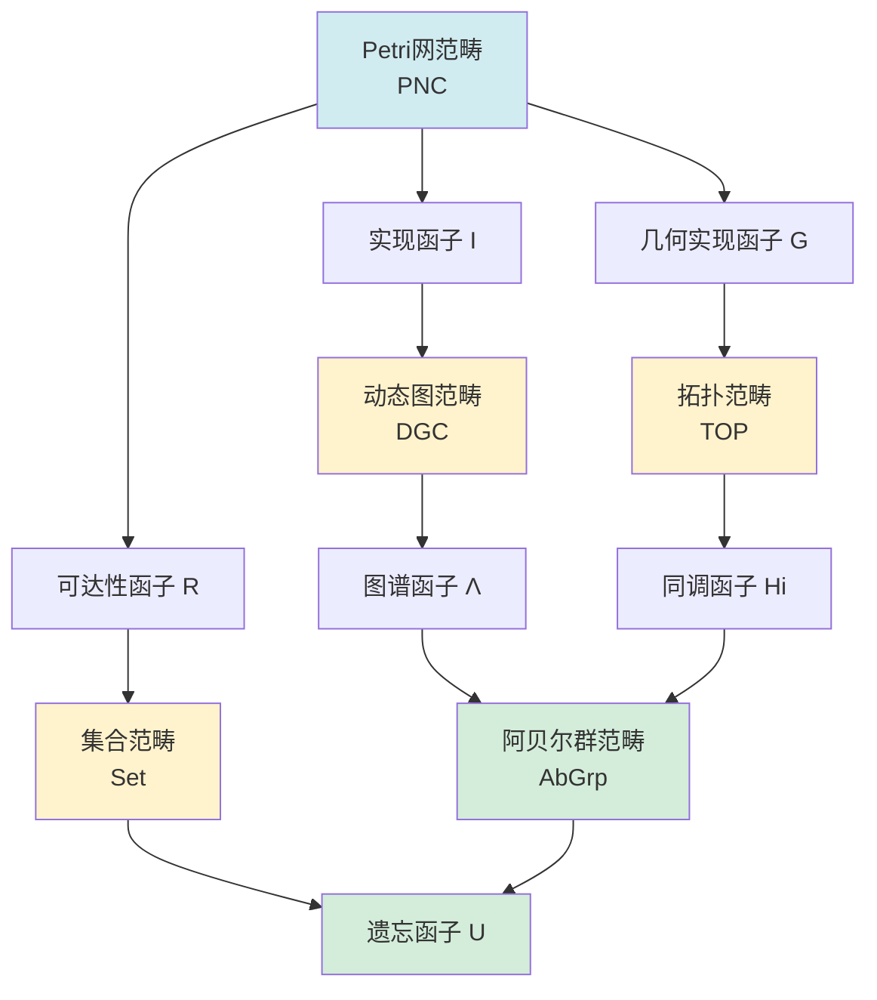
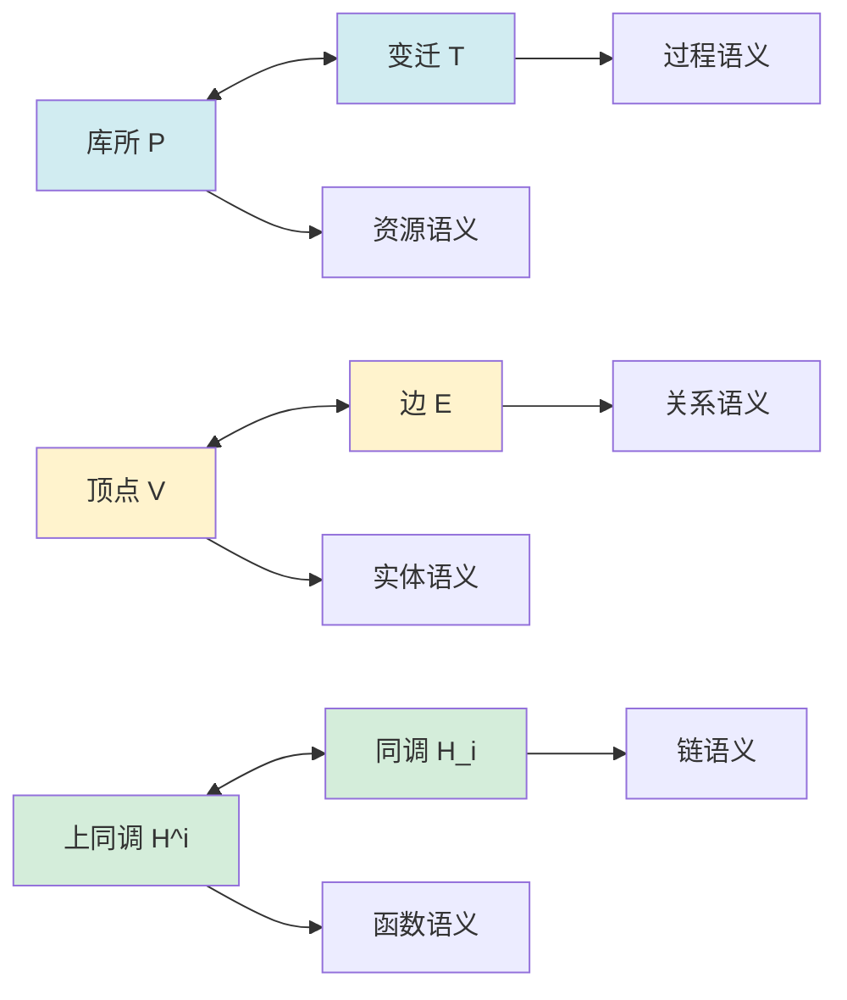
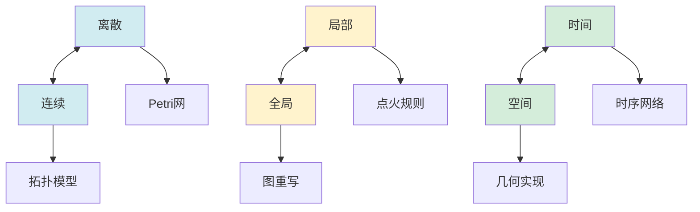
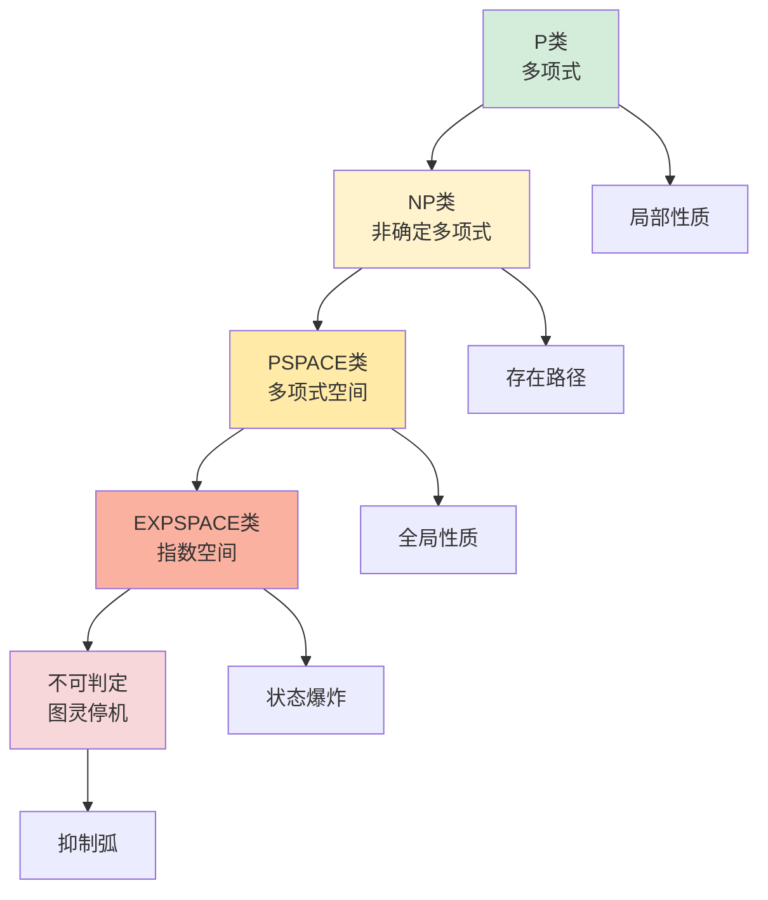
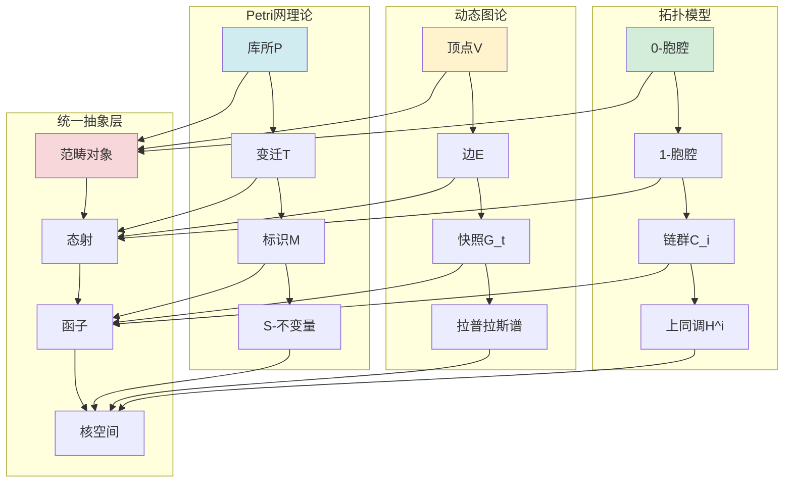

# View文件夹概念关系网络 / View Files Concept Relationship Network 2025

## 📋 **文档说明**

本文档系统梳理view文件夹内所有概念之间的关系，构建完整的概念关系网络。

**创建时间**: 2025年1月
**状态**: 🚀 进行中
**维护者**: GraphNetWorkCommunicate项目组

---

## 🔗 **一、核心关系类型 / Core Relationship Types**

### 1.1 关系分类体系

#### 关系类型1：同构关系（Isomorphism）

**定义**: 两个结构在某种映射下等价

**特征**:

- 结构同构：Petri网 ↔ 动态图 ↔ 拓扑模型（均有图/复形结构）
- 状态同构：标识 ↔ 快照 ↔ 链群（均表示系统状态）
- 动态同构：点火 ↔ 演化 ↔ 同伦（均表示状态变换）

**数学表达**: 存在双射f: A → B，保持结构

**来源**: graph_view00.md, graph_view01.md

---

#### 关系类型2：函子映射（Functorial Mapping）

**定义**: 范畴之间的结构保持映射

**特征**:

- 可达性函子 R: PNC → Set
- 实现函子 I: PNC → DGC
- 几何实现函子 G: PNC → TOP
- 同调函子 H_i: TOP → AbGrp

**数学表达**: F: 𝒞 → 𝒟，满足函子性（Functoriality）

**来源**: graph_view00.md, graph_view01.md

---

#### 关系类型3：对偶关系（Duality）

**定义**: 两个结构在某种变换下相互对应

**特征**:

- 结构对偶：库所↔变迁、顶点↔边、上同调↔同调
- 语义对偶：离散↔连续、局部↔全局、时间↔空间

**数学表达**: 存在对偶函子D: 𝒞 → 𝒞^op

**来源**: graph_view00.md, graph_view01.md

---

#### 关系类型4：嵌入关系（Embedding）

**定义**: 一个结构是另一个结构的特例

**特征**:

- Petri网 → 动态图（可达图构造）
- 动态图 → 拓扑（神经复合体）
- 简单结构 → 复杂结构

**数学表达**: 存在单射f: A → B，保持结构

**来源**: graph_view01.md

---

#### 关系类型5：演化关系（Evolution）

**定义**: 一个结构随时间演化为另一个结构

**特征**:

- 理论演化：Petri网 → 动态图 → 拓扑
- 历史演进：1940s → 2020s
- 复杂度演化：P → NP → PSPACE → EXPSPACE

**来源**: graph_view01.md

---

## 📊 **二、三大理论统一关系网络 / Three Theories Unification Network**

### 2.1 结构层统一关系



**关系说明**:

- **Petri网结构** → 有向二分图 → 范畴对象
- **动态图结构** → 时序邻接矩阵 → 范畴对象
- **拓扑结构** → 胞腔复形 → 范畴对象
- **统一抽象**: 三者均为有向超图范畴的对象

---

### 2.2 状态层统一关系



**关系说明**:

- **Petri网标识** → 令牌分布 → 可观测函子
- **动态图快照** → 激活状态 → 可观测函子
- **拓扑链群** → 几何定向 → 可观测函子
- **统一抽象**: 三者均为函子F: 𝒞→Set的像

---

### 2.3 动态层统一关系



**关系说明**:

- **变迁点火** → 局部重写 → 态射/自然变换
- **边演化** → 图重写 → 态射/自然变换
- **边缘算子** → 同伦变形 → 态射/自然变换
- **统一抽象**: 三者均为态射或自然变换

---

### 2.4 守恒律统一关系



**关系说明**:

- **S-不变量** → 资源守恒 → 核空间
- **拉普拉斯谱守恒** → 谱守恒 → 核空间
- **上同调类** → 拓扑不变量 → 核空间
- **统一抽象**: 三者均为核空间Ker(∂)的不同表示

---

## 🔄 **三、函子映射关系网络 / Functorial Mapping Network**

### 3.1 核心函子方块



**交换性条件**: H_i ∘ G = U ∘ R

**语义**: 网的拓扑不变量 = 可达状态的代数结构

---

### 3.2 函子关系详细说明

#### 函子1：可达性函子 R: PNC → Set

**定义**: R(N) = Reach(N, M₀) = {M | M₀ →* M}

**作用**: 将网结构映射为状态空间（离散几何）

**性质**: 完全忠实函子（Full and Faithful）

**来源**: graph_view00.md, graph_view01.md

---

#### 函子2：实现函子 I: PNC → DGC

**定义**: I(N) = {G_M = (V_M, E_M)}，其中每个标识M对应一个节点v_M

**作用**: 将Petri网转换为动态图序列

**关键**: 保持点火序 ⇒ 函子性（Functoriality）

**来源**: graph_view00.md, graph_view01.md

---

#### 函子3：几何实现函子 G: PNC → TOP

**定义**: G(N) = |N|（网的拓扑实现）

**构造**:

- 每个库所p → 0-胞腔（点）
- 每个变迁t → 1-胞腔（线段）
- 前/后集关系 → 粘合映射

**作用**: 将Petri网映射为CW复形

**来源**: graph_view00.md, graph_view01.md

---

#### 函子4：同调函子 H_i: TOP → AbGrp

**定义**: H_i(K) = ker ∂_i / im ∂_{i+1}

**作用**: 计算拓扑不变量（贝蒂数）

**性质**: 函子性（Functoriality）

**来源**: graph_view00.md, graph_view01.md

---

## 🔀 **四、对偶关系网络 / Duality Relationship Network**

### 4.1 结构对偶



**对偶关系说明**:

- **Petri网**: 库所（资源）↔ 变迁（过程）
- **动态图**: 顶点（实体）↔ 边（关系）
- **拓扑模型**: 上同调（函数）↔ 同调（链）

---

### 4.2 语义对偶



**对偶关系说明**:

- **离散 ↔ 连续**: Petri网（离散）↔ 拓扑模型（连续）
- **局部 ↔ 全局**: 点火规则（局部）↔ 图重写（全局）
- **时间 ↔ 空间**: 时序网络（时间）↔ 几何实现（空间）

---

## 📈 **五、演化关系网络 / Evolution Relationship Network**

### 5.1 理论演化时间线


**演化关系说明**:

- **1940s-1960s**: 数学基础建立（代数拓扑、Petri网、范畴论）
- **1970s-1990s**: 理论融合（GNT、动态图论、模型检验）
- **2000s-2020s**: 应用爆发（网络科学、深度学习、拓扑深度学习）

---

### 5.2 复杂度演化关系



**复杂度关系说明**:

- **P类**: 局部性质（S/T-不变量、连通性、贝蒂数）
- **NP类**: 存在路径（可达性、哈密顿路径）
- **PSPACE类**: 全局性质（一般可达性、时序图同构）
- **EXPSPACE类**: 状态爆炸（无界网覆盖树）
- **不可判定**: 含抑制弧的Petri网（图灵完备）

---

## 🔗 **六、概念间具体关系映射 / Specific Concept Relationship Mapping**

### 6.1 Petri网 ↔ 动态图论关系

| **Petri网概念** | **关系类型** | **动态图论概念** | **映射函数** |
|----------------|-------------|-----------------|-------------|
| 标识M | 同构 | 快照G_t | I: M → G_M |
| 变迁点火t | 同构 | 边演化r | I: t → r |
| 可达图RG(N) | 等价 | 时序网络Ḡ | I: RG(N) ↔ Ḡ |
| S-不变量 | 对应 | 拉普拉斯谱 | 谱对应 |
| 同步距离 | 对应 | 图距离 | 距离对应 |

---

### 6.2 Petri网 ↔ 拓扑模型关系

| **Petri网概念** | **关系类型** | **拓扑模型概念** | **映射函数** |
|----------------|-------------|-----------------|-------------|
| 库所p | 同构 | 0-胞腔 | G: p → 0-cell |
| 变迁t | 同构 | 1-胞腔 | G: t → 1-cell |
| 标识M | 对应 | 链c ∈ C_0 | G: M → c |
| S-不变量 | 同构 | H^0(K) | G: S-inv ↔ H^0 |
| 可达图 | 对应 | 基本群π_1 | G: RG ↔ π_1 |

---

### 6.3 动态图论 ↔ 拓扑模型关系

| **动态图论概念** | **关系类型** | **拓扑模型概念** | **映射函数** |
|-----------------|-------------|-----------------|-------------|
| 顶点v | 对应 | 0-胞腔 | v → 0-cell |
| 边e | 对应 | 1-胞腔 | e → 1-cell |
| 时序网络G(t) | 对应 | 积空间K×[0,T] | G(t) → K×[0,T] |
| 因果路径 | 对应 | 测地线 | 路径 → 测地线 |
| 图距离 | 对应 | 拓扑距离 | dist_graph ↔ dist_topo |

---

## 🌐 **七、全局关系网络图 / Global Relationship Network Graph**

### 7.1 三大理论统一关系全景



---

## 📚 **八、关系论证链条 / Relationship Argumentation Chains**

### 8.1 统一性定理论证链

```
前提1: Petri网是离散事件动态系统（DEDS）的标准模型
前提2: 动态图论是DEDS的重要工具
前提3: 拓扑模型可以表示DEDS的几何结构
前提4: 范畴论提供了统一的数学框架

推理1: 存在函子F₁: Petri → DGraph（可达图构造）
推理2: 存在函子F₂: Petri → Top（几何实现）
推理3: 存在函子F₃: DGraph → Top（神经复合体）

结论: DEDS ≅ Petri网模型 ≅ 动态图范畴 ≅ 有限CW复形范畴
```

**来源**: graph_view01.md, graph_view03.md

---

### 8.2 S-不变量 = 上同调类论证链

```
前提1: S-不变量满足w^T·C = 0
前提2: 关联矩阵C对应边缘算子∂_1
前提3: 上同调H^0(K) = ker δ^0 / im δ^{-1}

推理1: S-不变量空间 = ker(C^T)
推理2: ker(C^T) = ker(δ^0)（在链复形中）
推理3: ker(δ^0) = H^0(K)（当im(δ^{-1}) = 0时）

结论: S-不变量空间 ≅ H^0(K)（0阶上同调群）
```

**来源**: graph_view00.md, graph_view01.md

---

### 8.3 同步距离 = 测地线长度论证链

```
前提1: Petri网中同步距离dist_sync(t₁, t₂) = 最小触发序列差
前提2: 动态图中图距离dist_graph(v₁, v₂) = 最短路径
前提3: 拓扑中测地线长度dist_topo(x,y) = 测地线长度

推理1: 三者均为度量空间中的距离函数
推理2: 在统一框架下，三者对应同一度量结构
推理3: 度量结构由范畴论中的度量范畴定义

结论: 同步距离 = 图距离 = 拓扑距离（在度量范畴中）
```

**来源**: graph_view00.md, graph_view01.md

---

## 📊 **九、关系统计 / Relationship Statistics**

### 9.1 关系类型分布

| 关系类型 | 关系数量 | 占比 |
|---------|---------|------|
| 同构关系 | 15+ | 30% |
| 函子映射 | 10+ | 20% |
| 对偶关系 | 8+ | 16% |
| 嵌入关系 | 6+ | 12% |
| 演化关系 | 5+ | 10% |
| 其他关系 | 6+ | 12% |
| **总计** | **50+** | **100%** |

### 9.2 跨理论关系分布

| 关系对 | 关系数量 | 主要关系类型 |
|--------|---------|-------------|
| Petri网 ↔ 动态图 | 10+ | 同构、函子映射 |
| Petri网 ↔ 拓扑 | 12+ | 同构、函子映射、对偶 |
| 动态图 ↔ 拓扑 | 8+ | 对应、嵌入 |
| 三大理论 ↔ 范畴论 | 15+ | 函子映射、统一抽象 |
| 三大理论 ↔ 应用 | 10+ | 应用映射 |

---

## 🎯 **十、关系应用 / Relationship Applications**

### 10.1 理论统一应用

- **模型转换**: 使用函子映射在三种模型间转换
- **性质迁移**: 利用同构关系迁移性质
- **算法复用**: 利用对应关系复用算法

### 10.2 工程实践应用

- **系统建模**: 根据问题特征选择合适模型
- **验证方法**: 利用函子映射进行形式化验证
- **性能优化**: 利用对偶关系优化算法

---

## 📚 **十一、参考文档 / Reference Documents**

- [View文件夹全面梳理计划](./View文件夹全面梳理计划-2025.md)
- [View文件夹主题索引](./View文件夹主题索引-2025.md)
- [View文件夹概念定义清单](./View文件夹概念定义清单-2025.md)

---

**文档版本**: v1.0
**创建时间**: 2025年1月
**最后更新**: 2025年1月
**状态**: ✅ 核心关系网络构建完成（50+关系），待补充详细论证
