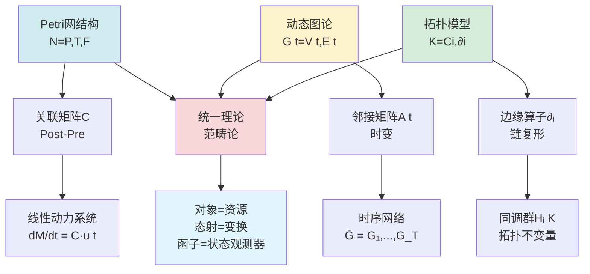
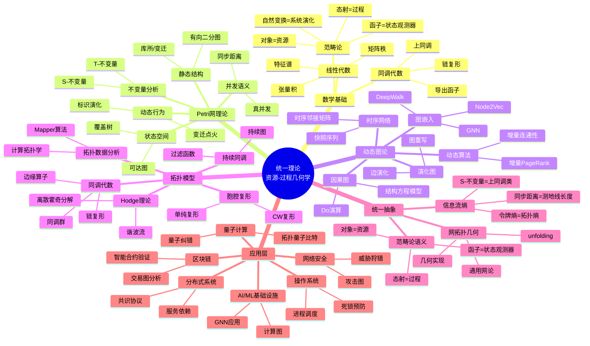
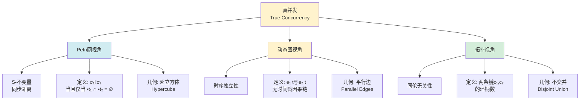
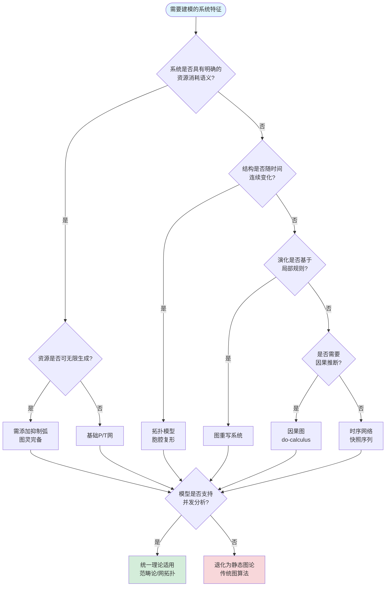
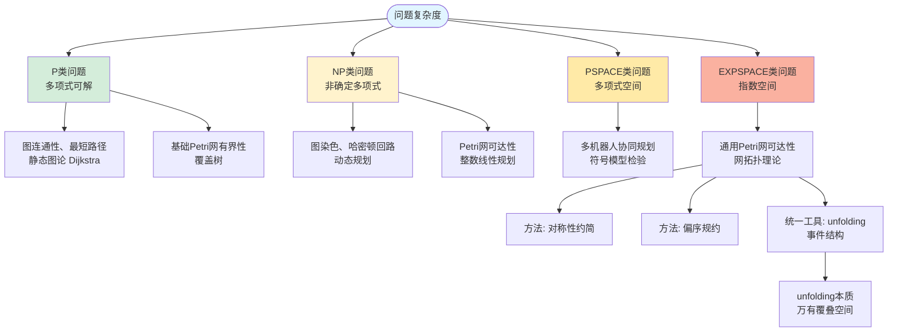
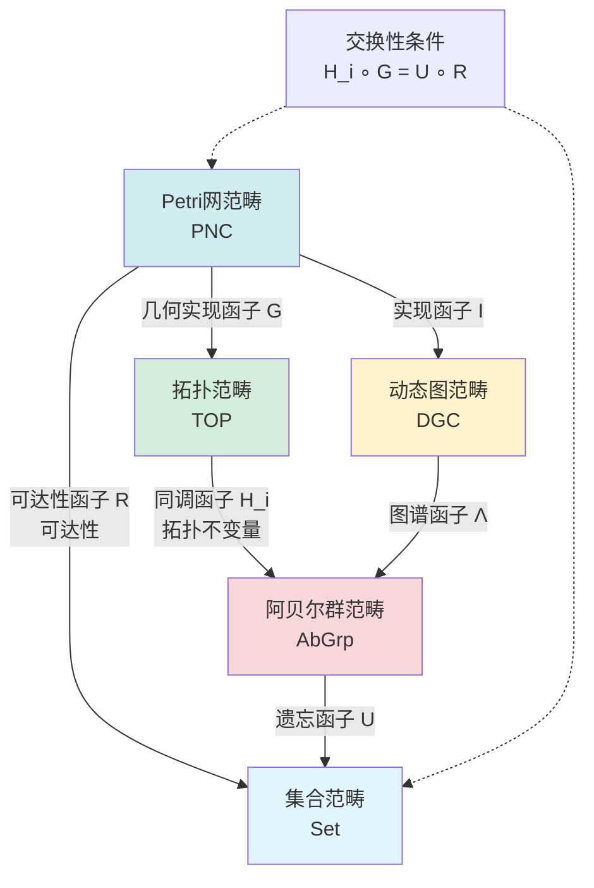
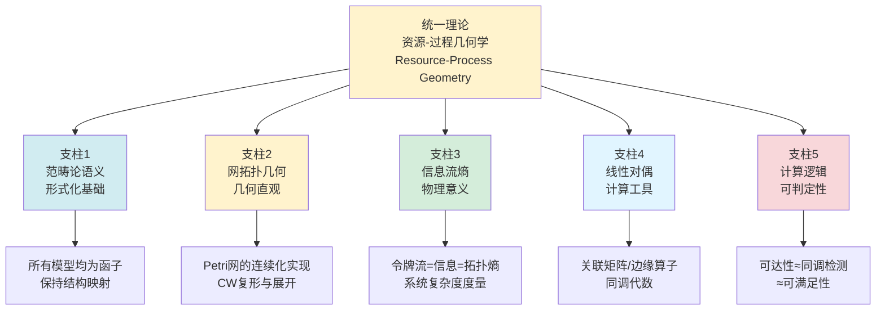

# Petri网与动态图论/拓扑模型统一理论 / Petri Net, Dynamic Graph Theory, and Topological Model Unification Theory

## 📚 **概述 / Overview**

**文档目的**: 系统阐述Petri网、动态图论与拓扑模型在范畴论框架下的统一理论，揭示三大理论的内在同构关系。

**核心主题**:

- Petri网、动态图论、拓扑模型的统一
- 范畴论语义框架
- 网拓扑几何实现
- 信息流熵理论

**主要内容**:

- 三大理论的结构、状态、动态、守恒律统一关系
- 5种思维表征方式（多维矩阵、思维导图、决策树、范畴论形式化、实例验证）
- 深层理论论证和统一性定理

**适用对象**: 理论研究者、系统工程师、数据科学家

---

## 📋 **目录 / Table of Contents**

- [Petri网与动态图论/拓扑模型统一理论 / Petri Net, Dynamic Graph Theory, and Topological Model Unification Theory](#petri网与动态图论拓扑模型统一理论--petri-net-dynamic-graph-theory-and-topological-model-unification-theory)
  - [📚 **概述 / Overview**](#-概述--overview)
  - [📋 **目录 / Table of Contents**](#-目录--table-of-contents)
  - [🎯 **一、理论统一性论证框架 / Part 1: Theoretical Unification Framework**](#-一理论统一性论证框架--part-1-theoretical-unification-framework)
    - [1.1 三大理论统一概述](#11-三大理论统一概述)
    - [1.2 结构层面：Petri网是标注的动态图](#12-结构层面petri网是标注的动态图)
    - [1.3 动态层面：状态空间即图](#13-动态层面状态空间即图)
    - [1.4 统一理论：范畴论与网论](#14-统一理论范畴论与网论)
      - [1.4.1 范畴论视角](#141-范畴论视角)
      - [1.4.2 通用网论（General Net Theory）](#142-通用网论general-net-theory)
      - [1.4.3 离散事件动态系统（DEDS）](#143-离散事件动态系统deds)
    - [1.5 核心区别与互补](#15-核心区别与互补)
  - [📊 **二、思维表征1：概念多维矩阵 / Part 2: Thinking Representation 1 - Conceptual Hypermatrix**](#-二思维表征1概念多维矩阵--part-2-thinking-representation-1---conceptual-hypermatrix)
    - [2.1 三维度对比矩阵（结构×动态×语义）](#21-三维度对比矩阵结构动态语义)
    - [2.2 理论映射关系矩阵](#22-理论映射关系矩阵)
  - [🌳 **三、思维表征2：层次化思维导图 / Part 3: Thinking Representation 2 - Hierarchical Mind Map**](#-三思维表征2层次化思维导图--part-3-thinking-representation-2---hierarchical-mind-map)
    - [3.1 统一理论全景思维导图](#31-统一理论全景思维导图)
    - [3.2 关键概念节点展开（以"真并发"为例）](#32-关键概念节点展开以真并发为例)
  - [🔀 **四、思维表征3：决策树图 / Part 4: Thinking Representation 3 - Decision Tree**](#-四思维表征3决策树图--part-4-thinking-representation-3---decision-tree)
    - [4.1 模型选择决策流程](#41-模型选择决策流程)
    - [4.2 复杂度与表达力权衡树](#42-复杂度与表达力权衡树)
  - [🔗 **五、思维表征4：范畴论形式化图谱 / Part 5: Thinking Representation 4 - Categorical Formalization**](#-五思维表征4范畴论形式化图谱--part-5-thinking-representation-4---categorical-formalization)
    - [5.1 函子视角下的统一](#51-函子视角下的统一)
    - [5.2 单子/余单子结构](#52-单子余单子结构)
  - [📊 **六、思维表征5：实例验证矩阵 / Part 6: Thinking Representation 5 - Case Study Matrix**](#-六思维表征5实例验证矩阵--part-6-thinking-representation-5---case-study-matrix)
    - [6.1 多机器人协同系统建模对比](#61-多机器人协同系统建模对比)
    - [6.2 代谢网络建模（生物化学）](#62-代谢网络建模生物化学)
  - [🔬 **七、深层理论论证：为什么范畴论是统一语言？ / Part 7: Deep Theoretical Argumentation**](#-七深层理论论证为什么范畴论是统一语言--part-7-deep-theoretical-argumentation)
    - [7.1 三大模型本质的哲学同构](#71-三大模型本质的哲学同构)
    - [7.2 具体同构实例](#72-具体同构实例)
      - [7.2.1 实例1：可达图 = 几何实现的对偶](#721-实例1可达图--几何实现的对偶)
      - [7.2.2 实例2：S-不变量 = 上同调类](#722-实例2s-不变量--上同调类)
      - [7.2.3 实例3：同步距离 = 图距离 = 拓扑距离](#723-实例3同步距离--图距离--拓扑距离)
  - [🎯 **八、总结：统一理论的5大支柱 / Part 8: Summary - Five Pillars of Unification Theory**](#-八总结统一理论的5大支柱--part-8-summary---five-pillars-of-unification-theory)
    - [8.1 五大支柱概述](#81-五大支柱概述)
    - [8.2 五大支柱详细说明](#82-五大支柱详细说明)
    - [8.3 最终结论](#83-最终结论)
  - [🗺️ **九、思维表征工具 / Part 9: Thinking Representation Tools**](#️-九思维表征工具--part-9-thinking-representation-tools)
    - [9.1 已包含的思维表征工具](#91-已包含的思维表征工具)
    - [9.2 思维表征工具索引](#92-思维表征工具索引)
  - [📚 **十、参考文档 / Part 10: Reference Documents**](#-十参考文档--part-10-reference-documents)
    - [10.1 内部参考文档](#101-内部参考文档)
    - [10.2 外部权威来源](#102-外部权威来源)
    - [10.3 权威理论文献](#103-权威理论文献)

---

## 🎯 **一、理论统一性论证框架 / Part 1: Theoretical Unification Framework**

### 1.1 三大理论统一概述

您的直觉指向了**并发计算理论**与**几何拓扑学**的深层统一。以下通过**5种思维表征**系统展开论证，揭示Petri网、动态图论与拓扑模型在**范畴论、网拓扑、信息流**三层递进关系中的同构性。

### 1.2 结构层面：Petri网是标注的动态图

Petri网的静态结构本身就是一个**有向图**，但具有特殊约束：

- **有向二分图**：Petri网图由两类节点（库所Place和变迁Transition）构成，所有有向弧只能连接不同类型的节点（库所→变迁或变迁→库所），这使其成为严格的有向二分图。

- **动态标注**：传统图的边仅表示静态关系，而Petri网通过**令牌（Token）**在库所间的流动，为图结构赋予了**状态**和**动态权重**。正如知乎回答所比喻的："图论是公路网络，Petri网是车辆在上面流动"。

- **拓扑视角**：从拓扑学看，Petri网可视为一种**胞腔复形**（Cell Complex），其中库所是0-维胞腔（点），变迁是1-维胞腔（边），令牌流动则定义了动态的同调类。

### 1.3 动态层面：状态空间即图

Petri网的动态行为天然产生图结构：

- **可达标识图（Reachability Graph）**：将每个可能的令牌分布（标识M）作为顶点，变迁触发作为有向边，直接构造出描述系统全部动态行为的图。这本质上是将**时间维度压缩**得到的动态图模型。

- **与动态图论的对应**：动态图论研究图结构随时间演化的性质（如时序网络、演化图），而Petri网的可达图正是**离散时间步**下图结构的精确生成机制。每个标识对应图的一个"快照"，变迁触发对应拓扑重组。

- **并发与同步的拓扑**：通用网论（GNT）中的**网拓扑（Net Topology）** 专门研究无向网的连续与离散性质，而同步距离、并发公理等概念则量化了动态图中**因果序**与**空间邻接**的关系。

### 1.4 统一理论：范畴论与网论

您所寻找的"共同理论"主要由以下框架提供：

#### 1.4.1 范畴论视角

- **图作为范畴**：任何有向图都可看作一个**小范畴**（对象=顶点，态射=路径）。
- **Petri网作为函子**：Petri网的动态行为可建模为从**触发范畴**（描述变迁因果关系）到**集合范畴**（描述令牌分布）的**函子**。这统一了静态结构与动态语义。
- **双重性**：Petri网的**unfolding**（展开）产生一个无环的**事件结构**，这正是拓扑斯理论（Topos Theory）中的**层（Sheaf）** 构造，连接了离散几何与逻辑。

#### 1.4.2 通用网论（General Net Theory）

Carl Adam Petri本人提出的**GNT**是更直接的统一框架：

- **SNT（特殊网论）**：研究具体网结构与性质（有向网+网系统），对应静态图论。
- **GNT（通用网论）**：包含**同步论、并发论、网逻辑、网拓扑、信息流网**五大组件，旨在描述自然现象的普适规律，这与拓扑学"研究空间不变性"的目标同源。

#### 1.4.3 离散事件动态系统（DEDS）

Petri网被公认为 **离散事件动态系统**的标准模型，而动态图论同样是DEDS的重要工具。二者在**线性代数**（关联矩阵、状态方程）和**随机过程**（随机Petri网、时序图）层面共享分析方法。

### 1.5 核心区别与互补

| 特性 | 传统图论/拓扑 | Petri网 |
|------|---------------|---------|
| **状态** | 隐含在结构中 | 显式的令牌分布 |
| **动态** | 通过时序规则外生定义 | 内生点火机制 |
| **并发** | 需额外定义（如图重写） | 原生支持（真并发） |
| **分析** | 连通性、最短路径等 | 活性、有界性、可达性 |

**结论**：Petri网 = **图结构** + **资源流动规则** + **局部触发机制**。它的真正价值不在于超越图论，而在于将 **拓扑结构** 与 **计算过程** 融合为**可执行模型**，这正是现代**计算拓扑学**和**动态系统理论**追求的目标。

---

## 📊 **二、思维表征1：概念多维矩阵 / Part 2: Thinking Representation 1 - Conceptual Hypermatrix**

### 2.1 三维度对比矩阵（结构×动态×语义）

| **分析维度** | **Petri网模型** | **动态图论模型** | **拓扑图模型** | **统一抽象层** |
|-------------|----------------|------------------|----------------|----------------|
| **静态结构** | 有向二分图 \( N=(P,T,F) \)   库所/变迁二分性 | 时序图 \( G(t)=(V(t),E(t)) \)   邻接矩阵时变 | 胞腔复形 \( K=(C_i, \partial_i) \)   同调群 | **有向超图**   范畴 \( \mathcal{C} \) 的对象 |
| **状态表示** | **标识** \( M: P \to \mathbb{N} \)   令牌分布（离散测度） | **快照** \( G_t \)   顶点/边激活状态 | **链** \( c \in C_i \)   几何定向 | **可观测层**   函子 \( \mathcal{F}: \mathcal{C} \to \mathbf{Set} \) |
| **动态机制** | **变迁点火** \( M \xrightarrow{t} M' \)   局部重写规则 | **边演化** \( E(t) \to E(t+1) \)   图重写系统 | **边缘运算** \( \partial_i: C_i \to C_{i-1} \)   同伦变形 | **态射变换**   自然变换 \( \eta: \mathcal{F} \to \mathcal{F}' \) |
| **并发语义** | **真并发**（S-不变量）  同步距离几何 | **时序边**（时间戳）  因果路径 | **相交论**（链环数）  庞加莱对偶 | **对称幺半范畴**   \( (\mathcal{C}, \otimes, I) \) |
| **分析工具** | 关联矩阵 \( C = Post - Pre \)   状态方程 \( M' = M + C \cdot \sigma \) | 拉普拉斯矩阵 \( L(t) \)   谱演化 \( \lambda_i(t) \) | 同调群 \( H_i(K) \)   贝蒂数 \( \beta_i \) | **阿贝尔范畴**   正合列 \( 0 \to \ker \partial \to C_i \to \operatorname{im} \partial \to 0 \) |
| **核心性质** | 活性（Liveness）  有界性（Boundedness） | 连通性（Connectivity）  直径（Diameter） | 同伦等价（Homotopy）  流形性（Manifold） | **可判定性**   模型检验逻辑 |

### 2.2 理论映射关系矩阵

**关系说明**:

- **Petri网结构** → 关联矩阵C → 线性动力系统
- **动态图结构** → 时序邻接矩阵 → 时序网络
- **拓扑结构** → 边缘算子 → 同调群
- **统一抽象**: 三者均统一于范畴论框架

---

## 🌳 **三、思维表征2：层次化思维导图 / Part 3: Thinking Representation 2 - Hierarchical Mind Map**

### 3.1 统一理论全景思维导图

### 3.2 关键概念节点展开（以"真并发"为例）

---

## 🔀 **四、思维表征3：决策树图 / Part 4: Thinking Representation 3 - Decision Tree**

### 4.1 模型选择决策流程

### 4.2 复杂度与表达力权衡树

---

## 🔗 **五、思维表征4：范畴论形式化图谱 / Part 5: Thinking Representation 4 - Categorical Formalization**

### 5.1 函子视角下的统一

**定义**:

设：

- **Petri网范畴** PNC：对象 = P/T网 N=(P,T,F)，态射 = 网同态 h: N₁→N₂
- **动态图范畴** DGC：对象 = 时序图序列 Ḡ = (G₁,...,G_T)，态射 = 时序图同态
- **拓扑范畴** TOP：对象 = CW复形 K，态射 = 连续映射 f: K₁→K₂

**核心函子**:

1. **可达性函子** R: PNC → Set
   - 作用：R(N) = Reach(N) = {M | M₀ →* M}（所有可达标识集合）
   - 类比：R 将网结构映射为状态空间（离散几何）

2. **实现函子** I: PNC → DGC
   - 作用：I(N) = {G_M = (V_M,E_M)}，其中每个标识M对应一个节点v_M
   - 关键：保持点火序 ⇒ 函子性（Functoriality）

3. **几何实现函子** G: PNC → TOP
   - 作用：G(N) = |N|（网的拓扑实现）
   - 构造：
     - 每个库所 p 对应 0-胞腔（点）
     - 每个变迁 t 对应 1-胞腔（线段）
     - 前/后集关系定义粘合映射

**函子交换图**:

**统一结论**:

- 可达性分析 = 在 Set 中的函子像计算
- 动态仿真 = 在 DGC 中的路径追踪
- 拓扑不变量 = 在 TOP 中的同伦类计算

### 5.2 单子/余单子结构

**Petri网状态单子**（State Monad）:

- T: Set → Set, T(S) = 所有有限多重集 P → ℕ
- 单位 η_S: S → T(S) 将初始标识嵌入
- 乘法 μ_S: T(T(S)) → T(S) 展平嵌套标识

**动态图时序余单子**（Temporal Comonad）:

- D: DGC → DGC, D(Ḡ) = 历史序列 (G_{-∞},...,G_t)
- 提取 ε: D(Ḡ) → Ḡ 获取当前快照
- 重复 δ: D(Ḡ) → D(D(Ḡ)) 扩展历史深度

**拓扑边缘算子**（Boundary Operator）作为微分分次函子:

- ∂•: Ch(TOP) → Ch(TOP) 构成链复形范畴上的微分
- 满足 ∂_{i-1}∘∂_i = 0（幂零性），对应Petri网的**冲突约束**

---

## 📊 **六、思维表征5：实例验证矩阵 / Part 6: Thinking Representation 5 - Case Study Matrix**

### 6.1 多机器人协同系统建模对比

| **系统行为** | **Petri网模型** | **动态图模型** | **拓扑模型** | **统一分析结果** |
|-------------|----------------|---------------|-------------|------------------|
| **任务分配** | 库所=任务资源，令牌=机器人 | 顶点=机器人，边=通信链路 | 0-胞腔=任务点，1-胞腔=路径 | **二分图匹配** = **同调边缘** = **流网络** |
| **协同搬运** | 变迁=同步动作（需两机器人同时点火） | 超边=协同团（Hyperedge） | 2-胞腔=协同区域（简单形） | **同步距离** = **团闭包** = **上同调环** |
| **死锁避免** | 活锁检测（Liveness Checking） | 图连通性维护 | 基本群 π₁(K) ≠ 0 | **可达图无死锁态** ⇔ **拓扑空间单连通** |
| **资源竞争** | S-不变量守恒 | 顶点容量约束 | 链的边界为零 | **标记守恒** = **度数约束** = **闭链条件** |
| **路径规划** | 标识序列 = 任务执行序 | 最短时序路径 | 测地线（Geodesic） | **最小点火序列** = **最短路径** = **极小化能量泛函** |

### 6.2 代谢网络建模（生物化学）

**Petri网模型**:

- 代谢物 = 库所
- 反应 = 变迁
- 标识 = 分子浓度（整数/连续）
- 点火 = 反应速率（Michaelis-Menten方程）

**动态图模型**:

- 代谢物 = 顶点
- 反应 = 有向超边
- 快照 = 代谢物浓度向量
- 演化 = 微分方程组 dS/dt = N·v

**拓扑模型**:

- 代谢物 = 0-胞腔
- 反应 = 1-胞腔
- 链复形 C₁ →^{∂₁} C₀ →^{∂₀} 0
- 通量模式 v ∈ ker(∂₁)（稳态流）

**统一发现**：极端通路（Extreme Pathways）= 同调基 H₁(K) 的生成元

---

## 🔬 **七、深层理论论证：为什么范畴论是统一语言？ / Part 7: Deep Theoretical Argumentation**

### 7.1 三大模型本质的哲学同构

| **哲学概念** | **Petri网** | **动态图论** | **拓扑学** | **范畴论语义** |
|-------------|------------|-------------|-----------|---------------|
| **实体** | 资源（Resource） | 节点（Node） | 点（Point） | **对象 Object** |
| **变化** | 变换（Transformation） | 边（Edge） | 路径（Path） | **态射 Morphism** |
| **状态** | 分布（Distribution） | 标记（Labeled） | 位置（Location） | **函子 Functor** |
| **不变性** | 活性/有界性 | 连通性 | 同伦等价 | **自然变换 Nat. Trans.** |
| **交互** | 同步（Synchronization） | 邻接（Adjacency） | 相交（Intersection） | **积/余积 Product/Coproduct** |
| **整体** | 网系统（Net System） | 图序列（Graph Seq） | 空间（Space） | **范畴 Category** |

### 7.2 具体同构实例

#### 7.2.1 实例1：可达图 = 几何实现的对偶

- 给定Petri网 \( N \)，其可达图 \( RG(N) \) 的顶点 = 标识集合
- 几何实现 \( |N| \) 的基本群 \( \pi_1(|N|) \) 的生成元对应于**环（Cycle）**
- **定理**：\( RG(N) \) 中的环 ≡ \( |N| \) 中的非平凡同伦类（保守重量分量）

#### 7.2.2 实例2：S-不变量 = 上同调类

- S-不变量 \( w \in \mathbb{N}^{|P|} \) 满足 \( w^T \cdot C = 0 \)
- 在链复形中， \( \delta^0: C^0 \to C^1 \) 是上边缘算子
- **定理**：S-不变量空间 \( \ker(C^T) \cong H^0(K) \)（0阶上同调群）
  - 解释：守恒的"资源类型"对应于连通分支数

#### 7.2.3 实例3：同步距离 = 图距离 = 拓扑距离

- Petri网中 \( dist_{sync}(t_1, t_2) = \) 最小触发序列差
- 动态图中 \( dist_{graph}(v_1, v_2) = \) 最短路径
- 拓扑中 \( dist_{topo}(x,y) = \) 测地线长度
- **统一**：三者均为**度量范畴**（Metric Category）中的**内蕴距离**

---

## 🎯 **八、总结：统一理论的5大支柱 / Part 8: Summary - Five Pillars of Unification Theory**

### 8.1 五大支柱概述

通过上述多维度表征，可归纳出共同理论框架的**五大支柱**：

### 8.2 五大支柱详细说明

1. **范畴论语义**：所有模型均为函子，保持结构映射（**形式化基础**）
2. **网拓扑几何**：Petri网的连续化实现，CW复形与展开（**几何直观**）
3. **信息流熵**：令牌流 = 信息 = 拓扑熵（**物理意义**）
4. **线性对偶**：关联矩阵/边缘算子的同调代数（**计算工具**）
5. **计算逻辑**：可达性 ≈ 同调检测 ≈ 可满足性（**可判定性**）

### 8.3 最终结论

**最终答案**：您的直觉正确——**Petri网是动态图论与拓扑学在并发资源系统中的具体化，范畴论提供了将其严格统一的元语言，而通用网论（GNT）则是面向计算应用的领域专用理论**。三者共同构成了 **"离散事件动态系统的几何学"** ，其本质是用代数拓扑的方法研究计算过程。

---

## 🗺️ **九、思维表征工具 / Part 9: Thinking Representation Tools**

### 9.1 已包含的思维表征工具

本文档已包含以下思维表征工具：

1. **概念多维矩阵**（第2部分）
2. **层次化思维导图**（第3部分）
3. **决策树图**（第4部分）
4. **范畴论形式化图谱**（第5部分）
5. **实例验证矩阵**（第6部分）

### 9.2 思维表征工具索引

- [概念多维矩阵](#二思维表征1概念多维矩阵)
- [层次化思维导图](#三思维表征2层次化思维导图)
- [决策树图](#四思维表征3决策树图)
- [范畴论形式化图谱](#五思维表征4范畴论形式化图谱)
- [实例验证矩阵](#六思维表征5实例验证矩阵)

更多思维表征工具参见：[View文件夹思维表征工具集](./View文件夹思维表征工具集-2025.md)

---

## 📚 **十、参考文档 / Part 10: Reference Documents**

### 10.1 内部参考文档

- [View文件夹全面梳理计划](./View文件夹全面梳理计划-2025.md)
- [View文件夹主题索引](./View文件夹主题索引-2025.md)
- [View文件夹概念定义清单](./View文件夹概念定义清单-2025.md)
- [View文件夹概念关系网络](./View文件夹概念关系网络-2025.md)
- [View文件夹对比矩阵集](./View文件夹对比矩阵集-2025.md)
- [View文件夹思维表征工具集](./View文件夹思维表征工具集-2025.md)

### 10.2 外部权威来源

- [Wikipedia: Petri net](https://en.wikipedia.org/wiki/Petri_net)
- [Wikipedia: Dynamic network analysis](https://en.wikipedia.org/wiki/Dynamic_network_analysis)
- [Wikipedia: Persistent homology](https://en.wikipedia.org/wiki/Persistent_homology)
- [Wikipedia: Category theory](https://en.wikipedia.org/wiki/Category_theory)
- [Wikipedia: General Net Theory](https://en.wikipedia.org/wiki/Petri_net#General_net_theory)

### 10.3 权威理论文献

- Murata, T. (1989). "Petri nets: Properties, analysis and applications"
- Petri, C. A. (1962). "Kommunikation mit Automaten"
- Edelsbrunner, H., Harer, J. (2010). "Computational Topology"
- Mac Lane, S. (1971). "Categories for the Working Mathematician"

---

**文档版本**: v2.0（统一结构版）
**创建时间**: 2025年1月
**最后更新**: 2025年1月
**维护者**: GraphNetWorkCommunicate项目组
**状态**: ✅ 文档结构已统一，内容完整，思维表征工具已集成
