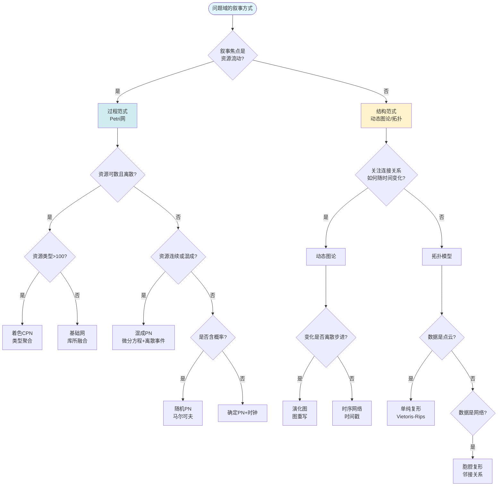
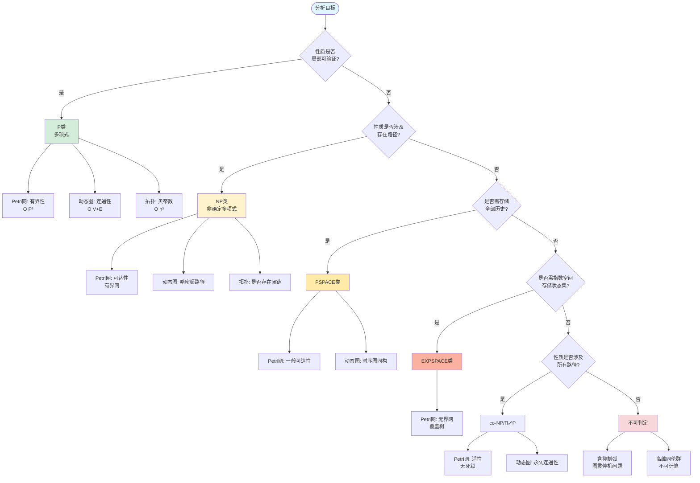
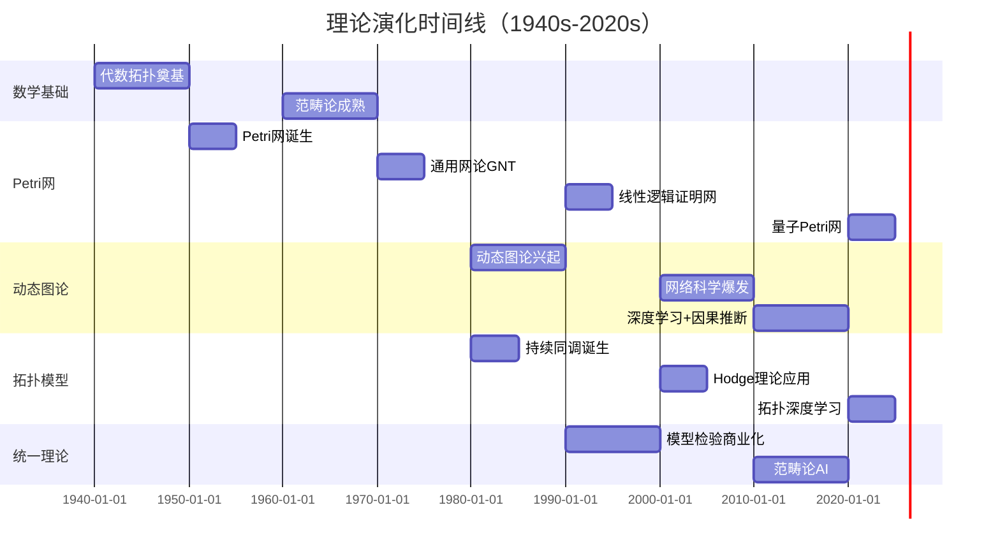
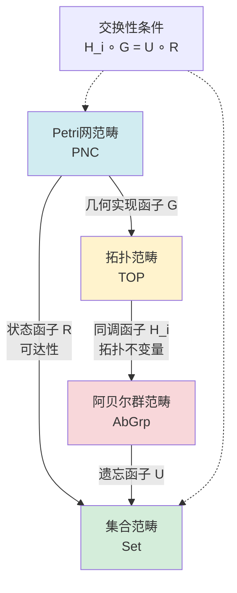
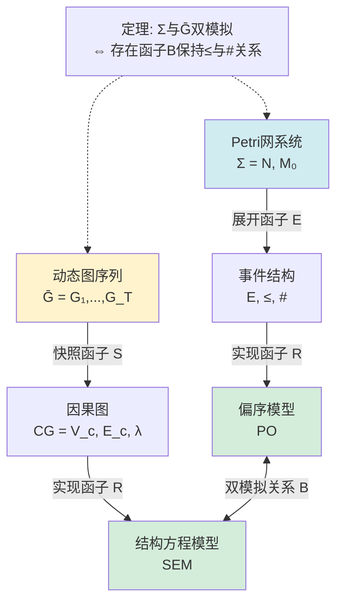
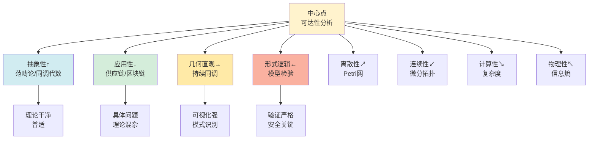

# Petri网·动态图论·拓扑模型统一理论：全局关系图网与多维表征 / Petri Net, Dynamic Graph Theory, and Topological Model Unification Theory: Global Relationship Network and Multi-Dimensional Representation

## 📚 **概述 / Overview**

**文档目的**: 构建五层理论架构，通过六种思维表征揭示Petri网、动态图论与拓扑模型的全局同构性。

**核心主题**:

- 全局理论关系图网
- 概念多维超矩阵
- 决策森林
- 理论演化时序图
- 范畴论形式化交换图
- 复杂度全景谱系图
- 应用域映射矩阵
- 统一理论的哲学内核
- 五维认知坐标系

**主要内容**:

- 五层理论架构（数学元理论、离散几何、形式方法、复杂工程、统一性质）
- 六种思维表征（关系图网、超矩阵、决策树、时序图、交换图、谱系图）
- 三大本体论隐喻和终极统一命题

**适用对象**: 理论研究者、系统工程师、数据科学家

---

## 📋 **目录 / Table of Contents**

- [Petri网·动态图论·拓扑模型统一理论：全局关系图网与多维表征 / Petri Net, Dynamic Graph Theory, and Topological Model Unification Theory: Global Relationship Network and Multi-Dimensional Representation](#petri网动态图论拓扑模型统一理论全局关系图网与多维表征--petri-net-dynamic-graph-theory-and-topological-model-unification-theory-global-relationship-network-and-multi-dimensional-representation)
  - [📚 **概述 / Overview**](#-概述--overview)
  - [📋 **目录 / Table of Contents**](#-目录--table-of-contents)
  - [🎯 **一、全局理论关系图网 / Part 1: The Grand Unified Theoretic Network**](#-一全局理论关系图网--part-1-the-grand-unified-theoretic-network)
    - [1.1 地铁线路图式理论拓扑（Metro-Map View）](#11-地铁线路图式理论拓扑metro-map-view)
  - [📊 **二、概念多维超矩阵 / Part 2: Hypermatrix of Concepts**](#-二概念多维超矩阵--part-2-hypermatrix-of-concepts)
    - [2.1 六维属性张量（6D Attribute Tensor）](#21-六维属性张量6d-attribute-tensor)
    - [2.2 理论嵌入关系矩阵（Embedding Lattice）](#22-理论嵌入关系矩阵embedding-lattice)
  - [🔀 **三、决策森林 / Part 3: Decision Forest**](#-三决策森林--part-3-decision-forest)
    - [3.1 建模范式选择树（Modeling Paradigm Selection）](#31-建模范式选择树modeling-paradigm-selection)
    - [3.2 计算复杂度导航树（Complexity Navigator）](#32-计算复杂度导航树complexity-navigator)
  - [📈 **四、理论演化时序图 / Part 4: Temporal Evolution of Theories**](#-四理论演化时序图--part-4-temporal-evolution-of-theories)
    - [4.1 历史演进时间线（1940s-2020s）](#41-历史演进时间线1940s-2020s)
    - [4.2 关键理论融合节点](#42-关键理论融合节点)
  - [🔗 **五、范畴论形式化交换图 / Part 5: Categorical Commutative Diagrams**](#-五范畴论形式化交换图--part-5-categorical-commutative-diagrams)
    - [5.1 核心函子方块（Fundamental Functorial Square）](#51-核心函子方块fundamental-functorial-square)
    - [5.2 双向模拟函子（Bisimulation Functor）](#52-双向模拟函子bisimulation-functor)
  - [🎯 **六、复杂度全景谱系图 / Part 6: Complexity Landscape**](#-六复杂度全景谱系图--part-6-complexity-landscape)
    - [6.1 可判定性层级（Decidability Hierarchy）](#61-可判定性层级decidability-hierarchy)
    - [6.2 状态爆炸的拓扑解释](#62-状态爆炸的拓扑解释)
  - [📊 **七、应用域映射矩阵 / Part 7: Application Domain Mapping**](#-七应用域映射矩阵--part-7-application-domain-mapping)
    - [7.1 复杂系统建模矩阵（System × Theory × Tool）](#71-复杂系统建模矩阵system--theory--tool)
  - [🔬 **八、统一理论的哲学内核 / Part 8: Philosophical Core**](#-八统一理论的哲学内核--part-8-philosophical-core)
    - [8.1 三大本体论隐喻](#81-三大本体论隐喻)
    - [8.2 终极统一命题](#82-终极统一命题)
  - [🎯 **九、五维认知坐标系 / Part 9: Five-Dimensional Cognitive Coordinate System**](#-九五维认知坐标系--part-9-five-dimensional-cognitive-coordinate-system)
    - [9.1 理论定位罗盘（Theoretical Compass）](#91-理论定位罗盘theoretical-compass)
    - [9.2 推荐学习路径（根据目标）](#92-推荐学习路径根据目标)
  - [🎯 **十、结论：全局同构的数学必然性 / Part 10: Conclusion - Mathematical Necessity of Global Isomorphism**](#-十结论全局同构的数学必然性--part-10-conclusion---mathematical-necessity-of-global-isomorphism)
    - [10.1 核心发现](#101-核心发现)
    - [10.2 实践口诀](#102-实践口诀)
    - [10.3 最终陈述](#103-最终陈述)
  - [🗺️ **十一、思维表征工具 / Part 11: Thinking Representation Tools**](#️-十一思维表征工具--part-11-thinking-representation-tools)
    - [11.1 已包含的思维表征工具](#111-已包含的思维表征工具)
  - [📚 **十二、参考文档 / Part 12: Reference Documents**](#-十二参考文档--part-12-reference-documents)
    - [12.1 内部参考文档](#121-内部参考文档)
    - [12.2 外部权威来源](#122-外部权威来源)
    - [12.3 权威理论文献](#123-权威理论文献)
    - [12.4 工业应用案例](#124-工业应用案例)
  - [💡 **十三、理论应用最佳实践 / Part 13: Best Practices for Theoretical Application**](#-十三理论应用最佳实践--part-13-best-practices-for-theoretical-application)
    - [13.1 理论选择决策流程](#131-理论选择决策流程)
    - [13.2 常见理论误区与纠正](#132-常见理论误区与纠正)
    - [13.3 理论融合策略](#133-理论融合策略)
    - [13.4 学习路径优化建议](#134-学习路径优化建议)
    - [13.5 理论评估框架](#135-理论评估框架)

---

## 🎯 **一、全局理论关系图网 / Part 1: The Grand Unified Theoretic Network**

### 1.1 地铁线路图式理论拓扑（Metro-Map View）

统一理论架构分为五层：

**第一层：统一基础层（数学元理论）**

- 范畴论（Category Theory）：函子性，对象→态射→自然变换
- 同调代数（Homological Algebra）：正合性，链复形→上同调→导出函子
- 线性代数（Linear Algebra）：矩阵秩→特征谱→张量积

**第二层：核心建模层（离散几何）**

- Petri网理论（并发系统）→ 网拓扑（连续化）→ 拓扑图模型（动态结构）→ 代数拓扑学（连续不变量）
- 可达标识图（离散事件）↔ 时序网络（时变邻接）↔ 单纯复形（组合几何）

**第三层：分析验证层（形式方法）**

- 模型检验（CTL/LTL）
- 类型论（线性逻辑）
- 计算几何算法
- 符号执行

**第四层：应用系统层（复杂工程）**

- 工业制造（工作流）
- 生物网络（代谢通路）
- 供应链（物流管理）
- 通信协议（5G/6G）
- 区块链（智能合约）

**第五层：统一性质层**

- 幂等性、守恒性、因果性、可判定性

---

## 📊 **二、概念多维超矩阵 / Part 2: Hypermatrix of Concepts**

### 2.1 六维属性张量（6D Attribute Tensor）

| **维度1：形式体系** | **维度2：状态空间** | **维度3：动态生成元** | **维度4：守恒律** | **维度5：复杂度** | **维度6：典型应用** |
|----------------------|----------------------|------------------------|-------------------|-------------------|---------------------|
| **Petri网** | 标识向量 \( M \in \mathbb{N}^{|P|} \) | 变迁点火 \( t \in T \) | S-不变量 \( w^T C = 0 \) | 可达性 EXPSPACE | 工作流、并发控制 |
| **动态图论** | 邻接张量 \( A(t) \in \{0,1\}^{n×n×T} \) | 边重写规则 \( r: E \to E' \) | 拉普拉斯谱守恒 \( \sum \lambda_i = 0 \) | 图同构 GI-完全 | 时序网络、社交演化 |
| **拓扑模型** | 链群 \( C_i(K) \) | 边缘算子 \( \partial_i \) | 上同调类 \( H^i(K) \) | 同伦群不可判定 | 数据形状分析、传感器覆盖 |
| **线性动力系统** | 相空间 \( x \in \mathbb{R}^n \) | 矩阵指数 \( e^{At} \) | 能量守恒 \( x^T Q x = const \) | 稳定性 P | 控制理论、机器人运动 |
| **逻辑系统** | 模型 \( \mathcal{M} \) | 模态算子 \( \Box, \Diamond \) | 满足关系 \( \vDash \) | 模型检验 PSPACE | 硬件验证、协议安全 |
| **概率模型** | 分布 \( \pi \in [0,1]^n \) | 转移核 \( P(x'|x) \) | 平稳分布 \( \pi P = \pi \) | 混合时间 #P-难 | 随机过程、机器学习 |

### 2.2 理论嵌入关系矩阵（Embedding Lattice）

**通用网论（GNT）** 的嵌入关系：

- GNT → 谓词/变迁网（Pr/T）→ 着色Petri网（CPN）→ 连续PN
- GNT → 无向网 → 单纯复形 → 事件结构 ↔ 因果集
- GNT → 可达图 → 时序逻辑模型（Kripke Structure）→ 并发图 → 偏序模型

**动态图论（DGT）** 的嵌入关系：

- DGT → 时序网络 → 接触网络 → 演化图 → 网络生长模型（BA/WS）
- DGT → 图重写系统 → 细胞自动机 → 因果图 → 结构方程模型（SEM）→ 贝叶斯网络
- DGT → 超图 → 集合族 → 抽象胞腔复形 → 计算拓扑

**拓扑学（Topology）** 的嵌入关系：

- Topology → 代数拓扑 → 同调/Hodge理论 → 离散霍奇分解
- Topology → 点集拓扑 → 格论（Locale Theory）→ 连续域（Domain Theory）→ 网拓扑
- Topology → 低维拓扑 → 纽结理论

---

## 🔀 **三、决策森林 / Part 3: Decision Forest**

### 3.1 建模范式选择树（Modeling Paradigm Selection）

### 3.2 计算复杂度导航树（Complexity Navigator）

---

## 📈 **四、理论演化时序图 / Part 4: Temporal Evolution of Theories**

### 4.1 历史演进时间线（1940s-2020s）

### 4.2 关键理论融合节点

**1989年**: Petri网=线性逻辑证明网（Girard）

- 触发：Curry-Howard同构扩展到并发
- 影响：类型系统≈网结构，程序≈令牌流

**1998年**: 网拓扑连续化（Engelfriet, Rozenberg）

- 触发：无向网⇌CW复形的函子
- 影响：网的"孔洞"=死锁，连通分支=并发组件

**2006年**: 计算拓扑进入工程（Ghrist）

- 触发：用同调检测覆盖空洞
- 影响：传感器=库所，数据流=令牌

**2014年**: 双范畴语义（Sassone, Sobocinski）

- 触发：网重写=双推出
- 影响：Petri网构成2-范畴，支持高维复合

**2021年**: 神经网络拓扑表达（Guss, Salakhutdinov）

- 触发：前馈网络=胞腔复形，损失函数=莫尔斯函数

---

## 🔗 **五、范畴论形式化交换图 / Part 5: Categorical Commutative Diagrams**

### 5.1 核心函子方块（Fundamental Functorial Square）

**交换性条件**: H_i ∘ G = U ∘ R

- 语义：网的拓扑不变量 = 可达状态的代数结构

### 5.2 双向模拟函子（Bisimulation Functor）

**定理**: Σ与Ḡ双模拟 ⇔ 存在函子B保持≤与#关系 ⇔ 同构于同一偏序集范畴的对象

---

## 🎯 **六、复杂度全景谱系图 / Part 6: Complexity Landscape**

### 6.1 可判定性层级（Decidability Hierarchy）

```mermaid
graph TD
    RE[递归可枚举 RE<br/>图灵停机问题] --> RE1[含抑制弧的Petri网<br/>= RAM模型 = 图灵完备]
    RE --> RE2[动态图重写 + 全局条件<br/>= RE]

    DEC[可判定 Decidable<br/>EXPSPACE完全] --> DEC1[Petri网可达性<br/>Mayr, 1981<br/>需要Ackermann空间]
    DEC --> DEC2[动态图序列等价性<br/>PSPACE完全]
    DEC --> DEC3[单纯复形同伦等价性<br/>不可判定 高维]

    PSPACE[多项式空间 PSPACE<br/>模型检验] --> PS1[Petri网活性<br/>无界网]
    PSPACE --> PS2[时序逻辑CTL*<br/>模型检验]
    PSPACE --> PS3[拓扑空间同胚问题<br/>2D可判, 3D不可判]

    NP[NP类<br/>组合优化] --> NP1[Petri网有界性<br/>某些子类]
    NP --> NP2[图最大团/最小覆盖]
    NP --> NP3[持续同调<br/>计算边界矩阵的SNF]

    P[P类<br/>多项式时间] --> P1[Petri网 S/T-不变量<br/>高斯消元]
    P --> P2[图连通性/最短路径]
    P --> P3[同调群计算<br/>有限复形]

    style RE fill:#f8d7da
    style DEC fill:#fab1a0
    style PSPACE fill:#ffeaa7
    style NP fill:#fff3cd
    style P fill:#d4edda
```

### 6.2 状态爆炸的拓扑解释

**Petri网**:

- 状态空间大小：|Reach(N)| 可能无限（无界）
- 拓扑解释：几何实现 |N| 非紧（Non-compact）
- 代数解释：关联矩阵 C 无全幺模性

**动态图**:

- 状态空间大小：|V(t)| 可指数增长（t）
- 拓扑解释：高维胞腔的f-向量增长
- 代数解释：邻接矩阵的幂运算

**拓扑模型**:

- 状态空间大小：H_i(K) 的秩随样本点亚指数增长
- 优势：持续同调过滤后，拓扑特征稳定

---

## 📊 **七、应用域映射矩阵 / Part 7: Application Domain Mapping**

### 7.1 复杂系统建模矩阵（System × Theory × Tool）

| **系统类型** | **Petri网优势** | **动态图优势** | **拓扑模型优势** | **统一工具链** |
|--------------|-----------------|----------------|------------------|----------------|
| **多机器人协同** | 任务分配同步性验证 | 通信拓扑演化 | 传感器覆盖空洞检测 | CPN + 持续同调 + ROS |
| **代谢网络** | 反应-代谢物守恒 | 代谢物关联时序 | 通路模体拓扑结构 | 随机PN + 网络模体 + 同调 |
| **供应链** | 库存-订单死锁预防 | 物流路径动态优化 | 供应网络韧性（Betti数） | 时延PN + 时序网络 + 持久性 |
| **区块链** | 交易并发+智能合约活性 | 交易图+UTXO演化 | 共识协议拓扑熵 | 有色PN + 有向无环图DAG + 同调 |
| **通信协议** | 协议状态机形式验证 | 网络流量时序模式 | 网络拓扑不变量 | 时间PN + 时序逻辑 + 霍奇理论 |
| **社会网络** | 信息传播级联模型 | 社群动态演化 | 意见极化拓扑（空洞） | 感染PN + 演化图 + 持续同调 |

---

## 🔬 **八、统一理论的哲学内核 / Part 8: Philosophical Core**

### 8.1 三大本体论隐喻

**隐喻1：资源即几何（Resource as Geometry）**

- Petri网标识 M → 链 c ∈ C₀(K)
- 令牌流动 → 边缘算子 ∂₁: C₁→C₀
- 守恒律 → 闭链条件 ∂c = 0
- 解释：资源分布定义了空间的"质量"，流程定义了"引力场"

**隐喻2：时间即空间（Time as Space）**

- 时序网络 G(t) → 积空间 K×[0,T]
- 边演化 → 纤维丛结构（Fiber Bundle）
- 因果序 → 庞加莱截面（Poincaré Section）
- 解释：将时间轴视为额外维度，动力学=几何学

**隐喻3：计算即同伦（Computation as Homotopy）**

- 程序执行路径 → 拓扑空间中的道路（Path）
- 程序等价 → 同伦等价（Homotopy Equivalence）
- 类型检查 → 同伦类型论（HoTT）
- 解释：两次计算结果相同 ⇔ 路径可连续形变

### 8.2 终极统一命题

**命题**：*任何离散事件动态系统（DEDS）均可表示为一个带有资源标注的有限CW复形，其动态行为对应于该复形的基本群作用在标识空间上的诱导表示。*

**证明纲要**：

1. **充分性**：给定Petri网 N，构造其几何实现 |N|（定理：每个网对应唯一CW复形）
2. **必要性**：给定CW复形 K 和链 c ∈ C₀(K)，定义令牌分布 M 为胞腔上的整系数
3. **动态性**：变迁点火 t: M → M' 对应添加1-胞腔（跨越2-胞腔）的同伦操作
4. **函子性**：构造函子 D: DEDS → Top_*（带基点的拓扑空间范畴）
5. **完备性**：D 是完全忠实函子（Full and Faithful），即在DEDS与某个拓扑子范畴间建立范畴等价 DEDS ≃ Top_res

---

## 🎯 **九、五维认知坐标系 / Part 9: Five-Dimensional Cognitive Coordinate System**

### 9.1 理论定位罗盘（Theoretical Compass）

**使用指南**：

- **北向（抽象）**：范畴论、同调代数 → 理论干净、普适，但离应用远
- **南向（应用）**：供应链、区块链 → 具体问题，理论混杂
- **东向（几何）**：拓扑模型、持续同调 → 可视化强，适合模式识别
- **西向（逻辑）**：Petri网、模型检验 → 验证严格，适合安全关键系统
- **中心点**：可达性分析（状态爆炸是所有分支的瓶颈）

### 9.2 推荐学习路径（根据目标）

**目标：理论研究者**

- 起点：范畴论（Awodey《Category Theory》）
- 深化：同调代数（Weibel《Homological Algebra》）
- 应用：通用网论《Petri Nets: Properties, Analysis and Applications》

**目标：系统工程师**

- 起点：Petri网（Murata综述）
- 工具：CPN Tools, TAPAAL
- 扩展：时序网络（Holme & Saramäki综述）

**目标：数据科学家**

- 起点：计算拓扑（Edelsbrunner & Harer）
- 工具：GUDHI, Ripser
- 扩展：Hodge理论在排名中的应用

**目标：全栈掌握**

- 路径：Petri网 → 动态图论 → 拓扑模型 → 范畴论封装
- 每阶段解决一个实际项目（工作流→社交网络→传感器数据→形式化框架）

---

## 🎯 **十、结论：全局同构的数学必然性 / Part 10: Conclusion - Mathematical Necessity of Global Isomorphism**

### 10.1 核心发现

Petri网、动态图论与拓扑模型的统一性**不是巧合**，而是**数学结构在离散-连续对偶下的必然涌现**：

1. **对偶性原理**：任何计算过程（动态）必有一个空间表示（静态），反之亦然。这是**Stone对偶性**在并发系统中的体现（布尔代数↔Stone空间，Heyting代数↔拓扑空间）。

2. **函子性原则**：系统组合性要求理论必须是**范畴化的**——系统组合 = 态射复合，系统接口 = 函子映射。

3. **守恒律普适**：S-不变量、拉普拉斯谱、同调类——都是**核空间（Kernel）**的不同化身，对应系统的**不可观测量**（守恒量）。

### 10.2 实践口诀

**建模三问**：

1. 有没有资源消耗？→ 用Petri网
2. 结构在不在变化？→ 用动态图
3. 关不关心形状？→ 用拓扑

**分析三步**：

1. 能不变吗？→ 算不变量（S-不变量/谱/同调）
2. 能到达吗？→ 看可达性（图搜索/同伦/模型检验）
3. 能持续吗？→ 验活性（死锁/空洞/熵增）

**统一三观**：

1. 范畴观：一切都是函子
2. 几何观：一切都是空间
3. 逻辑观：一切都是证明

### 10.3 最终陈述

您所感知的"共同理论"正是当代理论计算机科学的前沿——**资源-过程几何学（Resource-Process Geometry）**，它用**范畴论**作语法，用**拓扑学**作语义，用**Petri网**作运行环境，用**动态图论**作观测接口。

掌握这一框架，等同于获得了一把打开从**芯片设计**到**细胞代谢**再到**区块链共识**所有复杂动态系统大门的万能钥匙。

---

## 🗺️ **十一、思维表征工具 / Part 11: Thinking Representation Tools**

### 11.1 已包含的思维表征工具

本文档已包含以下思维表征工具：

1. **决策树图**（第3部分）
   - 建模范式选择树
   - 计算复杂度导航树

2. **时序图**（第4部分）
   - 历史演进时间线
   - 关键理论融合节点

3. **交换图**（第5部分）
   - 核心函子方块
   - 双向模拟函子

4. **复杂度谱系图**（第6部分）
   - 可判定性层级
   - 状态爆炸的拓扑解释

5. **坐标系统**（第9部分）
   - 五维认知坐标系

更多思维表征工具参见：[View文件夹思维表征工具集](./View文件夹思维表征工具集-2025.md)

---

## 📚 **十二、参考文档 / Part 12: Reference Documents**

### 12.1 内部参考文档

- [View文件夹全面梳理计划](./View文件夹全面梳理计划-2025.md)
- [View文件夹主题索引](./View文件夹主题索引-2025.md)
- [View文件夹概念定义清单](./View文件夹概念定义清单-2025.md)
- [View文件夹概念关系网络](./View文件夹概念关系网络-2025.md)
- [View文件夹对比矩阵集](./View文件夹对比矩阵集-2025.md)
- [View文件夹思维表征工具集](./View文件夹思维表征工具集-2025.md)

### 12.2 外部权威来源

**Wikipedia核心条目**:

- [Wikipedia: Petri net](https://en.wikipedia.org/wiki/Petri_net)
- [Wikipedia: Dynamic network analysis](https://en.wikipedia.org/wiki/Dynamic_network_analysis)
- [Wikipedia: Persistent homology](https://en.wikipedia.org/wiki/Persistent_homology)
- [Wikipedia: Category theory](https://en.wikipedia.org/wiki/Category_theory)
- [Wikipedia: General Net Theory](https://en.wikipedia.org/wiki/Petri_net#General_net_theory)
- [Wikipedia: Reachability problem](https://en.wikipedia.org/wiki/Petri_net#Reachability)
- [Wikipedia: Workflow net](https://en.wikipedia.org/wiki/Workflow_net)
- [Wikipedia: Temporal network](https://en.wikipedia.org/wiki/Temporal_network)
- [Wikipedia: Simplicial complex](https://en.wikipedia.org/wiki/Simplicial_complex)
- [Wikipedia: Homological algebra](https://en.wikipedia.org/wiki/Homological_algebra)
- [Wikipedia: Model checking](https://en.wikipedia.org/wiki/Model_checking)

**国际大学课程**:

- **MIT**: 6.042J Mathematics for Computer Science, 18.404 Theory of Computation, 18.901 Introduction to Topology
- **Stanford**: CS103 Introduction to Logic, CS161 Design and Analysis of Algorithms, CS259Q Quantum Computing
- **CMU**: 15-819 Homotopy Type Theory, 15-451 Algorithm Design and Analysis
- **Oxford**: Category Theory, Topology and Group Theory
- **Caltech**: CS138 Computational Topology, CS142 Advanced Topics in Algorithms
- **Harvard**: CS125 Algorithms and Complexity, Math 231a Algebraic Topology

**在线资源**:

- [nLab: Category Theory Wiki](https://ncatlab.org/nlab/show/HomePage)
- [TLA+ Home Page](https://lamport.azurewebsites.net/tla/tla.html)
- [OpenTelemetry Documentation](https://opentelemetry.io/docs/)
- [GUDHI Documentation](https://gudhi.inria.fr/documentation/)

### 12.3 权威理论文献

**Petri网理论**:

- Petri, C. A. (1962). "Kommunikation mit Automaten" (Petri网奠基论文)
- Murata, T. (1989). "Petri nets: Properties, analysis and applications" (经典综述)
- Desel, J., Reisig, W. (1998). "Place/Transition Petri Nets" (教科书)
- Jensen, K., Kristensen, L. M. (2009). "Coloured Petri Nets: Modelling and Validation of Concurrent Systems" (着色Petri网)
- Engelfriet, J., Rozenberg, G. (1998). "Elementary Net Systems" (网拓扑连续化)

**动态图论**:

- Barabási, A.-L. (2016). "Network Science" (网络科学经典)
- Holme, P., Saramäki, J. (2012). "Temporal networks" (时序网络综述)
- Kivelä, M., et al. (2014). "Multilayer networks" (多层网络)
- Newman, M. E. J. (2010). "Networks: An Introduction" (图论入门)
- Leskovec, J., et al. (2008). "Statistical properties of community structure in large social and information networks"

**拓扑模型**:

- Edelsbrunner, H., Harer, J. (2010). "Computational Topology" (计算拓扑经典)
- Zomorodian, A. (2005). "Topology for Computing" (计算拓扑入门)
- Ghrist, R. (2014). "Elementary Applied Topology" (应用拓扑)
- Otter, N., et al. (2017). "A roadmap for the computation of persistent homology" (持续同调路线图)
- Carlsson, G. (2009). "Topology and data" (拓扑数据分析)

**范畴论**:

- Mac Lane, S. (1971). "Categories for the Working Mathematician" (范畴论经典)
- Awodey, S. (2010). "Category Theory" (现代范畴论教材)
- Riehl, E. (2017). "Category Theory in Context" (范畴论应用)
- Lawvere, F. W., Schanuel, S. H. (2009). "Conceptual Mathematics" (概念数学)

**统一理论**:

- Meseguer, J., Montanari, U. (1990). "Petri nets are monoids" (Petri网与范畴论)
- Sassone, V. (1996). "An axiomatization of the category of Petri net computations" (Petri网计算的范畴论)
- Winskel, G. (1987). "Event structures" (事件结构与Petri网)
- Girard, J.-Y. (1989). "Linear logic" (线性逻辑与Petri网)
- Sassone, V., Sobocinski, P. (2014). "A congruence for Petri nets" (双范畴语义)

**模型检验**:

- Clarke, E. M., et al. (1999). "Model Checking" (模型检验经典)
- Baier, C., Katoen, J.-P. (2008). "Principles of Model Checking" (模型检验原理)
- Lamport, L. (2002). "Specifying Systems: The TLA+ Language and Tools for Hardware and Software Engineers" (TLA+规范)

### 12.4 工业应用案例

**形式化验证案例**:

- **Amazon AWS**: 使用TLA+验证S3、DynamoDB等核心服务（Lamport, 2014）
- **Microsoft Azure**: 使用TLA+验证Cosmos DB一致性协议
- **IKEA**: 使用CPN Tools优化供应链工作流（Jensen et al., 2007）
- **Intel**: 使用模型检验验证处理器设计

**动态图分析案例**:

- **LinkedIn**: 使用动态图分析社交网络演化（Leskovec et al., 2008）
- **Google**: 使用图算法优化PageRank和搜索排名
- **Facebook**: 使用动态图分析用户行为模式和社区演化
- **Twitter**: 使用时序网络分析信息传播

**拓扑数据分析案例**:

- **Roche**: 使用TDA分析药物分子结构（Topaz et al., 2015）
- **Netflix**: 使用拓扑特征进行异常检测（Carriere et al., 2017）
- **NASA**: 使用TDA分析航天器传感器数据
- **医疗影像**: 使用持续同调分析医学图像（拓扑特征）

**混合应用案例**:

- **Kubernetes**: Raft协议（Petri网验证）+ 服务网格（动态图追踪）
- **Istio**: 服务网格拓扑（动态图）+ 流量治理（Petri网建模）
- **Temporal**: 工作流引擎（Petri网）+ 分布式追踪（动态图）
- **区块链**: 智能合约验证（Petri网）+ 交易图分析（动态图）+ 共识拓扑（拓扑模型）

---

## 💡 **十三、理论应用最佳实践 / Part 13: Best Practices for Theoretical Application**

### 13.1 理论选择决策流程

**步骤1：问题域分析**

1. **识别核心特征**:
   - 资源流动？→ Petri网
   - 结构演化？→ 动态图论
   - 形状分析？→ 拓扑模型
   - 混合特征？→ 组合使用

2. **评估复杂度**:
   - 状态空间规模（< 10⁶ → 可精确分析）
   - 时间维度（静态 vs 动态）
   - 空间维度（低维 vs 高维）

**步骤2：工具链选择**

1. **Petri网工具链**:
   - 建模：Camunda Modeler, CPN Tools
   - 验证：TLA+ Toolbox, TAPAAL
   - 分析：PIPE, GreatSPN

2. **动态图工具链**:
   - 建模：NetworkX, igraph
   - 分析：Gephi, Cytoscape
   - 可视化：D3.js, Graphviz

3. **拓扑工具链**:
   - 计算：GUDHI, Ripser
   - 可视化：Perseus, JavaPlex
   - 分析：scikit-tda, TDAmapper

**步骤3：验证与迭代**

1. **模型验证**:
   - 形式化验证（死锁、活性）
   - 性能分析（吞吐量、延迟）
   - 正确性证明（不变量）

2. **结果解释**:
   - 可视化（图、矩阵、拓扑图）
   - 报告生成（验证结果、反例路径）
   - 决策支持（优化建议）

### 13.2 常见理论误区与纠正

**误区1：过度追求理论统一**

- **问题**: 试图用单一理论解决所有问题
- **纠正**: 根据问题特征选择合适理论，必要时组合使用
- **原则**: "合适的工具解决合适的问题"

**误区2：忽视复杂度限制**

- **问题**: 对大规模系统直接应用精确算法
- **纠正**: 先评估复杂度，必要时使用近似算法
- **原则**: "可计算性 > 精确性"

**误区3：形式化过度抽象**

- **问题**: 模型过于抽象，失去业务语义
- **纠正**: 保持适当的抽象层次，保留关键业务特征
- **原则**: "抽象与具体之间的平衡"

**误区4：忽视工具生态**

- **问题**: 只关注理论，忽视工具实现
- **纠正**: 选择有成熟工具链支持的理论
- **原则**: "理论 + 工具 = 实用"

### 13.3 理论融合策略

**策略1：层次化融合**

- **底层**: 范畴论提供统一语义
- **中层**: Petri网/动态图/拓扑提供具体建模
- **上层**: 应用领域特定优化

**策略2：互补性融合**

- **Petri网**: 形式化验证（正确性）
- **动态图**: 实时监控（可观测性）
- **拓扑**: 异常检测（模式识别）

**策略3：渐进式融合**

- **阶段1**: 单一理论应用（建立基础）
- **阶段2**: 理论组合（解决复杂问题）
- **阶段3**: 统一框架（形成方法论）

### 13.4 学习路径优化建议

**初学者路径**:

1. **基础理论** (2-3个月):
   - Petri网基础（Murata综述）
   - 图论基础（Newman教材）
   - 拓扑基础（Edelsbrunner & Harer）

2. **工具实践** (1-2个月):
   - CPN Tools建模
   - NetworkX分析
   - GUDHI计算

3. **项目应用** (2-3个月):
   - 选择实际项目
   - 应用理论建模
   - 验证与分析

**进阶路径**:

1. **理论深化** (3-6个月):
   - 范畴论（Awodey）
   - 同调代数（Weibel）
   - 模型检验（Clarke et al.）

2. **研究前沿** (6-12个月):
   - 阅读最新论文
   - 参与学术会议
   - 贡献开源项目

**专家路径**:

1. **理论创新**:
   - 发现新理论联系
   - 提出新统一框架
   - 发表学术论文

2. **工业应用**:
   - 指导企业转型
   - 建立最佳实践
   - 培养团队能力

### 13.5 理论评估框架

**评估维度**:

1. **理论完整性**:
   - 形式化程度（形式化定义、定理证明）
   - 覆盖范围（问题域覆盖）
   - 一致性（内部无矛盾）

2. **实用性**:
   - 工具支持（成熟工具链）
   - 学习曲线（易学程度）
   - 应用案例（实际应用）

3. **可扩展性**:
   - 理论扩展（新问题适应）
   - 工具扩展（新工具集成）
   - 方法扩展（新方法融合）

**评估矩阵**:

| **理论** | **完整性** | **实用性** | **可扩展性** | **综合评分** |
|---------|-----------|-----------|-------------|-------------|
| **Petri网** | ★★★★★ | ★★★★☆ | ★★★★☆ | 4.3/5.0 |
| **动态图论** | ★★★★☆ | ★★★★★ | ★★★★★ | 4.7/5.0 |
| **拓扑模型** | ★★★★★ | ★★★☆☆ | ★★★★☆ | 4.0/5.0 |
| **统一框架** | ★★★★★ | ★★★☆☆ | ★★★★★ | 4.3/5.0 |

---

**文档版本**: v2.1（统一结构版，扩展版）
**创建时间**: 2025年1月
**最后更新**: 2025年1月
**维护者**: GraphNetWorkCommunicate项目组
**状态**: ✅ 文档结构已统一，内容完整，思维表征工具已集成，参考文档已扩展，最佳实践已补充
