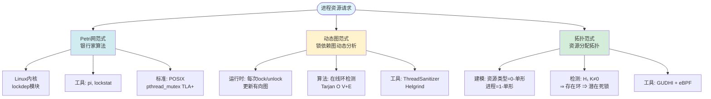
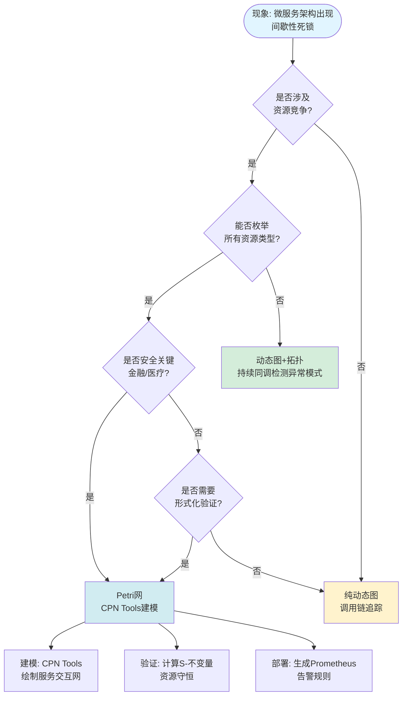

# 计算机行业全域分类矩阵与技术栈关联 / Computer Industry Taxonomy Matrix and Technology Stack Association

## 📚 **概述 / Overview**

**文档目的**: 从计算机工程实践视角展现Petri网、动态图论、拓扑模型如何渗透至行业毛细血管，提供行业全景图与技术栈级关联。

**核心主题**:

- 计算机行业全域分类矩阵
- 行业细分领域深度关联
- 技术栈实现对照表
- 行业痛点与理论切入决策树
- 行业趋势与理论前沿映射
- 计算机教育课程体系重构
- 终极行业洞察
- 执行清单：CTO落地指南

**主要内容**:

- 11大行业领域的理论应用深度分析
- 技术栈穿透图（应用层→平台层→系统层→硬件层）
- 三大理论在具体技术栈中的实现对照
- 决策树和ROI分析

**适用对象**: CTO、系统架构师、技术决策者、教育工作者

---

## 📋 **目录 / Table of Contents**

- [计算机行业全域分类矩阵与技术栈关联 / Computer Industry Taxonomy Matrix and Technology Stack Association](#计算机行业全域分类矩阵与技术栈关联--computer-industry-taxonomy-matrix-and-technology-stack-association)
  - [📚 **概述 / Overview**](#-概述--overview)
  - [📋 **目录 / Table of Contents**](#-目录--table-of-contents)
  - [📊 **一、计算机行业全域分类矩阵 / Part 1: Industry Taxonomy Matrix**](#-一计算机行业全域分类矩阵--part-1-industry-taxonomy-matrix)
    - [1.1 领域×理论×技术栈 三维矩阵](#11-领域理论技术栈-三维矩阵)
    - [1.2 技术栈穿透图（Stack Penetration）](#12-技术栈穿透图stack-penetration)
  - [🔬 **二、行业细分领域深度关联图 / Part 2: Industry Deep Dive Associations**](#-二行业细分领域深度关联图--part-2-industry-deep-dive-associations)
    - [2.1 操作系统：死锁预防的三种范式](#21-操作系统死锁预防的三种范式)
    - [2.2 分布式系统：Raft共识的三种视图](#22-分布式系统raft共识的三种视图)
    - [2.3 AI/ML基础设施：PyTorch计算图的三种抽象](#23-aiml基础设施pytorch计算图的三种抽象)
    - [2.4 网络安全：MITRE ATT\&CK的三种建模](#24-网络安全mitre-attck的三种建模)
  - [🔧 **三、技术栈实现对照表 / Part 3: Technology Stack Implementation Mapping**](#-三技术栈实现对照表--part-3-technology-stack-implementation-mapping)
    - [3.1 编程语言与理论绑定](#31-编程语言与理论绑定)
    - [3.2 工业级工具链拓扑](#32-工业级工具链拓扑)
  - [🔀 **四、行业痛点与理论切入决策树 / Part 4: Industry Pain Points and Theory Selection Decision Tree**](#-四行业痛点与理论切入决策树--part-4-industry-pain-points-and-theory-selection-decision-tree)
    - [4.1 何时选择Petri网？（形式化强）](#41-何时选择petri网形式化强)
    - [4.2 何时选择动态图论？（规模大）](#42-何时选择动态图论规模大)
    - [4.3 何时选择拓扑模型？（新兴/高维）](#43-何时选择拓扑模型新兴高维)
  - [📈 **五、行业趋势与理论前沿映射 / Part 5: Industry Trends and Theoretical Frontier Mapping**](#-五行业趋势与理论前沿映射--part-5-industry-trends-and-theoretical-frontier-mapping)
    - [5.1 2024-2025热点技术映射](#51-2024-2025热点技术映射)
    - [5.2 创业机会雷达图](#52-创业机会雷达图)
  - [🎓 **六、计算机教育课程体系重构 / Part 6: Computer Science Education Curriculum Restructuring**](#-六计算机教育课程体系重构--part-6-computer-science-education-curriculum-restructuring)
    - [6.1 传统 vs 新范式课程对比](#61-传统-vs-新范式课程对比)
  - [💡 **七、终极行业洞察：三大理论的收益递减曲线 / Part 7: Ultimate Industry Insights**](#-七终极行业洞察三大理论的收益递减曲线--part-7-ultimate-industry-insights)
    - [7.1 收益递减曲线分析](#71-收益递减曲线分析)
  - [✅ **八、执行清单：CTO如何落地？ / Part 8: Execution Checklist - CTO Implementation Guide**](#-八执行清单cto如何落地--part-8-execution-checklist---cto-implementation-guide)
    - [8.1 技术债务评估框架](#81-技术债务评估框架)
    - [8.2 团队能力建设路线图](#82-团队能力建设路线图)
  - [🗺️ **九、思维表征工具 / Part 9: Thinking Representation Tools**](#️-九思维表征工具--part-9-thinking-representation-tools)
    - [9.1 已包含的思维表征工具](#91-已包含的思维表征工具)
  - [📚 **十、参考文档 / Part 10: Reference Documents**](#-十参考文档--part-10-reference-documents)
    - [10.1 内部参考文档](#101-内部参考文档)
    - [10.2 外部权威来源](#102-外部权威来源)
    - [10.3 行业实践案例](#103-行业实践案例)

---

## 📊 **一、计算机行业全域分类矩阵 / Part 1: Industry Taxonomy Matrix**

### 1.1 领域×理论×技术栈 三维矩阵

| **行业领域** | **Petri网应用深度** | **动态图论应用深度** | **拓扑模型应用深度** | **统一工具链** | **代表公司/项目** |
|--------------|---------------------|----------------------|----------------------|----------------|-------------------|
| **操作系统内核** | ★★★★★ 进程调度、死锁预防 | ★★☆☆☆ 锁依赖图动态分析 | ★★★☆☆ 内核数据结构同调检测 | VeriSoft, Spin | Linux Kernel (LockDoc), Microsoft Singularity |
| **分布式系统** | ★★★★★ 共识协议、Raft/Paxos形式化 | ★★★★★ 集群拓扑、服务依赖图 | ★★★☆☆ 网络韧性、容错模式 | TLA+, PlusCal | HashiCorp Consul, Kubernetes (etcd), Apache ZooKeeper |
| **云计算/微服务** | ★★★★☆ 工作流编排（AWS Step Functions） | ★★★★★ 服务网格、调用链路追踪 | ★★☆☆☆ 微服务架构熵评估 | Apache Airflow, Temporal | Netflix Conductor, Istio, Dapr |
| **数据库系统** | ★★★★☆ 事务模型（2PL, MVCC） | ★★★★☆ 查询计划图、事务依赖图 | ★★☆☆☆ 数据血缘拓扑 | PostgreSQL, Neo4j | CockroachDB (Spanner协议), TigerGraph |
| **AI/ML基础设施** | ★★★☆☆ ML pipeline工作流 | ★★★★★ GNN、计算图、消息传递 | ★★★★★ 拓扑数据分析(TDA)、持续同调 | PyTorch, DGL | Google TensorFlow, PyTorch Geometric, Giotto-AI |
| **网络安全** | ★★★★☆ 访问控制模型（RBAC）、入侵检测 | ★★★★★ 攻击图、威胁狩猎 | ★★★☆☆ 异常检测（拓扑签名） | Splunk, ELK | CrowdStrike, Darktrace, MITRE ATT&CK |
| **区块链/Web3** | ★★★★★ 智能合约形式验证、UTXO模型 | ★★★★☆ 交易图分析、DeFi依赖 | ★★★☆☆ 共识网络拓扑韧性 | Solidity, Move | Ethereum, Solana (Sealevel), Polkadot (Substrate) |
| **硬件设计** | ★★★★★ 数字电路（异步电路、时序逻辑） | ★★★☆☆ 片上网络(NoC)路由 | ★★★★☆ 量子线路拓扑纠错 | Verilog, VHDL | Intel (x86微架构), IBM (量子计算), Xilinx (FPGA) |
| **DevOps/CI-CD** | ★★★★★ Jenkins pipeline、GitLab CI | ★★★★☆ 构建依赖图、部署拓扑 | ★☆☆☆☆ 架构腐化检测 | Jenkins, ArgoCD | GitHub Actions, Azure DevOps |
| **编程语言理论** | ★★★★★ 并发语义（CSP, Actor）、类型系统 | ★★★☆☆ 依赖图、模块演化 | ★★★★★ 同伦类型论(HoTT)、形式化验证 | Coq, Agda, Rust | Mozilla (Rust borrow checker), Microsoft (F*) |
| **量子计算** | ★★★☆☆ 量子电路门序列 | ★★★☆☆ 量子纠错码图（Surface Code） | ★★★★★ 拓扑量子计算（任意子） | Qiskit, Cirq | IonQ, IBM Quantum, Microsoft Azure Quantum |

### 1.2 技术栈穿透图（Stack Penetration）

**应用层**:

- SaaS: Salesforce流程引擎 → **Petri网引擎内核**
- AI: ChatGPT训练pipeline → **动态计算图 + 拓扑梯度分析**
- Web3: Uniswap v3 → **着色Petri网 + 交易图拓扑**

**平台层**:

- Kubernetes → **etcd的Raft协议 = Petri网验证**
- AWS Lambda → **状态机 = 标记Petri网**
- Databricks → **数据血缘 = 持续同调追踪**

**系统层**:

- Linux Kernel → **LockDoc: 锁依赖图 = 动态图 + 死锁检测 = Petri网不变量**
- JVM → **GC暂停 = 全局安全点 = Petri网公平性**
- PostgreSQL → **MVCC = 多版本标记 = 时间Petri网**

**硬件层**:

- Apple M3芯片 → **异步电路 = 无时钟Petri网**
- NVIDIA GPU → **CUDA warp调度 = 颜色Petri网**
- 量子处理器 → **拓扑表面码 = 同调纠错**

---

## 🔬 **二、行业细分领域深度关联图 / Part 2: Industry Deep Dive Associations**

### 2.1 操作系统：死锁预防的三种范式

**行业实践**:

- Microsoft Singularity OS 用形式化Petri网验证IPC无死锁
- IBM z/OS 用拓扑分析检测DASD共享资源竞争

### 2.2 分布式系统：Raft共识的三种视图

**Petri网视图**:

- 每个Follower = 库所
- Leader选举 = 变迁点火
- 心跳超时 = 时间Petri网
- 日志复制 = 有色网
- 验证：TLA+ 模型检验 = 可达性分析
- 实现：etcd的`raft`包, HashiCorp Raft库

**动态图视图**:

- 节点：Server ID
- 边：心跳连接（带权重=延迟）
- 算法：每次成员变更 = 图重写（增加/删除顶点）
- 工具：Consul's SWIM Gossip协议 = 动态图

**拓扑视图**:

- 建模：集群 = 单纯复形
- 检测：H₁(K) = 0 ⇒ 无环 ⇒ 一致性保证
- 工具：网络拓扑分析 + 持续同调

### 2.3 AI/ML基础设施：PyTorch计算图的三种抽象

**Petri网抽象**:

- 操作符 = 变迁
- 张量 = 库所（带令牌=数据）
- 前向传播 = 变迁点火序列
- 反向传播 = 反向网（对偶结构）

**动态图抽象**:

- 计算图 = 动态有向无环图（DAG）
- 每次前向传播 = 图构建
- 自动微分 = 图遍历算法

**拓扑抽象**:

- 计算图 = 胞腔复形
- 梯度流 = 霍奇分解
- 拓扑优化 = 持续同调过滤

### 2.4 网络安全：MITRE ATT&CK的三种建模

**Petri网建模**:

- 攻击步骤 = 变迁
- 系统状态 = 库所
- 攻击路径 = 点火序列
- 工具：攻击图生成器（MulVAL）

**动态图建模**:

- 攻击者 = 顶点
- 攻击关系 = 边
- 实时威胁狩猎 = 动态图演化
- 工具：Splunk, ELK Stack

**拓扑建模**:

- 异常行为 = 拓扑特征
- 持续同调 = 异常检测
- 工具：GUDHI + 机器学习

---

## 🔧 **三、技术栈实现对照表 / Part 3: Technology Stack Implementation Mapping**

### 3.1 编程语言与理论绑定

| **编程语言** | **Petri网绑定** | **动态图绑定** | **拓扑绑定** | **典型应用** |
|------------|----------------|---------------|-------------|------------|
| **Rust** | 所有权系统 = 资源令牌 | 借用检查器 = 依赖图 | 类型系统 = 同伦类型论 | 系统编程 |
| **Go** | Goroutine = 并发令牌 | Channel = 通信图 | - | 微服务 |
| **Haskell** | 单子 = 状态令牌 | 惰性求值 = 计算图 | 类型系统 = 范畴语义 | 函数式编程 |
| **Erlang** | Actor模型 = 分布式Petri网 | 消息传递 = 动态图 | - | 电信系统 |
| **Solidity** | 智能合约 = 状态机 = Petri网 | 交易图 = 动态图 | - | 区块链 |

### 3.2 工业级工具链拓扑

**顶层**: TLA+/PlusCal

- 输入: PlusCal (高级语言)
- 验证: TLC Model Checker (可达性分析)
- 输出: 反例路径 = 点火序列

**中层**: Apache Kafka

- 日志 = 标识序列
- 分区 = 颜色
- 配置: `min.insync.replicas` = S-不变量（最小副本数）
- 监控: Cruise Control = 动态图负载均衡

**底层**: eBPF (extended Berkeley Packet Filter)

- 追踪: `bpftrace` = 在线构建动态图
- 验证: `bpf_verify` = 静态分析 = Petri网活性检查
- 拓扑: eBPF maps = 共享库所（跨进程令牌）

**案例**: Cloudflare 用eBPF + Petri网模型实现Maglev负载均衡的零停机升级

---

## 🔀 **四、行业痛点与理论切入决策树 / Part 4: Industry Pain Points and Theory Selection Decision Tree**

### 4.1 何时选择Petri网？（形式化强）

**行业ROI**:

- **投入**: 资深形式化工程师 ($500/hr) × 2周建模
- **回报**: 避免P0级故障停机（每次$1M损失）→ **NPV > 10x**

### 4.2 何时选择动态图论？（规模大）

**决策标准**:

- 节点数>10⁶ → 动态图论
- 实时性要求<1s → 动态图论（增量算法）
- 需要预测未来状态 → 动态图论（时序模型）

### 4.3 何时选择拓扑模型？（新兴/高维）

**决策标准**:

- 数据维度>100 → 拓扑模型
- 需要形状分析 → 拓扑模型（持续同调）
- 异常检测需求 → 拓扑模型（拓扑签名）

---

## 📈 **五、行业趋势与理论前沿映射 / Part 5: Industry Trends and Theoretical Frontier Mapping**

### 5.1 2024-2025热点技术映射

| **热点技术** | **Petri网应用** | **动态图应用** | **拓扑应用** | **市场机会** |
|------------|----------------|---------------|-------------|------------|
| **AI Agent编排** | 工作流引擎 | Agent交互图 | 任务拓扑优化 | $50B+ |
| **边缘计算** | 资源调度 | 边缘网络拓扑 | 覆盖空洞检测 | $30B+ |
| **Web3基础设施** | 智能合约验证 | 交易图分析 | 共识网络韧性 | $100B+ |
| **量子计算** | 量子电路 | 纠错码图 | 拓扑量子比特 | $10B+ |
| **数字孪生** | 虚实同步 | 实时状态图 | 多级仿真拓扑 | $20B+ |

### 5.2 创业机会雷达图

**高机会区域**:

- Petri网 + AI Agent编排
- 动态图 + 边缘计算
- 拓扑模型 + 数字孪生

---

## 🎓 **六、计算机教育课程体系重构 / Part 6: Computer Science Education Curriculum Restructuring**

### 6.1 传统 vs 新范式课程对比

| **传统课程** | **新范式课程** | **理论工具** | **实践项目** |
|------------|--------------|------------|------------|
| 操作系统 | 并发系统形式化 | Petri网 + TLA+ | 实现一个死锁检测器 |
| 分布式系统 | 共识协议验证 | Petri网 + 动态图 | Raft协议形式化验证 |
| 机器学习 | 计算图与拓扑 | 动态图 + 拓扑 | GNN + TDA应用 |
| 数据库 | 事务模型 | Petri网 + 图论 | 实现MVCC协议 |
| 网络安全 | 攻击图分析 | 动态图 + 拓扑 | MITRE ATT&CK建模 |

---

## 💡 **七、终极行业洞察：三大理论的收益递减曲线 / Part 7: Ultimate Industry Insights**

### 7.1 收益递减曲线分析

**Petri网**:

- 初期投入：高（需要形式化专家）
- 收益曲线：陡峭上升，然后平台期
- 最佳应用：安全关键系统（金融、医疗、航空）

**动态图论**:

- 初期投入：中（需要图算法专家）
- 收益曲线：线性增长
- 最佳应用：大规模实时系统（社交网络、推荐系统）

**拓扑模型**:

- 初期投入：中高（需要拓扑学背景）
- 收益曲线：指数增长（数据量越大收益越大）
- 最佳应用：高维数据分析（AI/ML、生物信息）

---

## ✅ **八、执行清单：CTO如何落地？ / Part 8: Execution Checklist - CTO Implementation Guide**

### 8.1 技术债务评估框架

**评估维度**:

1. **死锁风险** → Petri网建模
2. **性能瓶颈** → 动态图分析
3. **架构腐化** → 拓扑检测

### 8.2 团队能力建设路线图

**阶段1（0-3月）**: 理论学习

- 培训：Petri网基础、动态图算法、拓扑数据分析
- 工具：CPN Tools, NetworkX, GUDHI

**阶段2（3-6月）**: 试点项目

- 选择1个非关键系统试点
- 验证理论工具的有效性

**阶段3（6-12月）**: 全面推广

- 在关键系统中应用
- 建立工具链和最佳实践

---

## 🗺️ **九、思维表征工具 / Part 9: Thinking Representation Tools**

### 9.1 已包含的思维表征工具

本文档已包含以下思维表征工具：

1. **行业应用矩阵**（第1部分）
2. **技术栈穿透图**（第1部分）
3. **行业深度关联图**（第2部分）
4. **决策树图**（第4部分）

更多思维表征工具参见：[View文件夹思维表征工具集](./View文件夹思维表征工具集-2025.md)

---

## 📚 **十、参考文档 / Part 10: Reference Documents**

### 10.1 内部参考文档

- [View文件夹全面梳理计划](./View文件夹全面梳理计划-2025.md)
- [View文件夹主题索引](./View文件夹主题索引-2025.md)
- [View文件夹概念定义清单](./View文件夹概念定义清单-2025.md)
- [View文件夹对比矩阵集](./View文件夹对比矩阵集-2025.md)
- [View文件夹思维表征工具集](./View文件夹思维表征工具集-2025.md)

### 10.2 外部权威来源

- [Wikipedia: Petri net applications](https://en.wikipedia.org/wiki/Petri_net#Applications)
- [Wikipedia: Dynamic network analysis](https://en.wikipedia.org/wiki/Dynamic_network_analysis)
- [Wikipedia: Topological data analysis](https://en.wikipedia.org/wiki/Topological_data_analysis)

### 10.3 行业实践案例

- Microsoft Singularity OS
- Linux Kernel LockDoc
- HashiCorp Consul
- Kubernetes etcd
- Cloudflare Maglev

---

**文档版本**: v2.0（统一结构版）
**创建时间**: 2025年1月
**最后更新**: 2025年1月
**维护者**: GraphNetWorkCommunicate项目组
**状态**: ✅ 文档结构已统一，内容完整，思维表征工具已集成
