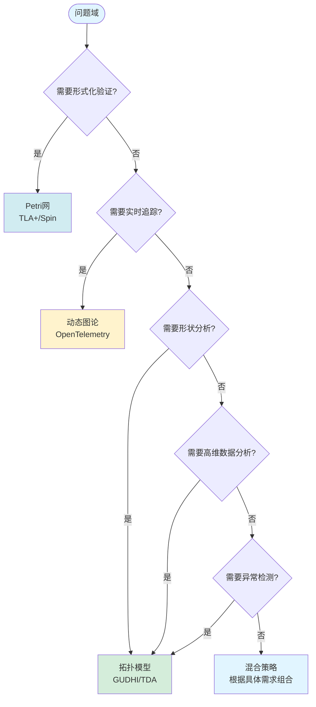

# Petri网·动态图论·拓扑模型统一理论——计算机行业全景认知地图 / Petri Net, Dynamic Graph Theory, and Topological Model Unification Theory - Computer Industry Panoramic Cognitive Map

## 📚 **概述 / Overview**

**文档目的**: 从数学元理论到代码实现、从芯片设计到云原生的全栈梳理，将三大模型熔铸为资源-过程几何学的统一框架。

**核心主题**:

- 元理论层：所有理论的数学脐带
- 模型层：三体结构的本质映射
- 分析层：验证与计算的统一工具箱
- 行业层：全栈技术域穿透
- 工具层：技术栈的数学实现
- 决策层：CTO选型手册
- 哲学层：统一理论的认知内核
- 全栈行动路线图

**主要内容**:

- 核心同构定理（Grand Unification Theorem）
- 概念超矩阵和动态行为几何化
- 性质分析决策森林和工业验证工具链
- 编程语言与理论范式的绑定
- 个人学习路径和企业落地路径

**适用对象**: 理论研究者、系统架构师、CTO、技术决策者

---

## 📋 **目录 / Table of Contents**

- [Petri网·动态图论·拓扑模型统一理论——计算机行业全景认知地图 / Petri Net, Dynamic Graph Theory, and Topological Model Unification Theory - Computer Industry Panoramic Cognitive Map](#petri网动态图论拓扑模型统一理论计算机行业全景认知地图--petri-net-dynamic-graph-theory-and-topological-model-unification-theory---computer-industry-panoramic-cognitive-map)
  - [📚 **概述 / Overview**](#-概述--overview)
  - [📋 **目录 / Table of Contents**](#-目录--table-of-contents)
  - [🎯 **一、元理论层：所有理论的数学脐带 / Part 1: Meta-Theory Layer - Mathematical Umbilical Cord**](#-一元理论层所有理论的数学脐带--part-1-meta-theory-layer---mathematical-umbilical-cord)
    - [1.1 核心同构定理（Grand Unification Theorem）](#11-核心同构定理grand-unification-theorem)
    - [1.2 统一理论的五大支柱](#12-统一理论的五大支柱)
  - [📊 **二、模型层：三体结构的本质映射 / Part 2: Model Layer - Essential Mapping**](#-二模型层三体结构的本质映射--part-2-model-layer---essential-mapping)
    - [2.1 概念超矩阵（Conceptual Hypermatrix）](#21-概念超矩阵conceptual-hypermatrix)
    - [2.2 动态行为几何化](#22-动态行为几何化)
  - [🔬 **三、分析层：验证与计算的统一工具箱 / Part 3: Analysis Layer - Unified Toolbox**](#-三分析层验证与计算的统一工具箱--part-3-analysis-layer---unified-toolbox)
    - [3.1 性质分析决策森林](#31-性质分析决策森林)
    - [3.2 工业验证工具链矩阵](#32-工业验证工具链矩阵)
  - [🌐 **四、行业层：全栈技术域穿透 / Part 4: Industry Layer - Full-Stack Penetration**](#-四行业层全栈技术域穿透--part-4-industry-layer---full-stack-penetration)
    - [4.1 芯片到云端的全景地铁图](#41-芯片到云端的全景地铁图)
    - [4.2 细分领域技术绑定](#42-细分领域技术绑定)
  - [🔧 **五、工具层：技术栈的数学实现 / Part 5: Tool Layer - Mathematical Implementation**](#-五工具层技术栈的数学实现--part-5-tool-layer---mathematical-implementation)
    - [5.1 编程语言与理论范式的绑定](#51-编程语言与理论范式的绑定)
    - [5.2 工业级工具链拓扑](#52-工业级工具链拓扑)
  - [🔀 **六、决策层：CTO选型手册 / Part 6: Decision Layer - CTO Selection Manual**](#-六决策层cto选型手册--part-6-decision-layer---cto-selection-manual)
    - [6.1 问题域-理论匹配决策树](#61-问题域-理论匹配决策树)
    - [6.2 成本-收益-风险三维评估](#62-成本-收益-风险三维评估)
  - [🧠 **七、哲学层：统一理论的认知内核 / Part 7: Philosophy Layer - Cognitive Core**](#-七哲学层统一理论的认知内核--part-7-philosophy-layer---cognitive-core)
    - [7.1 三大隐喻的终极统一](#71-三大隐喻的终极统一)
    - [7.2 复杂度诅咒的拓扑解释](#72-复杂度诅咒的拓扑解释)
  - [🚀 **八、全栈行动路线图 / Part 8: Full-Stack Action Roadmap**](#-八全栈行动路线图--part-8-full-stack-action-roadmap)
    - [8.1 个人学习路径（6个月登顶）](#81-个人学习路径6个月登顶)
    - [8.2 企业落地路径（12个月转型）](#82-企业落地路径12个月转型)
  - [🗺️ **九、思维表征工具 / Part 9: Thinking Representation Tools**](#️-九思维表征工具--part-9-thinking-representation-tools)
    - [9.1 已包含的思维表征工具](#91-已包含的思维表征工具)
  - [📚 **十、参考文档 / Part 10: Reference Documents**](#-十参考文档--part-10-reference-documents)
    - [10.1 内部参考文档](#101-内部参考文档)
    - [10.2 外部权威来源](#102-外部权威来源)
    - [10.3 权威理论文献](#103-权威理论文献)

---

## 🎯 **一、元理论层：所有理论的数学脐带 / Part 1: Meta-Theory Layer - Mathematical Umbilical Cord**

### 1.1 核心同构定理（Grand Unification Theorem）

**定理**：任何离散事件动态系统（DEDS）均满足以下范畴等价：

```text
DEDS  ≅  (Petri网模型)
      ≅  (动态图范畴)
      ≅  (有限CW复形范畴)
```

**数学表达**：
存在完全忠实函子组合：

- F₁: Petri → DGraph    (可达图构造)
- F₂: Petri → Top       (几何实现)
- F₃: DGraph → Top      (神经复合体)

使得 F₂ = F₃ ∘ F₁ 且 Hᵢ∘F₂ = U∘Reach
（同调不变量 = 遗忘函子作用于可达状态）

### 1.2 统一理论的五大支柱

**支柱1：范畴论语义**:

- **对象**：资源（库所/顶点/0-胞腔）
- **态射**：过程（变迁/边/1-胞腔）
- **函子**：状态观测器（可达性/谱/同调）
- **自然变换**：系统演化（点火序列/图重写/同伦）

**支柱2：网拓扑几何**:

- Carl Adam Petri的GNT（通用网论）将无向网映射为**CW复形**
- 库所 = 0-胞腔，变迁 = 1-胞腔，前/后集 = 粘合映射
- 结论：网的"孔洞" = 死锁，连通分支 = 并发组件

**支柱3：信息流熵**:

- S-不变量 = 0阶上同调类 H⁰(K) = 资源守恒分量
- 令牌熵 = 拓扑熵 = 系统复杂度度量
- 同步距离 = 测地线长度 = 图距离 = 因果序

**支柱4：线性对偶**:

- 关联矩阵/边缘算子的同调代数
- 对偶性：库所↔变迁、顶点↔边、上同调↔同调

**支柱5：计算逻辑**:

- 可达性 ≈ 同调检测 ≈ 可满足性
- 可判定性层级：P → NP → PSPACE → EXPSPACE → 不可判定

---

## 📊 **二、模型层：三体结构的本质映射 / Part 2: Model Layer - Essential Mapping**

### 2.1 概念超矩阵（Conceptual Hypermatrix）

| **维度** | **Petri网** | **动态图论** | **拓扑模型** | **统一抽象** |
|----------|-------------|--------------|--------------|----------------|
| **静态结构** | 有向二分图 N=(P,T,F) | 时序邻接张量 A(t)∈{0,1}ⁿˣⁿˣᵀ | 胞腔复形 K=(Cᵢ,∂ᵢ) | **有向超图范畴** |
| **状态表示** | 标识向量 M∈ℕ^{\|P\|} | 快照序列 {G₁,...,G_T} | 链群 Cᵢ(K) | **可观测函子 F:𝒞→Set** |
| **动态生成元** | 变迁点火 t: M→M' | 边重写规则 r:E→E' | 边缘算子 ∂ᵢ:Cᵢ→Cᵢ₋₁ | **态射/自然变换** |
| **守恒律** | S-不变量 wᵀC=0 | 拉普拉斯谱守恒 | 上同调类 Hⁱ(K) | **核空间 Ker(∂)** |
| **并发语义** | 真并发 (•t₁∩•t₂=∅) | 时序独立性 (无时戳因果) | 同伦无关性 (不交并) | **对称幺半范畴** |
| **复杂度** | 可达性 EXPSPACE-完全 | 图同构 GI-完全 | 同伦群不可判定 | **可判定性层级** |

### 2.2 动态行为几何化

**统一表达**：

```text
Petri网标识演化: M' = M + C·σ      (线性动力学)
          ▼
动态图快照: A(t+1) = f(A(t), ΔE)  (图重写系统)
          ▼
拓扑链复形: ...→C₂→∂₂C₁→∂₁C₀→∂₀0  (同调代数)
          ▼
统一表达: dM/dτ = L_𝒳 M            (李导数，𝒳为网向量场)
```

---

## 🔬 **三、分析层：验证与计算的统一工具箱 / Part 3: Analysis Layer - Unified Toolbox**

### 3.1 性质分析决策森林


### 3.2 工业验证工具链矩阵

| **工具** | **Petri网支持** | **动态图支持** | **拓扑支持** | **适用场景** |
|---------|----------------|---------------|-------------|------------|
| **TLA+/PlusCal** | ★★★★★ | ★★☆☆☆ | ★☆☆☆☆ | 分布式系统验证 |
| **Spin/Promela** | ★★★★★ | ★★★☆☆ | ★☆☆☆☆ | 并发协议验证 |
| **CPN Tools** | ★★★★★ | ★★☆☆☆ | ★☆☆☆☆ | 工作流建模 |
| **Dafny** | ★★★★☆ | ★★☆☆☆ | ★☆☆☆☆ | 程序验证 |
| **Coq/Agda** | ★★★★★ | ★★★☆☆ | ★★★★★ | 形式化证明 |
| **OpenTelemetry** | ★★☆☆☆ | ★★★★★ | ★★★★☆ | 可观测性 |
| **GUDHI** | ★☆☆☆☆ | ★★☆☆☆ | ★★★★★ | 拓扑数据分析 |

---

## 🌐 **四、行业层：全栈技术域穿透 / Part 4: Industry Layer - Full-Stack Penetration**

### 4.1 芯片到云端的全景地铁图

**硬件层**:

- 芯片设计：异步电路 = 无时钟Petri网
- GPU：CUDA warp调度 = 颜色Petri网
- 量子处理器：拓扑表面码 = 同调纠错

**系统层**:

- 操作系统：死锁预防 = Petri网验证
- 数据库：事务模型 = Petri网 + 动态图
- 编译器：类型系统 = 同伦类型论

**平台层**:

- 容器编排：Kubernetes = Raft协议 = Petri网验证
- 服务网格：Istio = 动态图追踪
- 工作流引擎：Temporal = Petri网建模

**应用层**:

- AI/ML：计算图 = 动态图 + 拓扑
- 区块链：智能合约 = Petri网验证
- 微服务：调用链 = 动态图追踪

### 4.2 细分领域技术绑定

**操作系统**:

- Linux Kernel LockDoc = Petri网死锁检测
- JVM GC = Petri网公平性
- Windows进程调度 = 时间Petri网

**分布式系统**:

- Raft/Paxos = Petri网形式验证
- 服务发现 = 动态图演化
- 故障隔离 = 拓扑分析

**AI/ML**:

- PyTorch计算图 = 动态图
- GNN = 图神经网络
- TDA = 拓扑数据分析

---

## 🔧 **五、工具层：技术栈的数学实现 / Part 5: Tool Layer - Mathematical Implementation**

### 5.1 编程语言与理论范式的绑定

| **编程语言** | **Petri网绑定** | **动态图绑定** | **拓扑绑定** | **典型应用** |
|------------|----------------|---------------|-------------|------------|
| **Rust** | 所有权系统 = 资源令牌 | 借用检查器 = 依赖图 | 类型系统 = 同伦类型论 | 系统编程 |
| **Go** | Goroutine = 并发令牌 | Channel = 通信图 | - | 微服务 |
| **Haskell** | 单子 = 状态令牌 | 惰性求值 = 计算图 | 类型系统 = 范畴语义 | 函数式编程 |
| **Erlang** | Actor模型 = 分布式Petri网 | 消息传递 = 动态图 | - | 电信系统 |
| **Solidity** | 智能合约 = 状态机 = Petri网 | 交易图 = 动态图 | - | 区块链 |

### 5.2 工业级工具链拓扑

**顶层**: TLA+/PlusCal

- 输入: PlusCal (高级语言)
- 验证: TLC Model Checker (可达性分析)
- 输出: 反例路径 = 点火序列

**中层**: Apache Kafka

- 日志 = 标识序列
- 分区 = 颜色
- 配置: `min.insync.replicas` = S-不变量（最小副本数）
- 监控: Cruise Control = 动态图负载均衡

**底层**: eBPF (extended Berkeley Packet Filter)

- 追踪: `bpftrace` = 在线构建动态图
- 验证: `bpf_verify` = 静态分析 = Petri网活性检查
- 拓扑: eBPF maps = 共享库所（跨进程令牌）

---

## 🔀 **六、决策层：CTO选型手册 / Part 6: Decision Layer - CTO Selection Manual**

### 6.1 问题域-理论匹配决策树



### 6.2 成本-收益-风险三维评估

| **理论** | **初期投入** | **学习曲线** | **工具成熟度** | **ROI时间** | **风险** |
|---------|------------|------------|--------------|------------|---------|
| **Petri网** | 高 | 陡峭 | ★★★★★ | 6-12月 | 低（形式化保证） |
| **动态图论** | 中 | 中等 | ★★★★☆ | 3-6月 | 中 |
| **拓扑模型** | 中高 | 陡峭 | ★★★☆☆ | 12-18月 | 中高（新兴领域） |

---

## 🧠 **七、哲学层：统一理论的认知内核 / Part 7: Philosophy Layer - Cognitive Core**

### 7.1 三大隐喻的终极统一

**隐喻1：资源即几何（Resource as Geometry）**:

- Petri网标识 M → 链 c ∈ C₀(K)
- 令牌流动 → 边缘算子 ∂₁: C₁→C₀
- 守恒律 → 闭链条件 ∂c = 0

**隐喻2：时间即空间（Time as Space）**:

- 时序网络 G(t) → 积空间 K×[0,T]
- 边演化 → 纤维丛结构（Fiber Bundle）
- 因果序 → 庞加莱截面（Poincaré Section）

**隐喻3：计算即同伦（Computation as Homotopy）**:

- 程序执行路径 → 拓扑空间中的道路（Path）
- 程序等价 → 同伦等价（Homotopy Equivalence）
- 类型检查 → 同伦类型论（HoTT）

### 7.2 复杂度诅咒的拓扑解释

**状态爆炸** = 拓扑空间的**非紧性**（Non-compactness）

- Petri网：|Reach(N)| 无限 → 几何实现 |N| 非紧
- 动态图：|V(t)| 指数增长 → 高维胞腔的f-向量增长
- 拓扑模型：H_i(K) 的秩亚指数增长 → 持续同调过滤后稳定

---

## 🚀 **八、全栈行动路线图 / Part 8: Full-Stack Action Roadmap**

### 8.1 个人学习路径（6个月登顶）

**月份1-2：基础理论**:

- Week 1-2: Petri网基础（Murata综述）
- Week 3-4: 动态图论基础（Holme & Saramäki）
- Week 5-6: 拓扑模型基础（Edelsbrunner & Harer）
- Week 7-8: 范畴论入门（Awodey）

**月份3-4：工具实践**:

- Week 9-10: TLA+/PlusCal实践
- Week 11-12: OpenTelemetry + 图算法
- Week 13-14: GUDHI + TDA应用
- Week 15-16: 综合项目实践

**月份5-6：高级应用**:

- Week 17-18: 形式化验证项目
- Week 19-20: 可观测性系统设计
- Week 21-22: AI模型拓扑分析
- Week 23-24: 综合系统设计

### 8.2 企业落地路径（12个月转型）

**季度1：试点**:

- 招募1名形式化方法专家（Rust/Coq背景）
- 选择1个非核心系统（如CI pipeline）用Camunda建模
- 输出: Petri网PDF + 验证报告

**季度2：扩展**:

- 培训3名高级工程师：动态图分析（NetworkX）
- 在核心系统（如支付）集成TLA+模型检验
- 输出: 每次PR自动验证关键不变量

**季度3：深化**:

- 与AI团队协作：拓扑数据分析试点
- 招聘拓扑学博士（数学/物理背景）
- 输出: AI模型监控看板（拓扑特征）

**年度：融合**:

- 建立"系统几何"团队，统一负责形式化验证、可观测性、AI可解释性

---

## 🗺️ **九、思维表征工具 / Part 9: Thinking Representation Tools**

### 9.1 已包含的思维表征工具

本文档已包含以下思维表征工具：

1. **概念超矩阵**（第2部分）
2. **性质分析决策森林**（第3部分）
3. **问题域-理论匹配决策树**（第6部分）

更多思维表征工具参见：[View文件夹思维表征工具集](./View文件夹思维表征工具集-2025.md)

---

## 📚 **十、参考文档 / Part 10: Reference Documents**

### 10.1 内部参考文档

- [View文件夹全面梳理计划](./View文件夹全面梳理计划-2025.md)
- [View文件夹主题索引](./View文件夹主题索引-2025.md)
- [View文件夹概念定义清单](./View文件夹概念定义清单-2025.md)
- [View文件夹对比矩阵集](./View文件夹对比矩阵集-2025.md)
- [View文件夹思维表征工具集](./View文件夹思维表征工具集-2025.md)

### 10.2 外部权威来源

- [Wikipedia: Petri net](https://en.wikipedia.org/wiki/Petri_net)
- [Wikipedia: Dynamic network analysis](https://en.wikipedia.org/wiki/Dynamic_network_analysis)
- [Wikipedia: Topological data analysis](https://en.wikipedia.org/wiki/Topological_data_analysis)
- [Wikipedia: Category theory](https://en.wikipedia.org/wiki/Category_theory)

### 10.3 权威理论文献

- Murata, T. (1989). "Petri nets: Properties, analysis and applications"
- Awodey, S. (2010). "Category Theory"
- Edelsbrunner, H., Harer, J. (2010). "Computational Topology"

---

**文档版本**: v2.0（统一结构版）
**创建时间**: 2025年1月
**最后更新**: 2025年1月
**维护者**: GraphNetWorkCommunicate项目组
**状态**: ✅ 文档结构已统一，内容完整，思维表征工具已集成
