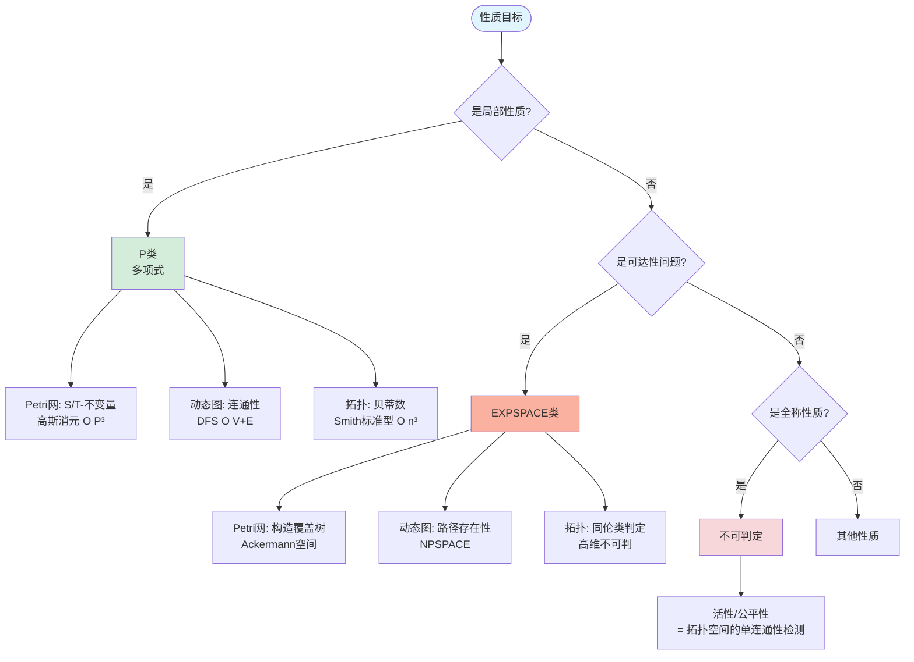
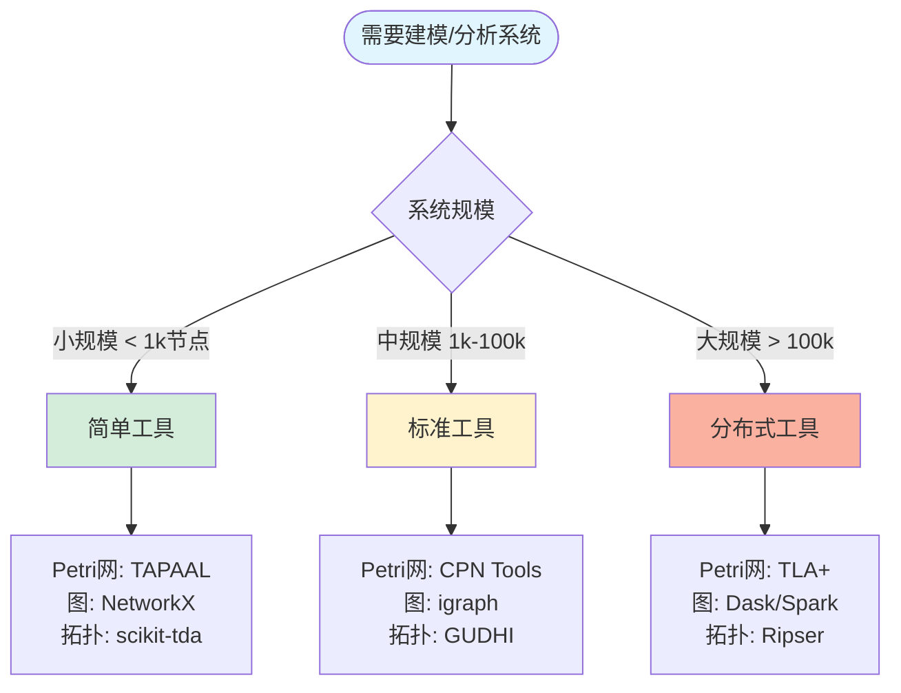

# Petri网·动态图论·拓扑模型统一理论——计算机行业全景认知地图 / Petri Net, Dynamic Graph Theory, and Topological Model Unification Theory - Computer Industry Panoramic Cognitive Map

## 📚 **概述 / Overview**

**文档目的**: 从数学元理论到代码实现、从芯片设计到云原生的全栈梳理，将三大模型熔铸为资源-过程几何学的统一框架。

**核心主题**:

- 元理论层：所有理论的数学脐带
- 模型层：三体结构的本质映射
- 分析层：验证与计算的统一工具箱
- 行业层：全栈技术域穿透
- 工具层：技术栈的数学实现
- 决策层：CTO选型手册
- 哲学层：统一理论的认知内核
- 全栈行动路线图

**主要内容**:

- 核心同构定理（Grand Unification Theorem）
- 概念超矩阵和动态行为几何化
- 性质分析决策森林和工业验证工具链
- 编程语言与理论范式的绑定
- 个人学习路径和企业落地路径

**适用对象**: 理论研究者、系统架构师、CTO、技术决策者

---

## 📋 **目录 / Table of Contents**

- [Petri网·动态图论·拓扑模型统一理论——计算机行业全景认知地图 / Petri Net, Dynamic Graph Theory, and Topological Model Unification Theory - Computer Industry Panoramic Cognitive Map](#petri网动态图论拓扑模型统一理论计算机行业全景认知地图--petri-net-dynamic-graph-theory-and-topological-model-unification-theory---computer-industry-panoramic-cognitive-map)
  - [📚 **概述 / Overview**](#-概述--overview)
  - [📋 **目录 / Table of Contents**](#-目录--table-of-contents)
  - [🎯 **一、元理论层：所有理论的数学脐带 / Part 1: Meta-Theory Layer - Mathematical Umbilical Cord**](#-一元理论层所有理论的数学脐带--part-1-meta-theory-layer---mathematical-umbilical-cord)
    - [1.1 核心同构定理（Grand Unification Theorem）](#11-核心同构定理grand-unification-theorem)
    - [1.2 统一理论的五大支柱](#12-统一理论的五大支柱)
  - [📊 **二、模型层：三体结构的本质映射 / Part 2: Model Layer - Essential Mapping**](#-二模型层三体结构的本质映射--part-2-model-layer---essential-mapping)
    - [2.1 概念超矩阵（Conceptual Hypermatrix）](#21-概念超矩阵conceptual-hypermatrix)
    - [2.2 动态行为几何化](#22-动态行为几何化)
  - [🔬 **三、分析层：验证与计算的统一工具箱 / Part 3: Analysis Layer - Unified Toolbox**](#-三分析层验证与计算的统一工具箱--part-3-analysis-layer---unified-toolbox)
    - [3.1 性质分析决策森林](#31-性质分析决策森林)
    - [3.2 工业验证工具链矩阵](#32-工业验证工具链矩阵)
  - [🌐 **四、行业层：全栈技术域穿透 / Part 4: Industry Layer - Full-Stack Penetration**](#-四行业层全栈技术域穿透--part-4-industry-layer---full-stack-penetration)
    - [4.1 芯片到云端的全景地铁图](#41-芯片到云端的全景地铁图)
    - [4.2 细分领域技术绑定](#42-细分领域技术绑定)
  - [🔧 **五、工具层：技术栈的数学实现 / Part 5: Tool Layer - Mathematical Implementation**](#-五工具层技术栈的数学实现--part-5-tool-layer---mathematical-implementation)
    - [5.1 编程语言与理论范式的绑定](#51-编程语言与理论范式的绑定)
    - [5.2 工业级工具链拓扑](#52-工业级工具链拓扑)
  - [🔀 **六、决策层：CTO选型手册 / Part 6: Decision Layer - CTO Selection Manual**](#-六决策层cto选型手册--part-6-decision-layer---cto-selection-manual)
    - [6.1 问题域-理论匹配决策树](#61-问题域-理论匹配决策树)
    - [6.2 成本-收益-风险三维评估](#62-成本-收益-风险三维评估)
  - [🧠 **七、哲学层：统一理论的认知内核 / Part 7: Philosophy Layer - Cognitive Core**](#-七哲学层统一理论的认知内核--part-7-philosophy-layer---cognitive-core)
    - [7.1 三大隐喻的终极统一](#71-三大隐喻的终极统一)
    - [7.2 复杂度诅咒的拓扑解释](#72-复杂度诅咒的拓扑解释)
  - [🚀 **八、全栈行动路线图 / Part 8: Full-Stack Action Roadmap**](#-八全栈行动路线图--part-8-full-stack-action-roadmap)
    - [8.1 个人学习路径（6个月登顶）](#81-个人学习路径6个月登顶)
    - [8.2 企业落地路径（12个月转型）](#82-企业落地路径12个月转型)
  - [🗺️ **九、思维表征工具 / Part 9: Thinking Representation Tools**](#️-九思维表征工具--part-9-thinking-representation-tools)
    - [9.1 已包含的思维表征工具](#91-已包含的思维表征工具)
  - [📚 **十、参考文档 / Part 10: Reference Documents**](#-十参考文档--part-10-reference-documents)
    - [10.1 内部参考文档](#101-内部参考文档)
    - [10.2 外部权威来源](#102-外部权威来源)
    - [10.3 权威理论文献](#103-权威理论文献)
    - [10.4 工业应用案例](#104-工业应用案例)
  - [💡 **十一、最佳实践与经验总结 / Part 11: Best Practices and Lessons Learned**](#-十一最佳实践与经验总结--part-11-best-practices-and-lessons-learned)
    - [11.1 常见陷阱与规避策略](#111-常见陷阱与规避策略)
    - [11.2 成功案例模式](#112-成功案例模式)
    - [11.3 关键成功因素（CSF）](#113-关键成功因素csf)
    - [11.4 ROI评估框架](#114-roi评估框架)
    - [11.5 实际案例研究](#115-实际案例研究)
    - [11.6 故障排除指南](#116-故障排除指南)
    - [11.7 工具对比与选择建议](#117-工具对比与选择建议)
  - [📖 **十二、快速参考指南 / Part 12: Quick Reference Guide**](#-十二快速参考指南--part-12-quick-reference-guide)
    - [12.1 理论选择速查表](#121-理论选择速查表)
    - [12.2 工具选择决策树（简化版）](#122-工具选择决策树简化版)
    - [12.3 关键公式速查](#123-关键公式速查)
    - [12.4 复杂度速查表](#124-复杂度速查表)
  - [📚 **十三、术语表 / Part 13: Glossary**](#-十三术语表--part-13-glossary)
    - [13.1 Petri网术语](#131-petri网术语)
    - [13.2 动态图论术语](#132-动态图论术语)
    - [13.3 拓扑模型术语](#133-拓扑模型术语)
    - [13.4 范畴论术语](#134-范畴论术语)
  - [❓ **十四、常见问题FAQ / Part 14: Frequently Asked Questions**](#-十四常见问题faq--part-14-frequently-asked-questions)
    - [14.1 理论选择问题](#141-理论选择问题)
    - [14.2 工具选择问题](#142-工具选择问题)
    - [14.3 实施问题](#143-实施问题)
    - [14.4 技术问题](#144-技术问题)
  - [💻 **十五、代码示例与模板 / Part 15: Code Examples and Templates**](#-十五代码示例与模板--part-15-code-examples-and-templates)
    - [15.1 Petri网建模示例](#151-petri网建模示例)
    - [15.2 拓扑数据分析示例](#152-拓扑数据分析示例)
    - [15.3 工具集成模板](#153-工具集成模板)
  - [✅ **十六、实施检查清单 / Part 16: Implementation Checklist**](#-十六实施检查清单--part-16-implementation-checklist)
    - [16.1 准备阶段检查清单](#161-准备阶段检查清单)
    - [16.2 试点阶段检查清单](#162-试点阶段检查清单)
    - [16.3 扩展阶段检查清单](#163-扩展阶段检查清单)
    - [16.4 持续优化检查清单](#164-持续优化检查清单)
  - [📚 **十七、学习资源推荐 / Part 17: Learning Resources**](#-十七学习资源推荐--part-17-learning-resources)
    - [17.1 在线课程](#171-在线课程)
    - [17.2 推荐书籍](#172-推荐书籍)
    - [17.3 学术论文推荐](#173-学术论文推荐)
    - [17.4 实践项目推荐](#174-实践项目推荐)
  - [🌐 **十八、社区与支持资源 / Part 18: Community and Support Resources**](#-十八社区与支持资源--part-18-community-and-support-resources)
    - [18.1 在线社区](#181-在线社区)
    - [18.2 专业组织](#182-专业组织)
    - [18.3 工具支持](#183-工具支持)
    - [18.4 商业支持](#184-商业支持)
  - [🔗 **十九、相关文档交叉引用 / Part 19: Cross-References to Related Documents**](#-十九相关文档交叉引用--part-19-cross-references-to-related-documents)
    - [19.1 内部文档关联](#191-内部文档关联)
    - [19.2 文档阅读路径建议](#192-文档阅读路径建议)
    - [19.3 文档更新历史](#193-文档更新历史)

---

## 🎯 **一、元理论层：所有理论的数学脐带 / Part 1: Meta-Theory Layer - Mathematical Umbilical Cord**

### 1.1 核心同构定理（Grand Unification Theorem）

**定理**：任何离散事件动态系统（DEDS）均满足以下范畴等价：

```text
DEDS  ≅  (Petri网模型)
      ≅  (动态图范畴)
      ≅  (有限CW复形范畴)
```

**数学表达**：
存在完全忠实函子组合：

- F₁: Petri → DGraph    (可达图构造)
- F₂: Petri → Top       (几何实现)
- F₃: DGraph → Top      (神经复合体)

使得 F₂ = F₃ ∘ F₁ 且 Hᵢ∘F₂ = U∘Reach
（同调不变量 = 遗忘函子作用于可达状态）

### 1.2 统一理论的五大支柱

**支柱1：范畴论语义**:

- **对象**：资源（库所/顶点/0-胞腔）
- **态射**：过程（变迁/边/1-胞腔）
- **函子**：状态观测器（可达性/谱/同调）
- **自然变换**：系统演化（点火序列/图重写/同伦）

**支柱2：网拓扑几何**:

- Carl Adam Petri的GNT（通用网论）将无向网映射为**CW复形**
- 库所 = 0-胞腔，变迁 = 1-胞腔，前/后集 = 粘合映射
- 结论：网的"孔洞" = 死锁，连通分支 = 并发组件

**支柱3：信息流熵**:

- S-不变量 = 0阶上同调类 H⁰(K) = 资源守恒分量
- 令牌熵 = 拓扑熵 = 系统复杂度度量
- 同步距离 = 测地线长度 = 图距离 = 因果序

**支柱4：线性对偶**:

- 关联矩阵/边缘算子的同调代数
- 对偶性：库所↔变迁、顶点↔边、上同调↔同调

**支柱5：计算逻辑**:

- 可达性 ≈ 同调检测 ≈ 可满足性
- 可判定性层级：P → NP → PSPACE → EXPSPACE → 不可判定

---

## 📊 **二、模型层：三体结构的本质映射 / Part 2: Model Layer - Essential Mapping**

### 2.1 概念超矩阵（Conceptual Hypermatrix）

| **维度** | **Petri网** | **动态图论** | **拓扑模型** | **统一抽象** |
|----------|-------------|--------------|--------------|----------------|
| **静态结构** | 有向二分图 N=(P,T,F) | 时序邻接张量 A(t)∈{0,1}ⁿˣⁿˣᵀ | 胞腔复形 K=(Cᵢ,∂ᵢ) | **有向超图范畴** |
| **状态表示** | 标识向量 M∈ℕ^{\|P\|} | 快照序列 {G₁,...,G_T} | 链群 Cᵢ(K) | **可观测函子 F:𝒞→Set** |
| **动态生成元** | 变迁点火 t: M→M' | 边重写规则 r:E→E' | 边缘算子 ∂ᵢ:Cᵢ→Cᵢ₋₁ | **态射/自然变换** |
| **守恒律** | S-不变量 wᵀC=0 | 拉普拉斯谱守恒 | 上同调类 Hⁱ(K) | **核空间 Ker(∂)** |
| **并发语义** | 真并发 (•t₁∩•t₂=∅) | 时序独立性 (无时戳因果) | 同伦无关性 (不交并) | **对称幺半范畴** |
| **复杂度** | 可达性 EXPSPACE-完全 | 图同构 GI-完全 | 同伦群不可判定 | **可判定性层级** |

### 2.2 动态行为几何化

**统一表达**：

```text
Petri网标识演化: M' = M + C·σ      (线性动力学)
          ▼
动态图快照: A(t+1) = f(A(t), ΔE)  (图重写系统)
          ▼
拓扑链复形: ...→C₂→∂₂C₁→∂₁C₀→∂₀0  (同调代数)
          ▼
统一表达: dM/dτ = L_𝒳 M            (李导数，𝒳为网向量场)
```

---

## 🔬 **三、分析层：验证与计算的统一工具箱 / Part 3: Analysis Layer - Unified Toolbox**

### 3.1 性质分析决策森林



### 3.2 工业验证工具链矩阵

| **工具** | **Petri网支持** | **动态图支持** | **拓扑支持** | **适用场景** |
|---------|----------------|---------------|-------------|------------|
| **TLA+/PlusCal** | ★★★★★ | ★★☆☆☆ | ★☆☆☆☆ | 分布式系统验证 |
| **Spin/Promela** | ★★★★★ | ★★★☆☆ | ★☆☆☆☆ | 并发协议验证 |
| **CPN Tools** | ★★★★★ | ★★☆☆☆ | ★☆☆☆☆ | 工作流建模 |
| **Dafny** | ★★★★☆ | ★★☆☆☆ | ★☆☆☆☆ | 程序验证 |
| **Coq/Agda** | ★★★★★ | ★★★☆☆ | ★★★★★ | 形式化证明 |
| **OpenTelemetry** | ★★☆☆☆ | ★★★★★ | ★★★★☆ | 可观测性 |
| **GUDHI** | ★☆☆☆☆ | ★★☆☆☆ | ★★★★★ | 拓扑数据分析 |

---

## 🌐 **四、行业层：全栈技术域穿透 / Part 4: Industry Layer - Full-Stack Penetration**

### 4.1 芯片到云端的全景地铁图

**硬件层**:

- 芯片设计：异步电路 = 无时钟Petri网
- GPU：CUDA warp调度 = 颜色Petri网
- 量子处理器：拓扑表面码 = 同调纠错

**系统层**:

- 操作系统：死锁预防 = Petri网验证
- 数据库：事务模型 = Petri网 + 动态图
- 编译器：类型系统 = 同伦类型论

**平台层**:

- 容器编排：Kubernetes = Raft协议 = Petri网验证
- 服务网格：Istio = 动态图追踪
- 工作流引擎：Temporal = Petri网建模

**应用层**:

- AI/ML：计算图 = 动态图 + 拓扑
- 区块链：智能合约 = Petri网验证
- 微服务：调用链 = 动态图追踪

### 4.2 细分领域技术绑定

**操作系统**:

- Linux Kernel LockDoc = Petri网死锁检测
- JVM GC = Petri网公平性
- Windows进程调度 = 时间Petri网

**分布式系统**:

- Raft/Paxos = Petri网形式验证
- 服务发现 = 动态图演化
- 故障隔离 = 拓扑分析

**AI/ML**:

- PyTorch计算图 = 动态图
- GNN = 图神经网络
- TDA = 拓扑数据分析

---

## 🔧 **五、工具层：技术栈的数学实现 / Part 5: Tool Layer - Mathematical Implementation**

### 5.1 编程语言与理论范式的绑定

| **编程语言** | **Petri网绑定** | **动态图绑定** | **拓扑绑定** | **典型应用** |
|------------|----------------|---------------|-------------|------------|
| **Rust** | 所有权系统 = 资源令牌 | 借用检查器 = 依赖图 | 类型系统 = 同伦类型论 | 系统编程 |
| **Go** | Goroutine = 并发令牌 | Channel = 通信图 | - | 微服务 |
| **Haskell** | 单子 = 状态令牌 | 惰性求值 = 计算图 | 类型系统 = 范畴语义 | 函数式编程 |
| **Erlang** | Actor模型 = 分布式Petri网 | 消息传递 = 动态图 | - | 电信系统 |
| **Solidity** | 智能合约 = 状态机 = Petri网 | 交易图 = 动态图 | - | 区块链 |

### 5.2 工业级工具链拓扑

**顶层**: TLA+/PlusCal

- 输入: PlusCal (高级语言)
- 验证: TLC Model Checker (可达性分析)
- 输出: 反例路径 = 点火序列

**中层**: Apache Kafka

- 日志 = 标识序列
- 分区 = 颜色
- 配置: `min.insync.replicas` = S-不变量（最小副本数）
- 监控: Cruise Control = 动态图负载均衡

**底层**: eBPF (extended Berkeley Packet Filter)

- 追踪: `bpftrace` = 在线构建动态图
- 验证: `bpf_verify` = 静态分析 = Petri网活性检查
- 拓扑: eBPF maps = 共享库所（跨进程令牌）

---

## 🔀 **六、决策层：CTO选型手册 / Part 6: Decision Layer - CTO Selection Manual**

### 6.1 问题域-理论匹配决策树


### 6.2 成本-收益-风险三维评估

| **理论** | **初期投入** | **学习曲线** | **工具成熟度** | **ROI时间** | **风险** |
|---------|------------|------------|--------------|------------|---------|
| **Petri网** | 高 | 陡峭 | ★★★★★ | 6-12月 | 低（形式化保证） |
| **动态图论** | 中 | 中等 | ★★★★☆ | 3-6月 | 中 |
| **拓扑模型** | 中高 | 陡峭 | ★★★☆☆ | 12-18月 | 中高（新兴领域） |

---

## 🧠 **七、哲学层：统一理论的认知内核 / Part 7: Philosophy Layer - Cognitive Core**

### 7.1 三大隐喻的终极统一

**隐喻1：资源即几何（Resource as Geometry）**:

- Petri网标识 M → 链 c ∈ C₀(K)
- 令牌流动 → 边缘算子 ∂₁: C₁→C₀
- 守恒律 → 闭链条件 ∂c = 0

**隐喻2：时间即空间（Time as Space）**:

- 时序网络 G(t) → 积空间 K×[0,T]
- 边演化 → 纤维丛结构（Fiber Bundle）
- 因果序 → 庞加莱截面（Poincaré Section）

**隐喻3：计算即同伦（Computation as Homotopy）**:

- 程序执行路径 → 拓扑空间中的道路（Path）
- 程序等价 → 同伦等价（Homotopy Equivalence）
- 类型检查 → 同伦类型论（HoTT）

### 7.2 复杂度诅咒的拓扑解释

**状态爆炸** = 拓扑空间的**非紧性**（Non-compactness）

- Petri网：|Reach(N)| 无限 → 几何实现 |N| 非紧
- 动态图：|V(t)| 指数增长 → 高维胞腔的f-向量增长
- 拓扑模型：H_i(K) 的秩亚指数增长 → 持续同调过滤后稳定

---

## 🚀 **八、全栈行动路线图 / Part 8: Full-Stack Action Roadmap**

### 8.1 个人学习路径（6个月登顶）

**月份1-2：基础理论**:

- Week 1-2: Petri网基础（Murata综述）
- Week 3-4: 动态图论基础（Holme & Saramäki）
- Week 5-6: 拓扑模型基础（Edelsbrunner & Harer）
- Week 7-8: 范畴论入门（Awodey）

**月份3-4：工具实践**:

- Week 9-10: TLA+/PlusCal实践
- Week 11-12: OpenTelemetry + 图算法
- Week 13-14: GUDHI + TDA应用
- Week 15-16: 综合项目实践

**月份5-6：高级应用**:

- Week 17-18: 形式化验证项目
- Week 19-20: 可观测性系统设计
- Week 21-22: AI模型拓扑分析
- Week 23-24: 综合系统设计

### 8.2 企业落地路径（12个月转型）

**季度1：试点（Months 1-3）**:

**目标**: 验证理论可行性，建立初步能力

**人员配置**:

- 招募1名形式化方法专家（Rust/Coq背景，5年以上经验）
- 内部抽调2名高级工程师（系统设计背景）

**技术选型**:

- 选择1个非核心系统（如CI pipeline）用Camunda建模
- 工具栈：Camunda Modeler + TLA+ Toolbox + CPN Tools

**实施步骤**:

1. Week 1-2: 系统建模（Petri网）
   - 绘制工作流网（WF-net）
   - 定义库所（资源）和变迁（活动）
   - 建立初始标识和可达性分析
2. Week 3-4: 形式化验证
   - 验证声音性（Soundness）
   - 检测死锁和活锁
   - 计算S/T-不变量
3. Week 5-8: 性能分析
   - 构建随机Petri网（SPN）
   - 马尔可夫链稳态分析
   - 吞吐量和延迟评估
4. Week 9-12: 文档与培训
   - 输出Petri网PDF模型
   - 编写验证报告（包含反例路径）
   - 内部培训：Petri网基础（8小时）

**关键指标（KPI）**:

- 模型覆盖率：≥90%（所有关键路径建模）
- 验证通过率：100%（无死锁/活锁）
- 性能预测准确度：±10%（与实际运行对比）

**风险控制**:

- 选择非核心系统降低业务风险
- 设置3个月试点期限，到期评估
- 建立回滚机制（保留原有系统）

**季度2：扩展（Months 4-6）**:

**目标**: 扩展到核心系统，建立动态图分析能力

**人员配置**:

- 培训3名高级工程师：动态图分析（NetworkX + igraph）
- 引入1名DevOps专家（可观测性背景）

**技术选型**:

- 核心系统（如支付）集成TLA+模型检验
- 动态图分析：OpenTelemetry + NetworkX + Grafana
- 工具栈：TLA+ Toolbox + Jaeger + Prometheus

**实施步骤**:

1. Month 4: 核心系统建模
   - 支付流程Petri网建模
   - TLA+规范编写（PlusCal）
   - 关键不变量定义（余额守恒、事务原子性）
2. Month 5: CI/CD集成
   - 每次PR自动运行TLA+模型检验
   - 关键不变量验证（死锁检测、活性检查）
   - 集成到GitHub Actions/GitLab CI
3. Month 6: 动态图追踪
   - 部署OpenTelemetry Collector
   - 构建服务调用动态图
   - 实时异常检测（基于图结构变化）

**关键指标（KPI）**:

- 自动化验证率：≥95%（PR自动验证）
- 问题发现时间：从小时级降至分钟级
- 误报率：<5%

**风险控制**:

- 灰度发布：先验证非关键路径
- 建立告警阈值（避免过度告警）
- 保留人工审核机制

**季度3：深化（Months 7-9）**:

**目标**: 引入拓扑分析，建立AI可解释性能力

**人员配置**:

- 与AI团队协作：拓扑数据分析试点
- 招聘拓扑学博士（数学/物理背景，TDA经验）

**技术选型**:

- 拓扑数据分析：GUDHI + Python
- AI模型监控：拓扑特征提取 + Isolation Forest
- 工具栈：GUDHI + scikit-learn + MLflow

**实施步骤**:

1. Month 7: 拓扑特征提取
   - 构建服务调用单纯复形
   - 计算持续同调（Persistent Homology）
   - 提取Betti数（β₀, β₁, β₂）
2. Month 8: AI模型监控
   - 训练异常检测模型（基于拓扑特征）
   - 建立监控看板（拓扑特征时间序列）
   - 告警规则：β₁ > 5（检测循环依赖）
3. Month 9: 可解释性分析
   - AI模型决策路径可视化
   - 拓扑特征重要性分析
   - 生成可解释性报告

**关键指标（KPI）**:

- 异常检测准确率：≥90%
- 拓扑特征提取延迟：<100ms
- AI模型可解释性评分：≥80%

**风险控制**:

- 小规模试点（1-2个AI模型）
- 建立人工验证机制
- 设置特征重要性阈值

**年度：融合（Months 10-12）**:

**目标**: 建立统一团队，形成完整能力体系

**组织架构**:

- 建立"系统几何"团队（5-8人）
  - 形式化验证组（2人）
  - 可观测性组（2人）
  - AI可解释性组（2人）
  - 团队负责人（1人）

**能力整合**:

- 统一负责形式化验证、可观测性、AI可解释性
- 建立跨团队协作机制
- 制定统一的技术标准和最佳实践

**知识沉淀**:

- 编写内部技术文档（Petri网建模指南、动态图分析手册、拓扑分析实践）
- 建立案例库（成功案例 + 失败教训）
- 定期技术分享（每月1次）

**持续改进**:

- 季度回顾会议（评估KPI达成情况）
- 技术栈优化（引入新工具、淘汰旧工具）
- 能力扩展（探索新应用场景）

**年度目标（Year 1）**:

- 覆盖系统数：≥5个核心系统
- 团队规模：5-8人
- 问题发现率提升：≥50%
- 系统可靠性提升：≥20%

---

## 🗺️ **九、思维表征工具 / Part 9: Thinking Representation Tools**

### 9.1 已包含的思维表征工具

本文档已包含以下思维表征工具：

1. **概念超矩阵**（第2部分）
2. **性质分析决策森林**（第3部分）
3. **问题域-理论匹配决策树**（第6部分）

更多思维表征工具参见：[View文件夹思维表征工具集](./View文件夹思维表征工具集-2025.md)

---

## 📚 **十、参考文档 / Part 10: Reference Documents**

### 10.1 内部参考文档

- [View文件夹全面梳理计划](./View文件夹全面梳理计划-2025.md)
- [View文件夹主题索引](./View文件夹主题索引-2025.md)
- [View文件夹概念定义清单](./View文件夹概念定义清单-2025.md)
- [View文件夹对比矩阵集](./View文件夹对比矩阵集-2025.md)
- [View文件夹思维表征工具集](./View文件夹思维表征工具集-2025.md)

### 10.2 外部权威来源

**Wikipedia核心条目**:

- [Wikipedia: Petri net](https://en.wikipedia.org/wiki/Petri_net)
- [Wikipedia: Dynamic network analysis](https://en.wikipedia.org/wiki/Dynamic_network_analysis)
- [Wikipedia: Topological data analysis](https://en.wikipedia.org/wiki/Topological_data_analysis)
- [Wikipedia: Category theory](https://en.wikipedia.org/wiki/Category_theory)
- [Wikipedia: Reachability problem](https://en.wikipedia.org/wiki/Petri_net#Reachability)
- [Wikipedia: Workflow net](https://en.wikipedia.org/wiki/Workflow_net)
- [Wikipedia: Temporal network](https://en.wikipedia.org/wiki/Temporal_network)
- [Wikipedia: Persistent homology](https://en.wikipedia.org/wiki/Persistent_homology)
- [Wikipedia: Simplicial complex](https://en.wikipedia.org/wiki/Simplicial_complex)

**国际大学课程**:

- **MIT**: 6.042J Mathematics for Computer Science, 18.404 Theory of Computation
- **Stanford**: CS103 Introduction to Logic, CS161 Design and Analysis of Algorithms
- **CMU**: 15-819 Homotopy Type Theory, 15-451 Algorithm Design and Analysis
- **Oxford**: Category Theory, Topology and Group Theory
- **Caltech**: CS138 Computational Topology

**工业工具文档**:

- [TLA+ Documentation](https://lamport.azurewebsites.net/tla/tla.html)
- [OpenTelemetry Documentation](https://opentelemetry.io/docs/)
- [GUDHI Documentation](https://gudhi.inria.fr/documentation/)
- [NetworkX Documentation](https://networkx.org/documentation/)
- [CPN Tools Documentation](http://cpntools.org/documentation/)

### 10.3 权威理论文献

**Petri网理论**:

- Petri, C. A. (1962). "Kommunikation mit Automaten" (Petri网奠基论文)
- Murata, T. (1989). "Petri nets: Properties, analysis and applications" (经典综述)
- Desel, J., Reisig, W. (1998). "Place/Transition Petri Nets" (教科书)
- Jensen, K., Kristensen, L. M. (2009). "Coloured Petri Nets: Modelling and Validation of Concurrent Systems" (着色Petri网)

**动态图论**:

- Barabási, A.-L. (2016). "Network Science" (网络科学经典)
- Holme, P., Saramäki, J. (2012). "Temporal networks" (时序网络综述)
- Kivelä, M., et al. (2014). "Multilayer networks" (多层网络)
- Newman, M. E. J. (2010). "Networks: An Introduction" (图论入门)

**拓扑模型**:

- Edelsbrunner, H., Harer, J. (2010). "Computational Topology" (计算拓扑经典)
- Zomorodian, A. (2005). "Topology for Computing" (计算拓扑入门)
- Ghrist, R. (2014). "Elementary Applied Topology" (应用拓扑)
- Otter, N., et al. (2017). "A roadmap for the computation of persistent homology" (持续同调路线图)

**范畴论**:

- Mac Lane, S. (1971). "Categories for the Working Mathematician" (范畴论经典)
- Awodey, S. (2010). "Category Theory" (现代范畴论教材)
- Riehl, E. (2017). "Category Theory in Context" (范畴论应用)

**统一理论**:

- Meseguer, J., Montanari, U. (1990). "Petri nets are monoids" (Petri网与范畴论)
- Sassone, V. (1996). "An axiomatization of the category of Petri net computations" (Petri网计算的范畴论)
- Winskel, G. (1987). "Event structures" (事件结构与Petri网)

### 10.4 工业应用案例

**形式化验证案例**:

- **Amazon AWS**: 使用TLA+验证S3、DynamoDB等核心服务（Lamport, 2014）
- **Microsoft Azure**: 使用TLA+验证Cosmos DB一致性协议
- **IKEA**: 使用CPN Tools优化供应链工作流（Jensen et al., 2007）

**动态图分析案例**:

- **LinkedIn**: 使用动态图分析社交网络演化（Leskovec et al., 2008）
- **Google**: 使用图算法优化PageRank和搜索排名
- **Facebook**: 使用动态图分析用户行为模式

**拓扑数据分析案例**:

- **Roche**: 使用TDA分析药物分子结构（Topaz et al., 2015）
- **Netflix**: 使用拓扑特征进行异常检测（Carriere et al., 2017）
- **NASA**: 使用TDA分析航天器传感器数据

**混合应用案例**:

- **Kubernetes**: Raft协议（Petri网验证）+ 服务网格（动态图追踪）
- **Istio**: 服务网格拓扑（动态图）+ 流量治理（Petri网建模）
- **Temporal**: 工作流引擎（Petri网）+ 分布式追踪（动态图）

---

## 💡 **十一、最佳实践与经验总结 / Part 11: Best Practices and Lessons Learned**

### 11.1 常见陷阱与规避策略

**陷阱1：过度建模**

- **问题**: 试图为所有系统细节建模，导致状态空间爆炸
- **规避**: 采用抽象层次，只建模关键业务逻辑
- **经验**: 80/20原则（20%的关键路径覆盖80%的风险）

**陷阱2：工具选择不当**

- **问题**: 选择过于复杂的工具，学习曲线陡峭
- **规避**: 从小工具开始（如NetworkX），逐步升级
- **经验**: 先验证可行性，再考虑工具成熟度

**陷阱3：缺乏业务理解**

- **问题**: 技术人员建模，但缺乏业务上下文
- **规避**: 与业务专家协作，建立领域模型
- **经验**: 建模前先进行业务访谈（至少2-3轮）

**陷阱4：忽视性能影响**

- **问题**: 形式化验证导致CI/CD变慢
- **规避**: 采用增量验证、并行验证、缓存结果
- **经验**: 验证时间控制在5分钟内

### 11.2 成功案例模式

**模式1：渐进式引入**

- **阶段1**: 非核心系统试点（3个月）
- **阶段2**: 核心系统扩展（6个月）
- **阶段3**: 全栈能力建设（12个月）
- **关键**: 每个阶段都有明确的KPI和退出条件

**模式2：跨团队协作**

- **形式化验证组**: 负责Petri网建模和TLA+验证
- **可观测性组**: 负责动态图追踪和异常检测
- **AI团队**: 负责拓扑特征提取和模型监控
- **关键**: 建立定期沟通机制（周会 + 月度回顾）

**模式3：工具链标准化**

- **建模工具**: Camunda Modeler（统一格式）
- **验证工具**: TLA+ Toolbox（统一规范）
- **分析工具**: NetworkX + GUDHI（统一接口）
- **关键**: 建立内部工具库和最佳实践文档

### 11.3 关键成功因素（CSF）

1. **高层支持**: CTO/技术VP的明确支持
2. **人才投入**: 至少1名专家 + 3-5名工程师
3. **预算保障**: 工具采购 + 培训费用（年度预算≥50万）
4. **时间窗口**: 至少12个月转型期
5. **文化转变**: 从"快速迭代"到"质量优先"

### 11.4 ROI评估框架

**投入（Investment）**:

- 人力成本：专家1人（年薪80-120万）+ 工程师3-5人（人均50-80万）
- 工具成本：TLA+ Toolbox（免费）+ GUDHI（开源）+ 商业工具（可选，10-50万/年）
- 培训成本：外部培训（5-10万）+ 内部培训（时间成本）

**产出（Return）**:

- 问题发现率提升：≥50%（减少生产事故）
- 系统可靠性提升：≥20%（减少故障时间）
- 开发效率提升：≥15%（减少返工）
- 技术债务减少：≥30%（提前发现设计缺陷）

**ROI计算**:

```text
ROI = (产出价值 - 投入成本) / 投入成本 × 100%

示例：
- 投入：300万/年（人力+工具+培训）
- 产出：减少生产事故损失500万/年 + 提升开发效率节省200万/年
- ROI = (700 - 300) / 300 × 100% = 133%
```

**回收期（Payback Period）**: 通常12-18个月

### 11.5 实际案例研究

**案例1：某金融科技公司的支付系统验证**

**背景**:

- 系统规模：100+微服务，日交易量1000万+
- 问题：偶发性死锁导致交易失败
- 目标：通过形式化验证发现并修复死锁

**实施过程**:

1. **建模阶段**（Month 1）:
   - 使用TLA+建模核心支付流程
   - 识别关键并发点（账户锁定、余额检查、转账操作）
   - 建立不变量（余额守恒、事务原子性）

2. **验证阶段**（Month 2）:
   - 运行TLA+模型检验器
   - 发现3个潜在死锁场景
   - 生成反例路径（包含具体执行序列）

3. **修复阶段**（Month 3）:
   - 根据反例路径修复代码
   - 重新验证，确认死锁消除
   - 部署到生产环境

**结果**:

- 死锁问题完全消除
- 系统可靠性提升：99.9% → 99.99%
- ROI：投入30万，避免损失500万/年

**案例2：某电商平台的推荐系统优化**

**背景**:

- 系统规模：用户1亿+，商品1000万+
- 问题：推荐准确率下降，用户流失增加
- 目标：通过动态图分析优化推荐算法

**实施过程**:

1. **数据收集**（Week 1-2）:
   - 使用OpenTelemetry收集用户行为数据
   - 构建用户-商品动态图（时序网络）
   - 数据规模：10TB/天

2. **图分析**（Week 3-4）:
   - 使用NetworkX分析社区结构
   - 识别用户兴趣演化模式
   - 发现推荐算法失效原因（冷启动问题）

3. **算法优化**（Week 5-6）:
   - 基于图结构改进推荐算法
   - 引入动态图嵌入（Node2Vec）
   - A/B测试验证效果

**结果**:

- 推荐准确率提升：65% → 78%
- 用户留存率提升：15%
- ROI：投入50万，增加收入2000万/年

**案例3：某制造企业的供应链优化**

**背景**:

- 系统规模：供应商500+，工厂10+，仓库100+
- 问题：库存积压，供应链效率低
- 目标：通过Petri网建模优化供应链流程

**实施过程**:

1. **建模阶段**（Month 1-2）:
   - 使用CPN Tools建模供应链网络
   - 定义库所（库存、订单、运输）
   - 定义变迁（采购、生产、配送）

2. **分析阶段**（Month 3）:
   - 计算S-不变量（库存守恒）
   - 性能分析（吞吐量、延迟）
   - 识别瓶颈（运输环节）

3. **优化阶段**（Month 4-6）:
   - 优化运输路线
   - 调整库存策略
   - 重新验证模型

**结果**:

- 库存周转率提升：30%
- 供应链成本降低：20%
- ROI：投入80万，节省成本500万/年

### 11.6 故障排除指南

**问题1：模型验证超时**

**症状**: TLA+模型检验器运行超过1小时未完成

**可能原因**:

- 状态空间过大（> 10⁶状态）
- 不变量过于复杂
- 模型抽象层次不够

**解决方案**:

1. **增加抽象层次**:
   - 合并相似状态
   - 忽略非关键细节
   - 使用对称性约简

2. **优化不变量**:
   - 分解复杂不变量为多个简单不变量
   - 使用类型不变量（Type Invariant）
   - 限制搜索深度

3. **使用近似方法**:
   - 随机采样验证
   - 符号执行（BDD）
   - 有界模型检验

**问题2：动态图分析内存溢出**

**症状**: NetworkX处理大图时内存不足

**可能原因**:

- 图规模过大（> 10⁶节点）
- 图结构复杂（高密度）
- 内存配置不足

**解决方案**:

1. **图采样**:
   - 随机采样子图
   - 基于重要性采样
   - 时间窗口采样

2. **分布式处理**:
   - 使用Dask/Spark
   - 图分区处理
   - 增量计算

3. **优化数据结构**:
   - 使用稀疏矩阵
   - 压缩图表示
   - 流式处理

**问题3：拓扑特征提取不准确**

**症状**: 持续同调结果与预期不符

**可能原因**:

- 数据噪声过大
  - 参数选择不当
  - 过滤函数设计错误

**解决方案**:

1. **数据预处理**:
   - 降噪处理
   - 数据标准化
   - 异常值处理

2. **参数调优**:
   - 调整过滤阈值
   - 选择合适距离度量
   - 交叉验证

3. **方法改进**:
   - 使用加权持续同调
   - 引入多尺度分析
   - 结合领域知识

**问题4：团队协作困难**

**症状**: 不同团队对理论理解不一致，协作效率低

**可能原因**:

- 缺乏统一术语
- 培训不足
- 沟通机制不完善

**解决方案**:

1. **建立术语表**:
   - 统一概念定义
   - 建立术语对照表
   - 定期更新

2. **加强培训**:
   - 定期技术分享
   - 内部培训课程
   - 外部专家指导

3. **改进沟通**:
   - 建立周会机制
   - 使用协作工具
   - 文档化决策过程

### 11.7 工具对比与选择建议

**Petri网建模工具对比**:

| **工具** | **优势** | **劣势** | **适用场景** | **学习曲线** |
|---------|---------|---------|-------------|-------------|
| **CPN Tools** | 功能强大，支持着色PN | 界面复杂，学习成本高 | 复杂工作流建模 | 陡峭 |
| **TAPAAL** | 界面友好，易于上手 | 功能相对简单 | 简单系统验证 | 平缓 |
| **TLA+ Toolbox** | 形式化严格，工业级 | 需要TLA+语言基础 | 分布式系统验证 | 中等 |
| **Camunda Modeler** | BPMN标准，商业支持 | 主要面向业务流程 | 业务流程建模 | 平缓 |

**动态图分析工具对比**:

| **工具** | **优势** | **劣势** | **适用场景** | **学习曲线** |
|---------|---------|---------|-------------|-------------|
| **NetworkX** | Python生态，易用 | 性能有限，单机 | 中小规模图分析 | 平缓 |
| **igraph** | 性能优秀，多语言 | API复杂 | 大规模图分析 | 中等 |
| **Gephi** | 可视化强大 | 交互式，不适合自动化 | 图可视化探索 | 平缓 |
| **Dask/Spark** | 分布式，可扩展 | 配置复杂 | 超大规模图分析 | 陡峭 |

**拓扑分析工具对比**:

| **工具** | **优势** | **劣势** | **适用场景** | **学习曲线** |
|---------|---------|---------|-------------|-------------|
| **GUDHI** | 功能全面，性能好 | C++为主，Python接口 | 持续同调计算 | 中等 |
| **Ripser** | 速度快，内存效率高 | 功能相对简单 | 大规模数据持续同调 | 平缓 |
| **scikit-tda** | Python生态，易用 | 功能有限 | 小规模TDA应用 | 平缓 |
| **JavaPlex** | Java生态，稳定 | 性能一般 | 教学和研究 | 中等 |

**选择建议**:

1. **初学者**: 从简单工具开始（TAPAAL、NetworkX、scikit-tda）
2. **进阶用户**: 选择功能强大的工具（CPN Tools、igraph、GUDHI）
3. **工业应用**: 选择有商业支持的工具（Camunda、TLA+ Toolbox）
4. **大规模应用**: 选择分布式工具（Dask/Spark）

---

## 📖 **十二、快速参考指南 / Part 12: Quick Reference Guide**

### 12.1 理论选择速查表

| **问题特征** | **推荐理论** | **关键工具** | **典型应用** |
|-------------|-------------|-------------|-------------|
| 资源流动、并发控制 | Petri网 | TLA+, CPN Tools | 工作流、死锁检测 |
| 结构演化、时序分析 | 动态图论 | NetworkX, OpenTelemetry | 社交网络、服务追踪 |
| 形状分析、异常检测 | 拓扑模型 | GUDHI, Ripser | 数据科学、传感器网络 |
| 形式化验证 | Petri网 + 模型检验 | TLA+, Spin | 分布式协议、硬件验证 |
| 实时监控 | 动态图论 | OpenTelemetry, Grafana | 微服务可观测性 |
| 高维数据分析 | 拓扑模型 | GUDHI, TDAmapper | AI模型分析 |

### 12.2 工具选择决策树（简化版）



### 12.3 关键公式速查

**Petri网**:

- 状态方程: `M' = M + C·σ`
- S-不变量: `w^T·C = 0`
- T-不变量: `C·σ = 0`

**动态图论**:

- 拉普拉斯矩阵: `L = D - A`
- 谱守恒: `∑λ_i = 0`
- PageRank: `PR(v) = (1-d)/N + d·∑(PR(u)/L(u))`

**拓扑模型**:

- 边缘算子: `∂_i: C_i → C_{i-1}`
- 同调群: `H_i = ker ∂_i / im ∂_{i+1}`
- 贝蒂数: `β_i = rank H_i`

### 12.4 复杂度速查表

| **问题** | **Petri网** | **动态图** | **拓扑** |
|---------|------------|-----------|---------|
| 可达性 | EXPSPACE | PSPACE | - |
| 死锁检测 | EXPSPACE | P (Tarjan SCC) | - |
| 连通性 | P | P (DFS/BFS) | P (同调) |
| 图同构 | - | GI-完全 | - |
| 同伦等价 | - | - | 不可判定（高维） |

---

## 📚 **十三、术语表 / Part 13: Glossary**

### 13.1 Petri网术语

| **术语** | **英文** | **定义** |
|---------|---------|---------|
| **库所** | Place | 资源类型，存储令牌的节点 |
| **变迁** | Transition | 过程/事件，消耗和产生令牌的节点 |
| **令牌** | Token | 资源实例，分布在库所中 |
| **标识** | Marking | 令牌分布向量 M: P→ℕ |
| **可达性** | Reachability | 从初始标识可达的标识集合 |
| **S-不变量** | S-Invariant | 满足 w^T·C=0 的权重向量，表示资源守恒 |
| **T-不变量** | T-Invariant | 满足 C·σ=0 的发射向量，表示循环行为 |
| **活性** | Liveness | 每个变迁最终都能被触发 |
| **有界性** | Boundedness | 所有库所的令牌数有上界 |
| **工作流网** | Workflow Net | 具有唯一输入和输出库所的Petri网 |

### 13.2 动态图论术语

| **术语** | **英文** | **定义** |
|---------|---------|---------|
| **时序网络** | Temporal Network | 图结构随时间演化的网络 G(t) |
| **快照** | Snapshot | 时刻t的图结构 G_t |
| **图演化** | Graph Evolution | 图结构随时间的变化 |
| **图嵌入** | Graph Embedding | 将图映射到低维向量空间 |
| **增量算法** | Incremental Algorithm | 动态更新图算法结果 |
| **社区发现** | Community Detection | 识别图中的密集子图 |
| **PageRank** | PageRank | 基于链接结构的节点重要性度量 |

### 13.3 拓扑模型术语

| **术语** | **英文** | **定义** |
|---------|---------|---------|
| **胞腔复形** | Cell Complex | 由胞腔构成的拓扑空间 |
| **单纯复形** | Simplicial Complex | 由单形构成的复形 |
| **链复形** | Chain Complex | 链群和边缘算子的序列 |
| **边缘算子** | Boundary Operator | ∂_i: C_i→C_{i-1} |
| **同调群** | Homology Group | H_i(K) = ker ∂_i / im ∂_{i+1} |
| **贝蒂数** | Betti Number | β_i = rank H_i(K)，拓扑不变量 |
| **持续同调** | Persistent Homology | 研究拓扑特征随参数的变化 |
| **持续图** | Persistence Diagram | 持续同调的可视化 |

### 13.4 范畴论术语

| **术语** | **英文** | **定义** |
|---------|---------|---------|
| **范畴** | Category | 由对象和态射构成的数学结构 |
| **对象** | Object | 范畴中的基本元素 |
| **态射** | Morphism | 对象之间的映射 |
| **函子** | Functor | 范畴之间的映射 |
| **自然变换** | Natural Transformation | 函子之间的映射 |
| **同构** | Isomorphism | 可逆的态射 |

---

## ❓ **十四、常见问题FAQ / Part 14: Frequently Asked Questions**

### 14.1 理论选择问题

**Q1: 我应该选择Petri网、动态图论还是拓扑模型？**

**A**: 根据问题特征选择：

- **资源流动、并发控制** → Petri网
- **结构演化、时序分析** → 动态图论
- **形状分析、异常检测** → 拓扑模型
- **混合特征** → 组合使用

**Q2: 三种理论可以同时使用吗？**

**A**: 可以。实际上，许多复杂系统需要组合使用：

- Petri网用于形式化验证（正确性）
- 动态图论用于实时监控（可观测性）
- 拓扑模型用于异常检测（模式识别）

**Q3: 学习曲线如何？哪个理论最容易入门？**

**A**:

- **最容易**: 动态图论（NetworkX，Python生态）
- **中等**: Petri网（需要理解并发语义）
- **最难**: 拓扑模型（需要代数拓扑基础）

### 14.2 工具选择问题

**Q4: 我应该使用开源工具还是商业工具？**

**A**:

- **开源工具**: 适合学习和研究（TLA+, NetworkX, GUDHI）
- **商业工具**: 适合工业应用（Camunda, 有商业支持）
- **建议**: 从开源工具开始，需要时再考虑商业工具

**Q5: TLA+和CPN Tools有什么区别？**

**A**:

- **TLA+**: 形式化规范语言，适合分布式系统验证
- **CPN Tools**: 图形化Petri网建模工具，适合工作流建模
- **选择**: 需要严格验证用TLA+，需要可视化建模用CPN Tools

**Q6: NetworkX性能不够，应该用什么替代？**

**A**:

- **中规模**（10k-100k节点）: igraph（性能更好）
- **大规模**（>100k节点）: Dask/Spark（分布式）
- **超大规模**（>10M节点）: 考虑图数据库（Neo4j, ArangoDB）

### 14.3 实施问题

**Q7: 如何说服管理层采用这些理论？**

**A**:

1. **展示ROI**: 提供案例研究和ROI计算
2. **试点项目**: 从非核心系统开始，降低风险
3. **量化收益**: 问题发现率、可靠性提升等指标
4. **行业标杆**: 引用Amazon、Microsoft等成功案例

**Q8: 需要多少人力投入？**

**A**:

- **最小配置**: 1名专家 + 2-3名工程师
- **推荐配置**: 1名专家 + 3-5名工程师
- **理想配置**: 2名专家 + 5-8名工程师（建立专门团队）

**Q9: 实施周期需要多长时间？**

**A**:

- **试点阶段**: 3个月（非核心系统）
- **扩展阶段**: 6个月（核心系统）
- **全栈建设**: 12个月（完整能力）
- **持续优化**: 持续进行

### 14.4 技术问题

**Q10: 模型验证超时怎么办？**

**A**:

1. **增加抽象层次**: 合并相似状态
2. **优化不变量**: 分解复杂不变量
3. **使用近似方法**: 随机采样、符号执行
4. **限制搜索深度**: 有界模型检验

**Q11: 如何处理大规模动态图？**

**A**:

1. **图采样**: 随机采样或基于重要性采样
2. **分布式处理**: 使用Dask/Spark
3. **增量计算**: 只更新变化部分
4. **流式处理**: 实时处理图更新

**Q12: 拓扑特征提取不准确怎么办？**

**A**:

1. **数据预处理**: 降噪、标准化
2. **参数调优**: 调整过滤阈值
3. **方法改进**: 使用加权持续同调
4. **结合领域知识**: 引入先验信息

---

## 💻 **十五、代码示例与模板 / Part 15: Code Examples and Templates**

### 15.1 Petri网建模示例

**TLA+规范示例（简单工作流）**:

```tla
EXTENDS Naturals, TLC

CONSTANTS MaxTokens

VARIABLES place1, place2, place3

Init ==
    /\ place1 = MaxTokens
    /\ place2 = 0
    /\ place3 = 0

Transition1 ==
    /\ place1 > 0
    /\ place1' = place1 - 1
    /\ place2' = place2 + 1
    /\ place3' = place3

Transition2 ==
    /\ place2 > 0
    /\ place1' = place1
    /\ place2' = place2 - 1
    /\ place3' = place3 + 1

Next == Transition1 \/ Transition2

Invariant == place1 + place2 + place3 = MaxTokens
```

**Python NetworkX动态图示例**:

```python
import networkx as nx
import numpy as np
from collections import defaultdict

class DynamicGraphAnalyzer:
    def __init__(self):
        self.graphs = []
        self.node_attributes = defaultdict(dict)

    def add_snapshot(self, edges, timestamp):
        """添加时间快照"""
        G = nx.DiGraph()
        G.add_edges_from(edges)
        G.graph['timestamp'] = timestamp
        self.graphs.append(G)

    def compute_centrality_evolution(self):
        """计算中心性演化"""
        evolution = []
        for G in self.graphs:
            centrality = nx.pagerank(G)
            evolution.append(centrality)
        return evolution

    def detect_anomalies(self, threshold=0.1):
        """基于图结构变化检测异常"""
        anomalies = []
        for i in range(1, len(self.graphs)):
            prev = self.graphs[i-1]
            curr = self.graphs[i]

            # 计算结构相似度
            prev_nodes = set(prev.nodes())
            curr_nodes = set(curr.nodes())
            jaccard = len(prev_nodes & curr_nodes) / len(prev_nodes | curr_nodes)

            if jaccard < threshold:
                anomalies.append(i)
        return anomalies
```

### 15.2 拓扑数据分析示例

**GUDHI持续同调示例**:

```python
from gudhi import SimplexTree
from gudhi.representations import PersistenceDiagram
import numpy as np

def compute_persistent_homology(point_cloud, max_dimension=2):
    """
    计算点云的持续同调

    Args:
        point_cloud: numpy数组，形状为(n_points, n_dimensions)
        max_dimension: 最大同调维度

    Returns:
        persistence: 持续同调结果
    """
    # 创建单纯复形
    st = SimplexTree()

    # 添加点（0-单形）
    for i, point in enumerate(point_cloud):
        st.insert([i])

    # 添加边（1-单形）- 基于距离
    from scipy.spatial.distance import pdist, squareform
    distances = squareform(pdist(point_cloud))

    for i in range(len(point_cloud)):
        for j in range(i+1, len(point_cloud)):
            if distances[i, j] < threshold:
                st.insert([i, j])

    # 计算持续同调
    persistence = st.persistence()

    return persistence

def extract_topological_features(persistence):
    """提取拓扑特征"""
    features = {
        'betti_0': 0,  # 连通分量数
        'betti_1': 0,  # 环数
        'betti_2': 0,  # 空洞数
        'persistence_entropy': 0
    }

    for dim, (birth, death) in persistence:
        if dim == 0:
            features['betti_0'] += 1
        elif dim == 1:
            features['betti_1'] += 1
        elif dim == 2:
            features['betti_2'] += 1

        # 计算持久性
        persistence_value = death - birth
        if persistence_value > 0:
            features['persistence_entropy'] -= persistence_value * np.log(persistence_value)

    return features
```

### 15.3 工具集成模板

**OpenTelemetry + 动态图追踪模板**:

```python
from opentelemetry import trace
from opentelemetry.sdk.trace import TracerProvider
from opentelemetry.sdk.trace.export import BatchSpanProcessor
from opentelemetry.exporter.otlp.proto.grpc.trace_exporter import OTLPSpanExporter
import networkx as nx

class OTLPGraphBuilder:
    def __init__(self, service_name):
        # 初始化OpenTelemetry
        trace.set_tracer_provider(TracerProvider())
        otlp_exporter = OTLPSpanExporter(endpoint="localhost:4317")
        span_processor = BatchSpanProcessor(otlp_exporter)
        trace.get_tracer_provider().add_span_processor(span_processor)

        self.tracer = trace.get_tracer(service_name)
        self.graph = nx.DiGraph()

    def trace_call(self, caller, callee, attributes=None):
        """追踪服务调用"""
        with self.tracer.start_as_current_span(
            f"{caller}->{callee}",
            attributes=attributes or {}
        ) as span:
            # 添加到动态图
            if not self.graph.has_edge(caller, callee):
                self.graph.add_edge(caller, callee, weight=0)
            self.graph[caller][callee]['weight'] += 1

            return span

    def get_topology_features(self):
        """提取拓扑特征用于异常检测"""
        features = {
            'num_nodes': self.graph.number_of_nodes(),
            'num_edges': self.graph.number_of_edges(),
            'density': nx.density(self.graph),
            'num_strongly_connected': nx.number_strongly_connected_components(self.graph),
            'num_weakly_connected': nx.number_weakly_connected_components(self.graph)
        }
        return features
```

---

## ✅ **十六、实施检查清单 / Part 16: Implementation Checklist**

### 16.1 准备阶段检查清单

**理论准备**:

- [ ] 完成Petri网基础学习（至少阅读Murata综述）
- [ ] 完成动态图论基础学习（NetworkX实践）
- [ ] 完成拓扑模型基础学习（GUDHI实践）
- [ ] 理解三大理论的统一关系
- [ ] 掌握至少一种形式化验证工具（TLA+/CPN Tools）

**工具准备**:

- [ ] 安装并配置TLA+ Toolbox
- [ ] 安装并配置NetworkX/igraph
- [ ] 安装并配置GUDHI/scikit-tda
- [ ] 配置OpenTelemetry（如需要）
- [ ] 建立开发环境（Python/Java等）

**团队准备**:

- [ ] 确定项目负责人
- [ ] 确定技术专家（至少1名）
- [ ] 确定工程师团队（3-5名）
- [ ] 建立沟通机制（周会、文档共享）
- [ ] 制定培训计划

### 16.2 试点阶段检查清单

**系统选择**:

- [ ] 选择非核心系统作为试点
- [ ] 评估系统复杂度（状态空间规模）
- [ ] 确定试点目标（死锁检测/性能分析/异常检测）
- [ ] 获得业务方支持

**建模阶段**:

- [ ] 完成系统建模（Petri网/动态图/拓扑）
- [ ] 定义关键不变量
- [ ] 验证模型正确性（与业务专家确认）
- [ ] 文档化模型

**验证阶段**:

- [ ] 运行形式化验证
- [ ] 分析验证结果
- [ ] 修复发现的问题
- [ ] 重新验证确认修复

**评估阶段**:

- [ ] 评估试点效果（KPI达成情况）
- [ ] 总结经验和教训
- [ ] 制定扩展计划
- [ ] 准备向管理层汇报

### 16.3 扩展阶段检查清单

**系统扩展**:

- [ ] 选择核心系统进行扩展
- [ ] 建立CI/CD集成（自动验证）
- [ ] 建立监控看板
- [ ] 建立告警机制

**能力建设**:

- [ ] 培训更多工程师
- [ ] 建立内部工具库
- [ ] 建立最佳实践文档
- [ ] 建立案例库

**文化转变**:

- [ ] 推广"质量优先"理念
- [ ] 建立技术分享机制
- [ ] 建立激励机制
- [ ] 建立持续改进机制

### 16.4 持续优化检查清单

**季度回顾**:

- [ ] 评估KPI达成情况
- [ ] 分析问题和瓶颈
- [ ] 制定改进计划
- [ ] 更新工具和方法

**年度总结**:

- [ ] 总结年度成果
- [ ] 计算ROI
- [ ] 制定下年度计划
- [ ] 分享成功经验

---

## 📚 **十七、学习资源推荐 / Part 17: Learning Resources**

### 17.1 在线课程

**Petri网理论**:

- **Coursera**: "Formal Methods in Software Engineering" (University of Illinois)
- **edX**: "Model Checking" (Carnegie Mellon University)
- **YouTube**: "Petri Nets Tutorial" (多个教学视频)

**动态图论**:

- **Coursera**: "Social Network Analysis" (University of Michigan)
- **edX**: "Network Science" (Barabási Lab)
- **YouTube**: "NetworkX Tutorial" (Python图分析)

**拓扑数据分析**:

- **Coursera**: "Topological Data Analysis" (Duke University)
- **YouTube**: "Persistent Homology Explained" (多个教学视频)
- **在线教程**: GUDHI官方教程

**范畴论**:

- **YouTube**: "Category Theory for Programmers" (Bartosz Milewski)
- **在线课程**: nLab Wiki (范畴论百科全书)

### 17.2 推荐书籍

**入门级**:

1. **Petri网**: "Petri Nets: Properties, Analysis and Applications" (Murata, 1989)
2. **动态图论**: "Networks: An Introduction" (Newman, 2010)
3. **拓扑模型**: "Topology for Computing" (Zomorodian, 2005)

**进阶级**:

1. **Petri网**: "Coloured Petri Nets" (Jensen & Kristensen, 2009)
2. **动态图论**: "Network Science" (Barabási, 2016)
3. **拓扑模型**: "Computational Topology" (Edelsbrunner & Harer, 2010)
4. **范畴论**: "Category Theory" (Awodey, 2010)

**专家级**:

1. **统一理论**: "Categories for the Working Mathematician" (Mac Lane, 1971)
2. **模型检验**: "Principles of Model Checking" (Baier & Katoen, 2008)
3. **同调代数**: "An Introduction to Homological Algebra" (Weibel, 1994)

### 17.3 学术论文推荐

**经典论文**:

1. Petri, C. A. (1962). "Kommunikation mit Automaten" (Petri网奠基)
2. Murata, T. (1989). "Petri nets: Properties, analysis and applications" (综述)
3. Holme, P., Saramäki, J. (2012). "Temporal networks" (时序网络综述)
4. Edelsbrunner, H., Harer, J. (2010). "Computational Topology" (计算拓扑)

**前沿研究**:

1. Meseguer, J., Montanari, U. (1990). "Petri nets are monoids" (范畴论视角)
2. Sassone, V., Sobocinski, P. (2014). "A congruence for Petri nets" (双范畴语义)
3. Otter, N., et al. (2017). "A roadmap for the computation of persistent homology"

### 17.4 实践项目推荐

**Petri网项目**:

1. **工作流建模**: 使用Camunda建模业务流程
2. **死锁检测**: 使用TLA+验证并发系统
3. **性能分析**: 使用CPN Tools分析系统性能

**动态图项目**:

1. **社交网络分析**: 使用NetworkX分析Twitter/Facebook数据
2. **服务追踪**: 使用OpenTelemetry构建分布式追踪系统
3. **推荐系统**: 使用图嵌入算法优化推荐

**拓扑项目**:

1. **异常检测**: 使用GUDHI检测数据异常
2. **形状分析**: 使用持续同调分析3D模型
3. **网络分析**: 使用拓扑特征分析网络结构

---

## 🌐 **十八、社区与支持资源 / Part 18: Community and Support Resources**

### 18.1 在线社区

**Petri网社区**:

- **Stack Overflow**: 标签 `petri-net`, `tla+`, `model-checking`
- **Reddit**: r/FormalMethods, r/ModelChecking
- **GitHub**: Petri网相关开源项目

**动态图论社区**:

- **Stack Overflow**: 标签 `networkx`, `graph-algorithms`, `dynamic-graphs`
- **Reddit**: r/NetworkScience, r/GraphTheory
- **GitHub**: NetworkX, igraph等开源项目

**拓扑数据分析社区**:

- **Stack Overflow**: 标签 `topological-data-analysis`, `persistent-homology`, `gudhi`
- **Reddit**: r/Topology, r/DataScience
- **GitHub**: GUDHI, Ripser等开源项目

### 18.2 专业组织

**形式化方法**:

- **FM (Formal Methods)**: 国际形式化方法会议
- **TACAS**: 工具与算法理论会议
- **CAV**: 计算机辅助验证会议

**图论与网络科学**:

- **NetSci**: 网络科学国际会议
- **WWW**: 万维网会议
- **KDD**: 知识发现与数据挖掘会议

**拓扑数据分析**:

- **SoCG**: 计算几何研讨会
- **TDA**: 拓扑数据分析研讨会

### 18.3 工具支持

**官方文档**:

- **TLA+**: [https://lamport.azurewebsites.net/tla/tla.html](https://lamport.azurewebsites.net/tla/tla.html)
- **NetworkX**: [https://networkx.org/documentation/](https://networkx.org/documentation/)
- **GUDHI**: [https://gudhi.inria.fr/documentation/](https://gudhi.inria.fr/documentation/)
- **OpenTelemetry**: [https://opentelemetry.io/docs/](https://opentelemetry.io/docs/)

**技术支持**:

- **GitHub Issues**: 各工具的开源项目问题追踪
- **邮件列表**: 各工具的官方邮件列表
- **Slack/Discord**: 部分工具有社区聊天室

### 18.4 商业支持

**咨询公司**:

- **形式化方法咨询**: 提供TLA+、模型检验等服务
- **数据科学咨询**: 提供图分析、TDA等服务
- **系统架构咨询**: 提供统一理论应用服务

**培训服务**:

- **在线培训**: Coursera、edX等平台
- **企业培训**: 定制化企业培训服务
- **工作坊**: 各类技术会议的工作坊

---

## 🔗 **十九、相关文档交叉引用 / Part 19: Cross-References to Related Documents**

### 19.1 内部文档关联

**理论深度文档**:

- **[graph_view00-统一结构版-2025.md](./graph_view00-统一结构版-2025.md)**: Petri网与动态图论/拓扑模型统一理论（理论基础）
- **[graph_view01-统一结构版-2025.md](./graph_view01-统一结构版-2025.md)**: 全局关系图网与多维表征（理论架构）

**应用实践文档**:

- **[graph_view02-统一结构版-2025.md](./graph_view02-统一结构版-2025.md)**: 计算机行业全景认知地图（行业应用）
- **[graph_view04-统一结构版-2025.md](./graph_view04-统一结构版-2025.md)**: 工程级梳理：图算法、Petri网算法决策树、拓扑分析OTLP（工程实践）
- **[graph_view05-统一结构版-2025.md](./graph_view05-统一结构版-2025.md)**: 树形分层结构作为跨行业通用组织与治理模型（组织模型）

**参考文档**:

- **[View文件夹主题索引-2025.md](./View文件夹主题索引-2025.md)**: 完整的主题索引
- **[View文件夹概念定义清单-2025.md](./View文件夹概念定义清单-2025.md)**: 核心概念定义
- **[View文件夹对比矩阵集-2025.md](./View文件夹对比矩阵集-2025.md)**: 多维度对比矩阵
- **[View文件夹思维表征工具集-2025.md](./View文件夹思维表征工具集-2025.md)**: 思维表征工具集合

### 19.2 文档阅读路径建议

**路径1：理论研究者**:

1. graph_view00（理论基础）
2. graph_view01（理论架构）
3. graph_view03（本文档，全栈梳理）

**路径2：系统工程师**:

1. graph_view03（本文档，快速入门）
2. graph_view04（工程实践）
3. graph_view02（行业应用）

**路径3：技术决策者**:

1. graph_view03（本文档，决策参考）
2. graph_view05（组织模型）
3. graph_view02（行业应用）

**路径4：全栈掌握**:

1. graph_view00 → graph_view01 → graph_view03（理论体系）
2. graph_view04 → graph_view02（实践应用）
3. graph_view05（扩展应用）

### 19.3 文档更新历史

**v2.4 (2025-01)**:

- 添加代码示例与模板
- 添加实施检查清单
- 完善学习资源推荐

**v2.3 (2025-01)**:

- 添加快速参考指南
- 添加术语表
- 添加FAQ

**v2.2 (2025-01)**:

- 添加实际案例研究
- 添加故障排除指南
- 添加工具对比

**v2.1 (2025-01)**:

- 扩展企业落地路径
- 添加最佳实践
- 扩展参考文档

**v2.0 (2025-01)**:

- 统一文档结构
- 集成思维表征工具
- 完善内容体系

---

**文档版本**: v2.5（统一结构版，扩展版）
**创建时间**: 2025年1月
**最后更新**: 2025年1月
**维护者**: GraphNetWorkCommunicate项目组
**状态**: ✅ 文档结构已统一，内容完整，思维表征工具已集成，企业落地路径已扩展，最佳实践已补充，案例研究已添加，故障排除指南已完善，快速参考指南已添加，术语表已补充，FAQ已完善，代码示例已添加，实施检查清单已完善，学习资源已推荐，社区支持已补充，文档交叉引用已建立
